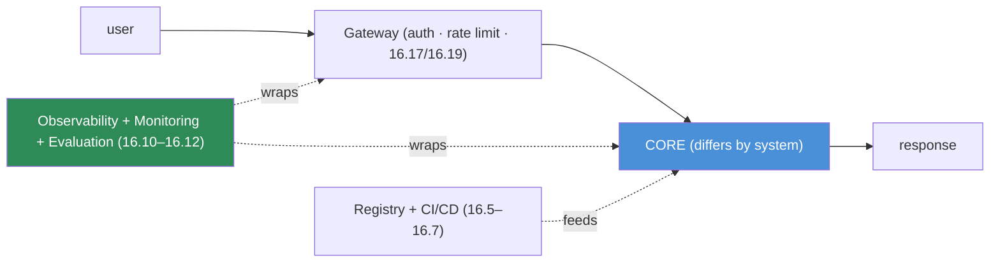
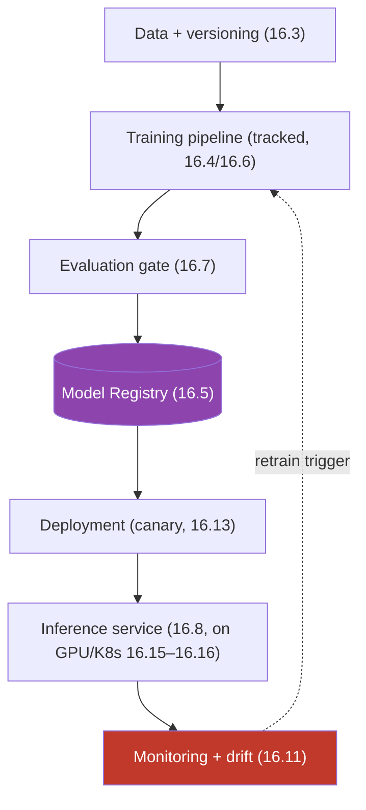
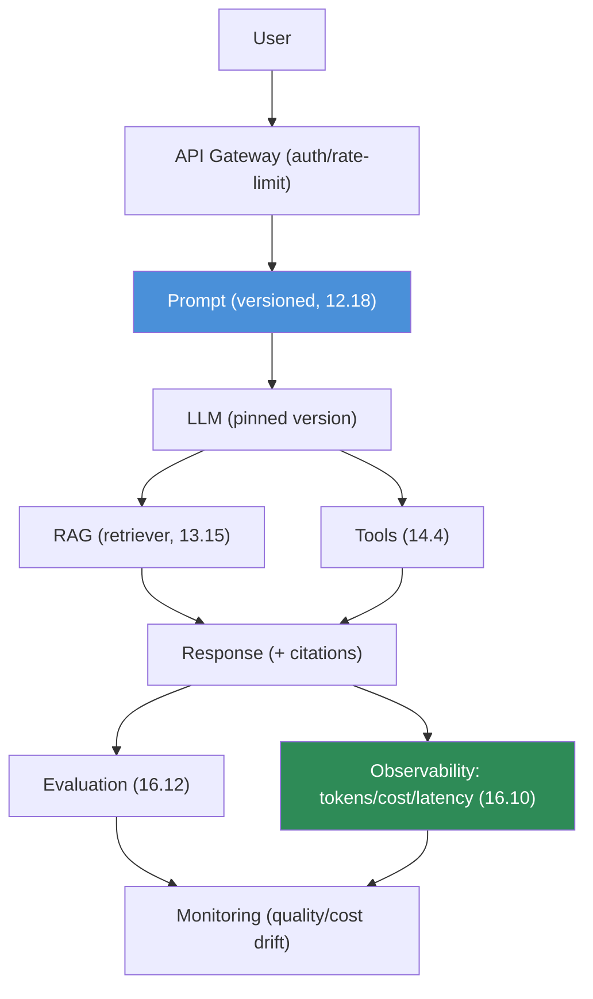
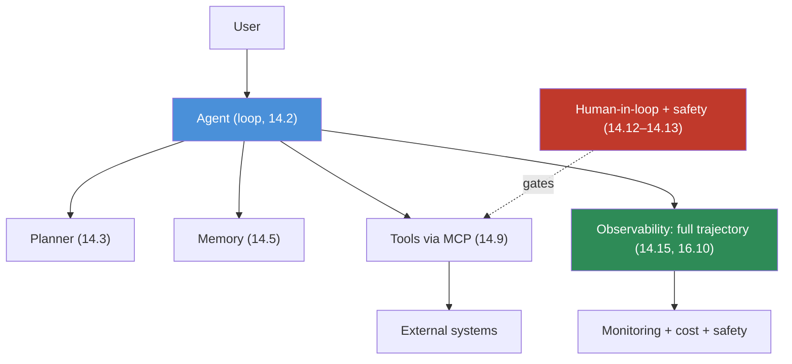

# 16.20 · Production Architecture

[⬅ 16.19 AI Security](16.19-security.md) · [🏠 Module 16](../README.md) · [➡ 16.21 Infrastructure as Code](16.21-iac.md)

> **The lesson in one line:** This lesson assembles everything into three reference architectures — a **traditional ML system**, an **LLM application**, and an **agent system** — each showing how the components you've learned (registry, serving, RAG, tools, observability, monitoring) wire together into a coherent, operable whole.

---

## 🎯 Learning objectives

- Design end-to-end architectures for **traditional ML, LLM applications, and agent systems**.
- See how every module component fits into a production whole.
- Recognize the shared backbone (gateway → core → observability) across all three.

## ✅ Prerequisites

- Most of Module 16, plus [13.15 RAG](../../13-RAG/weeks/13.15-production-architecture.md), [14.15 agents](../../14-AI-Agents/weeks/14.15-production-architecture.md), [11.20 LLM](../../11-LLMs/weeks/11.20-production-architecture.md).

---

## 🧠 Mental model

> [!IMPORTANT]
> **All three architectures share the same skeleton — an entry point (gateway with auth/rate-limit), a core that does the work, and an observability/monitoring layer wrapped around everything — they differ only in what fills the "core."** For traditional ML the core is a model behind a registry; for an LLM app it's prompt + LLM + RAG + tools; for an agent it's the loop + planner + memory + MCP tools. Recognizing this shared skeleton is the payoff of the module: **production AI is not a hundred bespoke designs; it's one operable pattern — versioned artifacts, gated deployment, resilient serving, deep observability, drift monitoring, and a retraining/improvement loop — instantiated for each system type.**



---

## Traditional ML system


**Data → training → evaluation → registry → deployment → inference → monitoring → (retrain).** The classic MLOps loop from [16.1](16.1-what-is-mlops.md): versioned data trains a tracked model, gated into a registry, deployed via canary, served, monitored for drift, and retrained.

---

## LLM application


**User → API → prompt → LLM → RAG → tools → response → evaluation → observability → monitoring.** The LLMOps core ([16.9](16.9-llmops.md)): versioned prompt, pinned model, RAG + tools, with token/cost/quality observability and continuous evaluation.

---

## Agent system


**User → agent → planner → memory → tools (MCP) → external systems → observability.** The agent core ([14.15](../../14-AI-Agents/weeks/14.15-production-architecture.md)): a loop with planning/memory, least-privilege MCP tools gated by human-in-the-loop/safety, with full-trajectory observability.

> [!IMPORTANT]
> **The three architectures escalate in autonomy and risk — ML predicts, LLM apps generate, agents *act* — so the observability, evaluation, and safety layers get correspondingly heavier, but the operable backbone is identical.** An ML system needs drift monitoring; an LLM app adds cost/quality observability and production eval; an agent adds trajectory tracing, human-in-the-loop, and least-privilege tools. **Design any AI system by starting from the shared skeleton (gateway → core → observability + registry/CI-CD) and filling the core for your system type** — that's how the whole module composes into buildable systems ([16.23](16.23-end-to-end-projects.md)).

---

## 🏭 Production examples

| System | Core | Heaviest concern |
|---|---|---|
| Fraud detection (ML) | model + registry | drift monitoring |
| Support chatbot (LLM) | prompt + LLM + RAG | cost + quality eval |
| Research assistant (agent) | loop + tools + memory | safety + trajectory observability |
| Recommendation (ML) | model + feature store | drift + scale |
| Coding agent | loop + code tools (sandboxed) | safety + human approval |

## ⚡ Performance & 💲 cost considerations

- **The observability/monitoring layer is shared** — build it once, reuse across all three ([16.10](16.10-observability.md)).
- **Escalating autonomy escalates cost** — agents make many LLM calls; budget per workflow ([16.18](16.18-cost-optimization.md)).
- **Serving/scaling patterns** are shared ([16.8](16.8-model-serving.md), [16.16](16.16-kubernetes.md)) — reuse them.

## 🔒 Security considerations

> [!CAUTION]
> - **Security scales with autonomy** — an agent that *acts* needs least-privilege tools + human gates ([14.13](../../14-AI-Agents/weeks/14.13-safety.md)) that an ML predictor doesn't; apply the [16.19](16.19-security.md) checklist to each layer.
> - **The gateway is the shared security control point** — auth, rate limit, input validation for all three ([16.17](16.17-reliability.md), [16.19](16.19-security.md)).
> - **Observability is a shared security tool** across all three ([16.10](16.10-observability.md)).

## 🚫 Common mistakes

| Mistake | Consequence |
|---|---|
| Designing each system from scratch | Reinventing the shared backbone |
| Same-weight safety for ML and agents | Under-protecting action-taking systems |
| No observability layer | Can't operate any of the three |
| No registry/CI-CD backbone | No safe deployment/rollback |
| Skipping the retraining/improvement loop | Silent decay ([16.11](16.11-monitoring-drift.md)) |

## 🐛 Debugging workflow

Architecture issue: (1) **Which layer?** Gateway (auth/rate), core (model/prompt/agent), or observability. (2) **Is the shared backbone present?** Registry, CI/CD gate, observability, monitoring, retraining loop — a missing one is often the gap. (3) **Trace a request** through the core ([16.10](16.10-observability.md)). (4) **Is safety proportional to autonomy?** (agents need more). Reuse the module's per-component debugging. Full method in [16.23](16.23-end-to-end-projects.md).

## 🏋️ Exercises

1. **Three diagrams.** Draw the ML, LLM, and agent architectures; label the shared skeleton.
2. **Fill the core.** For a given use case, pick the system type and design its core on the shared backbone.
3. **Autonomy → safety.** Show how the safety layer grows from ML → LLM → agent.
4. **Reuse.** Identify components shared across all three (gateway, observability, registry).
5. **Gap audit.** Audit a real system for the shared-backbone components; find the missing one.

## 🛠️ Mini project — "Reference architecture kit"

**Goal:** reusable architecture templates for ML, LLM, and agent systems on a shared backbone.

**Requirements:** a shared skeleton (gateway + observability + registry/CI-CD + monitoring); three core templates (ML model, LLM+RAG+tools, agent loop); per-type safety/eval layers; architecture diagrams; a gap-audit checklist.

**Folder structure**
```
ref-architectures/
├── backbone/       # gateway, observability, registry, monitoring
├── ml/             # model core
├── llm/            # prompt+LLM+RAG+tools core
├── agent/          # loop+memory+MCP core
└── audit.md        # shared-backbone checklist
```

**Testing:** each template composes on the shared backbone; safety scales with autonomy; audit finds missing components.
**Evaluation:** completeness vs the module's components.
**Security:** [16.19](16.19-security.md) checklist per layer.
**Monitoring:** shared observability across all three ([16.10](16.10-observability.md)).
**Future improvements:** IaC templates ([16.21](16.21-iac.md)); the two capstones ([16.23](16.23-end-to-end-projects.md)).

## 📄 Cheat sheet

| System | Core | Extra layer |
|---|---|---|
| **Traditional ML** | model + registry | drift monitoring |
| **LLM app** | prompt + LLM + RAG + tools | cost/quality obs + eval |
| **Agent** | loop + planner + memory + MCP tools | trajectory obs + human-in-loop + safety |
| **⭐ Shared skeleton** | gateway → core → observability + registry/CI-CD |
| **⭐ Autonomy ↑** | predict → generate → **act** → safety/obs get heavier |
| **Loop** | monitor → drift/eval → retrain/improve |

## 🎴 Flashcards

- **⭐ What do the three production architectures share?** → The same skeleton — a gateway (auth/rate-limit), a core that does the work, and an observability/monitoring layer around everything, plus a registry/CI-CD backbone — differing only in what fills the core.
- **What fills the core for each system?** → ML: a model behind a registry; LLM app: prompt + LLM + RAG + tools; agent: a loop + planner + memory + MCP tools.
- **⭐ How does the safety/observability layer change across the three?** → It gets heavier as autonomy rises (predict → generate → act): ML needs drift monitoring, LLM apps add cost/quality eval, agents add trajectory tracing + human-in-the-loop + least-privilege tools.
- **How should you design a new AI system?** → Start from the shared skeleton (gateway → core → observability + registry/CI-CD) and fill the core for your system type.
- **What's the shared security control point?** → The gateway (auth, rate limit, input validation) for all three system types.
- **What loop closes all three architectures?** → Monitor → drift/eval → retrain/improve — the continuous-improvement loop.

## 💬 Interview questions

1. Draw the production architecture for a traditional ML system, an LLM app, and an agent.
2. What do all three share, and how do they differ?
3. How does the safety/observability layer scale with system autonomy?
4. Which components are reusable across all three architectures?
5. How would you design a new AI system from the shared backbone?
6. Where's the shared security control point, and why?

## 📝 Summary

- The three production architectures — **traditional ML** (model + registry), **LLM app** (prompt + LLM + RAG + tools), and **agent** (loop + planner + memory + MCP tools) — share one **skeleton**: gateway → core → **observability/monitoring**, plus a **registry + CI/CD** backbone and a **retraining/improvement loop**.
- They **escalate in autonomy and risk** (predict → generate → **act**), so the **observability, evaluation, and safety layers get heavier** for LLM apps and heaviest for agents — but the operable backbone is identical.
- **Design any AI system by filling the shared core** for its type — the payoff of the module is that production AI is *one operable pattern*, not a hundred bespoke designs.
- This composes into the **end-to-end capstones** ([16.23](16.23-end-to-end-projects.md)), built on **IaC** ([16.21](16.21-iac.md)) and shared **observability/security** ([16.10](16.10-observability.md), [16.19](16.19-security.md)).

## 📚 References

1. **[11.20](../../11-LLMs/weeks/11.20-production-architecture.md) · [13.15](../../13-RAG/weeks/13.15-production-architecture.md) · [14.15](../../14-AI-Agents/weeks/14.15-production-architecture.md).** ⭐ The per-system architectures.
2. **[16.1 What Is MLOps](16.1-what-is-mlops.md).** The lifecycle these instantiate.
3. **Huyen — _Designing Machine Learning Systems_.** End-to-end ML architecture.
4. **[16.23 End-to-End Projects](16.23-end-to-end-projects.md).** The buildable capstones.

---

## 🧭 Navigation

| Direction | Link |
|---|---|
| ⬅ Previous | [16.19 · AI Security in Production](16.19-security.md) |
| ➡ Next | [16.21 · Infrastructure as Code](16.21-iac.md) |
| 🏠 Module | [Module 16](../README.md) |
| 📖 Lessons | [Lesson index](README.md) |
