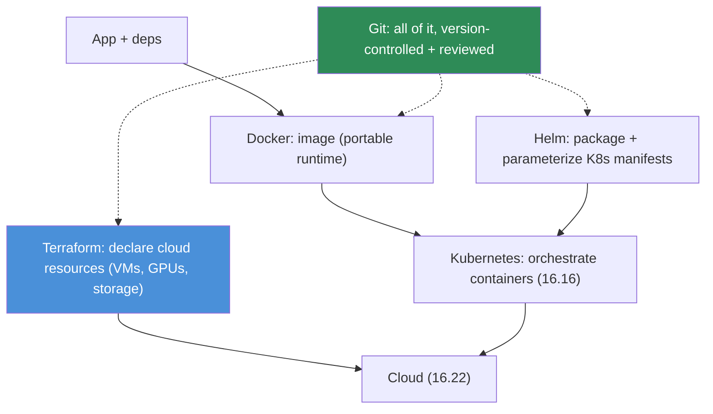

# 16.21 · Infrastructure as Code

[⬅ 16.20 Production Architecture](16.20-production-architecture.md) · [🏠 Module 16](../README.md) · [➡ 16.22 Cloud MLOps](16.22-cloud.md)

> **The lesson in one line:** Clicking through a cloud console to set up infrastructure is unreproducible and undocumented — Infrastructure as Code (IaC) declares your infrastructure in **version-controlled files** (Docker for the app, Terraform for the cloud resources, Kubernetes/Helm for orchestration) so your whole environment is reproducible, reviewable, and recoverable, just like your model and data.

---

## 🎯 Learning objectives

- Understand **Docker, Terraform, Kubernetes, and Helm** and how they layer.
- Version-control infrastructure for **reproducibility and review**.
- Build a basic deployment architecture as code.

## ✅ Prerequisites

- [16.2 reproducibility](16.2-reproducibility.md), [16.16 Kubernetes](16.16-kubernetes.md), [16.8 serving](16.8-model-serving.md).

---

## 🧠 Mental model

> [!IMPORTANT]
> **The same reproducibility argument you applied to code, data, and models ([16.2](16.2-reproducibility.md)) applies to *infrastructure*: if your production environment was set up by clicking around a console, nobody can reproduce it, review it, or recover it after a disaster.** IaC makes infrastructure a **versioned artifact** — declared in files, committed to Git, reviewed in PRs, and applied deterministically. The layers stack: **Docker** packages the app + dependencies into a portable image (reproducible *runtime*); **Terraform** declares the cloud resources (VMs, GPUs, storage, networks — reproducible *infrastructure*); **Kubernetes** orchestrates the containers ([16.16](16.16-kubernetes.md)); and **Helm** packages K8s manifests into reusable, parameterized charts. **Declare what you want, version it, apply it — the same environment every time, on any account.**



---

## The tools (layered)

| Tool | Layer | What it does |
|---|---|---|
| **Docker** | runtime | package app + deps + CUDA into a portable, reproducible **image** |
| **Terraform** | cloud infra | declare cloud resources (compute, GPU instances, storage, networking) declaratively; `plan`/`apply` |
| **Kubernetes** | orchestration | run/scale/heal containers ([16.16](16.16-kubernetes.md)) |
| **Helm** | K8s packaging | bundle K8s manifests into versioned, parameterized **charts** (templated deployments) |

- **Docker** = reproducible *runtime* (the reproducibility building block, [16.2](16.2-reproducibility.md)).
- **Terraform** = reproducible *cloud* (declare "I want a GPU node pool + a bucket + a network"; `terraform apply` makes it so; `destroy` tears it down).
- **Kubernetes + Helm** = reproducible *orchestration* (Helm charts parameterize deployments so dev/staging/prod differ only by values).

> [!IMPORTANT]
> **The payoff of IaC is the same as the model registry's for models: reproducibility, review, and rollback — but for your entire environment.** You can **reproduce** the whole stack on a new account (disaster recovery), **review** infrastructure changes in a PR (before they hit production), and **roll back** a bad infra change like any commit. For AI specifically, IaC is what makes **GPU infrastructure repeatable** ([16.15](16.15-gpu-infrastructure.md)) — a Terraform module for a GPU node pool + a Helm chart for the serving deployment means spinning up a full training/serving environment is `apply`, not a day of clicking. **Infrastructure becomes as version-controlled and disposable as code.**

---

## 💻 A basic deployment as code (sketch)

```dockerfile
# Docker: reproducible runtime (16.2)
FROM nvidia/cuda:12.1-runtime
COPY requirements.lock .            # pinned deps (16.2)
RUN pip install -r requirements.lock
COPY app/ /app
CMD ["python", "/app/serve.py"]
```
```hcl
# Terraform: declare a GPU node pool + bucket (conceptual)
resource "google_container_node_pool" "gpu" {
  node_config { machine_type = "a2-highgpu-1g"; guest_accelerator { type = "nvidia-tesla-a100"; count = 1 } }
  autoscaling { min_node_count = 1; max_node_count = 8 }   # warm min + scale (16.16)
}
resource "google_storage_bucket" "artifacts" { name = "model-artifacts"; versioning { enabled = true } }
```
```yaml
# Helm values: parameterize per environment
replicaCount: 3
image: { repository: myorg/model-server, tag: "1.4.0" }
resources: { limits: { nvidia.com/gpu: 1 } }               # GPU request (16.16)
```

Docker (runtime) + Terraform (cloud) + Helm/K8s (orchestration), all **in Git** — `terraform apply` + `helm upgrade` deploys the full stack reproducibly.

---

## 🏭 Production examples

| Need | IaC |
|---|---|
| Reproducible training/serving env | Docker image (pinned deps) |
| GPU node pool on demand | Terraform module + autoscaling |
| Parameterized dev/staging/prod | Helm charts with per-env values |
| Disaster recovery | `terraform apply` on a fresh account |
| Reviewable infra changes | Terraform/Helm PRs with `plan` diff |

## ⚡ Performance & 💲 cost considerations

- **`terraform destroy` for ephemeral environments** — tear down GPU resources when not needed (huge cost saving, [16.18](16.18-cost-optimization.md)).
- **Autoscaling + spot in Terraform** — declare cost-optimized infra ([16.15](16.15-gpu-infrastructure.md)).
- **Pinned Docker images** — reproducible *and* cacheable (fast rebuilds, [16.16](16.16-kubernetes.md)).

## 🔒 Security considerations

> [!CAUTION]
> - **No secrets in IaC files** — reference a secrets manager, never hardcode keys in Terraform/Dockerfiles/Helm ([16.19](16.19-security.md)); IaC is committed to Git.
> - **IaC is a review gate for security** — infrastructure changes (open ports, IAM roles) get PR review + policy-as-code scanning.
> - **Scan Docker images** (vulnerabilities) and use minimal, pinned base images ([16.16](16.16-kubernetes.md)).
> - **Least-privilege IAM in Terraform** — declare minimal cloud permissions ([16.19](16.19-security.md)).

## 🚫 Common mistakes

| Mistake | Consequence |
|---|---|
| Console-clicking infrastructure | Unreproducible, unreviewable, unrecoverable |
| Secrets hardcoded in IaC | Leaked credentials in Git |
| Unpinned Docker base images | Non-reproducible builds ([16.2](16.2-reproducibility.md)) |
| Not tearing down ephemeral GPU envs | Wasted cost ([16.18](16.18-cost-optimization.md)) |
| No PR review on infra changes | Risky changes hit prod |
| Over-permissive IAM in Terraform | Large blast radius |

## 🐛 Debugging workflow

Infra issue: (1) **Is it in code?** If the environment was hand-configured, that's the root problem — codify it. (2) **`terraform plan`** to see the diff between declared and actual state. (3) **Reproduce** on a fresh environment from the IaC — if you can't, the IaC is incomplete. (4) **Roll back** the infra change (revert the commit + `apply`). (5) **Docker build reproducible?** Pinned deps ([16.2](16.2-reproducibility.md)). IaC turns "works on the prod cluster only" into a reviewable, reproducible diff.

## 🏋️ Exercises

1. **Dockerize.** Package a model server with pinned deps into a reproducible image.
2. **Terraform.** Declare a GPU node pool + a versioned bucket; `plan`/`apply`/`destroy`.
3. **Helm.** Chart a model deployment with per-env values (replicas, image tag, GPU).
4. **Reproduce.** Stand up the full stack on a fresh environment purely from IaC.
5. **Review.** Make an infra change as a PR; review the `plan` diff before applying.

## 🛠️ Mini project — "Deployment as code"

**Goal:** the full serving stack declared as version-controlled IaC.

**Requirements:** Docker image (pinned deps); Terraform for cloud resources (GPU node pool, storage, network) with autoscaling; Helm chart for the K8s deployment (per-env values); secrets via a manager (not in files); a `plan`-reviewed change flow; `destroy` for ephemeral envs.

**Folder structure**
```
deploy-as-code/
├── Dockerfile          # reproducible runtime
├── terraform/          # cloud resources (GPU, storage, net)
├── helm/               # chart + per-env values
└── Makefile            # build / plan / apply / destroy
```

**Testing:** the stack reproduces on a fresh account from IaC; no secrets in files; `destroy` tears down cleanly.
**Evaluation:** reproducibility (does a fresh apply match prod?); change-review coverage.
**Security:** secrets external; least-privilege IAM; scanned images ([16.19](16.19-security.md)).
**Monitoring:** infra drift (declared vs actual) alerts.
**Future improvements:** policy-as-code (OPA); GitOps (ArgoCD); multi-region modules.

## 📄 Cheat sheet

| Tool | Layer / role |
|---|---|
| **Docker** | reproducible **runtime** (app + deps + CUDA) |
| **Terraform** | declare **cloud resources** (GPU, storage, net); plan/apply/destroy |
| **Kubernetes** | orchestrate containers ([16.16](16.16-kubernetes.md)) |
| **Helm** | package + parameterize K8s manifests (per-env) |
| **⭐ Payoff** | reproduce · review · rollback — for your whole environment |
| **⭐ AI angle** | makes GPU infra repeatable; `apply` not clicking |
| **⚠️** | no secrets in IaC; pin images; least-privilege IAM; `destroy` ephemeral |

## 🎴 Flashcards

- **⭐ Why use Infrastructure as Code?** → So infrastructure is a version-controlled artifact — reproducible, reviewable (PRs), and recoverable — instead of unreproducible console clicking; the same reproducibility argument as code/data/models.
- **How do Docker, Terraform, Kubernetes, and Helm layer?** → Docker packages the app (runtime), Terraform declares cloud resources (infra), Kubernetes orchestrates containers, and Helm parameterizes K8s manifests into charts.
- **What does Terraform do?** → Declares cloud resources (compute, GPUs, storage, networking) in files and applies them deterministically (`plan`/`apply`/`destroy`).
- **⭐ Why is IaC especially valuable for AI?** → It makes GPU infrastructure repeatable — a Terraform GPU node pool + Helm serving chart means standing up a full training/serving environment is `apply`, not a day of clicking.
- **Why must secrets never be in IaC files?** → IaC is committed to Git; hardcoded keys leak — reference a secrets manager instead.
- **How does IaC enable disaster recovery?** → You can reproduce the entire stack on a fresh account from the version-controlled files.
- **What cost lever does IaC enable?** → `terraform destroy` tears down ephemeral GPU environments when idle, avoiding paying for unused resources.

## 💬 Interview questions

1. Why version-control infrastructure, and how does IaC do it?
2. How do Docker, Terraform, Kubernetes, and Helm layer together?
3. What does Terraform provide over clicking in a console?
4. Why is IaC especially valuable for AI/GPU infrastructure?
5. How do you handle secrets and security in IaC?
6. How does IaC enable reproducibility, review, and disaster recovery?

## 📝 Summary

- **Infrastructure as Code** makes your environment a **version-controlled artifact** — reproducible, reviewable, and recoverable — extending the reproducibility discipline ([16.2](16.2-reproducibility.md)) from code/data/models to infrastructure.
- The layers stack: **Docker** (reproducible runtime), **Terraform** (declare cloud resources — GPU pools, storage, networks), **Kubernetes** (orchestration, [16.16](16.16-kubernetes.md)), **Helm** (parameterized K8s charts).
- The payoff mirrors the registry's — **reproduce, review, roll back** — for the whole stack; for AI it makes **GPU infrastructure repeatable** (`apply`, not clicking) and enables cost control (`destroy` ephemeral envs, [16.18](16.18-cost-optimization.md)).
- **No secrets in IaC files, pin images, least-privilege IAM, PR-review infra changes** — IaC is a security review gate ([16.19](16.19-security.md)), and it's the foundation for **cloud MLOps** ([16.22](16.22-cloud.md)) and the capstones ([16.23](16.23-end-to-end-projects.md)).

## 📚 References

1. **Docker / Terraform / Helm documentation.** ⭐ The IaC tools.
2. **[16.16 Kubernetes for AI](16.16-kubernetes.md).** The orchestration layer.
3. **[16.2 Reproducibility](16.2-reproducibility.md).** Docker as a reproducibility block.
4. **GitOps (ArgoCD/Flux) & OPA/policy-as-code.** Declarative delivery + governance.

---

## 🧭 Navigation

| Direction | Link |
|---|---|
| ⬅ Previous | [16.20 · Production Architecture](16.20-production-architecture.md) |
| ➡ Next | [16.22 · Cloud MLOps](16.22-cloud.md) |
| 🏠 Module | [Module 16](../README.md) |
| 📖 Lessons | [Lesson index](README.md) |
