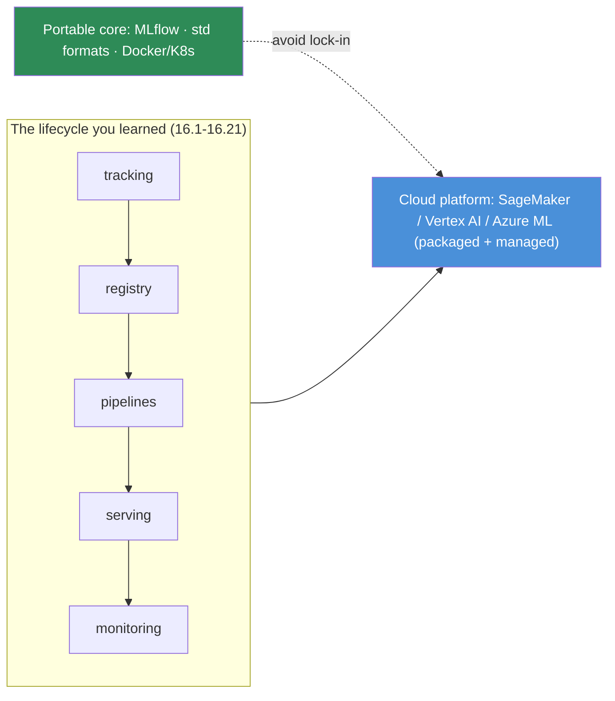

# 16.22 · Cloud MLOps

[⬅ 16.21 Infrastructure as Code](16.21-iac.md) · [🏠 Module 16](../README.md) · [➡ 16.23 End-to-End Projects](16.23-end-to-end-projects.md)

> **The lesson in one line:** Every major cloud offers a managed MLOps platform (SageMaker, Vertex AI, Azure ML) that bundles training, registry, pipelines, serving, and monitoring — the trade-off is **speed and integration vs. lock-in and cost**, and the right answer is usually a **portable core** (your own registry/tracking/containers) on top of managed compute.

---

## 🎯 Learning objectives

- Map the **cloud MLOps platforms** (AWS SageMaker, GCP Vertex AI, Azure ML) onto the lifecycle you've learned.
- Understand the **managed vs. self-hosted** trade-off and how to avoid lock-in.
- Reason about **GPU availability, cost, and portability** across clouds.

## ✅ Prerequisites

- The whole module — cloud platforms are *packaged* versions of everything in 16.1–16.21.

---

## 🧠 Mental model

> [!IMPORTANT]
> **The cloud MLOps platforms don't invent new concepts — they package the ones you've already learned into a managed service.** SageMaker / Vertex AI / Azure ML each bundle experiment tracking ([16.4](16.4-experiment-tracking.md)), a model registry ([16.5](16.5-model-registry.md)), pipelines ([16.6](16.6-ml-pipelines.md)), serving ([16.8](16.8-model-serving.md)), and monitoring ([16.11](16.11-monitoring-drift.md)) behind one integrated console. The value is **speed and integration** (less to build/operate, managed GPUs, autoscaling out of the box). The cost is **lock-in and price** (proprietary formats, per-hour premiums, hard-to-migrate pipelines). **The durable answer is a portable core — keep your tracking, registry, and containers vendor-neutral (MLflow, standard model formats, Docker/K8s) and rent the managed *compute* underneath.** That way you get cloud speed without betting your whole stack on one vendor.

---

## The platforms (mapped to the lifecycle)

| Lifecycle stage | AWS SageMaker | GCP Vertex AI | Azure ML |
|---|---|---|---|
| Tracking ([16.4](16.4-experiment-tracking.md)) | Experiments | Experiments | Jobs/Runs |
| Registry ([16.5](16.5-model-registry.md)) | Model Registry | Model Registry | Model Registry |
| Pipelines ([16.6](16.6-ml-pipelines.md)) | Pipelines | Pipelines (KFP) | Pipelines |
| Serving ([16.8](16.8-model-serving.md)) | Endpoints | Endpoints | Endpoints |
| Monitoring ([16.11](16.11-monitoring-drift.md)) | Model Monitor | Model Monitoring | Data drift |
| LLMs | Bedrock | Vertex/Gemini | Azure OpenAI |

They all cover the same lifecycle — **the concepts transfer; only the console changes.**

> [!IMPORTANT]
> **The managed vs. self-hosted decision is the central cloud MLOps trade-off, and it's rarely all-or-nothing.** Managed platforms buy you **speed** (ship without building infra) and **integration** (one console, GPUs on demand, autoscaling), at the price of **lock-in** (proprietary pipeline/endpoint formats) and **cost** (managed premiums on top of raw compute). The pragmatic pattern: **rent managed *compute and GPUs* (the hard, expensive part) but keep your *core artifacts portable*** — MLflow for tracking/registry, standard model formats, and Docker/K8s ([16.16](16.16-kubernetes.md), [16.21](16.21-iac.md)) for serving. **GPU availability and price are the real constraints** ([16.15](16.15-gpu-infrastructure.md)) — spot/preemptible instances, multi-region, and multi-cloud portability are how you manage both scarcity and cost ([16.18](16.18-cost-optimization.md)).

---

## 🏭 Production examples

| Situation | Cloud approach |
|---|---|
| Small team, ship fast | Managed platform end-to-end (accept some lock-in) |
| Cost-sensitive scale | Managed compute + portable core (MLflow, Docker/K8s) |
| GPU scarcity | Multi-region / multi-cloud + spot ([16.15](16.15-gpu-infrastructure.md)) |
| LLM app | Managed LLM API (Bedrock/Vertex/Azure OpenAI) + own LLMOps ([16.9](16.9-llmops.md)) |
| Regulated / on-prem | Self-hosted K8s stack ([16.16](16.16-kubernetes.md), [16.21](16.21-iac.md)) |

## ⚡ Performance & 💲 cost considerations

- **Managed premium is real** — you pay for convenience; measure it against build/operate cost ([16.18](16.18-cost-optimization.md)).
- **Spot/preemptible GPUs** — biggest cloud cost lever for training ([16.15](16.15-gpu-infrastructure.md)).
- **Egress costs** — moving data/models across clouds/regions is expensive; factor it into portability.
- **Autoscaling + scale-to-zero** — managed endpoints often support it; use it ([16.16](16.16-kubernetes.md)).

## 🔒 Security considerations

> [!CAUTION]
> - **Cloud IAM is your first security layer** — least-privilege roles for every service ([16.19](16.19-security.md)).
> - **Private networking** — keep endpoints/data in VPCs, not public.
> - **Managed secrets** (cloud secret managers) — never in code/IaC ([16.19](16.19-security.md), [16.21](16.21-iac.md)).
> - **Data residency / compliance** — regulated data may forbid certain regions or managed services.

## 🚫 Common mistakes

| Mistake | Consequence |
|---|---|
| All-in on one vendor's proprietary formats | Painful, expensive migration later |
| Ignoring egress/GPU pricing | Runaway cloud bill ([16.18](16.18-cost-optimization.md)) |
| On-demand GPUs for everything | Overpaying vs. spot ([16.15](16.15-gpu-infrastructure.md)) |
| Over-permissive cloud IAM | Large blast radius ([16.19](16.19-security.md)) |
| Assuming managed = no ops | You still own monitoring/drift/evals |

## 🐛 Debugging workflow

Cloud issue: (1) **Which lifecycle stage?** Map the symptom to tracking/registry/pipeline/serving/monitoring — the concept is the same as self-hosted. (2) **GPU availability?** Capacity errors → try another region/instance type ([16.15](16.15-gpu-infrastructure.md)). (3) **IAM/networking?** Access failures are usually roles or VPC config ([16.19](16.19-security.md)). (4) **Cost spike?** Check on-demand vs. spot, egress, idle endpoints ([16.18](16.18-cost-optimization.md)). (5) **Portability escape hatch?** If a managed feature is failing, your portable core (MLflow/Docker) lets you fall back.

## 🏋️ Exercises

1. **Map it.** Take one cloud platform and map each service to the 16.x lesson it implements.
2. **Portable core.** Run MLflow tracking/registry on managed compute; keep artifacts vendor-neutral.
3. **Spot training.** Run a training job on spot/preemptible GPUs with checkpointing.
4. **Cost model.** Compare managed-endpoint vs. self-hosted-K8s cost for the same traffic.
5. **Multi-region.** Design a GPU strategy that tolerates capacity scarcity in one region.

## 🛠️ Mini project — "Portable cloud MLOps"

**Goal:** run the lifecycle on managed cloud compute *without* deep lock-in.

**Requirements:** managed GPUs (spot where possible); a **portable core** (MLflow tracking + registry, standard model formats, Docker/K8s serving); managed secrets + least-privilege IAM; monitoring/drift ([16.11](16.11-monitoring-drift.md)) wired in; a documented **exit plan** (how you'd move to another cloud).

**Testing:** the core artifacts (models, experiments) are reproducible off-platform; spot interruptions are handled via checkpointing.
**Evaluation:** cost per request vs. a fully-managed baseline; migration effort estimate.
**Security:** VPC-private endpoints; least-privilege IAM; managed secrets ([16.19](16.19-security.md)).
**Monitoring:** cost + GPU utilization + drift dashboards.
**Future improvements:** multi-cloud abstraction; committed-use discounts; GitOps deploys ([16.21](16.21-iac.md)).

## 📄 Cheat sheet

| Platform | Notes |
|---|---|
| **AWS SageMaker** | Experiments · Model Registry · Pipelines · Endpoints · Model Monitor · Bedrock (LLM) |
| **GCP Vertex AI** | Experiments · Registry · KFP Pipelines · Endpoints · Monitoring · Gemini (LLM) |
| **Azure ML** | Jobs · Registry · Pipelines · Endpoints · Data drift · Azure OpenAI |
| **⭐ Trade-off** | managed = speed + integration; cost = lock-in + price |
| **⭐ Durable pattern** | rent managed **compute**; keep **core portable** (MLflow, std formats, Docker/K8s) |
| **⭐ Real constraint** | GPU availability + price → spot, multi-region, multi-cloud |
| **⚠️** | least-privilege IAM · private networking · managed secrets · watch egress |

## 🎴 Flashcards

- **⭐ What do cloud MLOps platforms actually provide?** → A managed, integrated packaging of the same lifecycle you learned — tracking, registry, pipelines, serving, monitoring — behind one console; the concepts transfer, only the console changes.
- **⭐ What is the managed vs. self-hosted trade-off?** → Managed buys speed and integration (GPUs on demand, autoscaling, less to operate) at the cost of lock-in (proprietary formats) and price (managed premiums).
- **⭐ How do you get cloud speed without deep lock-in?** → Rent managed compute/GPUs but keep a portable core — MLflow for tracking/registry, standard model formats, Docker/K8s for serving.
- **What is the real constraint in cloud MLOps for AI?** → GPU availability and price — managed via spot/preemptible instances, multi-region, and multi-cloud portability.
- **Name the three major platforms and their LLM services.** → SageMaker (Bedrock), Vertex AI (Gemini), Azure ML (Azure OpenAI).
- **Does managed mean no ops?** → No — you still own monitoring, drift, and evaluations; managed removes infra toil, not the operational responsibility.
- **What hidden cost bites cross-cloud portability?** → Data/model egress charges between clouds and regions.

## 💬 Interview questions

1. How do the major cloud MLOps platforms map onto the ML lifecycle?
2. What's the managed vs. self-hosted trade-off, and how do you decide?
3. How do you use a managed platform *without* getting locked in?
4. What are the real GPU constraints in the cloud and how do you manage them?
5. Where do IAM, networking, and secrets fit in cloud MLOps security?
6. How does cloud change (or not change) your monitoring/drift responsibilities?

## 📝 Summary

- **Cloud MLOps platforms** (SageMaker, Vertex AI, Azure ML) **package the lifecycle you already learned** into a managed, integrated service — the concepts transfer; only the console changes.
- The central trade-off is **managed (speed + integration) vs. self-hosted (control + portability)**, with costs of **lock-in and price** on the managed side.
- The durable pattern is a **portable core** (MLflow, standard formats, Docker/K8s — [16.21](16.21-iac.md)) on **managed compute**, so you get cloud speed without betting the stack on one vendor.
- **GPU availability and price** are the real constraints ([16.15](16.15-gpu-infrastructure.md)) — spot, multi-region, and multi-cloud manage both; secure with **least-privilege IAM, private networking, and managed secrets** ([16.19](16.19-security.md)). Next, the capstones tie all of this together end-to-end ([16.23](16.23-end-to-end-projects.md)).

## 📚 References

1. **SageMaker / Vertex AI / Azure ML documentation.** ⭐ The managed platforms.
2. **[16.5 Model Registry](16.5-model-registry.md) · [16.6 Pipelines](16.6-ml-pipelines.md).** The portable-core building blocks.
3. **[16.15 GPU Infrastructure](16.15-gpu-infrastructure.md) · [16.18 Cost](16.18-cost-optimization.md).** The real constraints.
4. **MLflow.** ⭐ The vendor-neutral tracking/registry that keeps you portable.

---

## 🧭 Navigation

| Direction | Link |
|---|---|
| ⬅ Previous | [16.21 · Infrastructure as Code](16.21-iac.md) |
| ➡ Next | [16.23 · End-to-End MLOps & LLMOps Projects](16.23-end-to-end-projects.md) |
| 🏠 Module | [Module 16](../README.md) |
| 📖 Lessons | [Lesson index](README.md) |
