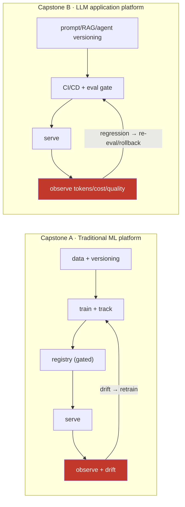

# 16.23 · End-to-End MLOps & LLMOps Projects

[⬅ 16.22 Cloud MLOps](16.22-cloud.md) · [🏠 Module 16](../README.md) · [➡ 16.24 Mini Projects & Summary](16.24-projects-summary.md)

> **The lesson in one line:** The two capstones assemble everything in Module 16 into complete, operating systems — a **traditional ML platform** (data → training → registry → serving → monitoring → retraining) and an **LLM application platform** (prompt/RAG/agent versioning → eval-gated CI/CD → observable serving → drift/cost monitoring) — because the point of MLOps is not any single tool but a **closed loop that keeps a system correct in production over time.**

---

## 🎯 Learning objectives

- Assemble the full lifecycle into **two working end-to-end systems**.
- Wire the **closed loop**: detect → evaluate → retrain/redeploy, with rollback.
- Practice building an LLMOps platform distinct from a classic ML platform.

## ✅ Prerequisites

- All of Module 16. These capstones *are* the module, integrated.

---

## 🧠 Mental model

> [!IMPORTANT]
> **A capstone is not "train a model and deploy it" — it's a *closed loop* that keeps the system correct as the world changes.** Every lesson in this module was a piece of that loop; the capstones wire the pieces together so failures are caught, evaluated, and fixed automatically. The **traditional ML capstone** proves you can version data ([16.3](16.3-data-versioning.md)), track experiments ([16.4](16.4-experiment-tracking.md)), gate promotion through a registry ([16.5](16.5-model-registry.md)), serve ([16.8](16.8-model-serving.md)), observe ([16.10](16.10-observability.md)), detect drift ([16.11](16.11-monitoring-drift.md)), and **retrain automatically** — a loop, not a line. The **LLMOps capstone** proves the *same discipline* applied to the parts that make LLMs different — versioned prompts/RAG/agents ([16.9](16.9-llmops.md)), an **eval gate in CI/CD** ([16.7](16.7-cicd.md), [16.12](16.12-llm-evaluation.md)), observability of tokens/cost/latency ([16.10](16.10-observability.md)), and quality/cost drift monitoring. **The deliverable is a system that fixes itself, not a model that sits still.**

---

## 🏗️ Capstone A — Traditional ML platform (end-to-end)

**Goal:** a production ML system that retrains itself when it drifts.

**The loop (each stage → its lesson):**
1. **Data + versioning** — versioned datasets, validation ([16.3](16.3-data-versioning.md)).
2. **Training + tracking** — every run logged, reproducible ([16.2](16.2-reproducibility.md), [16.4](16.4-experiment-tracking.md)).
3. **Registry (gated promotion)** — staging → prod only past eval + approval; instant rollback ([16.5](16.5-model-registry.md)).
4. **Pipeline + CI/CD** — orchestrated retrain, tested, eval-gated ([16.6](16.6-ml-pipelines.md), [16.7](16.7-cicd.md)).
5. **Serving** — online/batch, autoscaled ([16.8](16.8-model-serving.md), [16.16](16.16-kubernetes.md)).
6. **Deployment strategy** — canary/shadow before full rollout ([16.13](16.13-deployment-strategies.md)).
7. **Observability + monitoring** — metrics/logs/traces, quality proxies ([16.10](16.10-observability.md)).
8. **Drift detection → retrain trigger** — closes the loop ([16.11](16.11-monitoring-drift.md)).

**Deliverables:** the running system, dashboards, a triggered auto-retrain, and a demonstrated rollback.

---

## 🏗️ Capstone B — LLM application platform (end-to-end)

**Goal:** a production LLM app (RAG + optional agent) with LLMOps discipline.

**The loop (each stage → its lesson):**
1. **Prompt / RAG / agent versioning** — first-class, pinned model versions ([16.9](16.9-llmops.md)).
2. **CI/CD with an eval gate** — no ship without passing an eval suite ([16.7](16.7-cicd.md), [16.12](16.12-llm-evaluation.md)).
3. **Serving** — LLM-optimized (batching/KV cache/vLLM), reliable ([16.8](16.8-model-serving.md), [16.14](16.14-model-optimization.md), [16.17](16.17-reliability.md)).
4. **Deployment strategy** — canary a new prompt/model; shadow before rollout ([16.13](16.13-deployment-strategies.md)).
5. **Observability** — trace every call; tokens, cost, latency, quality ([16.10](16.10-observability.md)).
6. **Quality + cost drift monitoring → re-eval/rollback** — closes the loop ([16.11](16.11-monitoring-drift.md), [16.18](16.18-cost-optimization.md)).

**Deliverables:** the running app, an eval suite gating deploys, a full trace + cost dashboard, a canaried prompt change, and a demonstrated rollback.

> [!IMPORTANT]
> **The difference between the two capstones is exactly the difference between MLOps and LLMOps ([16.9](16.9-llmops.md)):** Capstone A versions *data and models* and retrains on *data drift*; Capstone B additionally versions *prompts, RAG, and agents*, gates on an *eval suite* (not just accuracy metrics), and monitors *quality and cost drift* (not just data drift). **Both are the same closed loop — detect, evaluate, fix, roll back — applied to different failure modes.** Building both proves you can operate either kind of AI system, which is the entire point of this module.

## 🔒 Security & reliability (both capstones)

> [!CAUTION]
> - **Defense-in-depth** — infra security (IAM, network, secrets) + AI-layer security (prompt-injection defense, output validation) ([16.19](16.19-security.md)).
> - **Reliability patterns** — timeout/retry/circuit-breaker/graceful degradation on every external call ([16.17](16.17-reliability.md)).
> - **Rollback is mandatory** — both capstones must demonstrate instant rollback ([16.5](16.5-model-registry.md), [16.13](16.13-deployment-strategies.md)).
> - **Everything as code** — infra, pipelines, and configs version-controlled ([16.21](16.21-iac.md)).

## 🐛 Debugging workflow (integration)

When the end-to-end system misbehaves: (1) **Trace it** — one request through the whole pipeline; observability ([16.10](16.10-observability.md)) tells you *which stage*. (2) **Is it drift or a deploy?** Correlate with recent model/prompt changes vs. input distribution ([16.11](16.11-monitoring-drift.md)). (3) **Reproduce** from versioned data/prompt/model ([16.2](16.2-reproducibility.md), [16.9](16.9-llmops.md)). (4) **Roll back first, diagnose second** ([16.5](16.5-model-registry.md), [16.13](16.13-deployment-strategies.md)). (5) **Did the eval gate miss it?** Add the failing case to the suite so CI/CD catches it next time ([16.7](16.7-cicd.md), [16.12](16.12-llm-evaluation.md)) — the loop learns.

## 🏋️ Exercises

1. **Close the loop (ML).** Force data drift; verify auto-retrain triggers and promotes past the gate.
2. **Close the loop (LLM).** Ship a prompt regression; verify the eval gate blocks it in CI/CD.
3. **Rollback drill.** In both systems, roll back a bad deploy and measure time-to-recover.
4. **Canary.** Route 5% of traffic to a new model/prompt; promote or abort on metrics.
5. **Incident.** Break one stage; use traces to localize it end-to-end.

## 📄 Cheat sheet

| Capstone | Loop |
|---|---|
| **A · ML platform** | data+version → train+track → registry(gated) → serve → observe → **drift→retrain** |
| **B · LLM platform** | prompt/RAG/agent version → CI/CD **eval gate** → serve → observe tokens/cost → **regression→re-eval/rollback** |
| **⭐ Core idea** | not train→deploy — a **closed loop** that keeps the system correct over time |
| **⭐ A vs. B** | = MLOps vs. LLMOps: data/model drift vs. prompt/eval/quality+cost drift |
| **Mandatory** | gated promotion · rollback · observability · everything-as-code |

## 🎴 Flashcards

- **⭐ What is an MLOps capstone really building?** → A closed loop — detect, evaluate, fix, roll back — that keeps a system correct in production over time, not just a train→deploy pipeline.
- **⭐ How do the two capstones differ, and why?** → Capstone A (ML) versions data/models and retrains on data drift; Capstone B (LLM) also versions prompts/RAG/agents, gates on an eval suite, and monitors quality+cost drift — the same difference as MLOps vs. LLMOps.
- **What closes the loop in the ML capstone?** → Drift detection triggering an automatic retrain that must pass the registry's gated promotion.
- **What closes the loop in the LLM capstone?** → Quality/cost regression triggering re-evaluation or rollback, with an eval gate in CI/CD blocking regressions before they ship.
- **What must both capstones demonstrate for safety?** → Instant rollback, gated promotion, full observability/tracing, and everything-as-code.
- **When the eval gate misses a bug, what's the fix?** → Add the failing case to the eval suite so CI/CD catches it next time — the loop learns.

## 💬 Interview questions

1. Walk through an end-to-end ML platform as a closed loop, stage by stage.
2. How does an LLM application platform differ, and why?
3. Where and how does each capstone close its feedback loop?
4. How do rollback and gated promotion make the systems safe?
5. How do observability and drift detection cooperate to trigger fixes?
6. When an eval gate lets a regression through, how do you improve the system?

## 📝 Summary

- The **two capstones assemble all of Module 16** into complete, operating systems: a **traditional ML platform** and an **LLM application platform**.
- Both are **closed loops** — detect → evaluate → fix → roll back — not train→deploy lines; the loop is what keeps a system correct as the world changes.
- **Capstone A vs. B is MLOps vs. LLMOps** ([16.9](16.9-llmops.md)): data/model versioning + data-drift retraining vs. prompt/RAG/agent versioning + eval-gated CI/CD + quality/cost-drift monitoring.
- **Gated promotion, instant rollback, full observability, and everything-as-code** ([16.5](16.5-model-registry.md), [16.10](16.10-observability.md), [16.13](16.13-deployment-strategies.md), [16.21](16.21-iac.md)) are mandatory in both — the smaller mini projects in [16.24](16.24-projects-summary.md) drill the individual muscles these capstones combine.

## 📚 References

1. **[16.9 LLMOps](16.9-llmops.md).** ⭐ The MLOps-vs-LLMOps distinction the two capstones embody.
2. **[16.11 Monitoring & Drift](16.11-monitoring-drift.md) · [16.5 Registry](16.5-model-registry.md).** How each loop closes.
3. **[16.7 CI/CD](16.7-cicd.md) · [16.12 LLM Evaluation](16.12-llm-evaluation.md).** The eval gate.
4. **Google "MLOps: Continuous delivery and automation pipelines in ML".** ⭐ The maturity model behind the loop.

---

## 🧭 Navigation

| Direction | Link |
|---|---|
| ⬅ Previous | [16.22 · Cloud MLOps](16.22-cloud.md) |
| ➡ Next | [16.24 · Mini Projects & Summary](16.24-projects-summary.md) |
| 🏠 Module | [Module 16](../README.md) |
| 📖 Lessons | [Lesson index](README.md) |
