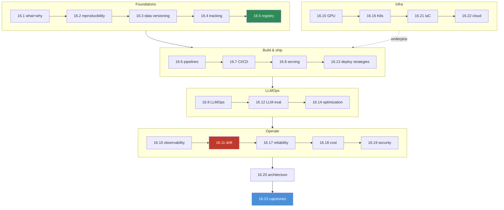

# 16.24 · Mini Projects & Module Summary

[⬅ 16.23 End-to-End Projects](16.23-end-to-end-projects.md) · [🏠 Module 16](../README.md) · [➡ Module 17](../../17-Cloud/README.md)

> **The lesson in one line:** Ten focused mini projects each drill one production muscle — versioning, tracking, registry, pipelines, CI/CD, serving, observability, drift, optimization, reliability — so that by the time you assemble the [16.23](16.23-end-to-end-projects.md) capstones, every piece already works; this lesson lists them and closes the module.

---

## 🎯 Learning objectives

- Practice each core MLOps/LLMOps capability in **isolation** before integrating.
- Consolidate the module into a single **mental map** of the production lifecycle.

---

## 🛠️ The ten mini projects

Each is small, self-contained, and maps to a lesson. Build them in any order; together they cover the whole loop.

| # | Mini project | Drills | Lesson |
|---|---|---|---|
| 1 | **Reproducible run** | seed/env/data pinning → identical results twice | [16.2](16.2-reproducibility.md) |
| 2 | **Data versioning** | version a dataset; roll back; diff two versions | [16.3](16.3-data-versioning.md) |
| 3 | **Experiment tracker** | log 20 runs; compare; find the best by metric | [16.4](16.4-experiment-tracking.md) |
| 4 | **Gated registry** | staging→prod promotion past an eval gate; instant rollback | [16.5](16.5-model-registry.md) |
| 5 | **Retrain pipeline** | orchestrate data→train→eval→register as a DAG | [16.6](16.6-ml-pipelines.md) |
| 6 | **CI/CD eval gate** | block a PR that regresses model/prompt quality | [16.7](16.7-cicd.md) · [16.12](16.12-llm-evaluation.md) |
| 7 | **Optimized server** | serve with batching/KV-cache; measure latency/throughput | [16.8](16.8-model-serving.md) · [16.14](16.14-model-optimization.md) |
| 8 | **Observability stack** | trace requests; dashboard tokens/cost/latency | [16.10](16.10-observability.md) |
| 9 | **Drift detector** | detect data/quality drift; trigger an alert/retrain | [16.11](16.11-monitoring-drift.md) |
| 10 | **Reliable client** | timeout/retry/circuit-breaker/graceful degradation | [16.17](16.17-reliability.md) |

> [!TIP]
> **Build the mini projects first, then the capstones.** Each capstone in [16.23](16.23-end-to-end-projects.md) is these ten wired into a loop — if each muscle already works in isolation, integration is assembly, not debugging ten new things at once.

---

## 🧩 Incident drills (operate the systems)

The mini projects build; these **break** things so you practice the on-call reality that AI systems **fail quietly** ([16.1](16.1-what-is-mlops.md)). Each maps to the lesson that diagnoses it — see [`exercises/`](../exercises/README.md) for the full scenarios.

| Incident | First question | Lesson |
|---|---|---|
| Model suddenly inaccurate | Drift or bad deploy? | [16.11](16.11-monitoring-drift.md) · [16.13](16.13-deployment-strategies.md) |
| GPU memory exhausted (OOM) | What changed in batch/seq/model size? | [16.15](16.15-gpu-infrastructure.md) |
| LLM cost spikes unexpectedly | Which token driver moved? | [16.18](16.18-cost-optimization.md) |
| Latency climbs | Queue, batch, or dependency? | [16.10](16.10-observability.md) · [16.17](16.17-reliability.md) |
| Data distribution shifts | Detect → evaluate → retrain | [16.11](16.11-monitoring-drift.md) |
| Deployment fails | Roll back first, diagnose second | [16.13](16.13-deployment-strategies.md) |
| Rollback required | Is the previous version one click away? | [16.5](16.5-model-registry.md) |

---

## 🗺️ Module 16 — the whole map

## 📝 Module summary — what you can now do

- **Make AI reproducible** — pin code, data, and models; version every artifact ([16.2](16.2-reproducibility.md)–[16.5](16.5-model-registry.md)).
- **Ship safely** — pipelines, CI/CD with eval gates, and progressive deployment (canary/shadow/blue-green) ([16.6](16.6-ml-pipelines.md), [16.7](16.7-cicd.md), [16.13](16.13-deployment-strategies.md)).
- **Serve efficiently** — batch/online/async, optimized for LLMs, on GPUs and Kubernetes ([16.8](16.8-model-serving.md), [16.14](16.14-model-optimization.md)–[16.16](16.16-kubernetes.md)).
- **Operate the LLMOps layer** — version prompts/RAG/agents, evaluate quality, monitor tokens/cost ([16.9](16.9-llmops.md), [16.12](16.12-llm-evaluation.md)).
- **Keep it correct** — observability, drift detection, reliability, cost control, security ([16.10](16.10-observability.md), [16.11](16.11-monitoring-drift.md), [16.17](16.17-reliability.md)–[16.19](16.19-security.md)).
- **Make it repeatable** — infrastructure as code, on any cloud, without lock-in ([16.21](16.21-iac.md), [16.22](16.22-cloud.md)).
- **Assemble the loop** — two end-to-end capstones that keep themselves correct over time ([16.23](16.23-end-to-end-projects.md)).

> [!IMPORTANT]
> **The one thing to carry out of Module 16:** production AI is not *train → deploy*. It's a **closed loop** — reproduce, ship through gates, observe, detect drift, evaluate, retrain, roll back — because AI systems **fail quietly** and only a loop catches quiet failure. Every tool in this module is a piece of that loop.

## 🎴 Flashcards

- **What's the point of building mini projects before the capstones?** → Each drills one production muscle in isolation, so assembling the capstones is integration, not debugging ten unfamiliar pieces at once.
- **⭐ The single takeaway of Module 16?** → Production AI is a closed loop (reproduce → ship-through-gates → observe → detect drift → evaluate → retrain → roll back), not train→deploy — because AI systems fail quietly.
- **Why include incident drills, not just build projects?** → On-call reality is diagnosing quiet failures; drills practice localizing and rolling back under a real failure mode.
- **When "model suddenly inaccurate," what's the first question?** → Drift or bad deploy? — correlate input distribution vs. recent model/prompt changes before acting.

## 📚 References

1. **[16.23 End-to-End Projects](16.23-end-to-end-projects.md).** Where the mini projects combine.
2. **[16.1 What is MLOps](16.1-what-is-mlops.md).** "Fails quietly" — why the loop exists.
3. **[`exercises/`](../exercises/README.md).** The full incident scenarios.

---

## 🧭 Navigation

| Direction | Link |
|---|---|
| ⬅ Previous | [16.23 · End-to-End Projects](16.23-end-to-end-projects.md) |
| ➡ Next module | [Module 17](../../17-Cloud/README.md) |
| 🏠 Module | [Module 16](../README.md) |
| 📖 Lessons | [Lesson index](README.md) |
