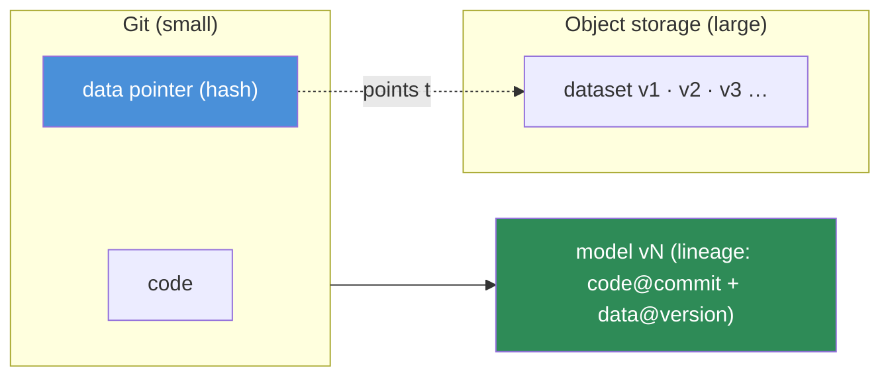
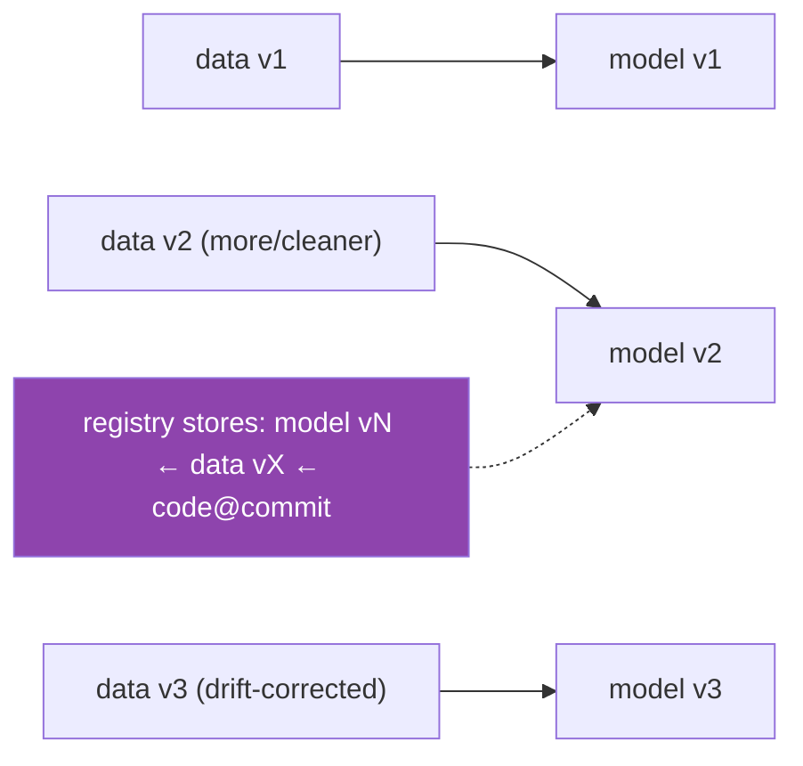

# 16.3 · Data Versioning

[⬅ 16.2 Reproducibility](16.2-reproducibility.md) · [🏠 Module 16](../README.md) · [➡ 16.4 Experiment Tracking](16.4-experiment-tracking.md)

> **The lesson in one line:** In ML the data is as much "source" as the code, so it must be **versioned** — but datasets are too big for Git, so tools like DVC and LakeFS version them by storing lightweight *pointers* in Git while the actual data lives in object storage, giving you **data ↔ model lineage**: every model traceable to the exact data that made it.

---

## 🎯 Learning objectives

- Version datasets with **data lineage, validation, quality checks**, and detect **dataset drift**.
- Understand DVC and LakeFS **conceptually** (Git-for-data via pointers).
- Link **data versions to model versions** for full lineage.

## ✅ Prerequisites

- [16.2 reproducibility](16.2-reproducibility.md), [15.4 dataset preparation](../../15-Fine-Tuning/weeks/15.4-dataset-preparation.md), [05 SQL/data](../../05-SQL/README.md).

---

## 🧠 Mental model

> [!IMPORTANT]
> **Code + data → model. You already version code with Git; a model isn't reproducible unless you also version the data — but data is gigabytes-to-terabytes, so you can't just `git add` it.** The trick every data-versioning tool uses: store the **large data in object storage** (S3/GCS) and commit a small **pointer/hash** to Git. Git then versions the *reference*; checking out an old commit fetches the matching data version. This gives you **data ↔ model lineage**: model `v7` was trained on dataset `d3` at commit `abc123`, so you can always answer "what data made this model?" — essential for reproducibility ([16.2](16.2-reproducibility.md)), debugging drift ([16.11](16.11-monitoring-drift.md)), and compliance ([16.19](16.19-security.md)).



---

## The data lifecycle in versioning

| Stage | What it does |
|---|---|
| **Dataset versioning** | immutable snapshots (hash/pointer) so a version never changes ([15.4](../../15-Fine-Tuning/weeks/15.4-dataset-preparation.md)) |
| **Data lineage** | trace a dataset version → its sources → the models trained on it |
| **Data validation** | schema, types, ranges, nulls — reject malformed data before training |
| **Data quality checks** | duplicates, label balance, PII, distribution sanity |
| **Dataset drift** | production data distribution differs from training data ([16.11](16.11-monitoring-drift.md)) |

### Data validation & quality
Validate **every dataset version** before it trains a model: schema conformance, value ranges, null rates, class balance, PII presence ([15.4](../../15-Fine-Tuning/weeks/15.4-dataset-preparation.md)). A validation gate in the pipeline ([16.6](16.6-ml-pipelines.md)) stops a bad data version from silently producing a bad model — a classic quiet failure ([16.1](16.1-what-is-mlops.md)).

---

## The tools (conceptually)

| Tool | Model | Best for |
|---|---|---|
| **DVC** | Git-like CLI; data files → hashes in Git, blobs in remote storage | versioning datasets/models alongside a code repo; pipelines |
| **LakeFS** | Git-*over*-object-storage; branch/commit/merge your whole data lake | large-scale data lakes; branch data for experiments |

- **DVC**: `dvc add data/` replaces the file with a small `.dvc` pointer (committed to Git); `dvc push` sends the blob to remote storage. `git checkout` + `dvc checkout` restores the exact data for that commit. Also does data/ML **pipelines** with dependency tracking.
- **LakeFS**: gives your **object storage** Git semantics — you `branch` a petabyte-scale lake, run an experiment on the branch, and `merge` or discard — without copying the data.

> [!IMPORTANT]
> **The unifying idea is "Git for data": version the data by reference, not by value.** You don't need to memorize a specific tool — you need the *pattern*: large data lives in object storage, a small immutable pointer lives in version control, and checking out a code version restores the matching data version. Whether it's DVC (file-level pointers) or LakeFS (lake-level branches), the payoff is the same: **every model has a reproducible, auditable data lineage.**

---

## Data versions ↔ model versions



Every registered model ([16.5](16.5-model-registry.md)) records **which data version + code commit + config** produced it. This lineage is what lets you: reproduce a model ([16.2](16.2-reproducibility.md)), explain a regression (data changed), retrain on a new data version ([16.11](16.11-monitoring-drift.md)), and satisfy audits ("what data trained this?").

---

## 💻 A data versioning workflow (DVC-style)

```bash
# version a dataset
dvc add data/train.parquet        # creates data/train.parquet.dvc (a small pointer)
git add data/train.parquet.dvc data/.gitignore
git commit -m "data: training set v2 (deduped)"
dvc push                          # upload the blob to remote storage (S3/GCS)

# ...later, reproduce an old model's data
git checkout <old-commit>         # restores the pointer
dvc checkout                      # fetches the exact matching data version
```
Now the data version is tied to a Git commit; the [experiment tracker (16.4)](16.4-experiment-tracking.md) and [registry (16.5)](16.5-model-registry.md) record which data version each model used.

---

## 🏭 Production examples

| Scenario | Practice |
|---|---|
| Reproduce a past model | git commit + `dvc checkout` restores exact data |
| Explain a regression | diff data versions; often the data changed |
| Retrain on fresh data | new data version → new model version, lineage kept |
| Branch data for an experiment | LakeFS branch; merge if it wins |
| Compliance/audit | prove which data trained a model |

## ⚡ Performance & 💲 cost considerations

- **Versioning by reference is cheap** — you store blobs once in object storage, not copies per commit (dedup by hash).
- **Object storage cost grows with retained versions** — set retention/garbage-collection policies; you don't keep every intermediate forever.
- **Data transfer (push/pull) has cost/latency** — colocate storage with compute ([16.22](16.22-cloud.md)).

## 🔒 Security considerations

> [!CAUTION]
> - **Versioned data may contain PII/sensitive content** — access-control the storage, encrypt at rest, and support deletion (which means removing a version *and* retraining, [15.20](../../15-Fine-Tuning/weeks/15.20-security.md)).
> - **Data lineage is a compliance asset** — proving provenance supports audits and right-to-be-forgotten.
> - **Immutable versions + hashes detect tampering/poisoning** — a changed hash flags altered data ([16.19](16.19-security.md)).

## 🚫 Common mistakes

| Mistake | Consequence |
|---|---|
| Committing large data to Git | Bloated, slow repo; hits size limits |
| Mutable "latest" dataset | Same code, changing data → irreproducible ([16.2](16.2-reproducibility.md)) |
| No data validation gate | Bad data → bad model, silently ([16.1](16.1-what-is-mlops.md)) |
| No data↔model lineage | Can't reproduce/explain/audit models |
| Keeping every version forever | Runaway storage cost |
| No access control on data storage | PII exposure |

## 🐛 Debugging workflow

"Model regressed" or "can't reproduce" — (1) **Did the data version change?** Diff the pointers/hashes between the good and bad models' lineage. (2) **Validation gate** — did malformed data slip through? (3) **Drift** — is production data now unlike training data ([16.11](16.11-monitoring-drift.md))? (4) **Lineage complete?** If you can't answer "what data made this model," that's the gap to fix. Data changes are the most common *quiet* cause of model regressions.

## 🏋️ Exercises

1. **Version a dataset.** Use DVC (or a hash-pointer scheme) to version a dataset; commit the pointer; restore an old version.
2. **Lineage.** Wire data version → model version so each model records its data; query "what data made model v3?"
3. **Validation gate.** Add a schema/quality gate; feed malformed data; show it's rejected before training.
4. **Reproduce via data.** Recreate an old model by checking out its data version + code commit.
5. **Storage math.** Compare storage cost of copy-per-commit vs hash-dedup versioning.

## 🛠️ Mini project — "Data versioning + lineage system"

**Goal:** version datasets by reference, validate them, and link versions to models.

**Requirements:** hash/pointer versioning (DVC or custom) with object-storage backend; a validation + quality gate (schema/nulls/balance/PII); data↔model lineage recorded per training run; a `restore <commit>` that fetches the exact data; retention policy.

**Folder structure**
```
data-versioning/
├── version.py      # add/push/checkout by hash
├── validate.py     # schema + quality + PII gate
├── lineage.py      # data version ↔ model version
└── retention.py    # GC old versions
```

**Testing:** old data version restored exactly; malformed data rejected; lineage answers "what data made model X".
**Evaluation:** reproducibility rate; validation catch rate.
**Security:** access control + encryption + tamper-detection via hashes ([16.19](16.19-security.md)).
**Monitoring:** dataset drift vs the training version ([16.11](16.11-monitoring-drift.md)).
**Future improvements:** LakeFS-style branching; automated drift-triggered re-versioning.

## 📄 Cheat sheet

| Concept | One line |
|---|---|
| **⭐ Version data like code** | it's source too: code + data → model |
| **⭐ Git for data** | big data in object storage; small **pointer/hash** in Git |
| **DVC** | file-level pointers; `dvc add/push/checkout`; pipelines |
| **LakeFS** | Git branches/commits over an object-storage data lake |
| **Data lineage** | model vN ← data vX ← code@commit |
| **Validation gate** | schema/nulls/balance/PII before training |
| **Dataset drift** | prod data ≠ training data ([16.11](16.11-monitoring-drift.md)) |
| **⭐ Payoff** | reproduce · explain · retrain · audit any model |

## 🎴 Flashcards

- **⭐ Why version data, and why can't you use Git directly?** → In ML, code + data → model, so data must be versioned for reproducibility; but datasets are too large for Git, so tools store a small pointer/hash in Git and the blob in object storage.
- **How do DVC and LakeFS differ?** → DVC versions files via pointers alongside a Git repo; LakeFS gives Git-style branch/commit/merge over an entire object-storage data lake.
- **What is data↔model lineage?** → The recorded link "model vN was trained on data vX at code commit Y" — enabling reproduction, regression diagnosis, retraining, and audits.
- **What does a data validation gate do?** → Checks schema/types/ranges/nulls/balance/PII on a dataset version and rejects bad data before it trains a model (preventing a quiet failure).
- **Why must a dataset version be immutable?** → A mutable "latest" dataset means the same code produces different models over time — irreproducible.
- **How is data versioning a security control?** → Immutable hashes detect tampering/poisoning, and lineage proves provenance for audits and deletion requests.

## 💬 Interview questions

1. Why version data, and why is Git insufficient for it?
2. Explain the "Git for data" pattern DVC and LakeFS share.
3. What is data↔model lineage, and what does it enable?
4. What checks belong in a data validation gate, and why before training?
5. How does data versioning relate to reproducibility and drift?
6. How is versioned data a compliance and security asset?

## 📝 Summary

- In ML, **code + data → model**, so data is **source** and must be versioned — but it's too big for Git, so tools use **"Git for data": a small pointer/hash in version control, the blob in object storage**.
- **DVC** (file pointers, pipelines) and **LakeFS** (branch/commit a data lake) both give **data↔model lineage** — every model traceable to the exact data + commit that produced it.
- **Validate and quality-check each data version** before training (schema/nulls/balance/PII) to stop bad data from silently producing a bad model.
- Lineage powers **reproducibility, regression diagnosis, retraining, and audits**, and immutable hashes provide **tamper/poisoning detection** — with retention policies to control storage cost.

## 📚 References

1. **DVC documentation.** ⭐ Data/model versioning + pipelines.
2. **LakeFS documentation.** Git-over-object-storage.
3. **[15.4 Dataset Preparation](../../15-Fine-Tuning/weeks/15.4-dataset-preparation.md).** Validation, dedup, leakage.
4. **Great Expectations / pandera.** Data validation frameworks.

---

## 🧭 Navigation

| Direction | Link |
|---|---|
| ⬅ Previous | [16.2 · Reproducibility](16.2-reproducibility.md) |
| ➡ Next | [16.4 · Experiment Tracking](16.4-experiment-tracking.md) |
| 🏠 Module | [Module 16](../README.md) |
| 📖 Lessons | [Lesson index](README.md) |
