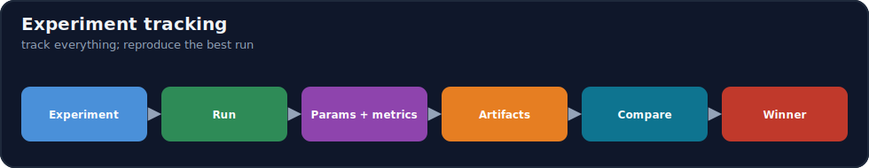
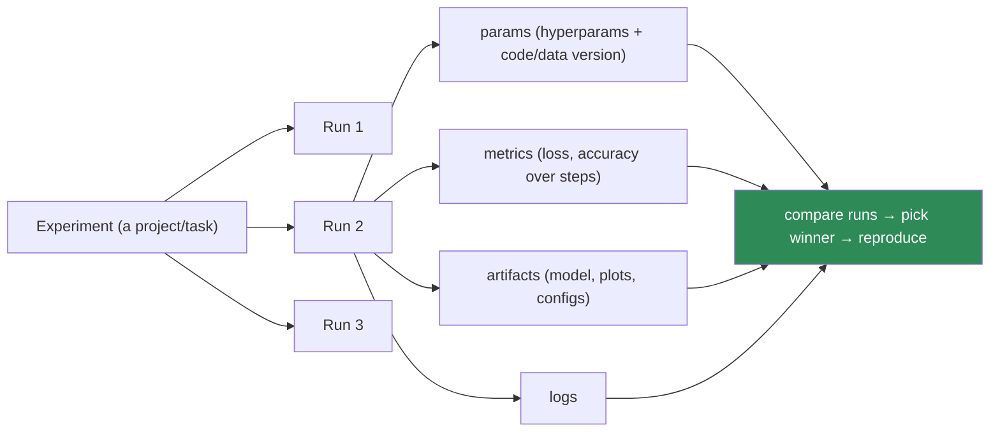
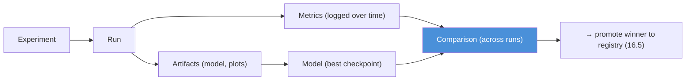

# 16.4 · Experiment Tracking ⭐

[⬅ 16.3 Data Versioning](16.3-data-versioning.md) · [🏠 Module 16](../README.md) · [➡ 16.5 Model Registry](16.5-model-registry.md)

> **The lesson in one line:** ML is empirical — you run *many* experiments and keep the best — so you need a system that automatically logs every run's **hyperparameters, metrics, artifacts, logs, and checkpoints**, tied to its code/data versions, so you can **compare runs objectively and reproduce the winner** instead of losing it to a notebook you overwrote.



---

## 🎯 Learning objectives

- Log the elements of a run: **hyperparameters, metrics, artifacts, logs, checkpoints**.
- Understand the **experiment → run → metrics → artifacts → model → comparison** flow.
- Use MLflow / Weights & Biases **conceptually** and build a tracking workflow.

## ✅ Prerequisites

- [16.2 reproducibility](16.2-reproducibility.md), [16.3 data versioning](16.3-data-versioning.md), [15.11 hyperparameters](../../15-Fine-Tuning/weeks/15.11-hyperparameters.md).

---

## 🧠 Mental model

> [!IMPORTANT]
> **ML isn't written, it's *searched* — you try dozens of configurations and keep the best, so the question that dominates ML work is "which run was best, and can I recreate it?"** Without tracking, that history lives in overwritten notebooks, ad-hoc filenames (`model_final_v2_real.pt`), and memory — and the good run is routinely lost. **Experiment tracking is a database for your ML process**: every *run* records its **inputs** (hyperparameters + code/data versions), its **outputs** (metrics + artifacts + checkpoints), and its **logs**, so you can **compare runs on identical axes** and **reproduce the winner** ([16.2](16.2-reproducibility.md)). It turns ML from "I think this config was good" into "run #142 scored 0.91; here's exactly how to recreate it."



---

## What a run records

| Element | What | Why |
|---|---|---|
| **Hyperparameters** | LR, batch, epochs, rank, model, etc. | the knobs that produced the result ([15.11](../../15-Fine-Tuning/weeks/15.11-hyperparameters.md)) |
| **Metrics** | loss/accuracy/F1 over steps/epochs | how good, and the training curve |
| **Artifacts** | the model, plots, configs, sample outputs | the outputs to keep/inspect |
| **Logs** | stdout, warnings, errors | debugging a run after the fact |
| **Checkpoints** | model states at intervals | resume; keep best-by-validation |
| **Lineage** | git commit + data version | reproducibility ([16.2](16.2-reproducibility.md)–[16.3](16.3-data-versioning.md)) |

---

## The flow



An **experiment** is a project/task (e.g., "fraud classifier"); each **run** is one attempt (a config). You **log metrics over time** (to see the curve, not just the final number), **save artifacts**, and then **compare runs** to pick the winner — which flows into the **model registry** ([16.5](16.5-model-registry.md)) for promotion.

---

## The tools (conceptually)

| Tool | Character |
|---|---|
| **MLflow** | open-source; tracking + registry + projects + serving; self-host or managed |
| **Weights & Biases** | hosted (self-host option); rich UI, dashboards, sweeps, artifacts, collaboration |

Both give: a run API (`log_param`, `log_metric`, `log_artifact`), a UI to **compare runs**, and integration with a **model registry**. Choose by hosting preference, UI needs, and team scale — the *concepts* (run/params/metrics/artifacts/compare) are identical.

---

## 💻 A tracking workflow (MLflow-style)

```python
import mlflow
mlflow.set_experiment("fraud-classifier")

with mlflow.start_run(run_name="lr2e4-bs32") as run:
    mlflow.log_params({"lr": 2e-4, "batch_size": 32, "epochs": 3,
                       "git_commit": git_sha(), "data_version": data_hash()})  # lineage (16.2–16.3)
    for epoch in range(epochs):
        train_loss = train_one_epoch(...)
        val_f1 = evaluate(...)
        mlflow.log_metrics({"train_loss": train_loss, "val_f1": val_f1}, step=epoch)  # over time
    mlflow.log_artifact("plots/confusion_matrix.png")
    mlflow.log_artifact("config.yaml")
    mlflow.pytorch.log_model(model, "model")            # artifact → registrable (16.5)
    mlflow.set_tag("status", "candidate")
```

**Log lineage (commit + data version) as params**, metrics **over time** (with `step`), and the **model as an artifact** — so the run is comparable *and* reproducible, and the model can be promoted to the registry.

> [!IMPORTANT]
> **Track from the very first experiment, not "once it's serious" — because the run you didn't track is the run you can't reproduce, and that's always the good one.** The habit costs almost nothing (a few `log_*` calls, or automatic autologging) and pays back the moment you ask "what was different about the run that scored 0.91?" Tracking also makes **comparison objective** (a sortable table instead of memory) and is the on-ramp to **hyperparameter sweeps**, the **model registry** ([16.5](16.5-model-registry.md)), and **CI/CD gates** ([16.7](16.7-cicd.md)).

---

## 🏭 Production examples

| Practice | Payoff |
|---|---|
| Autolog every run | zero-effort history; nothing lost |
| Log git commit + data version | reproducible runs ([16.2](16.2-reproducibility.md)) |
| Metrics over time (not just final) | see divergence/overfitting ([15.19](../../15-Fine-Tuning/weeks/15.19-debugging.md)) |
| Compare-runs UI | objective winner selection |
| Sweeps (grid/Bayesian) | systematic hyperparameter search |
| Tracker → registry handoff | promote the winner ([16.5](16.5-model-registry.md)) |

## ⚡ Performance & 💲 cost considerations

- **Logging is cheap**; storing large artifacts (checkpoints) adds storage cost — keep best-N, prune the rest.
- **Metric logging frequency** — log per-epoch or per-N-steps, not per-step for huge runs (overhead + noise).
- **Managed trackers charge by usage/storage** — self-host (MLflow) for cost control at scale.

## 🔒 Security considerations

> [!CAUTION]
> - **Tracked artifacts/logs can contain sensitive data** (sample outputs with PII, config with secrets) — govern access; keep secrets out of logged params ([16.19](16.19-security.md)).
> - **A hosted tracker sees your metrics/artifacts** — check data-handling terms for sensitive projects; self-host if needed.
> - **Lineage supports audit/compliance** — proving how a model was produced ([15.20](../../15-Fine-Tuning/weeks/15.20-security.md)).

## 🚫 Common mistakes

| Mistake | Consequence |
|---|---|
| Not tracking early runs | The good run is lost/unreproducible |
| Ad-hoc filenames instead of a tracker | No objective comparison |
| Logging only the final metric | Miss the training curve (overfitting/divergence) |
| Not logging commit/data version | Runs aren't reproducible ([16.2](16.2-reproducibility.md)) |
| Keeping every checkpoint | Runaway storage |
| Secrets in logged params | Leak |

## 🐛 Debugging workflow

"Which run was best / why did this one fail?" — (1) **Open the compare view**; sort by the target metric; the winner is objective. (2) **Inspect the losing run's curve** (metrics over time) — divergence (LR), overfitting (val rises), flat (broken, [15.19](../../15-Fine-Tuning/weeks/15.19-debugging.md)). (3) **Diff params** between good and bad runs — what changed? (4) **Reproduce** the winner from its logged lineage ([16.2](16.2-reproducibility.md)). Tracking turns "I don't remember" into a queryable record.

## 🏋️ Exercises

1. **Track it.** Instrument a training with params/metrics/artifacts; view the compare table.
2. **Lineage.** Log git commit + data version; reproduce a run from them.
3. **Curves.** Log metrics over time; identify overfitting from the val curve.
4. **Sweep.** Run a small hyperparameter sweep; pick the winner from the tracked table.
5. **Handoff.** Log a model artifact and mark it a candidate for the registry ([16.5](16.5-model-registry.md)).

## 🛠️ Mini project — "ML experiment tracking system"

**Goal:** a tracking setup that records everything and makes runs comparable and reproducible.

**Requirements:** run API (params/metrics/artifacts/logs/checkpoints); auto-capture of git commit + data version; metrics-over-time; a compare view; best-N checkpoint retention; a candidate→registry tag ([16.5](16.5-model-registry.md)).

**Folder structure**
```
exp-tracking/
├── track.py        # log params/metrics/artifacts + lineage
├── compare.py      # sortable run comparison
├── retention.py    # keep best-N checkpoints
└── sweep.py        # hyperparameter sweep
```

**Testing:** every run is comparable + reproducible; the winner is objectively selectable.
**Evaluation:** fraction of runs reproducible from their record.
**Security:** access control; no secrets in params ([16.19](16.19-security.md)).
**Monitoring:** track eval metrics to compare against production later ([16.11](16.11-monitoring-drift.md)).
**Future improvements:** Bayesian sweeps; registry integration; CI gate on metrics ([16.7](16.7-cicd.md)).

## 📄 Cheat sheet

| Concept | One line |
|---|---|
| **⭐ Why track** | ML is searched, not written — keep/reproduce the best run |
| **Experiment → run** | a task → one attempt (a config) |
| **Log** | params (+ lineage) · metrics **over time** · artifacts · logs · checkpoints |
| **Compare** | objective sortable table → pick winner |
| **Tools** | MLflow (OSS, +registry) · W&B (hosted UI/sweeps) |
| **⭐ Habit** | track from run #1 (the untracked run is the good one) |
| **Handoff** | winner → model registry ([16.5](16.5-model-registry.md)) |
| **⚠️** | keep best-N checkpoints; no secrets in params |

## 🎴 Flashcards

- **⭐ Why is experiment tracking essential?** → ML is empirical (you search many configs and keep the best); without tracking, the winning run is lost to overwritten notebooks and memory, and can't be reproduced.
- **What does a run record?** → Hyperparameters (+ git commit + data version), metrics over time, artifacts (model/plots), logs, and checkpoints.
- **What is the experiment→run relationship?** → An experiment is a project/task; each run is one attempt (a configuration) within it.
- **Why log metrics over time, not just the final number?** → To see the training curve — divergence, overfitting, or a flat/broken run — not just the endpoint.
- **⭐ Why track from the first experiment?** → The run you didn't track is the one you can't reproduce, and it's reliably the good one; tracking is cheap and enables comparison, sweeps, registry, and CI gates.
- **How do MLflow and W&B compare conceptually?** → Same concepts (run/params/metrics/artifacts/compare + registry); MLflow is open-source/self-hostable, W&B is a hosted UI with rich dashboards/sweeps.

## 💬 Interview questions

1. Why is experiment tracking foundational to ML work?
2. What does a run record, and why include lineage?
3. Why log metrics over time rather than just the final value?
4. How does tracking connect to reproducibility and the model registry?
5. Compare MLflow and Weights & Biases conceptually.
6. How would you select and reproduce the best run from a sweep?

## 📝 Summary

- ML is **searched, not written** — you run many experiments and must **keep and reproduce the best**, which is what **experiment tracking** provides: a database of runs.
- Each **run** logs **hyperparameters (+ git commit + data version), metrics over time, artifacts, logs, and checkpoints**, making runs **comparable** and **reproducible** ([16.2](16.2-reproducibility.md)).
- **MLflow** (open-source, +registry) and **Weights & Biases** (hosted UI/sweeps) share identical concepts; **track from run #1** because the untracked run is the one you can't recreate.
- Tracking is the on-ramp to **sweeps, the model registry** ([16.5](16.5-model-registry.md)), and **CI/CD metric gates** ([16.7](16.7-cicd.md)) — keep **best-N checkpoints** and **no secrets in params**.

## 📚 References

1. **MLflow Tracking documentation.** ⭐ Runs, params, metrics, artifacts, registry.
2. **Weights & Biases documentation.** Dashboards, sweeps, artifacts.
3. **[16.2 Reproducibility](16.2-reproducibility.md) & [16.5 Model Registry](16.5-model-registry.md).** What tracking feeds.
4. **[15.11 Hyperparameters](../../15-Fine-Tuning/weeks/15.11-hyperparameters.md).** The knobs you track.

---

## 🧭 Navigation

| Direction | Link |
|---|---|
| ⬅ Previous | [16.3 · Data Versioning](16.3-data-versioning.md) |
| ➡ Next | [16.5 · Model Registry](16.5-model-registry.md) |
| 🏠 Module | [Module 16](../README.md) |
| 📖 Lessons | [Lesson index](README.md) |
