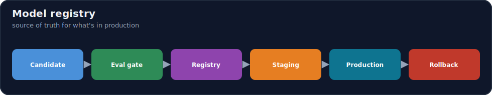
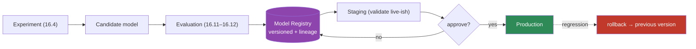
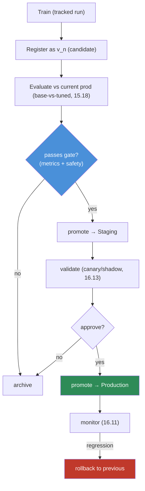

# 16.5 · Model Registry ⭐

[⬅ 16.4 Experiment Tracking](16.4-experiment-tracking.md) · [🏠 Module 16](../README.md) · [➡ 16.6 ML Pipelines](16.6-ml-pipelines.md)

> **The lesson in one line:** A model registry is the **source of truth for "which model is in production"** — a versioned catalog where a candidate is evaluated, approved, promoted through stages (staging → production), and can be **rolled back instantly** — turning "the model file on someone's laptop" into a governed, auditable, recoverable artifact.



---

## 🎯 Learning objectives

- Understand **model versions, stages, approval, promotion, and rollback**.
- Trace the lifecycle: experiment → candidate → evaluation → registry → staging → production.
- Use a registry to make deployment **governed and reversible**.

## ✅ Prerequisites

- [16.4 experiment tracking](16.4-experiment-tracking.md), [15.21 fine-tuning production pipeline](../../15-Fine-Tuning/weeks/15.21-production-pipeline.md).

---

## 🧠 Mental model

> [!IMPORTANT]
> **The registry answers three questions you must always be able to answer in production: "exactly which model is serving right now?", "how did it get there?", and "how do I put the previous one back?"** Without it, models live as ambiguous files (`model_final.pt`), nobody's sure which is deployed, promotion is a manual copy, and rollback means frantically finding the old file. A registry makes each model a **versioned, staged, approved artifact with lineage** — the same discipline Git brings to code and DVC brings to data ([16.3](16.3-data-versioning.md)), now for models. It's the **hinge between training and serving**: experiments produce candidates, the registry governs which candidate becomes production, and it keeps the old versions ready for **instant rollback**.



---

## The registry concepts

| Concept | What |
|---|---|
| **Model version** | an immutable registered artifact + its **lineage** (data/code/config, [16.2](16.2-reproducibility.md)–[16.4](16.4-experiment-tracking.md)) |
| **Stages** | `None → Staging → Production → Archived` — where each version is in its lifecycle |
| **Approval** | a gate (human or automated) that a version passes before promotion |
| **Promotion** | moving a version to the next stage (staging → production) |
| **Rollback** | re-pointing production to a previous version — **fast, no retraining** |
| **Aliases/tags** | pointers like `@champion`, `@challenger` for A/B ([16.13](16.13-deployment-strategies.md)) |

---

## The model lifecycle



> [!IMPORTANT]
> **Promotion must be *gated*, and rollback must be *instant*.** A model reaches production only after passing an **evaluation gate** (metrics + safety, compared against the current production model, [15.18](../../15-Fine-Tuning/weeks/15.18-base-vs-finetuned.md)) — never by manual copy. And because the registry keeps every version, a bad production model is reverted by **re-pointing the serving layer to the previous version** — seconds, no retraining. **Gated promotion + instant rollback is what makes shipping models *safe***, the same invariant as fine-tuning's production pipeline ([15.21](../../15-Fine-Tuning/weeks/15.21-production-pipeline.md)).

---

## 💻 Registry operations (MLflow-style)

```python
from mlflow import MlflowClient
client = MlflowClient()

# register a tracked run's model as a new version
mv = client.create_model_version(name="fraud-classifier",
                                 source=f"runs:/{run_id}/model", run_id=run_id)

# gate: promote to staging only if it beats production on the eval set
if eval_beats_production(mv):                       # 15.18: significant, net-positive, safe
    client.transition_model_version_stage("fraud-classifier", mv.version, "Staging")

# after canary validation, approve → production
client.transition_model_version_stage("fraud-classifier", mv.version, "Production")

# serving loads by stage/alias, not a hardcoded path
model = mlflow.pyfunc.load_model("models:/fraud-classifier/Production")

# rollback: re-point Production to the previous version
client.transition_model_version_stage("fraud-classifier", prev_version, "Production")
```

**Serving loads `models:/name/Production`, not a file path** — so promotion/rollback is a registry state change, not a redeploy. This decouples *which model serves* from *the serving code*.

---

## 🏭 Production examples

| Need | Registry provides |
|---|---|
| Know what's live | the Production-stage version + lineage |
| Safe promotion | evaluation gate before production |
| Instant rollback | re-point to previous version (no retrain) |
| A/B / canary | champion/challenger aliases ([16.13](16.13-deployment-strategies.md)) |
| Audit | full lineage per version ([16.2](16.2-reproducibility.md)) |
| Multi-model / multi-tenant | many named models + versions (LoRA adapters, [15.8](../../15-Fine-Tuning/weeks/15.8-lora.md)) |

## ⚡ Performance & 💲 cost considerations

- **Loading by stage adds indirection, not latency** — the model is cached after load; the registry lookup is cheap.
- **Storing many versions costs storage** — archive/GC old versions per policy (keep a rollback window).
- **LoRA adapters are tiny registry artifacts** (few MB) — many versioned adapters cheaply ([15.8](../../15-Fine-Tuning/weeks/15.8-lora.md)).

## 🔒 Security considerations

> [!CAUTION]
> - **The registry is the control point for what runs in production** — access-control promotions (only authorized approvals reach Production, [16.19](16.19-security.md)).
> - **Registered models are sensitive artifacts** (may have memorized data) — encrypt, audit access ([15.20](../../15-Fine-Tuning/weeks/15.20-security.md)).
> - **Safety must be part of the promotion gate** — never auto-promote past a safety check ([16.12](16.12-llm-evaluation.md), [15.17](../../15-Fine-Tuning/weeks/15.17-evaluation.md)).

## 🚫 Common mistakes

| Mistake | Consequence |
|---|---|
| Deploying model files directly | No lineage, no rollback, ambiguity |
| Manual promotion (copy files) | Ungated, error-prone, unauditable |
| Hardcoding a model path in serving | Can't promote/rollback without redeploy |
| No evaluation gate before production | Regressed/unsafe model ships |
| No rollback window (deleting old versions) | Can't recover from a bad ship |
| Unrestricted promotion access | Unauthorized production changes |

## 🐛 Debugging workflow

Production model issue: (1) **Which version is in Production?** (registry answers instantly) and **what's its lineage** (data/code/config)? (2) **Regression?** Compare to the previous version on the eval set ([15.18](../../15-Fine-Tuning/weeks/15.18-base-vs-finetuned.md)); **roll back** to it by re-staging while fixing forward. (3) **How did it get promoted?** Check the gate/approval record — did the eval gate pass? (4) Add the missed failure to the promotion gate. The registry turns "which model is broken?" into a lookup.

## 🏋️ Exercises

1. **Register + stage.** Register a tracked model; move it through None→Staging→Production.
2. **Gated promotion.** Promote to Production only if it beats the current prod model on an eval set; block a regressor.
3. **Rollback drill.** Deploy a bad version; roll back by re-pointing Production to the previous version; measure recovery time.
4. **Load by stage.** Make serving load `models:/name/Production`; show promotion changes what serves with no redeploy.
5. **Lineage.** From a production version, recover its data/code/config ([16.2](16.2-reproducibility.md)).

## 🛠️ Mini project — "Model registry workflow"

**Goal:** a registry-driven lifecycle: candidate → gated eval → staging → production → rollback.

**Requirements:** register versions with lineage; stages (None/Staging/Production/Archived); an evaluation gate ([15.18](../../15-Fine-Tuning/weeks/15.18-base-vs-finetuned.md)) + safety; approval step; serving loads by stage; one-command rollback; access control on promotion.

**Folder structure**
```
model-registry/
├── register.py     # version + lineage
├── gate.py         # eval + safety before promotion
├── promote.py      # stage transitions + approval
├── serve.py        # load by stage/alias
└── rollback.py     # re-point Production
```

**Testing:** regressor blocked at the gate; rollback restores previous; serving reflects stage changes without redeploy.
**Evaluation:** MTTR for a bad model; % promotions gated.
**Security:** access-controlled promotion; safety gate; encrypted artifacts ([16.19](16.19-security.md)).
**Monitoring:** which version serves; promotion/rollback audit ([16.11](16.11-monitoring-drift.md)).
**Future improvements:** champion/challenger A/B; automated promotion on winning canary.

## 📄 Cheat sheet

| Concept | One line |
|---|---|
| **⭐ Registry** | source of truth for which model is in production |
| **Model version** | immutable artifact + lineage |
| **Stages** | None → Staging → Production → Archived |
| **⭐ Gated promotion** | eval + safety gate before Production ([15.18](../../15-Fine-Tuning/weeks/15.18-base-vs-finetuned.md)) |
| **⭐ Rollback** | re-point Production to previous — instant, no retrain |
| **Load by stage** | `models:/name/Production` — not a file path |
| **Aliases** | champion/challenger for A/B ([16.13](16.13-deployment-strategies.md)) |
| **⚠️** | access-control promotion; keep a rollback window |

## 🎴 Flashcards

- **⭐ What is a model registry, and what three questions does it answer?** → A versioned catalog of models that answers: which model is in production now, how it got there (lineage), and how to roll back to the previous one.
- **What are model stages?** → None → Staging → Production → Archived — where each version sits in its lifecycle.
- **⭐ Why must promotion be gated?** → A model reaches production only after passing an evaluation + safety gate (vs the current prod model), never by manual copy — this prevents shipping regressions.
- **⭐ How does rollback work with a registry?** → Re-point the Production stage/alias to a previous version — instant, no retraining — because the registry keeps every version.
- **Why should serving load by stage, not a file path?** → So promotion and rollback are registry state changes, not code redeploys — decoupling which model serves from the serving code.
- **How is the registry a security control?** → It's the access-controlled control point for what runs in production, with safety as part of the promotion gate.

## 💬 Interview questions

1. What is a model registry, and why is deploying model files directly a bad idea?
2. Explain model stages, promotion, and approval.
3. Why must promotion be gated, and rollback instant?
4. Why should the serving layer load a model by stage rather than a path?
5. How does the registry connect experiment tracking to deployment?
6. How is the registry both a governance and a security control?

## 📝 Summary

- A **model registry** is the **source of truth for what's in production** — versioned models with lineage, moved through **stages** (staging → production) via **gated promotion** and reverted via **instant rollback**.
- It's the **hinge between training and serving**: experiments produce candidates, an **evaluation + safety gate** decides promotion ([15.18](../../15-Fine-Tuning/weeks/15.18-base-vs-finetuned.md)), and **serving loads by stage** (`models:/name/Production`) so promotion/rollback needs no redeploy.
- **Gated promotion + instant rollback = safe model shipping** — the same invariant as the fine-tuning production pipeline ([15.21](../../15-Fine-Tuning/weeks/15.21-production-pipeline.md)).
- **Access-control promotions, include safety in the gate, and keep a rollback window** — the registry is the governance and security control point for production models.

## 📚 References

1. **MLflow Model Registry documentation.** ⭐ Versions, stages, transitions.
2. **[15.21 Production Fine-Tuning Pipeline](../../15-Fine-Tuning/weeks/15.21-production-pipeline.md).** Lineage + rollback invariants.
3. **[15.18 Base vs Fine-Tuned](../../15-Fine-Tuning/weeks/15.18-base-vs-finetuned.md).** The promotion gate.
4. **[16.13 Deployment Strategies](16.13-deployment-strategies.md).** Canary/champion-challenger.

---

## 🧭 Navigation

| Direction | Link |
|---|---|
| ⬅ Previous | [16.4 · Experiment Tracking](16.4-experiment-tracking.md) |
| ➡ Next | [16.6 · ML Pipelines & Orchestration](16.6-ml-pipelines.md) |
| 🏠 Module | [Module 16](../README.md) |
| 📖 Lessons | [Lesson index](README.md) |
