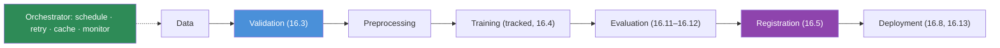
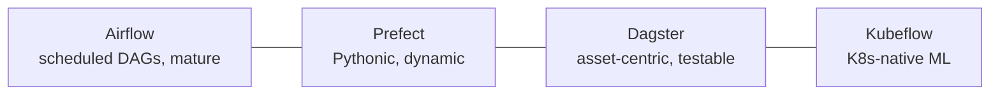

# 16.6 · ML Pipelines & Orchestration

[⬅ 16.5 Model Registry](16.5-model-registry.md) · [🏠 Module 16](../README.md) · [➡ 16.7 CI/CD for AI](16.7-cicd.md)

> **The lesson in one line:** A one-off training script isn't operable — an **ML pipeline** turns "data → model" into a graph of discrete, re-runnable, dependency-tracked stages (validate → preprocess → train → evaluate → register → deploy) run by an **orchestrator** (Airflow / Prefect / Dagster / Kubeflow) that schedules, retries, and monitors them.

---

## 🎯 Learning objectives

- Design **data, training, evaluation, and deployment** pipelines as staged DAGs.
- Understand **orchestration** and compare Airflow / Prefect / Dagster / Kubeflow.
- Know why pipelines (not scripts) are the unit of production ML.

## ✅ Prerequisites

- [16.2 reproducibility](16.2-reproducibility.md), [16.4 tracking](16.4-experiment-tracking.md), [16.5 registry](16.5-model-registry.md).

---

## 🧠 Mental model

> [!IMPORTANT]
> **A notebook that does everything in one cell is a demo; production ML is a *pipeline* — a directed graph of independent stages, each with defined inputs/outputs, that can be re-run, retried, cached, scheduled, and monitored on its own.** The reasons mirror [prompt chaining (12.8)](../../12-Prompt-Engineering/weeks/12.8-prompt-chaining.md) and [RAG's two planes (13.15)](../../13-RAG/weeks/13.15-production-architecture.md): if training fails at step 4, you don't re-run steps 1–3; if data validation fails, you stop before wasting GPU on training; you can schedule retraining nightly; and each stage is testable in isolation. An **orchestrator** is the engine that runs this graph — resolving dependencies, retrying failures, caching results, and reporting status. **Pipelines make ML reproducible, automatable, and observable; scripts don't.**



---

## The pipeline types

| Pipeline | Stages | Runs |
|---|---|---|
| **Data** | ingest → validate → clean → version | on new data ([16.3](16.3-data-versioning.md)) |
| **Training** | load data → preprocess → train (tracked) → checkpoint | on schedule / trigger |
| **Evaluation** | load model → eval on test set → gate | after training ([16.11](16.11-monitoring-drift.md)) |
| **Deployment** | register → stage → canary → promote | after passing the gate ([16.5](16.5-model-registry.md), [16.13](16.13-deployment-strategies.md)) |

These chain into the full lifecycle: **data → validation → preprocessing → training → evaluation → registration → deployment** — the diagram above. Each stage's output is the next's versioned input.

> [!IMPORTANT]
> **The single highest-value stage is the *validation gate before training* — it converts a "quiet failure" into a "loud, early failure."** Without it, bad data silently trains a bad model that quietly serves wrong answers ([16.1](16.1-what-is-mlops.md)). With it, the pipeline stops at step 2 with a clear error, saving GPU hours and a production incident. The same logic applies to the **evaluation gate before deployment** ([16.5](16.5-model-registry.md)): fail early, loudly, cheaply. **Gates are where pipelines earn their keep.**

---

## Orchestration tools (compared)

| Tool | Model | Complexity | Scalability | Learning curve | Best for |
|---|---|---|---|---|---|
| **Airflow** | Python DAGs; time-scheduled tasks; mature ecosystem | high | high | steep | scheduled batch pipelines, big orgs |
| **Prefect** | Python-native flows; dynamic, modern DX | low–med | high | gentle | Pythonic pipelines, fast iteration |
| **Dagster** | asset-centric (data assets as first-class); strong typing/testing | med | high | med | data-asset lineage, testable pipelines |
| **Kubeflow** | Kubernetes-native ML pipelines; containers per step | high | very high | steep | K8s-based ML at scale, GPU workloads |



> [!IMPORTANT]
> **Choose an orchestrator by your environment and team, not hype: Airflow if you need battle-tested scheduling and already run it; Prefect for the smoothest Python DX; Dagster if data-asset lineage and testability matter; Kubeflow if you're all-in on Kubernetes and GPU workloads ([16.16](16.16-kubernetes.md)).** They all provide the essentials — a DAG, scheduling, retries, caching, and observability. Don't add an orchestrator before you have a pipeline worth orchestrating; a simple `Makefile` or shell script is fine for one stage, and a lightweight tool beats a heavyweight one you can't operate.

---

## 💻 A pipeline sketch (tool-agnostic)

```python
# stages are functions with typed inputs/outputs; the orchestrator wires the DAG
def data_stage() -> DataVersion: ...
def validate_stage(data: DataVersion) -> DataVersion:      # ⭐ gate: fail early
    assert passes_validation(data), "data validation failed"; return data
def preprocess_stage(data: DataVersion) -> Features: ...
def train_stage(feats: Features) -> ModelRun: ...          # tracked (16.4)
def evaluate_stage(run: ModelRun) -> EvalReport: ...
def register_stage(run: ModelRun, report: EvalReport):     # ⭐ gate: only if it passes
    if report.beats_production: register_and_stage(run)    # 16.5

# orchestrator (Prefect/Dagster/Airflow) defines dependencies + schedule + retries
pipeline = data_stage >> validate_stage >> preprocess_stage >> train_stage >> evaluate_stage >> register_stage
schedule(pipeline, cron="0 2 * * *", retries=2)            # nightly, retry transient failures
```

Each stage is **re-runnable and cached** (unchanged inputs → skip); the orchestrator handles **scheduling, retries, and monitoring**. This is the machinery behind [retraining (16.11)](16.11-monitoring-drift.md) and the [production pipeline (15.21)](../../15-Fine-Tuning/weeks/15.21-production-pipeline.md).

---

## 🏭 Production examples

| Need | Pipeline/orchestration |
|---|---|
| Nightly retraining | scheduled training pipeline + eval gate |
| Fail fast on bad data | validation stage before training |
| Resume after failure | staged DAG + caching (don't re-run passed stages) |
| GPU training at scale | Kubeflow (containerized steps on GPU nodes, [16.16](16.16-kubernetes.md)) |
| Data-asset lineage | Dagster assets |
| Drift-triggered retrain | monitor → trigger pipeline ([16.11](16.11-monitoring-drift.md)) |

## ⚡ Performance & 💲 cost considerations

- **Caching skips unchanged stages** — huge savings on re-runs (don't re-preprocess if data didn't change).
- **Gate before GPU stages** — validation/eval failures should stop *before* expensive training/serving.
- **Parallelize independent stages**; right-size compute per stage (CPU for preprocessing, GPU for training).

## 🔒 Security considerations

> [!CAUTION]
> - **Pipelines run with credentials** (data access, registry, deploy) — use least-privilege service accounts per stage ([16.19](16.19-security.md)).
> - **A validation/quality gate is also a security gate** — catches poisoned/malformed data before it trains ([15.20](../../15-Fine-Tuning/weeks/15.20-security.md)).
> - **Orchestrator UIs/APIs are attack surface** — authenticate and network-restrict them.

## 🚫 Common mistakes

| Mistake | Consequence |
|---|---|
| One monolithic training script | Can't resume, cache, test, or schedule |
| No validation gate before training | Bad data → bad model, GPU wasted |
| No eval gate before deploy | Regression ships ([16.5](16.5-model-registry.md)) |
| Adding a heavy orchestrator too early | Complexity before you need it |
| No retries on transient failures | Flaky pipelines fail spuriously |
| Re-running everything each time | No caching → slow/expensive |

## 🐛 Debugging workflow

Pipeline failed? (1) **Which stage?** The orchestrator localizes it (unlike a monolithic script). (2) **Is it the input?** Check the failing stage's versioned input (data/model). (3) **Transient?** Retry with backoff ([16.17](16.17-reliability.md)); permanent → fix the stage. (4) **Gate fired?** A validation/eval gate failing is *correct* — investigate the data/model, not the gate. (5) **Re-run from the failed stage** (caching skips the passed ones). Staged pipelines make failures localizable and re-runnable.

## 🏋️ Exercises

1. **Stage it.** Convert a monolithic training script into a 5-stage pipeline (validate→preprocess→train→eval→register).
2. **Gate.** Add a validation gate before training; feed bad data; show it stops early and cheaply.
3. **Cache.** Re-run with unchanged data; show preprocessing/training are skipped.
4. **Schedule + retry.** Schedule nightly with retries; simulate a transient failure and recovery.
5. **Tool compare.** Implement the same pipeline in two orchestrators; compare DX and features.

## 🛠️ Mini project — "Automated training pipeline"

**Goal:** an orchestrated, gated, scheduled training pipeline that registers the winner.

**Requirements:** staged DAG (data→validate→preprocess→train(tracked)→eval→register); validation + eval gates; caching; scheduling + retries; drift-trigger hook ([16.11](16.11-monitoring-drift.md)); orchestrator of choice (Prefect/Dagster/Airflow).

**Folder structure**
```
training-pipeline/
├── stages/         # one module per stage
├── gates.py        # validation + eval gates
├── pipeline.py     # DAG + schedule + retries
└── trigger.py      # drift-triggered run
```

**Testing:** each stage tested in isolation; gate stops bad data/model; resume-from-failure works; caching skips unchanged.
**Evaluation:** pipeline success rate; GPU saved by early gating.
**Security:** least-privilege per stage; validation as a security gate ([16.19](16.19-security.md)).
**Monitoring:** stage status/latency; failed-stage alerts.
**Future improvements:** Kubeflow on GPU nodes; parallel stages; auto-retrain on drift.

## 📄 Cheat sheet

| Concept | One line |
|---|---|
| **⭐ Pipeline** | staged, re-runnable DAG (not a monolithic script) |
| **Full lifecycle** | data→validate→preprocess→train→eval→register→deploy |
| **⭐ Gates** | validation before training; eval before deploy — **fail early** |
| **Orchestrator** | schedule · retry · cache · monitor the DAG |
| **Airflow** | mature scheduled DAGs; steep |
| **Prefect** | Pythonic, dynamic; gentle |
| **Dagster** | asset-centric, testable |
| **Kubeflow** | K8s-native ML at scale |
| **⚠️** | don't over-orchestrate early; least-privilege per stage |

## 🎴 Flashcards

- **⭐ Why is a pipeline better than a training script?** → It's a staged, re-runnable, dependency-tracked DAG you can retry, cache, schedule, test in isolation, and monitor — a script can do none of these.
- **What are the stages of the full ML lifecycle pipeline?** → Data → validation → preprocessing → training → evaluation → registration → deployment.
- **⭐ What's the highest-value pipeline stage and why?** → The validation gate before training — it turns a quiet failure (bad data → bad model) into a loud, early, cheap one, saving GPU and a production incident.
- **What does an orchestrator do?** → Runs the DAG: resolves dependencies, schedules, retries failures, caches results, and reports status.
- **How do the four orchestrators compare?** → Airflow (mature scheduled DAGs, steep), Prefect (Pythonic/dynamic, gentle), Dagster (asset-centric/testable), Kubeflow (K8s-native ML at scale).
- **Why does caching matter in pipelines?** → Unchanged-input stages are skipped, saving large amounts of compute on re-runs.

## 💬 Interview questions

1. Why are pipelines, not scripts, the unit of production ML?
2. Walk through the stages of the ML lifecycle pipeline.
3. Where do you put gates, and why "fail early"?
4. Compare Airflow, Prefect, Dagster, and Kubeflow.
5. What does an orchestrator provide beyond running code in order?
6. How do pipelines enable retraining and reproducibility?

## 📝 Summary

- Production ML is a **pipeline** — a **staged, re-runnable, dependency-tracked DAG** (data → validate → preprocess → train → evaluate → register → deploy) — not a monolithic script; each stage is independently testable, cacheable, and retryable.
- **Gates** (validation before training, evaluation before deployment) turn **quiet failures into loud, early, cheap ones** — the highest-value part of a pipeline.
- An **orchestrator** (Airflow / Prefect / Dagster / Kubeflow) runs the DAG with scheduling, retries, caching, and monitoring; **choose by environment and team**, and don't over-orchestrate before you have a pipeline worth it.
- Pipelines are the machinery behind **retraining** ([16.11](16.11-monitoring-drift.md)) and the **production lifecycle** ([15.21](../../15-Fine-Tuning/weeks/15.21-production-pipeline.md)) — with least-privilege stages and validation as a security gate.

## 📚 References

1. **Airflow / Prefect / Dagster / Kubeflow Pipelines docs.** ⭐ The orchestrators.
2. **Google — _MLOps pipelines_.** Pipeline automation & maturity levels.
3. **[15.21 Production Pipeline](../../15-Fine-Tuning/weeks/15.21-production-pipeline.md).** The fine-tuning instance.
4. **[16.7 CI/CD for AI](16.7-cicd.md).** Pipelines triggered by change.

---

## 🧭 Navigation

| Direction | Link |
|---|---|
| ⬅ Previous | [16.5 · Model Registry](16.5-model-registry.md) |
| ➡ Next | [16.7 · CI/CD for AI](16.7-cicd.md) |
| 🏠 Module | [Module 16](../README.md) |
| 📖 Lessons | [Lesson index](README.md) |
