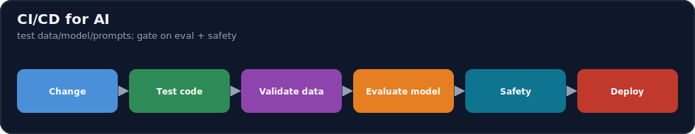
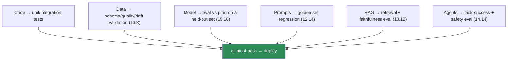

# 16.7 · CI/CD for AI ⭐

[⬅ 16.6 ML Pipelines](16.6-ml-pipelines.md) · [🏠 Module 16](../README.md) · [➡ 16.8 Model Serving](16.8-model-serving.md)

> **The lesson in one line:** CI/CD for AI extends software CI/CD — automated test → build → deploy on every change — to the *extra* artifacts, so the pipeline validates not just **code** but **data, models, prompts, RAG, and agents**, and gates deployment on **evaluation and safety**, not just passing unit tests.



---

## 🎯 Learning objectives

- Distinguish **CI, continuous delivery, and continuous deployment** for AI.
- Test the AI-specific artifacts: **code, data, models, prompts, RAG, agents**.
- Build an **AI CI/CD pipeline** with an evaluation + safety gate.

## ✅ Prerequisites

- [16.5 registry](16.5-model-registry.md), [16.6 pipelines](16.6-ml-pipelines.md), [12.14 prompt testing](../../12-Prompt-Engineering/weeks/12.14-testing.md), [15.18 base vs tuned](../../15-Fine-Tuning/weeks/15.18-base-vs-finetuned.md).

---

## 🧠 Mental model

> [!IMPORTANT]
> **Software CI/CD asks "does the code still work?" on every change; AI CI/CD asks "does the *system* still work?" — where the system is code + data + model + prompts + eval, and "work" means *quality*, not just *no crash*.** A green unit-test suite is necessary but wildly insufficient: the code can be perfect while the model regressed, the prompt tanked answer quality, the RAG retriever broke, or the data drifted. So AI CI/CD adds **data validation, model evaluation, prompt/RAG/agent tests, and safety checks** to the classic build-and-test flow, and — crucially — **gates deployment on a passing evaluation** ([15.18](../../15-Fine-Tuning/weeks/15.18-base-vs-finetuned.md)), not just green tests. The output isn't "the build passed," it's "the system is measurably as good or better, and safe."

```mermaid
flowchart LR
    CH["Change (code / data / model / prompt)"] --> T["Tests (code)"]
    T --> DV["Data validation (16.3)"]
    DV --> ME["Model evaluation (16.11–16.12, 15.18)"]
    ME --> PT["Prompt / RAG / agent tests (12.14)"]
    PT --> SEC["Security checks (16.19)"]
    SEC --> B["Build (container, 16.21)"]
    B --> D["Deploy (canary, 16.13)"]
    style ME fill:#4a90d9,color:#fff
    style SEC fill:#c0392b,color:#fff
    style D fill:#2e8b57,color:#fff
```



---

## CI / CD / CD

| Term | Meaning | AI addition |
|---|---|---|
| **Continuous Integration** | test + validate on every change | + data validation, model eval, prompt/RAG/agent tests |
| **Continuous Delivery** | every passing change is *ready* to deploy (manual approve) | + registry staging + eval gate ([16.5](16.5-model-registry.md)) |
| **Continuous Deployment** | every passing change deploys *automatically* | + canary/shadow + auto-rollback ([16.13](16.13-deployment-strategies.md)) |

For AI, **continuous *delivery* (human approve) is often safer than full continuous deployment** — you want a person (or a strong eval gate) between "it passed" and "all users get it," because model/prompt regressions are quiet.

---

## Testing every AI artifact



| Artifact | What to test | Reference |
|---|---|---|
| **Code** | unit + integration | standard |
| **Data** | schema, quality, drift | [16.3](16.3-data-versioning.md) |
| **Model** | eval vs production on a golden set (significant, net-positive) | [15.18](../../15-Fine-Tuning/weeks/15.18-base-vs-finetuned.md) |
| **Prompts** | golden-set regression; pin model version | [12.14](../../12-Prompt-Engineering/weeks/12.14-testing.md) |
| **RAG** | retrieval recall + faithfulness | [13.12](../../13-RAG/weeks/13.12-evaluation.md) |
| **Agents** | task success + safety on a sandboxed suite | [14.14](../../14-AI-Agents/weeks/14.14-evaluation.md) |
| **Security** | secrets scan, dependency audit, injection suite | [16.19](16.19-security.md) |

> [!IMPORTANT]
> **The load-bearing addition is the *evaluation gate*: deployment is blocked unless the change is measurably as good or better on a golden set, with no safety regression.** A passing test suite proves the code runs; the eval gate proves the *system* is good — and for AI, that's the property that matters and the one that regresses quietly ([16.1](16.1-what-is-mlops.md)). Whether the change is a new model, a prompt edit, or a retriever tweak, it goes through the same gate: **test → validate data → evaluate → safety → (gate) → deploy.** Prompts and data are code here; a prompt edit triggers the pipeline just like a code commit ([12.14](../../12-Prompt-Engineering/weeks/12.14-testing.md)).

---

## 💻 An AI CI/CD pipeline (sketch)

```yaml
# .github/workflows/ai-cicd.yml (conceptual)
on: [push, pull_request]         # code, prompt, config, or data-pointer change
jobs:
  ci:
    steps:
      - run: pytest                                  # 1 code tests
      - run: python validate_data.py                 # 2 data validation (16.3)
      - run: python evaluate_model.py --gate         # 3 model eval vs prod (15.18) — FAILS if regressed
      - run: python test_prompts.py --golden         # 4 prompt regression (12.14)
      - run: python eval_rag.py && python eval_agent.py  # 5 RAG/agent eval (13.12/14.14)
      - run: trivy fs . && pip-audit                 # 6 security: deps + secrets (16.19)
      - run: docker build -t app:$SHA .              # 7 build (16.21)
  cd:
    needs: ci
    steps:
      - run: python deploy.py --canary               # 8 deploy: canary + auto-rollback (16.13)
```

Every stage is a **gate**: the model-eval and safety steps *fail the build* on regression, so a bad model/prompt can't reach production — the CI equivalent of the registry's promotion gate ([16.5](16.5-model-registry.md)).

---

## 🏭 Production examples

| Change | CI/CD response |
|---|---|
| Code PR | tests + data validation + build |
| New model candidate | eval vs prod gate → register → canary |
| Prompt edit | golden-set regression + safety gate |
| RAG config change | retrieval + faithfulness eval |
| Dependency bump | security audit + full eval (behavior may change, [16.2](16.2-reproducibility.md)) |
| Failed canary | auto-rollback ([16.13](16.13-deployment-strategies.md)) |

## ⚡ Performance & 💲 cost considerations

- **Eval in CI costs compute** (running the model/LLM on a golden set) — keep a fast smoke set per commit, a full set on release/merge ([16.12](16.12-llm-evaluation.md)).
- **Cache builds and datasets**; parallelize independent gates.
- **Full continuous deployment saves human time but raises risk** — gate strength must match the automation level.

## 🔒 Security considerations

> [!CAUTION]
> - **Security checks are CI gates**: dependency audit, secret scanning, and an **injection/adversarial suite** for LLM/agent systems ([16.19](16.19-security.md), [12.16](../../12-Prompt-Engineering/weeks/12.16-security.md)).
> - **A prompt/model change that weakens safety must fail CI** — safety is a blocking gate, never advisory ([15.17](../../15-Fine-Tuning/weeks/15.17-evaluation.md)).
> - **CI runners have credentials** — least privilege; protect secrets; don't run untrusted PRs with prod access.

## 🚫 Common mistakes

| Mistake | Consequence |
|---|---|
| Only unit-testing code | Model/prompt/RAG regressions ship |
| No eval gate before deploy | Quiet quality regression to all users |
| Treating prompts/data as un-testable | Silent prompt/data breakage |
| Full auto-deploy with a weak gate | Bad model reaches everyone instantly |
| No security suite in CI | Injection/supply-chain issues ship |
| Full eval on every commit | Slow, expensive CI |

## 🐛 Debugging workflow

CI failed on an AI gate: (1) **Which gate?** Code test (fix code), data validation (fix data, [16.3](16.3-data-versioning.md)), **eval gate** (the model/prompt regressed vs prod — this is CI working, [15.18](../../15-Fine-Tuning/weeks/15.18-base-vs-finetuned.md)), safety (a regression — investigate). (2) **Reproduce** the failing eval locally. (3) A failing *eval/safety* gate is a **correct block**, not a flaky test — fix the artifact, don't disable the gate. (4) Deploy failed / canary regressed → **auto-rollback** ([16.13](16.13-deployment-strategies.md)). Full method in [16.11](16.11-monitoring-drift.md).

## 🏋️ Exercises

1. **AI CI.** Build a CI pipeline that tests code + validates data + evaluates a model vs a golden set; make a regressor fail it.
2. **Prompt CI.** Add a golden-set prompt regression gate; make a prompt edit that regresses fail CI ([12.14](../../12-Prompt-Engineering/weeks/12.14-testing.md)).
3. **Safety gate.** Add an injection/adversarial suite; make a change that weakens safety fail.
4. **Smoke vs full.** Split eval into a fast smoke set (per commit) and full set (per merge); measure the CI-time saving.
5. **Auto-rollback.** Wire a failing canary to roll back automatically.

## 🛠️ Mini project — "ML/LLM CI/CD pipeline"

**Goal:** a CI/CD pipeline that gates deployment on code, data, model, prompt, and safety checks.

**Requirements:** code tests; data validation ([16.3](16.3-data-versioning.md)); model eval vs prod gate ([15.18](../../15-Fine-Tuning/weeks/15.18-base-vs-finetuned.md)); prompt/RAG/agent tests ([12.14](../../12-Prompt-Engineering/weeks/12.14-testing.md)); security suite ([16.19](16.19-security.md)); build (container); canary deploy + auto-rollback; smoke vs full eval split.

**Folder structure**
```
ai-cicd/
├── ci/             # code + data + model + prompt + security steps
├── evaluate.py     # eval-vs-prod gate
├── security.py     # deps + secrets + injection suite
├── build/          # Dockerfile
└── deploy.py       # canary + rollback
```

**Testing:** a regressing model/prompt fails CI; safety regression blocks; canary failure rolls back.
**Evaluation:** % regressions caught before prod; CI time.
**Security:** deps/secrets/injection gates; least-privilege runners ([16.19](16.19-security.md)).
**Monitoring:** CI pass rates; gate-failure reasons.
**Future improvements:** progressive delivery; auto-promote on winning canary; per-artifact caching.

## 📄 Cheat sheet

| Concept | One line |
|---|---|
| **⭐ AI CI/CD** | test code **+ data + model + prompts + RAG + agents**; gate on eval + safety |
| **CI / CDelivery / CDeploy** | test-on-change / ready-to-ship / auto-ship |
| **⭐ Eval gate** | block deploy unless as-good-or-better + safe ([15.18](../../15-Fine-Tuning/weeks/15.18-base-vs-finetuned.md)) |
| **Test data** | schema/quality/drift ([16.3](16.3-data-versioning.md)) |
| **Test prompts** | golden-set regression, pin model ([12.14](../../12-Prompt-Engineering/weeks/12.14-testing.md)) |
| **Security gate** | deps + secrets + injection suite ([16.19](16.19-security.md)) |
| **Prefer** | continuous *delivery* (human/gate) over full auto for AI |
| **⚠️** | smoke set per commit, full set per merge |

## 🎴 Flashcards

- **⭐ How does AI CI/CD differ from software CI/CD?** → It tests not just code but data, models, prompts, RAG, and agents, and gates deployment on *evaluation and safety* (quality), not just passing unit tests.
- **What's the difference between continuous delivery and deployment?** → Delivery makes every passing change ready to deploy (human/gate approves); deployment ships automatically — for AI, delivery is often safer.
- **⭐ What is the eval gate?** → A CI step that blocks deployment unless the change is measurably as-good-or-better on a golden set with no safety regression.
- **How do you test a prompt in CI?** → A golden-set regression run with the model version pinned, blocking a prompt edit that regresses quality.
- **Why is a passing unit-test suite insufficient for AI?** → The code can be correct while the model regressed, the prompt tanked, RAG broke, or data drifted — quiet failures a code test can't catch.
- **What security checks belong in AI CI?** → Dependency audit, secret scanning, and an injection/adversarial suite for LLM/agent systems — as blocking gates.

## 💬 Interview questions

1. How does CI/CD for AI extend software CI/CD?
2. What artifacts must an AI CI pipeline test, and how?
3. What is the evaluation gate, and why is it the key addition?
4. Why is continuous delivery often preferred over continuous deployment for AI?
5. How do you test prompts, RAG, and agents in CI?
6. What security checks belong in an AI CI/CD pipeline?

## 📝 Summary

- AI CI/CD extends software CI/CD to the **extra artifacts** — testing **code + data + model + prompts + RAG + agents** — and **gates deployment on evaluation and safety**, not just green unit tests.
- The load-bearing addition is the **eval gate**: block deploy unless the change is **as-good-or-better and safe** on a golden set ([15.18](../../15-Fine-Tuning/weeks/15.18-base-vs-finetuned.md)) — because AI regresses **quietly**.
- **Prompts and data are code**: a prompt/data change triggers the same pipeline; a failing eval/safety gate is a **correct block**, not a flaky test.
- Prefer **continuous *delivery* (human/gate)** over full auto for AI, split **smoke (per commit) vs full (per merge)** eval, and include **security gates** (deps/secrets/injection) — with **canary + auto-rollback** on deploy ([16.13](16.13-deployment-strategies.md)).

## 📚 References

1. **[12.14 Prompt Testing](../../12-Prompt-Engineering/weeks/12.14-testing.md) & [15.18 Base vs Fine-Tuned](../../15-Fine-Tuning/weeks/15.18-base-vs-finetuned.md).** ⭐ The gates.
2. **GitHub Actions / GitLab CI docs.** CI/CD mechanics.
3. **CML (Continuous Machine Learning) / MLflow CI patterns.** ML-specific CI.
4. **[16.13 Deployment Strategies](16.13-deployment-strategies.md).** Canary + rollback.

---

## 🧭 Navigation

| Direction | Link |
|---|---|
| ⬅ Previous | [16.6 · ML Pipelines & Orchestration](16.6-ml-pipelines.md) |
| ➡ Next | [16.8 · Model Serving](16.8-model-serving.md) |
| 🏠 Module | [Module 16](../README.md) |
| 📖 Lessons | [Lesson index](README.md) |
