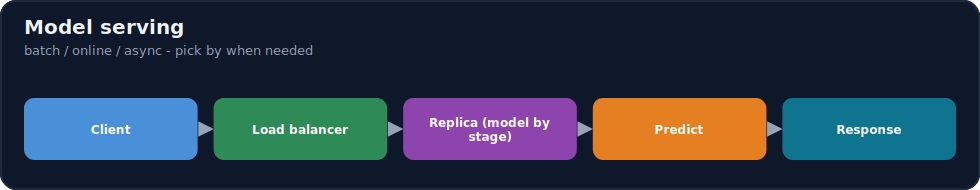
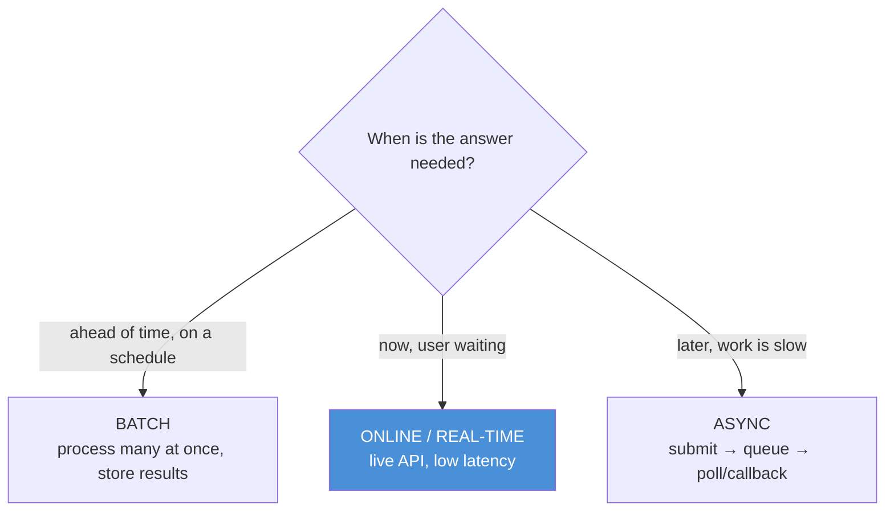
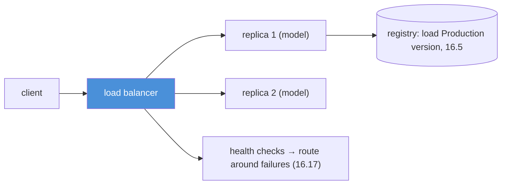

# 16.8 · Model Serving ⭐

[⬅ 16.7 CI/CD for AI](16.7-cicd.md) · [🏠 Module 16](../README.md) · [➡ 16.9 LLMOps](16.9-llmops.md)

> **The lesson in one line:** A trained model does nothing until it's *served* — turned into an API that takes requests and returns predictions — and the core decision is the **serving pattern** (batch, online/real-time, or async), each trading **latency, throughput, and cost** differently for the workload.



---

## 🎯 Learning objectives

- Distinguish **batch, online/real-time, and asynchronous** inference.
- Reason about **latency, throughput, availability, scalability**.
- Use FastAPI / BentoML / TorchServe **conceptually** and build a serving architecture.

## ✅ Prerequisites

- [16.5 registry](16.5-model-registry.md), [11.15 KV cache / inference](../../11-LLMs/weeks/11.15-kv-cache.md), [11.20 production LLM](../../11-LLMs/weeks/11.20-production-architecture.md).

---

## 🧠 Mental model

> [!IMPORTANT]
> **"Serving" is wrapping a model in an interface that answers requests — and the interface you choose is dictated by *when the answer is needed*.** If predictions can be computed ahead of time on a schedule, use **batch** (cheapest, highest throughput, high latency). If a user is waiting *right now*, use **online/real-time** (low latency, the model is a live service). If the work is slow and the caller can come back later, use **async** (submit → job queue → poll/callback). This isn't a quality choice — the *model* is the same — it's an **operational** choice about latency, throughput, and cost. Getting it wrong (serving a huge model online when batch would do, or batch when users need instant answers) is a top serving mistake.



---

## The serving patterns

| Pattern | How | Latency | Throughput | Cost | Use for |
|---|---|---|---|---|---|
| **Batch** | run on a large set on a schedule; store results | high (minutes–hours) | very high | low (bulk, spot GPUs) | recommendations precompute, nightly scoring, embeddings |
| **Online / real-time** | live API; request → prediction now | low (ms) | moderate | higher (always-on) | fraud check, search ranking, chat |
| **Async** | submit → job queue → worker → result later | medium–high | high | medium | long generations, video/doc processing, agent tasks |

- **Batch** amortizes cost across many predictions and tolerates high latency — ideal when results are consumed later (a dashboard, a table).
- **Online** keeps the model warm as a service; the challenge is **low tail latency** under load.
- **Async** decouples request from computation via a **queue** — the caller gets a job ID, then polls or receives a callback. Essential for slow work (long LLM generations, agent loops, [14.7](../../14-AI-Agents/weeks/14.7-agent-loops.md)) that would time out a synchronous API.

---

## The four service qualities

| Quality | Definition | Lever |
|---|---|---|
| **Latency** | time to a single response (p50/p95/**p99** tail) | model size, batching, hardware, caching ([16.14](16.14-model-optimization.md)) |
| **Throughput** | requests/sec the service handles | batching, replicas, GPU utilization ([16.15](16.15-gpu-infrastructure.md)) |
| **Availability** | % of time the service is up | replicas, health checks, failover ([16.17](16.17-reliability.md)) |
| **Scalability** | handling more load gracefully | autoscaling, load balancing ([16.16](16.16-kubernetes.md)) |

> [!IMPORTANT]
> **Latency and throughput trade off, and the tail (p99) is what users feel — optimize for it, not the average.** Batching *increases throughput* (more requests per GPU pass) but *adds latency* (waiting to fill a batch); a bigger model is better but slower. For LLMs specifically, **continuous batching and the KV cache** ([11.15](../../11-LLMs/weeks/11.15-kv-cache.md), [16.14](16.14-model-optimization.md)) are how you get both throughput *and* acceptable latency. Track **p95/p99 latency, throughput, and GPU utilization** — an average of 100 ms hides the 2 s p99 that's timing out 1% of users.

---

## The tools (conceptually)

| Tool | Character |
|---|---|
| **FastAPI** | a general Python web framework; wrap any model in an HTTP endpoint — flexible, you build the serving logic |
| **BentoML** | ML-serving framework: package model + code + deps into a servable "bento", adaptive batching, multi-framework, deploy anywhere |
| **TorchServe** | PyTorch's dedicated model server: handlers, versioning, batching, metrics — production PyTorch serving |

FastAPI = maximum control (DIY); BentoML/TorchServe = **batteries-included** model serving (batching, versioning, metrics). For LLMs, specialized servers like **vLLM/TGI** ([11.16](../../11-LLMs/weeks/11.16-inference-optimization.md)) add continuous batching + PagedAttention.

---

## 💻 A simple serving API (FastAPI)

```python
from fastapi import FastAPI
from pydantic import BaseModel
import mlflow.pyfunc

app = FastAPI()
model = mlflow.pyfunc.load_model("models:/fraud-classifier/Production")  # by stage (16.5)

class Req(BaseModel):
    features: list[float]

@app.post("/predict")                 # online inference
def predict(req: Req):
    pred = model.predict([req.features])
    return {"prediction": pred[0]}

@app.get("/health")                   # health check for load balancer (16.17)
def health(): return {"status": "ok"}
```



Load the model **by registry stage** (so promotion/rollback needs no redeploy, [16.5](16.5-model-registry.md)); run **replicas behind a load balancer**; expose a **health check**; batch and cache for throughput/latency.

---

## 🏭 Production examples

| Workload | Pattern |
|---|---|
| Nightly product recommendations | batch |
| Fraud check at checkout | online (low latency) |
| Long document summarization | async (queue) |
| Live chat / RAG | online + streaming |
| Bulk embedding a corpus | batch |
| Agent task ("research this") | async ([14.15](../../14-AI-Agents/weeks/14.15-production-architecture.md)) |

## ⚡ Performance & 💲 cost considerations

- **Batch is cheapest per prediction** (bulk, spot/preemptible GPUs, high utilization); **online is priciest** (always-on, low utilization at low traffic).
- **Batching + caching are the biggest online levers**; for LLMs, **continuous batching + KV cache** ([16.14](16.14-model-optimization.md)).
- **Right-size hardware to the pattern** — don't keep a GPU idle for a low-traffic online service; consider CPU/quantized ([16.15](16.15-gpu-infrastructure.md)).
- **Autoscale** online replicas on load; scale to zero for spiky/async where possible.

## 🔒 Security considerations

> [!CAUTION]
> - **A model endpoint is an attack surface** — authenticate, rate-limit ([16.17](16.17-reliability.md)), and validate inputs ([16.19](16.19-security.md)).
> - **Model extraction / adversarial inputs** — monitor and rate-limit to resist reconstruction ([15.20](../../15-Fine-Tuning/weeks/15.20-security.md)).
> - **Async job queues carry request data** — secure the queue and results store; scope per-tenant.

## 🚫 Common mistakes

| Mistake | Consequence |
|---|---|
| Online serving when batch would do | Needless always-on GPU cost |
| Batch when users need answers now | Unacceptable latency |
| Synchronous API for slow work | Timeouts (use async) |
| Optimizing average, ignoring p99 | Tail latency times out users |
| Hardcoding model path in the server | Can't promote/rollback ([16.5](16.5-model-registry.md)) |
| No health check / single replica | No failover; downtime |
| No batching/caching for online | Poor throughput, high cost |

## 🐛 Debugging workflow

Serving issue: (1) **High latency?** Check p99 (not avg); is batching adding wait? model too big? no caching? ([16.14](16.14-model-optimization.md)). (2) **Low throughput?** GPU underutilized → batch; add replicas ([16.15](16.15-gpu-infrastructure.md)). (3) **Timeouts?** Slow work on a sync endpoint → move to async. (4) **Errors under load?** Add replicas, autoscaling, circuit breakers ([16.17](16.17-reliability.md)). (5) **Wrong predictions?** That's a model/data issue, not serving → drift/monitoring ([16.11](16.11-monitoring-drift.md)). Full method in [16.10](16.10-observability.md).

## 🏋️ Exercises

1. **Three patterns.** Serve a model as batch, online (FastAPI), and async (queue); compare latency/throughput/cost.
2. **Load by stage.** Make the server load `models:/name/Production`; show promotion changes serving with no redeploy.
3. **Batching.** Add request batching to an online API; measure the throughput gain and latency cost.
4. **Tail latency.** Load-test; report p50/p95/p99; identify the tail source.
5. **Replicas + health.** Run replicas behind a load balancer with health checks; kill one; show failover.

## 🛠️ Mini project — "Model serving API"

**Goal:** a production-shaped serving service with registry loading, batching, replicas, and health.

**Requirements:** FastAPI (or BentoML) service loading by registry stage ([16.5](16.5-model-registry.md)); online + async (queue) endpoints; request batching; health check + readiness; replicas behind a load balancer; p50/p95/p99 latency + throughput metrics ([16.10](16.10-observability.md)).

**Folder structure**
```
serving/
├── app.py          # online + async endpoints, load by stage
├── batch.py        # request batching
├── health.py       # health/readiness
└── loadtest.py     # p50/p95/p99 + throughput
```

**Testing:** promotion changes serving without redeploy; async handles slow work; batching raises throughput; failover works.
**Evaluation:** latency percentiles, throughput, cost/request.
**Security:** auth + rate limit + input validation ([16.19](16.19-security.md)).
**Monitoring:** latency/throughput/error dashboards ([16.10](16.10-observability.md)).
**Future improvements:** autoscaling ([16.16](16.16-kubernetes.md)); LLM continuous batching ([16.14](16.14-model-optimization.md)); streaming.

## 📄 Cheat sheet

| Pattern | Latency / throughput / cost | Use for |
|---|---|---|
| **Batch** | high / very high / **low** | precompute, nightly scoring, embeddings |
| **Online/real-time** | **low** / moderate / higher | fraud, search, chat |
| **Async** | medium / high / medium | long generations, agents, doc processing |
| **⭐ Choose by** | *when the answer is needed* |
| **Qualities** | latency (p99!) · throughput · availability · scalability |
| **Levers** | batching · caching · replicas · hardware ([16.14](16.14-model-optimization.md)) |
| **Tools** | FastAPI (DIY) · BentoML/TorchServe (batteries) · vLLM/TGI (LLM) |
| **⭐ Load** | by registry **stage**, not a file path |

## 🎴 Flashcards

- **⭐ How do you choose a serving pattern?** → By when the answer is needed: batch (ahead of time, cheapest, high latency), online/real-time (now, low latency), async (later, slow work via a queue).
- **What are the four serving qualities?** → Latency (p50/p95/p99), throughput, availability, and scalability.
- **⭐ Why optimize p99, not the average?** → The tail is what users feel — an average of 100 ms can hide a 2 s p99 timing out 1% of requests.
- **How do batching and latency trade off?** → Batching raises throughput (more per GPU pass) but adds latency (waiting to fill a batch); LLMs use continuous batching + KV cache to get both.
- **When must you use async serving?** → For slow work (long LLM generations, agent loops) that would time out a synchronous API — submit → queue → poll/callback.
- **Why load the model by registry stage?** → So promotion and rollback are registry state changes, not server redeploys.
- **FastAPI vs BentoML/TorchServe?** → FastAPI is DIY control; BentoML/TorchServe are batteries-included ML servers (batching, versioning, metrics); vLLM/TGI add LLM continuous batching.

## 💬 Interview questions

1. Compare batch, online, and async inference on latency, throughput, and cost.
2. How do you choose a serving pattern for a given workload?
3. Why is p99 latency the metric that matters, and how do you reduce it?
4. How do batching and caching affect an online service?
5. Why load a model by registry stage rather than a path?
6. When and why would you use async serving with a queue?

## 📝 Summary

- **Serving** turns a model into a request-answering API; the core choice is the **pattern** — **batch** (ahead of time, cheapest, high latency), **online/real-time** (now, low latency), or **async** (later, via a queue for slow work) — dictated by *when the answer is needed*.
- Optimize the four qualities — **latency (p99!), throughput, availability, scalability** — with **batching, caching, replicas, and right-sized hardware**; batching trades latency for throughput, and LLMs use **continuous batching + KV cache**.
- Use **FastAPI (DIY), BentoML/TorchServe (batteries-included), or vLLM/TGI (LLM)**; **load the model by registry stage** so promotion/rollback needs no redeploy ([16.5](16.5-model-registry.md)).
- Run **replicas behind a load balancer with health checks**, autoscale online services, and secure the endpoint (auth/rate-limit/validation) — wrong predictions are a **model/data** issue (drift, [16.11](16.11-monitoring-drift.md)), not a serving one.

## 📚 References

1. **FastAPI / BentoML / TorchServe documentation.** ⭐ The serving tools.
2. **[11.16 Inference Optimization](../../11-LLMs/weeks/11.16-inference-optimization.md).** vLLM/TGI, continuous batching.
3. **[11.20 Production LLM Architecture](../../11-LLMs/weeks/11.20-production-architecture.md).** Serving in the system.
4. **[16.14 Model Optimization](16.14-model-optimization.md).** Latency/throughput levers.

---

## 🧭 Navigation

| Direction | Link |
|---|---|
| ⬅ Previous | [16.7 · CI/CD for AI](16.7-cicd.md) |
| ➡ Next | [16.9 · LLMOps](16.9-llmops.md) |
| 🏠 Module | [Module 16](../README.md) |
| 📖 Lessons | [Lesson index](README.md) |
