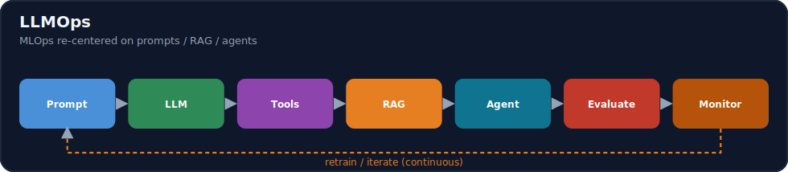
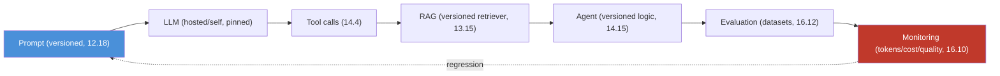
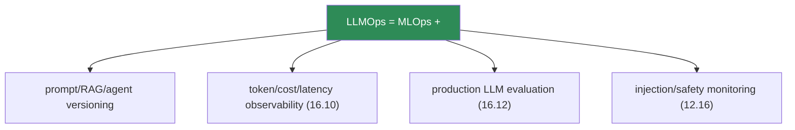

# 16.9 · LLMOps ⭐

[⬅ 16.8 Model Serving](16.8-model-serving.md) · [🏠 Module 16](../README.md) · [➡ 16.10 AI Observability](16.10-observability.md)

> **The lesson in one line:** LLMOps is MLOps for systems where the "model" is often an API you don't control and the real logic lives in **prompts, RAG pipelines, and agents** — so the versioned artifacts, the failure modes, and the metrics all shift: you version prompts/RAG/agents, evaluate on datasets, and observe **tokens, cost, and quality**, not just accuracy and uptime.



---

## 🎯 Learning objectives

- Version the LLM-system artifacts: **prompts, models, RAG configs, agents, evaluation datasets**.
- Understand the LLM lifecycle: prompt → LLM → tool → RAG → agent → evaluation → monitoring.
- Explain **why LLM systems need specialized operational practices** beyond classic MLOps.

## ✅ Prerequisites

- [16.1 MLOps/LLMOps](16.1-what-is-mlops.md), [12.18 production prompt management](../../12-Prompt-Engineering/weeks/12.18-production.md), [13.15 production RAG](../../13-RAG/weeks/13.15-production-architecture.md), [14.15 production agents](../../14-AI-Agents/weeks/14.15-production-architecture.md).

---

## 🧠 Mental model

> [!IMPORTANT]
> **In classic MLOps you *train* the model, so the model is your central artifact. In LLMOps you often *rent* the model (a hosted API you can't retrain or even inspect), so your central artifacts become the things you *do* control: the prompt, the retrieval pipeline, and the agent logic.** That inversion changes everything operationally. The model can change under you (a provider updates it) with no action on your part. Your "code" is partly natural language (prompts) that isn't caught by normal tests. Cost is per-token and volatile. Quality is fuzzy and drifts silently. So LLMOps keeps all of MLOps' discipline (versioning, CI/CD, monitoring) but **re-centers it on prompts/RAG/agents, adds token/cost/latency observability, and makes production evaluation continuous** — because the failure modes classic MLOps guards against aren't the ones that bite LLM systems.



---

## The LLM-system artifacts to version

| Artifact | Why version it | Reference |
|---|---|---|
| **Prompts** | a prompt edit changes behavior with no code change | [12.18](../../12-Prompt-Engineering/weeks/12.18-production.md) |
| **Model** | pin the version; providers update models silently | [15.2](../../15-Fine-Tuning/weeks/15.2-base-models.md) |
| **RAG config** | chunking/embedding/retriever/reranker changes quality | [13.15](../../13-RAG/weeks/13.15-production-architecture.md) |
| **Agent logic** | tools/planning/memory changes behavior | [14.15](../../14-AI-Agents/weeks/14.15-production-architecture.md) |
| **Evaluation datasets** | the golden/adversarial sets that gate changes | [16.12](16.12-llm-evaluation.md) |

Each is a **first-class versioned artifact in a registry**, with the same gated-promotion + rollback discipline as models ([16.5](16.5-model-registry.md)) — a prompt goes through staging → eval gate → production just like a model.

> [!IMPORTANT]
> **The prompt is code and the eval set is your test suite — treat them with the same rigor.** In an LLM system, a one-word prompt change or a retriever tweak can be a bigger behavior change than a code refactor, yet it slips past normal tests. So LLMOps versions prompts/RAG/agents ([12.18](../../12-Prompt-Engineering/weeks/12.18-production.md), [13.15](../../13-RAG/weeks/13.15-production-architecture.md), [14.15](../../14-AI-Agents/weeks/14.15-production-architecture.md)), runs them through **CI eval gates** ([16.7](16.7-cicd.md)), and **pins the model version** so a provider update is a controlled change, not a silent surprise ([15.14](../../15-Fine-Tuning/weeks/15.14-rlhf.md)).

---

## Why LLM systems need specialized ops

| Classic MLOps assumes | LLM systems break it |
|---|---|
| You control/retrain the model | often a **hosted API** you can't retrain or inspect |
| Behavior changes only when *you* change something | provider **silently updates** the model |
| "Code" is code | "code" includes **prompts** (natural language) |
| Cost is ~fixed per request | **per-token, volatile** — can spike 10× |
| Quality = a metric on a test set | quality is **fuzzy, subjective, drifts** ([16.12](16.12-llm-evaluation.md)) |
| Failures are wrong predictions | + **hallucination, injection, tool misuse, cost blowups** |



> [!IMPORTANT]
> **The three things LLMOps adds on top of MLOps are: version the natural-language artifacts, observe cost/tokens/quality (not just accuracy/uptime), and evaluate continuously in production.** A green server and a stable accuracy number tell you nothing about an LLM app whose cost tripled, whose quality drifted after a provider model update, or whose agent got prompt-injected. **You operate what you can measure — and LLM systems require measuring things (tokens, cost, faithfulness, tool-call success) that classic MLOps never tracked.**

---

## 🏭 Production examples

| LLM failure mode | LLMOps control |
|---|---|
| Prompt edit regresses quality | prompt versioning + CI eval gate ([12.18](../../12-Prompt-Engineering/weeks/12.18-production.md), [16.7](16.7-cicd.md)) |
| Provider updates the model | pinned version + re-eval on change |
| Cost spikes overnight | token/cost observability + alerts ([16.10](16.10-observability.md), [16.18](16.18-cost-optimization.md)) |
| RAG retrieval degrades | RAG versioning + retrieval metrics ([13.12](../../13-RAG/weeks/13.12-evaluation.md)) |
| Agent takes a bad action | agent versioning + safety eval ([14.13](../../14-AI-Agents/weeks/14.13-safety.md)) |
| Quality drifts silently | continuous production eval ([16.12](16.12-llm-evaluation.md)) |

## ⚡ Performance & 💲 cost considerations

- **Cost is a first-class LLMOps metric** — per-token, per-request, per-user, per-workflow ([16.18](16.18-cost-optimization.md)); track it like latency.
- **Latency is user-facing and variable** — depends on tokens, model, provider load ([16.8](16.8-model-serving.md)).
- **Caching (semantic/exact) and model right-sizing** are the big LLM cost levers ([13.16](../../13-RAG/weeks/13.16-performance.md), [16.14](16.14-model-optimization.md)).

## 🔒 Security considerations

> [!CAUTION]
> - **Prompt injection is an LLMOps monitoring concern** — track for it in production ([12.16](../../12-Prompt-Engineering/weeks/12.16-security.md)); agents amplify it ([14.13](../../14-AI-Agents/weeks/14.13-safety.md)).
> - **Sending data to a hosted LLM exports it** — data-flow governance; self-host for sensitive data ([15.20](../../15-Fine-Tuning/weeks/15.20-security.md)).
> - **Prompts can embed secrets/policy** — access-control the prompt registry ([12.18](../../12-Prompt-Engineering/weeks/12.18-production.md)).

## 🚫 Common mistakes

| Mistake | Consequence |
|---|---|
| Treating LLM apps as plain software | Miss prompt/RAG/agent + cost/quality drift |
| Not versioning prompts | Untraceable regressions; no rollback |
| Not pinning the model version | Silent provider-update regressions |
| Monitoring only uptime | Miss cost/quality drift |
| No production evaluation | Quality decays invisibly ([16.12](16.12-llm-evaluation.md)) |
| Ignoring per-token cost | Bill blowups unnoticed |

## 🐛 Debugging workflow

LLM system misbehaving (per [16.1](16.1-what-is-mlops.md)'s extra suspects): (1) **Prompt changed?** Diff the prompt version ([12.18](../../12-Prompt-Engineering/weeks/12.18-production.md)). (2) **Model changed?** Provider update or a version bump — re-eval, pin. (3) **RAG changed?** Retriever/chunking/embedding config ([13.13](../../13-RAG/weeks/13.13-debugging.md)). (4) **Agent changed?** Tools/logic ([14.14](../../14-AI-Agents/weeks/14.14-evaluation.md)). (5) **Cost/latency spike?** Observability ([16.10](16.10-observability.md)). Each LLM artifact is a versioned suspect — which is why you version and observe all of them.

## 🏋️ Exercises

1. **Artifact inventory.** For a RAG+agent app, list every versioned LLM artifact and how each could regress.
2. **Prompt registry.** Version a prompt; promote via an eval gate; roll back ([12.18](../../12-Prompt-Engineering/weeks/12.18-production.md)).
3. **Pin the model.** Show a provider "update" changing behavior; pin the version to control it.
4. **MLOps vs LLMOps.** For 6 concerns (versioning, cost, quality, drift, security, eval), contrast classic ML vs LLM systems.
5. **Cost metric.** Instrument per-request token/cost logging; find the priciest request type.

## 🛠️ Mini project — "LLMOps control plane"

**Goal:** a control plane that versions LLM artifacts and gates their changes.

**Requirements:** registries for prompts / model versions / RAG configs / agent configs, each with staging → eval gate → production + rollback ([16.5](16.5-model-registry.md)); pinned model versions; per-request token/cost/latency logging ([16.10](16.10-observability.md)); a CI eval gate ([16.7](16.7-cicd.md), [16.12](16.12-llm-evaluation.md)).

**Folder structure**
```
llmops/
├── registries/     # prompts, models, rag, agents (versioned)
├── gate.py         # eval + safety gate per artifact
├── pin.py          # model version pinning
└── telemetry.py    # tokens/cost/latency per request
```

**Testing:** a prompt/RAG regression is blocked at the gate; model pin controls provider changes; cost/tokens logged per request.
**Evaluation:** % artifact changes gated; regressions caught.
**Security:** access-controlled prompt registry; data-flow governance; injection monitoring ([12.16](../../12-Prompt-Engineering/weeks/12.16-security.md)).
**Monitoring:** cost/quality/latency dashboards ([16.10](16.10-observability.md)).
**Future improvements:** full observability layer ([16.10](16.10-observability.md)); production eval ([16.12](16.12-llm-evaluation.md)); the LLMOps capstone ([16.23](16.23-end-to-end-projects.md)).

## 📄 Cheat sheet

| Concept | One line |
|---|---|
| **⭐ LLMOps** | MLOps re-centered on **prompts/RAG/agents** + cost + quality |
| **Rented model** | often a hosted API you can't retrain/inspect |
| **⭐ Version** | prompts · model · RAG config · agent · eval sets |
| **Prompt = code** | eval set = test suite; gate changes in CI ([16.7](16.7-cicd.md)) |
| **Pin the model** | provider updates are silent behavior changes |
| **⭐ Observe** | tokens · cost · latency · quality (not just uptime/accuracy) |
| **Evaluate** | continuously, in production ([16.12](16.12-llm-evaluation.md)) |
| **New failures** | hallucination · injection · tool misuse · cost blowups |

## 🎴 Flashcards

- **⭐ How does LLMOps differ from MLOps?** → In LLMOps the model is often a rented API you can't retrain, so the central artifacts become prompts/RAG/agents; you version those, observe tokens/cost/quality (not just accuracy/uptime), and evaluate continuously in production.
- **What LLM-system artifacts must you version?** → Prompts, the model version, RAG configs, agent logic, and evaluation datasets — each as a first-class registry artifact with gated promotion + rollback.
- **⭐ Why pin the model version?** → Providers silently update hosted models, changing behavior with no action on your part; pinning makes it a controlled, re-evaluated change.
- **Why is "prompt = code, eval set = test suite" the LLMOps mindset?** → A prompt/RAG change can be a bigger behavior change than a refactor yet slips past normal tests, so it needs versioning and CI eval gates.
- **What three things does LLMOps add on top of MLOps?** → Versioning natural-language artifacts, observing cost/tokens/quality, and continuous production evaluation.
- **What failure modes do LLM systems have that classic ML doesn't?** → Hallucination, prompt injection, tool misuse, silent quality drift, and cost blowups.

## 💬 Interview questions

1. How does LLMOps differ from classic MLOps, and why?
2. What artifacts does an LLM system have, and how do you version them?
3. Why must you pin the model version, and what happens if you don't?
4. Why is "prompt is code, eval set is the test suite" the right mindset?
5. What does LLMOps add to MLOps' versioning/observability/evaluation?
6. What LLM-specific failure modes must you operate against?

## 📝 Summary

- **LLMOps is MLOps re-centered on prompts, RAG, and agents** — because the model is often a **rented API you can't retrain**, so your controllable artifacts (and failure modes) shift to the natural-language and pipeline layers.
- **Version prompts, the model, RAG configs, agents, and eval datasets** as first-class registry artifacts with **gated promotion + rollback**; **pin the model version** so provider updates are controlled changes.
- LLMOps **adds three things to MLOps**: versioning natural-language artifacts, **observing tokens/cost/latency/quality** (not just accuracy/uptime), and **continuous production evaluation** ([16.10](16.10-observability.md), [16.12](16.12-llm-evaluation.md)).
- LLM systems fail in ways classic MLOps didn't anticipate — **hallucination, injection, tool misuse, cost blowups** — so you **operate what you can measure**, which means measuring the new things.

## 📚 References

1. **[12.18 Production Prompt Management](../../12-Prompt-Engineering/weeks/12.18-production.md).** ⭐ Prompt versioning/registry.
2. **[13.15 Production RAG](../../13-RAG/weeks/13.15-production-architecture.md) & [14.15 Production Agents](../../14-AI-Agents/weeks/14.15-production-architecture.md).** RAG/agent ops.
3. **[16.10 AI Observability](16.10-observability.md) & [16.12 LLM Evaluation](16.12-llm-evaluation.md).** The new metrics.
4. **Langfuse / LangSmith docs.** LLMOps tooling.

---

## 🧭 Navigation

| Direction | Link |
|---|---|
| ⬅ Previous | [16.8 · Model Serving](16.8-model-serving.md) |
| ➡ Next | [16.10 · AI Observability](16.10-observability.md) |
| 🏠 Module | [Module 16](../README.md) |
| 📖 Lessons | [Lesson index](README.md) |
