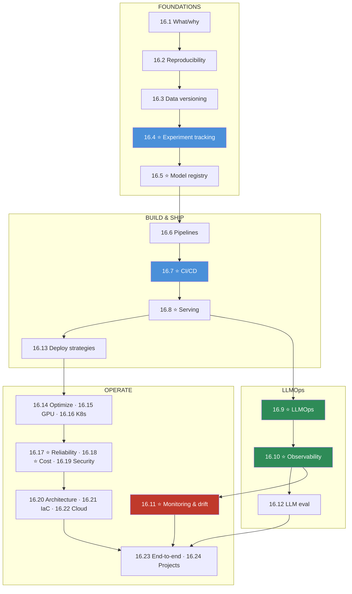

# Module 16 · MLOps & LLMOps — Lessons

[⬅ Module home](../README.md) · [🗺 Roadmap](../../../ROADMAP.md) · [📚 Curriculum](../../../CURRICULUM.md)

> This is the map of Module 16. **AI systems fail quietly — the API stays green while the answers go wrong — so operating them means versioning data/models/prompts, deploying safely, observing deeply, and improving continuously.** By the end you will build an experiment tracker, a model registry, an AI CI/CD pipeline, a serving API, an observability layer, and a drift detector, then assemble end-to-end MLOps and LLMOps platforms.

---

## The rule of this module

> [!IMPORTANT]
> **A production AI system is code + data + model + prompts + evaluation — five things that can each break independently and silently.** Traditional software fails loudly; ML/LLM systems fail *quietly* (still 200 OK, but the answer is now wrong). So MLOps treats **data, models, and prompts as first-class versioned artifacts** and wraps the whole lifecycle in **reproducibility, tracking, CI/CD, safe deployment, monitoring, and retraining**. **LLMOps** adds the LLM-specific concerns — **prompt/RAG/agent versioning, token/cost/latency observability, and production evaluation** — because LLM systems fail in ways (cost spikes, quality drift, injection) classic MLOps never anticipated.
>
> **The plan:** define MLOps/LLMOps → make it reproducible → version data → track experiments → register models → build pipelines → CI/CD → serve → **LLMOps** → observe → monitor drift → evaluate LLMs in prod → deploy safely → optimize → GPU/K8s infra → reliability → cost → security → architecture → IaC → cloud → **two end-to-end capstones**.

This module is the **operational capstone of the program**: it takes the models from [Module 8–9](../../08-Machine-Learning/README.md), the [LLMs (11)](../../11-LLMs/README.md), and the [RAG (13)](../../13-RAG/README.md) / [Agents (14)](../../14-AI-Agents/README.md) / [Fine-tuning (15)](../../15-Fine-Tuning/README.md) systems and makes them **reliable, observable, and cost-controlled in production.**

---

## The 24 lessons

| # | Lesson | The one thing | Build? |
|---|---|---|---|
| 16.1 | [What Is MLOps & LLMOps?](16.1-what-is-mlops.md) ⭐ | AI = code + **data + model + prompts + eval**; fails quietly | — |
| 16.2 | [Reproducibility](16.2-reproducibility.md) | seeds · envs · lockfiles · config — reproduce any run | ✅ |
| 16.3 | [Data Versioning](16.3-data-versioning.md) | version data like code; data ↔ model lineage | ✅ |
| 16.4 | [Experiment Tracking](16.4-experiment-tracking.md) ⭐ | params · metrics · artifacts → compare runs | ✅ |
| 16.5 | [Model Registry](16.5-model-registry.md) ⭐ | versions · stages · promotion · **rollback** | ✅ |
| 16.6 | [ML Pipelines & Orchestration](16.6-ml-pipelines.md) | data→train→eval→register→deploy; Airflow/Prefect/… | ✅ |
| 16.7 | [CI/CD for AI](16.7-cicd.md) ⭐ | test code **and** data, models, prompts, RAG, agents | ✅ |
| 16.8 | [Model Serving](16.8-model-serving.md) ⭐ | batch vs online vs async; latency/throughput | ✅ |
| 16.9 | [LLMOps](16.9-llmops.md) ⭐ | prompt/RAG/agent versioning; why LLMs need it | — |
| 16.10 | [AI Observability](16.10-observability.md) ⭐ | logs · metrics · **traces**; tokens/cost/tool-calls | ✅ |
| 16.11 | [Model Monitoring & Drift](16.11-monitoring-drift.md) ⭐ | data/concept/model drift → retrain | ✅ |
| 16.12 | [LLM Evaluation in Production](16.12-llm-evaluation.md) | offline/online/human/LLM-judge; limits | ✅ |
| 16.13 | [Deployment Strategies](16.13-deployment-strategies.md) | blue-green · canary · rolling · **shadow** | — |
| 16.14 | [Model Optimization](16.14-model-optimization.md) | quantize/distill/cache; KV-cache, continuous batching | — |
| 16.15 | [GPU Infrastructure](16.15-gpu-infrastructure.md) | VRAM · utilization · estimate memory | — |
| 16.16 | [Kubernetes for AI](16.16-kubernetes.md) | pods/services/jobs · **GPU scheduling** | — |
| 16.17 | [Reliability](16.17-reliability.md) ⭐ | retries · timeouts · circuit breakers · degradation | ✅ |
| 16.18 | [Cost Optimization](16.18-cost-optimization.md) ⭐ | cost per request/user/model/workflow | — |
| 16.19 | [AI Security in Production](16.19-security.md) | secrets · endpoints · supply chain — **defensive** | — |
| 16.20 | [Production Architecture](16.20-production-architecture.md) | ML · LLM · Agent systems, end to end | — |
| 16.21 | [Infrastructure as Code](16.21-iac.md) | Docker · Terraform · K8s · Helm — versioned infra | ✅ |
| 16.22 | [Cloud MLOps](16.22-cloud.md) | storage · compute · GPU · managed K8s (transferable) | — |
| 16.23 | [End-to-End MLOps & LLMOps](16.23-end-to-end-projects.md) | the two capstone systems, wired together | ✅ |
| 16.24 | [Mini Projects & Summary](16.24-projects-summary.md) | 10 projects; the whole discipline | ✅ |

⭐ marks the load-bearing lessons. **16.1 (what/why)**, **16.7 (CI/CD)**, **16.10 (observability)**, and **16.11 (drift)** are the spine; **16.5 (registry)**, **16.8 (serving)**, and **16.9 (LLMOps)** make it concrete.

---

## The dependency graph

**Read it as four phases:** *foundations* (reproducibility → tracking → registry), *build & ship* (pipelines → CI/CD → serving → deploy), *LLMOps* (versioning → observability → eval), and *operate* (monitoring → optimize → infra → reliability → cost → security → architecture).

---

## The recurring through-lines

- **AI fails quietly** — 200 OK but wrong; you can't operate what you can't observe.
- **Data, models, and prompts are versioned artifacts** — not just the code.
- **Reproducibility is the foundation** — if you can't reproduce it, you can't debug or trust it.
- **Deploy safely, roll back instantly** — canary/shadow + a registry with rollback.
- **LLMs add cost, latency, and quality drift** — observe tokens/cost/quality, not just uptime.
- **Retrain on a loop** — production data drifts; the model decays without it.

---

## Navigation

| Direction | Link |
|---|---|
| 🏠 Module home | [Module 16](../README.md) |
| ➡ First lesson | [16.1 · What Is MLOps & LLMOps?](16.1-what-is-mlops.md) |
| 🗺 Roadmap | [ROADMAP.md](../../../ROADMAP.md) |
| 📚 Curriculum | [CURRICULUM.md](../../../CURRICULUM.md) |
