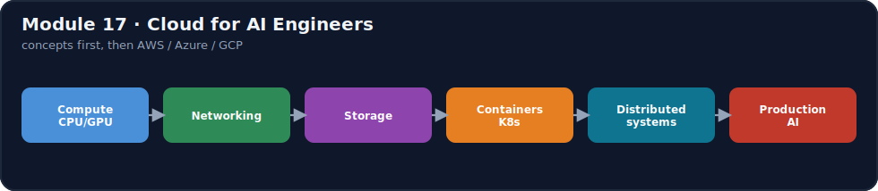
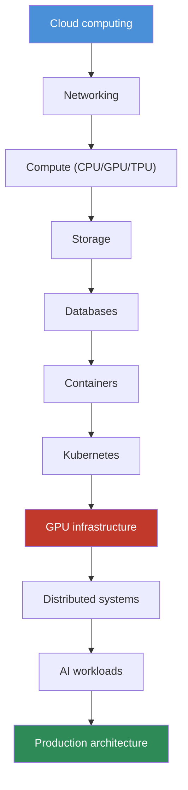
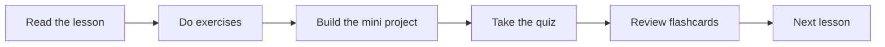

# Module 17 · Cloud for AI Engineers

[⬅ 16 · MLOps & LLMOps](../16-MLOps/README.md) · [🏠 docs](../README.md) · [🗺 Roadmap](../../ROADMAP.md) · [18 · System Design ➡](../18-System-Design/README.md)

> **The module in one line:** The cloud is not a list of vendor services to memorize — it's a small set of **transferable primitives** (compute, networking, storage, databases, containers, orchestration, distributed systems) that every provider implements under different names. Learn the concept once, and AWS, Azure, and Google Cloud become three dialects of the same language. This module bridges **local AI development** and **production-scale cloud AI engineering**.

---

## Why this module exists

You can build a model, a RAG pipeline, or an agent on your laptop. Production is a different problem: the model needs a GPU that costs money by the second, the API needs to survive a datacenter fire, the vector database needs a private network, secrets can't live in code, and the bill can 10× overnight if you misconfigure autoscaling. **Cloud engineering is the discipline of running AI systems that are scalable, available, secure, observable, and affordable** — and it rests on infrastructure concepts that long predate AI.

This module teaches those concepts **in dependency order**, then maps each to the three major clouds. It is deliberately **not** a certification course: we do not memorize service catalogs. We learn *what a VPC is and why*, then note that AWS calls it a VPC, Azure a VNet, and GCP a VPC — and move on.

## What you'll be able to do

- **Understand cloud computing fundamentals** — virtualization, elasticity, the IaaS→SaaS→serverless ladder, and when each fits an AI system.
- **Design cloud architectures for AI** — traditional ML, LLM applications, and agent systems, region- and AZ-aware.
- **Deploy AI to the cloud** — containers, Kubernetes, serverless, and CI/CD pipelines.
- **Reason about CPU and GPU infrastructure** — VRAM math, multi-GPU, distributed training, GPU cost optimization.
- **Work with cloud networking** — VPCs, subnets, load balancers, firewalls, private connectivity.
- **Use object storage and the right database** — block/file/object; relational/NoSQL/vector for embeddings, memory, and metadata.
- **Secure cloud AI** — identity, IAM, least privilege, secrets, encryption, network security.
- **Control cost** — right-sizing, spot, reserved, autoscaling, scale-to-zero, caching, batching.
- **Operate it** — observability, autoscaling, distributed processing, reliability, and disaster recovery.

## The lessons

⭐ marks the load-bearing lessons — if you're short on time, these carry the module.

| # | Lesson | Build? | Focus |
|---|---|:--:|---|
| ⭐ [17.1](weeks/17.1-cloud-fundamentals.md) | Cloud Computing Fundamentals | | Virtualization · elasticity · IaaS/PaaS/SaaS/serverless |
| [17.2](weeks/17.2-regions-availability.md) | Regions & Availability | | Regions · AZs · HA · disaster recovery |
| ⭐ [17.3](weeks/17.3-compute.md) | Compute | | VM · CPU · GPU · TPU · bare metal · selecting compute |
| ⭐ [17.4](weeks/17.4-gpu-infrastructure.md) | GPU Cloud Infrastructure | ✅ | CUDA · VRAM · multi-GPU · memory estimation |
| ⭐ [17.5](weeks/17.5-networking.md) | Cloud Networking | | VPC · subnets · load balancers · firewalls · DNS |
| [17.6](weeks/17.6-storage.md) | Storage | | Block vs file vs **object**; AI storage use cases |
| ⭐ [17.7](weeks/17.7-databases.md) | Databases for AI Systems | | Relational · NoSQL · **vector**; cache |
| [17.8](weeks/17.8-containers.md) | Containers | ✅ | Images · Dockerfiles · registries · volumes |
| ⭐ [17.9](weeks/17.9-kubernetes.md) | Kubernetes for AI Engineers | ✅ | Nodes · pods · deployments · GPU scheduling |
| [17.10](weeks/17.10-serverless.md) | Serverless Computing | | Functions · event-driven · limits for GPU/LLMs |
| ⭐ [17.11](weeks/17.11-ai-architectures.md) | Cloud AI Architectures | | ML · LLM · agent reference architectures |
| [17.12](weeks/17.12-ai-services.md) | Cloud AI Services | | Service categories · architectural trade-offs |
| ⭐ [17.13](weeks/17.13-security.md) | Cloud Security | | Identity · IAM · least privilege · secrets · encryption |
| ⭐ [17.14](weeks/17.14-cost-optimization.md) | Cloud Cost Optimization | | Compute/GPU/storage/network/API cost levers |
| [17.15](weeks/17.15-autoscaling.md) | Autoscaling | | Horizontal/vertical · load balancing for AI |
| ⭐ [17.16](weeks/17.16-distributed-systems.md) | Distributed Systems for AI | | Queues · async · event-driven · distributed training |
| [17.17](weeks/17.17-deployment.md) | Cloud Deployment | ✅ | Git → CI/CD → registry → deploy → monitor |
| [17.18](weeks/17.18-iac.md) | Infrastructure as Code | ✅ | Terraform · state · modules · environments |
| [17.19](weeks/17.19-observability.md) | Cloud Observability | | Logs/metrics/traces + tokens/latency/throughput |
| [17.20](weeks/17.20-reliability.md) | Cloud Reliability | | HA · fault tolerance · DR · backups · failover |
| [17.21](weeks/17.21-multi-cloud.md) | Multi-Cloud Architecture | | AWS vs Azure vs GCP — what transfers |
| [17.22](weeks/17.22-projects-summary.md) | Cloud AI Projects & Summary | ✅ | 8 projects + module synthesis |

See the [lesson index](weeks/README.md) for the full dependency graph.

## Companion artifacts

| Artifact | What's in it |
|---|---|
| [🏋️ Exercises](exercises/README.md) | Conceptual, architecture-design, deployment, GPU-selection, cost-estimation, security, and **incident-style** troubleshooting scenarios |
| [📝 Quiz](quizzes/quiz-01.md) + [answers](quizzes/answers-01.md) | Self-assessment across all 22 lessons |
| [🎴 Flashcards](flashcards/deck.md) | Spaced-repetition deck of the load-bearing ideas |
| [📄 Cheat sheet](cheat-sheets/cloud-cheatsheet.md) | One-page reference + the AWS/Azure/GCP concept-mapping table |

## The spine of this module

> [!IMPORTANT]
> **Concepts transfer; consoles don't.** Every cloud gives you the same primitives — a way to rent compute, isolate a network, store bytes durably, run a container, orchestrate many of them, and scale under load. This module teaches the primitive first and the vendor name second, so that switching clouds (or reading any of their docs) is a lookup, not a re-education. For AI specifically, three primitives dominate everything else: **GPUs** (the scarce, expensive resource), the **network** (that keeps data private and latency low), and **cost control** (because AI infrastructure is expensive in ways ordinary web apps never are).

## Study flow

---

## Navigation

| Direction | Link |
|---|---|
| ⬆ Parent | [docs/](../README.md) |
| ⬅ Previous module | [16 · MLOps & LLMOps](../16-MLOps/README.md) |
| ➡ Next module | [18 · System Design](../18-System-Design/README.md) |
| 📖 Lessons | [Lesson index](weeks/README.md) |
| 🗺 Roadmap | [ROADMAP.md](../../ROADMAP.md) |
| 📚 Curriculum | [CURRICULUM.md](../../CURRICULUM.md) |
