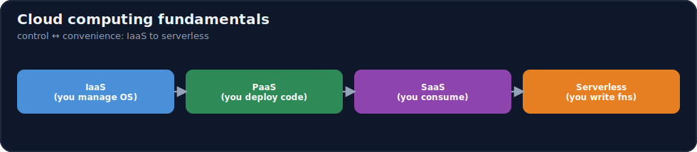
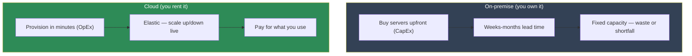

# 17.1 · Cloud Computing Fundamentals ⭐

[🏠 Module 17](../README.md) · [📖 Lessons](README.md) · [➡ 17.2 Regions & Availability](17.2-regions-availability.md)

> **The lesson in one line:** Cloud computing is **renting someone else's computers, on demand, by the second** — and the reason it changed everything is *elasticity*: you pay for what you use and scale up or down in minutes instead of buying hardware for months. The IaaS → PaaS → SaaS → serverless ladder is a single trade-off — **more control vs. less operational burden** — and choosing the right rung is the first architectural decision for any AI system.



---

## 🎯 Learning objectives

- Explain what cloud computing is and **why it exists** (the on-prem problem it solves).
- Define **virtualization, elasticity, scalability, availability, fault tolerance** — and why they're distinct.
- Place workloads on the **Infrastructure → VM → Container → Managed → Serverless** abstraction ladder.
- Compare **IaaS / PaaS / SaaS / serverless** and choose the right model for a given AI system.

## ✅ Prerequisites

- Basic comfort with servers, OS processes, and HTTP. Everything else is built here.
- Helpful: [16.1 What is MLOps](../../16-MLOps/weeks/16.1-what-is-mlops.md) (production mindset), [16.16 Kubernetes](../../16-MLOps/weeks/16.16-kubernetes.md) (previewed, expanded in [17.9](17.9-kubernetes.md)).

---

## 🧠 Mental model

> [!IMPORTANT]
> **The cloud is a utility, like electricity.** You don't build a power plant to run a toaster — you plug in and pay per kilowatt-hour. Cloud computing does the same for compute: instead of buying servers (capital expense, months of lead time, capacity you guessed at), you **rent them on demand** (operating expense, minutes of lead time, capacity you adjust live). The magic word is **elasticity** — capacity that grows and shrinks with load. For AI this is transformative because AI demand is *spiky and expensive*: you need eight GPUs for a 6-hour training run and zero afterward; you need to serve 10 requests at 3am and 10,000 at noon. Owning hardware for the peak wastes money; the cloud lets you rent the peak and release it.



## 🔍 Internal explanation

### Why the cloud exists — the on-prem problem

Before the cloud, running a service meant **buying and operating hardware**: estimate peak demand, purchase servers (weeks of procurement), rack them in a datacenter you rent or own, power/cool/secure them, replace failed disks, and eat the cost whether the servers are busy or idle. Two failure modes are baked in:

- **Over-provisioning** — you buy for the peak, so most of the time expensive hardware sits idle.
- **Under-provisioning** — you buy for the average, so at peak the service falls over.

The cloud dissolves this by making capacity **on demand and metered**. Someone else owns the datacenter, the power, the cooling, and the spare parts; you rent a slice for as long as you need it.

### Virtualization — the enabling technology

The cloud is possible because of **virtualization**: software (a *hypervisor*) that carves one physical machine into many isolated **virtual machines (VMs)**, each behaving like its own computer with its own OS. This is what lets a provider sell you "a server" that is really a fraction of a big one, spin it up in seconds, move it between physical hosts, and reclaim it when you're done. **Containers** ([17.8](17.8-containers.md)) push the same idea further — virtualizing the OS instead of the hardware, so they start in milliseconds and pack more densely.

> [!NOTE]
> **Virtualization is the "how"; elasticity is the "why it matters."** Because a VM is just software on shared hardware, the provider can create, destroy, and relocate it instantly — which is exactly what makes capacity elastic.

### The five properties that define cloud value

| Property | Definition | Why AI cares |
|---|---|---|
| **Virtualization** | one physical machine → many isolated virtual ones | lets you rent exactly the GPU/CPU slice you need |
| **Elasticity** | capacity grows/shrinks automatically with load | rent 8 GPUs for a training run, release them after |
| **Scalability** | the system *can* handle more load by adding resources | serve 10 → 10,000 inference requests without a rewrite |
| **Availability** | the fraction of time the system is up (e.g. 99.9%) | an LLM API that's down loses users and revenue |
| **Fault tolerance** | the system keeps working when a component fails | a GPU node dies mid-serve; traffic reroutes, no outage |

> [!IMPORTANT]
> **Scalability and elasticity are not the same, and availability and fault tolerance are not the same.** *Scalability* is the capability to grow; *elasticity* is doing it **automatically and reversibly** with demand. *Availability* is a measured outcome (uptime %); *fault tolerance* is the **design** that produces it (redundancy so no single failure takes you down — [17.2](17.2-regions-availability.md), [17.20](17.20-reliability.md)). You engineer fault tolerance to achieve availability, and you use elasticity to achieve cost-efficient scalability.

### The abstraction ladder

Every cloud offering sits somewhere on a ladder from "raw hardware you manage" to "finished software you just use":


As you climb: **you manage less, the provider manages more, and you trade control for convenience** (and usually a per-unit price premium). The bottom rung gives you a bare VM (you install everything); the top gives you a finished product (you just log in).

### IaaS / PaaS / SaaS / serverless

> [!IMPORTANT]
> **These four models answer one question: "how much of the stack do you want to manage?"** IaaS = you manage the OS and up (max control, max burden). PaaS = you deploy code, the platform runs it. Serverless = you write functions, the platform runs them per-event and scales to zero. SaaS = you consume finished software (min control, min burden). The right rung is the **highest one that still meets your control, cost, latency, and hardware (GPU!) needs** — climb as high as you can, stop where the abstraction stops fitting.

| Model | You manage | Provider manages | AI example |
|---|---|---|---|
| **IaaS** | OS, runtime, app, scaling | virtualized hardware | rent a GPU VM to fine-tune a model |
| **PaaS** | app code + config | OS, runtime, scaling | push a container to a managed serving platform |
| **Serverless** | function code | everything else; scales to zero | a webhook that triggers RAG ingestion |
| **SaaS** | nothing (just use it) | the whole stack | call a hosted LLM API (e.g. a managed model endpoint) |

**Where each fits AI:**
- **IaaS** — training, fine-tuning, and custom GPU serving where you need specific hardware and full control ([17.4](17.4-gpu-infrastructure.md)).
- **PaaS** — deploying model APIs without managing servers; good default for online inference.
- **Serverless** — event glue, data-pipeline triggers, lightweight pre/post-processing — **not** big models or GPUs ([17.10](17.10-serverless.md) explains the limits).
- **SaaS** — consuming a foundation-model API when you don't need to host your own weights.

## 🛠️ Practical implementation

Choosing a rung is a decision, not code. A quick heuristic:

```text
Need a specific GPU / full OS control / long-running training?   → IaaS (VM)
Just want your container served, autoscaled, no server ops?      → PaaS
Short, event-driven, no GPU, spiky-to-zero traffic?              → Serverless
Don't need to host weights at all?                               → SaaS (model API)
```

```python
# The SAME logical task — "serve a model" — at three rungs, conceptually:
# IaaS:        provision a GPU VM, install CUDA + your server, run it, manage scaling yourself
# PaaS:        push a container image; the platform runs and autoscales it
# Serverless:  deploy a function; it runs per request, scales to zero (CPU-only, small models)
# The higher you go, the less of this you write and operate — at the cost of control.
```

## 🏭 Production examples

| Scenario | Right model | Why |
|---|---|---|
| Fine-tune a 13B model overnight | IaaS GPU VM (spot) | need the GPU + full control; release after ([17.14](17.14-cost-optimization.md)) |
| Serve a custom LLM at scale | PaaS / Kubernetes | autoscaled online inference ([17.9](17.9-kubernetes.md), [17.15](17.15-autoscaling.md)) |
| Trigger embedding ingestion on file upload | Serverless | event-driven, spiky, no GPU ([17.10](17.10-serverless.md)) |
| Add chat to a product fast | SaaS model API | no hosting; fastest path to value |

## ⚡ Performance considerations

- **Cold start vs. warm capacity** — serverless and scale-to-zero save money but add first-request latency; keep a warm minimum for latency-sensitive AI ([17.15](17.15-autoscaling.md)).
- **Higher rungs add overhead** — managed abstractions cost some latency/throughput vs. bare metal; measure if you're latency-bound.
- **Elasticity has a provisioning delay** — new VMs/GPUs take seconds-to-minutes to come online; autoscaling must anticipate, not just react.

## 💲 Cost considerations

> [!IMPORTANT]
> **The cloud's superpower — pay-per-use — is also its trap.** Elasticity only saves money if you actually **release** what you stop using. The classic cloud bill shock is an idle GPU VM left running over a weekend. Match the model to the workload: **release IaaS GPUs when idle, prefer scale-to-zero for spiky work, and use SaaS/PaaS to avoid paying for idle capacity you'd otherwise manage.** Full treatment in [17.14](17.14-cost-optimization.md).

## 🔒 Security considerations

- **Shared responsibility model** — the provider secures the *cloud* (hardware, hypervisor, physical datacenter); **you** secure what's *in* the cloud (your OS at IaaS, your data, your access controls). The higher the rung, the more the provider covers — but never your data and identity ([17.13](17.13-security.md)).
- **Multi-tenancy** — your VM shares physical hardware with strangers; isolation is the provider's job, but you still harden your own layer.

## 🚫 Common mistakes

| Mistake | Consequence |
|---|---|
| Treating "scalable" and "elastic" as synonyms | build that *can* scale but never *does* automatically → outages or waste |
| Choosing IaaS out of habit | reinventing autoscaling/patching a PaaS would give you free |
| Serverless for a GPU/LLM workload | hits timeout/memory/no-GPU limits ([17.10](17.10-serverless.md)) |
| Leaving elastic resources running | pay-per-use becomes pay-forever ([17.14](17.14-cost-optimization.md)) |
| Assuming the provider secures *your* data | shared-responsibility gap → breach ([17.13](17.13-security.md)) |

## 🐛 Debugging workflow

Deciding "which rung is wrong here?": (1) **Are you managing things the provider could?** (patching OS, hand-rolling autoscaling) → climb a rung. (2) **Are you hitting a ceiling the abstraction imposes?** (no GPU, function timeout, can't tune the kernel) → descend a rung. (3) **Idle cost high?** → the workload is spiky; move toward serverless/scale-to-zero. (4) **Latency floor too high?** → cold starts; add warm capacity or descend to always-on.

## 🏋️ Exercises

1. **Conceptual.** In your own words, distinguish scalability vs. elasticity and availability vs. fault tolerance, with an AI example of each.
2. **Placement.** For 6 AI workloads (overnight fine-tune, real-time LLM chat, nightly batch scoring, file-upload embedding trigger, internal dashboard, foundation-model call), pick IaaS/PaaS/serverless/SaaS and justify.
3. **On-prem vs. cloud.** Estimate the cost of owning 4 GPUs used 5 hours/day vs. renting them; when does owning win?
4. **Cost trap.** Name three elastic resources that silently keep billing when idle, and how you'd catch each.
5. **Ladder.** Take one service you use and identify which rung it's on and what you'd gain/lose moving up or down.

## 🛠️ Mini project — "Rung decision record"

**Goal:** produce a one-page **architecture decision record (ADR)** for deploying a small LLM API.

**Requirements:** state the workload (traffic shape, latency SLA, GPU need, budget); evaluate all four models against it; pick one with explicit trade-offs; note the *trigger* that would make you change rungs (e.g. "if sustained GPU utilization > 60%, move from serverless-CPU quantized to a PaaS GPU deployment").
**Deliverable:** the ADR + a diagram of the chosen deployment.
**Extension:** redo it for a training workload and note how the answer flips toward IaaS.

## 📄 Cheat sheet

| Concept | Essence |
|---|---|
| **Cloud** | rent computers on demand, pay per use; a utility |
| **Virtualization** | hypervisor splits one machine into many VMs — enables the cloud |
| **Elasticity** | capacity auto-grows/shrinks with load (reversible) |
| **Scalability** | the *capability* to grow by adding resources |
| **Availability** | measured uptime % (the outcome) |
| **Fault tolerance** | redundancy so no single failure = outage (the design) |
| **Ladder** | Infra → VM → Container → Managed → Serverless → SaaS |
| **⭐ IaaS/PaaS/SaaS/serverless** | how much of the stack *you* manage: most → least |
| **⭐ Rule** | climb to the highest rung that still meets control/cost/latency/**GPU** needs |
| **⚠️ Trap** | elastic ≠ free — release what you don't use |

## 🎴 Flashcards

- **⭐ What is cloud computing, in one sentence?** → Renting computing resources on demand over the internet, paying per use, with elastic capacity — a utility model for compute.
- **⭐ Scalability vs. elasticity?** → Scalability is the *capability* to handle more by adding resources; elasticity is doing so *automatically and reversibly* with demand.
- **Availability vs. fault tolerance?** → Availability is measured uptime (the outcome); fault tolerance is the redundant design that achieves it.
- **What is virtualization and why does it enable the cloud?** → A hypervisor divides one physical machine into many isolated VMs, so providers can create/destroy/relocate capacity instantly — the basis of elasticity.
- **⭐ What single trade-off separates IaaS/PaaS/SaaS/serverless?** → How much of the stack you manage vs. the provider — control vs. operational burden.
- **When is serverless wrong for AI?** → Large models, GPU workloads, and long-running training — it hits timeout, memory, and no-GPU limits.
- **What's the elasticity cost trap?** → Pay-per-use only saves money if you release idle resources; forgotten GPU VMs bill forever.
- **What is the shared responsibility model?** → The provider secures the cloud (hardware/hypervisor/datacenter); you secure what's in it (your OS/data/access), more of which shifts to the provider at higher rungs.

## 💬 Interview questions

1. Why did cloud computing displace on-prem for most workloads? What problem does elasticity solve?
2. Distinguish scalability, elasticity, availability, and fault tolerance.
3. Walk through IaaS/PaaS/SaaS/serverless and when each fits an AI system.
4. Why is serverless usually the wrong choice for LLM inference or training?
5. Explain the shared responsibility model and where the security line sits at each rung.
6. How does virtualization make the cloud possible?

## 📝 Summary

- **Cloud computing = renting elastic, metered compute** instead of owning fixed hardware; it exists to kill the over-/under-provisioning dilemma of on-prem.
- **Virtualization** (VMs via a hypervisor, then containers) is the enabling technology; **elasticity** — automatic, reversible scaling with demand — is why it matters, especially for spiky, GPU-heavy AI.
- Keep four properties distinct: **scalability** (capability) vs. **elasticity** (automatic reversibility); **availability** (measured uptime) vs. **fault tolerance** (the redundant design that produces it — [17.2](17.2-regions-availability.md), [17.20](17.20-reliability.md)).
- **IaaS → PaaS → serverless → SaaS** is a control-vs-convenience ladder; choose the **highest rung that still meets your control, cost, latency, and GPU needs** — and remember that elasticity only saves money if you **release idle resources** ([17.14](17.14-cost-optimization.md)).

## 📚 References

1. **NIST Definition of Cloud Computing (SP 800-145).** ⭐ The canonical IaaS/PaaS/SaaS + essential-characteristics definition.
2. **Provider shared-responsibility model docs (AWS/Azure/GCP).** Where the security line sits per rung.
3. **[17.2 Regions & Availability](17.2-regions-availability.md).** How availability and fault tolerance are engineered.
4. **[17.14 Cost Optimization](17.14-cost-optimization.md).** Making pay-per-use actually cheap.

---

## 🧭 Navigation

| Direction | Link |
|---|---|
| ⬅ Previous | Module overview — [Module 17](../README.md) |
| ➡ Next | [17.2 · Regions & Availability](17.2-regions-availability.md) |
| 🏠 Module | [Module 17](../README.md) |
| 📖 Lessons | [Lesson index](README.md) |
