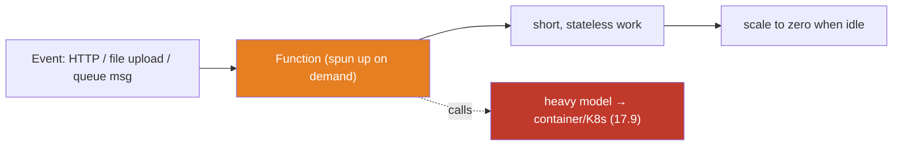

# 17.10 · Serverless Computing

[⬅ 17.9 Kubernetes for AI Engineers](17.9-kubernetes.md) · [🏠 Module 17](../README.md) · [➡ 17.11 Cloud AI Architectures](17.11-ai-architectures.md)

> **The lesson in one line:** Serverless means you deploy **functions or managed services and the cloud runs them per-event, scaling automatically (including to zero) with no servers to manage** — brilliant for event-driven glue, data-pipeline triggers, and lightweight APIs, but the wrong tool for **large models, GPU workloads, and long-running training**, which hit serverless's hard limits on time, memory, and hardware.

---

## 🎯 Learning objectives

- Understand **functions, event-driven architecture, and managed services**.
- Know when serverless **fits** (data processing, API endpoints, event processing, light AI glue) and when it **doesn't** (large models, GPUs, long training).
- Compare **serverless vs. containers vs. VMs**.

## ✅ Prerequisites

- [17.1 Cloud Fundamentals](17.1-cloud-fundamentals.md), [17.3 Compute](17.3-compute.md), [17.8 Containers](17.8-containers.md).

---

## 🧠 Mental model

> [!IMPORTANT]
> **Serverless flips the unit of deployment from "a running server" to "a function that runs when something happens."** You don't provision or manage any machine; you upload code, and the platform executes it **on each event** (an HTTP request, a file upload, a queue message), spinning up capacity on demand and **scaling to zero when idle** (you pay nothing when nothing's happening). This is perfect for **spiky, short, stateless** work. But the same design that makes it effortless imposes hard limits — **execution time caps, memory caps, and (crucially) no GPUs** — so serverless is the *glue and triggers* of an AI system, not the place you run a 13B model. The engineering judgment is: **serverless for the plumbing, containers/K8s for the models.**



## 🔍 Internal explanation

### Functions and event-driven architecture

A serverless **function** is a small, stateless unit of code triggered by an **event**. **Event-driven architecture** wires systems together by events rather than direct calls: something happens (a document is uploaded to object storage), which emits an event, which triggers a function (chunk + embed the document), which may emit another event. Components are **decoupled** — producers don't know about consumers ([17.16](17.16-distributed-systems.md)).

**Managed services** are the broader serverless idea: databases, queues, and AI APIs you *use* without operating servers. A hosted model API ([17.12](17.12-ai-services.md)) is "serverless" from your perspective — you call it, someone else runs the GPUs.

### Where serverless shines for AI

| Use case | Why serverless fits |
|---|---|
| **Data processing / pipeline triggers** | event-driven, spiky, short (e.g. "on upload → start embedding") |
| **API endpoints (light)** | scale-to-zero for low/spiky traffic; no idle server cost |
| **Event processing** | queue message → function → act; natural fit |
| **Lightweight AI workflows** | pre/post-processing, orchestration glue, calling a hosted model API |
| **Webhooks & automation** | cheap, on-demand, no infra to babysit |

> [!IMPORTANT]
> **Serverless is the ideal "connective tissue" of an AI system.** The pattern that recurs: an event fires (file uploaded, request arrives), a serverless function does light work and **calls out to the heavy compute** (a hosted LLM API, or a model service on Kubernetes), then stores or forwards the result. The function is cheap, scales to zero, and needs no GPU — because the GPU work lives elsewhere.

### Where serverless breaks for AI

> [!CAUTION]
> **Serverless's limits are exactly where AI is heaviest:**
> - **No GPUs** — most serverless platforms are CPU-only; you cannot run GPU inference or training on them.
> - **Execution time limits** — functions cap out (often minutes); long training or big batch jobs get killed.
> - **Memory limits** — capped RAM can't hold large model weights.
> - **Cold starts** — a scaled-to-zero function pays a startup penalty on the first request; loading even a modest model per invocation is slow and wasteful.
> - **Statelessness** — no persistent GPU/model kept warm between calls, so you'd reload the model every time.
>
> **So: no large models, no GPU workloads, no long-running training on serverless.** Those belong on containers/VMs/Kubernetes ([17.9](17.9-kubernetes.md)).

### Serverless vs. containers vs. VMs

| | **VM** | **Container** | **Serverless** |
|---|---|---|---|
| You manage | OS + app + scaling | the container; platform/K8s scales | just the function code |
| Scaling | manual/autoscaler | autoscaler / K8s | automatic, to zero |
| Idle cost | pay while running | pay while running (unless scale-to-zero) | **zero when idle** |
| GPU | yes | yes | **no (typically)** |
| Runtime limits | none | none | time/memory caps |
| AI fit | training, custom serving | model serving at scale | glue, triggers, light APIs |
| Startup | slow | fast (image pull) | cold-start penalty |

The three form a spectrum of **control vs. convenience** ([17.1](17.1-cloud-fundamentals.md)): VMs (most control), containers (portable, orchestrated), serverless (least ops, most limits).

## 🛠️ Practical implementation

```python
# Serverless as AI glue: triggered by a file upload, it does light work and
# delegates the heavy lifting — it does NOT run the model itself.
def on_document_uploaded(event):            # triggered by object-storage upload event
    doc = load(event["bucket"], event["key"])     # light I/O
    chunks = chunk(doc)                            # cheap CPU work
    # Heavy work is delegated, not done here:
    embeddings = embedding_api(chunks)             # call a managed/hosted model (17.12)
    vector_db.upsert(embeddings)                   # write to the vector DB (17.7)
    # Function ends in seconds, scales to zero — no GPU, no long run.
```

**Decision rule:**
```text
Short (< minutes), stateless, spiky, no GPU?          → serverless
Needs a GPU, or must stay warm, or runs long?         → container / Kubernetes (17.9)
Full OS control / special hardware / always-on?       → VM (17.3)
```

## 🏭 Production examples

| System | Serverless role |
|---|---|
| RAG ingestion | function triggered on upload → chunk/embed via hosted API → vector DB |
| Async post-processing | function on a queue message formats/stores an LLM result ([17.16](17.16-distributed-systems.md)) |
| Lightweight inference API | quantized small model or hosted-API proxy behind a function (CPU) |
| Scheduled automation | timer → function → kick off a batch job or report |
| Webhooks | function receives an event, validates, forwards |

## ⚡ Performance considerations

- **Cold starts** — first invocation after idle is slow; for latency-sensitive endpoints keep warm (provisioned concurrency) or use always-on containers instead.
- **Per-invocation model loading is a trap** — never load a large model inside a function per call; that's a sign you need a warm model service.
- **Concurrency limits** — platforms cap concurrent executions; a traffic spike can throttle.

## 💲 Cost considerations

> [!IMPORTANT]
> **Serverless's cost superpower is scale-to-zero: you pay per invocation (and duration/memory), nothing when idle — ideal for spiky, low-average-traffic glue.** But it's *not* cheaper for steady high volume: at scale, always-on containers can be cheaper per request than paying per invocation. And it can't save you on the expensive part anyway (GPUs), because it can't run them. Use serverless to **avoid paying for idle plumbing**; use containers/K8s for **sustained model serving** ([17.14](17.14-cost-optimization.md)).

## 🔒 Security considerations

- **Least-privilege function roles** — a function should have only the permissions it needs (read this bucket, call this API) ([17.13](17.13-security.md)).
- **Secrets from a manager**, injected at runtime — never in the function package.
- **Event-source validation** — validate/authenticate incoming events (webhooks are public endpoints).
- **Larger surface via many small functions** — audit each function's permissions.

## 🚫 Common mistakes

| Mistake | Consequence |
|---|---|
| Running a large model / GPU job on serverless | hits no-GPU/time/memory wall |
| Loading a model per invocation | brutal latency + cost; reload every call |
| Serverless for steady high-volume serving | more expensive than warm containers |
| Ignoring cold starts on a latency-SLA endpoint | first-request lag |
| Over-broad function IAM roles | large blast radius ([17.13](17.13-security.md)) |

## 🐛 Debugging workflow

Serverless issue: (1) **Function times out.** → The work is too long/heavy for serverless — move it to a container/Job ([17.9](17.9-kubernetes.md)), or split it. (2) **Slow first request.** → Cold start; add warm/provisioned concurrency or use an always-on service. (3) **Out of memory.** → Trying to hold a model; delegate to a model service. (4) **Throttled under spike.** → Concurrency limit; raise it or add a queue for backpressure ([17.16](17.16-distributed-systems.md)). (5) **Permission denied.** → Function role missing an action; grant least-privilege access.

## 🏋️ Exercises

1. **Conceptual.** Define serverless and event-driven architecture; give two AI glue use cases.
2. **Fit test.** For 6 tasks (upload-triggered embedding, 13B inference, nightly training, webhook, batch scoring, quantized small-model API), decide serverless vs. container vs. VM and justify.
3. **Limits.** List the four serverless limits that block AI model workloads and why each bites.
4. **Cost.** Compare serverless vs. always-on container cost for (a) 100 spiky requests/day and (b) 100 req/s steady.
5. **Incident.** "Model deployment fails: function times out loading the model" — explain the root cause and fix.

## 🛠️ Mini project — "Event-driven RAG ingestion"

**Goal:** a serverless ingestion pipeline that stays cheap and scales to zero.

**Requirements:** a function triggered by object-storage uploads that chunks documents, calls a **hosted embedding API** (not a self-run GPU model), and upserts to the vector DB ([17.7](17.7-databases.md)); least-privilege role (read bucket, call API, write vector DB); secrets from a manager; a queue in front for backpressure on bursts ([17.16](17.16-distributed-systems.md)); a note on where the *heavy* compute lives (delegated, not in the function).
**Deliverable:** the event-flow diagram + the function spec + IAM/secret notes.
**Extension:** add cold-start mitigation and a cost comparison vs. a persistent ingestion container.

## 📄 Cheat sheet

| Concept | Essence |
|---|---|
| **Serverless** | deploy functions; platform runs per-event, scales to zero; no servers |
| **Event-driven** | components decoupled via events (producer → event → consumer) |
| **Managed service** | use it without running servers (DBs, queues, model APIs) |
| **⭐ Fits** | glue, triggers, light/spiky APIs, data-pipeline events |
| **⭐ Doesn't fit** | large models, **GPUs**, long training (time/memory/GPU limits) |
| **Pattern** | function does light work → **delegates heavy compute** to a model service |
| **vs.** | VM (control) → container (portable) → serverless (least ops, most limits) |
| **⚠️** | model-per-invocation; cold starts; steady-high-volume cost |
| **Cross-cloud** | Lambda (AWS) · Functions (Azure) · Cloud Functions/Run (GCP) |

## 🎴 Flashcards

- **⭐ What is serverless?** → You deploy functions/managed services; the cloud runs them per-event, autoscaling (including to zero) with no servers to manage.
- **⭐ When is serverless the wrong choice for AI?** → Large models, GPU workloads, and long-running training — it's CPU-only with time and memory caps.
- **What is the serverless AI pattern?** → A cheap function does light, event-triggered work and *delegates* heavy compute to a hosted model API or a model service on Kubernetes.
- **What is event-driven architecture?** → Components communicate via events (producer emits, consumer reacts), staying decoupled.
- **What is a cold start?** → The startup latency when a scaled-to-zero function handles its first request after idle.
- **Serverless cost superpower and its limit?** → Scale-to-zero (pay nothing when idle) — but at steady high volume, warm containers can be cheaper per request.
- **serverless vs. containers vs. VMs?** → Least-ops/most-limits (serverless) → portable/orchestrated (containers) → most-control (VMs); only containers/VMs get GPUs.
- **Why never load a model per invocation?** → No warm state means reloading the model every call — huge latency and cost; use a persistent model service.

## 💬 Interview questions

1. What is serverless, and what's the event-driven model behind it?
2. Where does serverless fit in an AI system, and where does it break?
3. Why can't you run large-model GPU inference or training on serverless?
4. Compare serverless, containers, and VMs on control, cost, scaling, and GPU support.
5. How do cold starts and statelessness shape what you put on serverless?
6. How do you secure serverless functions?

## 📝 Summary

- **Serverless** runs your **functions/managed services per-event, autoscaling to zero** with no servers to manage — ideal for **spiky, short, stateless glue**: data-pipeline triggers, event processing, and lightweight APIs.
- Its design imposes **hard limits — no GPUs, time caps, memory caps, cold starts, statelessness** — that make it **wrong for large models, GPU inference, and long training**, which belong on containers/Kubernetes/VMs.
- The durable AI pattern: **serverless functions do light work and delegate the heavy compute** to a hosted model API or a model service ([17.9](17.9-kubernetes.md), [17.12](17.12-ai-services.md)).
- On the **VM → container → serverless** spectrum, serverless is least-ops/most-limits; use it to **avoid paying for idle plumbing**, and containers/K8s for **sustained model serving** ([17.14](17.14-cost-optimization.md), [17.16](17.16-distributed-systems.md)).

## 📚 References

1. **Serverless docs — AWS Lambda / Azure Functions / Google Cloud Functions & Cloud Run.** The three platforms.
2. **[17.16 Distributed Systems for AI](17.16-distributed-systems.md).** Event-driven and queue-based patterns.
3. **[17.12 Cloud AI Services](17.12-ai-services.md).** Managed model APIs as "serverless" heavy compute.
4. **[17.9 Kubernetes for AI](17.9-kubernetes.md).** Where GPU/model workloads actually run.

---

## 🧭 Navigation

| Direction | Link |
|---|---|
| ⬅ Previous | [17.9 · Kubernetes for AI Engineers](17.9-kubernetes.md) |
| ➡ Next | [17.11 · Cloud AI Architectures](17.11-ai-architectures.md) |
| 🏠 Module | [Module 17](../README.md) |
| 📖 Lessons | [Lesson index](README.md) |
