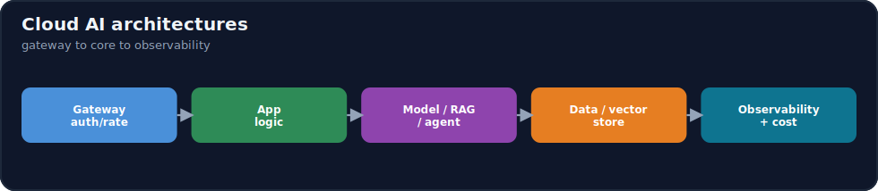
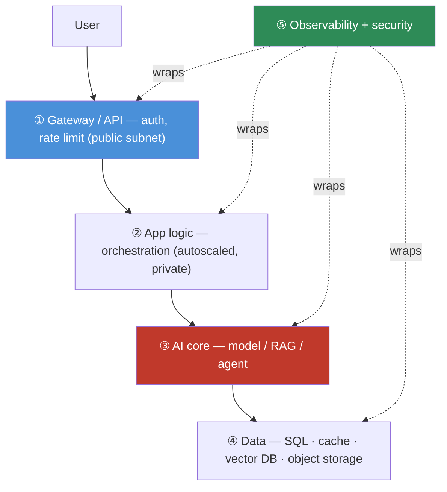
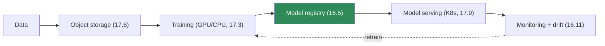
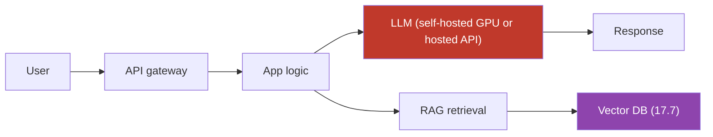
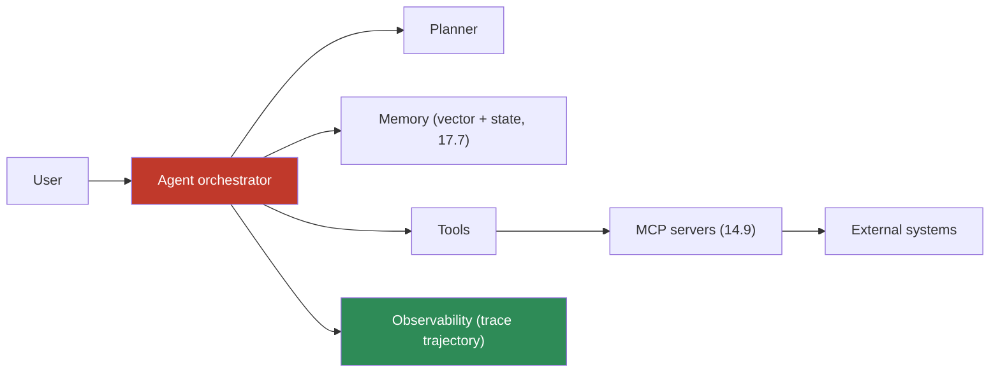

# 17.11 · Cloud AI Architectures ⭐

[⬅ 17.10 Serverless Computing](17.10-serverless.md) · [🏠 Module 17](../README.md) · [➡ 17.12 Cloud AI Services](17.12-ai-services.md)

> **The lesson in one line:** This lesson assembles everything so far into three reference architectures — a **traditional ML system**, an **LLM application**, and an **AI agent system** — and shows they share one skeleton: a **front door (API/gateway) → application logic → the AI core (model / RAG / agent) → data stores → observability**, all riding on the cloud primitives (compute, network, storage, containers) you've now learned.



---

## 🎯 Learning objectives

- Design cloud reference architectures for **traditional ML, LLM applications, and AI agents**.
- Recognize the **shared skeleton** and where the three diverge.
- Place each component on the right cloud primitive (compute, storage, DB, network).

## ✅ Prerequisites

- Lessons [17.1](17.1-cloud-fundamentals.md)–[17.10](17.10-serverless.md). Echoes [16.20 production architecture](../../16-MLOps/weeks/16.20-production-architecture.md).

---

## 🧠 Mental model

> [!IMPORTANT]
> **Every cloud AI system is the same five-layer skeleton with a different "core."** From the outside in: **(1) a gateway/API** (auth, rate limiting, routing — the public front door in a public subnet), **(2) application logic** (orchestration, business rules — stateless, autoscaled), **(3) the AI core** (the part that differs: a served model, a RAG pipeline, or an agent loop), **(4) data stores** (relational, cache, vector DB, object storage), and **(5) observability + security** wrapping all of it. Traditional ML, LLM apps, and agents are **variations on this skeleton** — they differ in the core and in which data stores dominate, not in the overall shape. Learn the skeleton once and every AI architecture becomes a fill-in-the-core exercise.



## 🔍 Internal explanation

### Architecture 1 — Traditional ML



- **Data → object storage** ([17.6](17.6-storage.md)); **training** on GPU/CPU ([17.3](17.3-compute.md)); versioned in a **model registry** ([16.5](../../16-MLOps/weeks/16.5-model-registry.md)); **served** behind a Service on Kubernetes ([17.9](17.9-kubernetes.md)); **monitored** for drift with a retrain loop ([16.11](../../16-MLOps/weeks/16.11-monitoring-drift.md)).
- **Dominant data store:** object storage (datasets/artifacts) + relational (metadata). Core = a trained model.

### Architecture 2 — LLM application



- **User → API → app → LLM**, with **RAG** pulling context from a **vector DB** ([17.7](17.7-databases.md)) built from documents in object storage. The LLM is either **self-hosted on GPU** (Kubernetes + vLLM) or a **hosted API** ([17.12](17.12-ai-services.md)).
- **Dominant data store:** vector DB (retrieval) + cache (responses) + object storage (docs). Core = LLM + retrieval.

### Architecture 3 — AI agent



- **User → agent** running a loop (plan → act → observe, [14.2](../../14-AI-Agents/weeks/14.2-agent-architecture.md)); **memory** in vector + state stores ([17.7](17.7-databases.md), [14.5](../../14-AI-Agents/weeks/14.5-memory.md)); **tools** reached via **MCP** ([14.9](../../14-AI-Agents/weeks/14.9-mcp.md)) into external systems; heavy **observability** to trace the full trajectory ([16.10](../../16-MLOps/weeks/16.10-observability.md)).
- **Dominant concerns:** tool orchestration, memory, security (the agent *acts*), and observability. Core = the agent loop.

### The shared skeleton, made explicit

> [!IMPORTANT]
> **All three ride the same cloud substrate:** a **gateway** in a public subnet ([17.5](17.5-networking.md)); **stateless app/core containers** on Kubernetes, autoscaled ([17.9](17.9-kubernetes.md), [17.15](17.15-autoscaling.md)); **GPU nodes** for model compute ([17.4](17.4-gpu-infrastructure.md)); **data stores** (SQL, cache, vector, object) in private subnets ([17.6](17.6-storage.md), [17.7](17.7-databases.md)); **secrets/IAM/encryption** throughout ([17.13](17.13-security.md)); and **observability** across the whole path ([17.19](17.19-observability.md)). What changes across the three is the **core** (model / RAG / agent) and **which data stores dominate** — the infrastructure pattern is constant. This is why the cloud primitives are worth learning once: they compose into every AI architecture.

| Layer | Traditional ML | LLM app | AI agent |
|---|---|---|---|
| Front door | API/batch | API gateway | API gateway |
| App logic | scoring service | orchestration | agent loop |
| **AI core** | trained model | LLM + RAG | agent + tools + planner |
| Dominant data | object + relational | vector + cache | vector + state + audit |
| Compute | GPU/CPU serving | GPU (or hosted API) | CPU loop + GPU/API |
| Extra emphasis | drift/retrain | retrieval quality, cost | tool security, trajectory obs |

## 🛠️ Practical implementation

```text
Build order for any cloud AI architecture:
  1. Network: VPC + public/private subnets, gateway front door        (17.5)
  2. Data: object storage + the right DBs (incl. vector for RAG/agent) (17.6, 17.7)
  3. Compute: containerize the app + AI core; GPU nodes for models     (17.8, 17.4)
  4. Orchestrate: Kubernetes deployments/services + autoscaling        (17.9, 17.15)
  5. The core: plug in model serving / RAG / agent loop
  6. Wrap: security (IAM/secrets), observability, cost controls        (17.13, 17.19, 17.14)
```

## 🏭 Production examples

| Product | Architecture |
|---|---|
| Churn prediction | Traditional ML: object storage → GPU training → registry → K8s serving → drift monitor |
| Enterprise doc assistant | LLM app: gateway → app → RAG (vector DB) → LLM (hosted/self-hosted) → cache |
| Autonomous ops agent | Agent: orchestrator → planner/memory → tools via MCP → external systems → deep observability |

## ⚡ Performance considerations

- **Keep the AI core close to its data** — model ↔ vector DB ↔ cache in the same AZ ([17.2](17.2-regions-availability.md), [17.5](17.5-networking.md)).
- **Cache aggressively** — responses/embeddings for LLM apps ([17.7](17.7-databases.md), [17.14](17.14-cost-optimization.md)).
- **Autoscale the stateless tiers**, keep GPU tiers warm-minimal ([17.15](17.15-autoscaling.md)).

## 💲 Cost considerations

- **The AI core dominates cost** — GPU serving (LLM/ML) or per-token hosted-API calls; everything else is comparatively cheap ([17.14](17.14-cost-optimization.md)).
- **Agents multiply calls** — planning loops and tool calls can explode token/compute cost; budget and cap them ([14.7](../../14-AI-Agents/weeks/14.7-agent-loops.md)).

## 🔒 Security considerations

> [!CAUTION]
> - **Gateway is the only public tier**; app, core, and data are private ([17.5](17.5-networking.md)).
> - **Agents need extra security** — they *act*, so least-privilege tools, sandboxing, and human-in-the-loop ([14.13](../../14-AI-Agents/weeks/14.13-safety.md), [17.13](17.13-security.md)).
> - **Tenant isolation** on the vector DB for multi-tenant RAG ([17.7](17.7-databases.md)).
> - **Secrets/IAM/encryption** across every layer ([17.13](17.13-security.md)).

## 🚫 Common mistakes

| Mistake | Consequence |
|---|---|
| Designing each AI system from scratch | miss the reusable skeleton; inconsistent, error-prone |
| Public app/data tiers | attackable core ([17.5](17.5-networking.md)) |
| No observability on agent trajectories | can't debug multi-step failures ([16.10](../../16-MLOps/weeks/16.10-observability.md)) |
| Ignoring retrieval quality in LLM apps | fluent-but-wrong answers |
| Unbounded agent loops | runaway cost ([14.7](../../14-AI-Agents/weeks/14.7-agent-loops.md)) |

## 🐛 Debugging workflow

Architecture-level issue: (1) **Which layer?** Use observability to localize — gateway, app, core, or data ([17.19](17.19-observability.md)). (2) **Core wrong output?** ML → drift/deploy; LLM → retrieval or prompt; agent → which step (trace the trajectory). (3) **Latency?** Find the slow hop (model, DB, external tool) — [17.5](17.5-networking.md). (4) **Cost spike?** The core (GPU/tokens) almost always — attribute it ([17.14](17.14-cost-optimization.md)). (5) **Security?** Verify only the gateway is public and tenant isolation holds.

## 🏋️ Exercises

1. **Skeleton.** Draw the five-layer skeleton and label the cloud primitive behind each layer.
2. **Three cores.** Design the traditional-ML, LLM-app, and agent architectures; mark where they diverge.
3. **Placement.** For an LLM app, assign every component to a subnet, compute type, and data store.
4. **Trade-off.** Self-hosted GPU LLM vs. hosted API — compare on cost, control, latency, and ops ([17.12](17.12-ai-services.md)).
5. **Security.** Show the public/private split and the extra controls an agent needs over an LLM app.

## 🛠️ Mini project — "Reference architecture pack"

**Goal:** three labeled, cloud-grounded reference architectures.

**Requirements:** diagrams for traditional ML, LLM app, and agent, each showing the five-layer skeleton, the subnet/compute/storage placement of every component, and the observability/security wrap; a table of where the three diverge (core, dominant data, cost driver, security emphasis); one component-to-primitive mapping so nothing is abstract.
**Deliverable:** the three diagrams + the divergence table + the placement mapping.
**Extension:** annotate each with its top cost driver and its top failure mode.

## 📄 Cheat sheet

| Layer | Role | Primitive |
|---|---|---|
| ① Gateway/API | auth, rate limit, routing | public subnet, LB ([17.5](17.5-networking.md)) |
| ② App logic | orchestration | autoscaled containers ([17.9](17.9-kubernetes.md)) |
| ③ **AI core** | model / RAG / agent | GPU nodes or hosted API ([17.4](17.4-gpu-infrastructure.md)) |
| ④ Data | SQL · cache · vector · object | private subnets ([17.6](17.6-storage.md), [17.7](17.7-databases.md)) |
| ⑤ Wrap | observability + security | across all ([17.13](17.13-security.md), [17.19](17.19-observability.md)) |
| **⭐ Skeleton** | gateway → app → core → data → observability (all three architectures) |
| **Diverge** | the **core** and dominant **data store**, not the shape |

## 🎴 Flashcards

- **⭐ What skeleton do all cloud AI architectures share?** → Gateway/API → app logic → AI core (model/RAG/agent) → data stores → observability+security, riding the cloud primitives.
- **⭐ How do the three architectures differ?** → In the *core* (trained model vs. LLM+RAG vs. agent loop) and which data store dominates (object/relational vs. vector/cache vs. vector/state) — not in the overall shape.
- **Traditional ML architecture flow?** → Data → object storage → training → model registry → serving → monitoring/drift → retrain.
- **LLM application flow?** → User → API → app → LLM + RAG (vector DB) → response, with response caching.
- **AI agent architecture emphasis?** → Agent loop + planner + memory + tools via MCP to external systems, with heavy trajectory observability and least-privilege tool security.
- **Which layer is public?** → Only the gateway/API; app, core, and data live in private subnets.
- **What dominates cost in every AI architecture?** → The AI core — GPU serving or per-token hosted-API calls.
- **Why learn the cloud primitives once?** → They compose into every AI architecture; each design is a fill-in-the-core exercise on the same skeleton.

## 💬 Interview questions

1. What skeleton is common to ML, LLM, and agent cloud architectures, and where do they diverge?
2. Design the cloud architecture for an enterprise RAG assistant, placing each component.
3. Self-hosted GPU LLM vs. hosted API — how do you decide?
4. What extra architectural concerns does an agent introduce over an LLM app?
5. Where does cost concentrate in these architectures, and how do you control it?
6. How does the public/private network split apply across the layers?

## 📝 Summary

- Cloud AI architectures share a **five-layer skeleton**: **gateway → app logic → AI core → data stores → observability+security**, all built on the cloud primitives from earlier lessons.
- The three canonical designs — **traditional ML** (data→train→registry→serve→monitor), **LLM app** (API→app→LLM+RAG→vector DB), and **AI agent** (loop→planner/memory→tools via MCP) — **differ only in the core and dominant data store**, not the shape.
- Place components correctly: **gateway public; app/core/data private; GPU nodes for models; vector DB for RAG/agent memory**; wrap everything in **security and observability**.
- The **AI core dominates cost and risk** — GPU/token spend, retrieval quality (LLM), and tool security + trajectory observability (agents) — which the following lessons on services, security, cost, and scaling address in depth.

## 📚 References

1. **[16.20 Production Architecture](../../16-MLOps/weeks/16.20-production-architecture.md).** ⭐ The MLOps view of the same skeleton.
2. **RAG ([13.x](../../13-RAG/README.md)) and Agents ([14.x](../../14-AI-Agents/README.md)) modules.** The cores in depth.
3. **[17.12 Cloud AI Services](17.12-ai-services.md).** Hosted vs. self-hosted core.
4. **AWS/Azure/GCP well-architected AI/ML guidance.** Provider reference architectures.

---

## 🧭 Navigation

| Direction | Link |
|---|---|
| ⬅ Previous | [17.10 · Serverless Computing](17.10-serverless.md) |
| ➡ Next | [17.12 · Cloud AI Services](17.12-ai-services.md) |
| 🏠 Module | [Module 17](../README.md) |
| 📖 Lessons | [Lesson index](README.md) |
