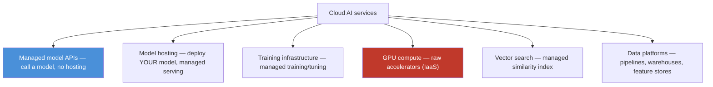

# 17.12 · Cloud AI Services

[⬅ 17.11 Cloud AI Architectures](17.11-ai-architectures.md) · [🏠 Module 17](../README.md) · [➡ 17.13 Cloud Security](17.13-security.md)

> **The lesson in one line:** Every cloud sells a stack of **managed AI services** — hosted model APIs, model-hosting platforms, training infrastructure, GPU compute, vector search, and data platforms — and the skill isn't memorizing product names (they change constantly) but recognizing the **service *categories*** and reasoning about the one trade-off that governs them all: **managed convenience vs. control, portability, and cost.**

---

## 🎯 Learning objectives

- Recognize the **categories** of cloud AI services (not the vendor catalog).
- Reason about **build-vs-buy** and **managed-vs-self-hosted** for each category.
- Map categories across AWS, Azure, and Google Cloud at the concept level.

## ✅ Prerequisites

- [17.11 Cloud AI Architectures](17.11-ai-architectures.md). Echoes [16.22 Cloud MLOps](../../16-MLOps/weeks/16.22-cloud.md).

---

## 🧠 Mental model

> [!IMPORTANT]
> **Think in categories, not products.** A cloud AI service catalog looks overwhelming until you realize it collapses into ~6 categories, each answering "which part of the AI stack do you want the provider to run for you?" The provider's product names change yearly and differ across clouds — but the *categories* are stable and transferable. For every category the decision is the same one from [17.1](17.1-cloud-fundamentals.md): **the more managed you go, the less you operate but the more you trade away control, portability, and (often) margin.** The right answer is rarely "all managed" or "all self-hosted" — it's **buy the undifferentiated heavy lifting (GPU provisioning, vector-index ops) and build/own what is your differentiation or your lock-in risk.**



## 🔍 Internal explanation

### The six categories

| Category | What it gives you | Managed ↔ control trade-off | Self-hosted alternative |
|---|---|---|---|
| **Managed model APIs** | call a hosted foundation model (text/vision/speech/embeddings) — no weights, no GPUs | max convenience; you don't control the model or its version unless pinned | run open weights yourself ([17.9](17.9-kubernetes.md)) |
| **Model hosting / serving** | deploy *your* model; provider manages the serving infra + autoscaling | less ops; some lock-in to their format | vLLM/TGI on your K8s |
| **Training infrastructure** | managed training/fine-tuning jobs, hyperparameter search | no cluster ops; proprietary pipeline | your own training on GPU nodes ([17.4](17.4-gpu-infrastructure.md)) |
| **GPU compute** | raw GPU instances (IaaS) | full control; you operate everything | (this *is* the low rung) |
| **Vector search** | managed similarity index + metadata filtering | no index ops/scaling; per-vector cost | self-hosted vector DB ([17.7](17.7-databases.md)) |
| **Data platforms** | pipelines, warehouses, feature stores, labeling | integrated data tooling; gravity/lock-in | open-source data stack |

### Managed model APIs — the highest-leverage, highest-lock-in category

> [!IMPORTANT]
> **A managed model API is "SaaS for a model": you send text, you get output, and someone else owns the GPUs, scaling, and updates.** It's the fastest path to shipping AI — no VRAM math, no serving stack, no GPU scarcity to fight. The costs are **per-token pricing** (which scales with usage, not fixed like a rented GPU), **version drift** (the provider can change the model under you — always pin the version, [16.9](../../16-MLOps/weeks/16.9-llmops.md)), **data-governance questions** (where does your prompt data go?), and **lock-in** (your prompts/evals tune to one model's behavior). Use it when speed-to-value beats control; self-host open weights when you need control, privacy, predictable cost at scale, or a model you can't get as an API.

### GPU compute — the category everything else is built on

At the bottom of the stack is **raw GPU compute** (IaaS GPU instances, [17.4](17.4-gpu-infrastructure.md)). Every higher service ultimately runs on it; renting it directly gives you maximum control (any framework, any model) at maximum operational cost. **GPU availability is itself a service constraint** — capacity is scarce and regional, so multi-region/multi-cloud sourcing and spot instances are part of the design ([17.14](17.14-cost-optimization.md)).

### The build-vs-buy lens

For each category, ask:
1. **Is this our differentiation?** If the model/pipeline *is* your product's edge, own it. If it's plumbing (a vector index, GPU provisioning), buy it.
2. **What's the lock-in cost?** Proprietary formats/pipelines are hard to leave; keep a **portable core** (open model formats, MLflow, Docker/K8s — [16.22](../../16-MLOps/weeks/16.22-cloud.md)) so you *can* leave.
3. **What's the cost curve?** Managed APIs are cheap to start, expensive at scale; self-hosting is expensive to start, cheaper at steady high volume.
4. **What are the constraints?** Data residency, privacy, latency, or a specific model may force self-hosting ([17.13](17.13-security.md)).

## 🛠️ Practical implementation

```text
Choosing per category (decision sketch):
  Need a foundation model, shipping fast, usage modest?     → managed model API (pin the version)
  Have your own model, don't want serving ops?              → managed model hosting
  Fine-tuning occasionally, no cluster to run?              → managed training infra
  Need control / privacy / scale economics / any framework? → raw GPU compute + self-host
  Need similarity search without running an index?          → managed vector search
  Building data pipelines/feature stores?                   → data platform (mind lock-in)
Keep a PORTABLE CORE regardless, so any of these can be swapped.
```

## 🏭 Production examples

| Situation | Service choice |
|---|---|
| Startup adding chat, tiny team | managed model API — ship this week |
| Regulated data, must self-host | raw GPU compute + open-weights serving ([17.9](17.9-kubernetes.md)) |
| High steady LLM volume | self-host on reserved/owned GPUs (cheaper per token at scale) |
| RAG without DB ops | managed vector search + managed model API |
| Occasional fine-tuning | managed training infra (no cluster to babysit) |

## ⚡ Performance considerations

- **Managed APIs add network latency + rate limits** — you're calling out over the internet/private link; batch and cache ([17.7](17.7-databases.md)).
- **Self-hosting gives latency control** — co-locate the model with the app ([17.5](17.5-networking.md)) and tune serving ([16.14](../../16-MLOps/weeks/16.14-model-optimization.md)).
- **GPU scarcity is a performance risk** — capacity errors force fallbacks/retries ([17.4](17.4-gpu-infrastructure.md)).

## 💲 Cost considerations

> [!IMPORTANT]
> **The managed-vs-self-hosted cost curves cross.** Managed APIs (per-token) and managed services (per-use premium) are cheapest at low/spiky volume — you pay for nothing idle. Self-hosting (rented/owned GPUs) has high fixed cost but lower marginal cost, so it wins at **steady high volume**. Find the crossover for your workload, and don't forget the *hidden* managed costs (egress, per-request, version churn forcing re-tuning) and the *hidden* self-hosted costs (ops time, idle GPUs). Full toolkit in [17.14](17.14-cost-optimization.md).

## 🔒 Security considerations

> [!CAUTION]
> - **Data governance on managed APIs** — know where prompt/inference data goes, retention, and training-use terms; for sensitive data prefer self-hosting or a private/enterprise tier ([17.13](17.13-security.md)).
> - **Private connectivity** to managed services (private endpoints) keeps traffic off the public internet ([17.5](17.5-networking.md)).
> - **Least-privilege credentials** for every service; secrets from a manager ([17.13](17.13-security.md)).
> - **Pin model versions** — an un-pinned managed model is a silent behavior/security change ([16.9](../../16-MLOps/weeks/16.9-llmops.md)).

## 🚫 Common mistakes

| Mistake | Consequence |
|---|---|
| Memorizing products instead of categories | knowledge rots as catalogs change |
| Going all-managed with no portable core | painful, expensive lock-in |
| Managed API for high steady volume | overpaying vs. self-hosting |
| Self-hosting when a tiny team should ship | reinventing infra, slow to value |
| Ignoring data-governance terms on APIs | compliance/privacy breach |
| Not pinning a managed model version | silent regressions ([16.9](../../16-MLOps/weeks/16.9-llmops.md)) |

## 🐛 Debugging workflow

Service-selection or incident issue: (1) **Cost surprise?** Which category — per-token API blew up, or idle self-hosted GPUs? Attribute it ([17.14](17.14-cost-optimization.md)). (2) **Quality regressed with no code change?** Managed model version drifted — pin it. (3) **Latency high?** Managed API network hop + rate limit, or self-hosted under-provisioned. (4) **Capacity errors?** GPU scarcity — multi-region/spot fallback ([17.4](17.4-gpu-infrastructure.md)). (5) **Lock-in pain?** No portable core — introduce open formats/abstractions incrementally.

## 🏋️ Exercises

1. **Categories.** List the six AI service categories and give the self-hosted alternative for each.
2. **Mapping.** For AWS/Azure/GCP, name the category (not the product) each of a few services belongs to.
3. **Build-vs-buy.** For 5 scenarios, decide managed vs. self-hosted and justify with the four lenses.
4. **Cost curve.** Sketch managed-API vs. self-hosted cost vs. volume and mark the crossover.
5. **Governance.** List the data-governance questions to ask before sending sensitive data to a managed API.

## 🛠️ Mini project — "AI service selection framework"

**Goal:** a reusable framework to choose AI services for any project.

**Requirements:** the six-category table with each category's managed↔self-hosted trade-off; a build-vs-buy decision checklist (differentiation, lock-in, cost curve, constraints); a worked example choosing services for one LLM+RAG product with justification and a documented **portable-core / exit plan**; a data-governance checklist for any managed API used.
**Deliverable:** the framework doc + the worked example + the exit plan.
**Extension:** add a rough cost model comparing managed vs. self-hosted at 3 volume levels.

## 📄 Cheat sheet

| Category | Buy it when… |
|---|---|
| **Managed model API** | shipping fast, modest/spiky volume (pin version!) |
| **Model hosting** | own model, don't want serving ops |
| **Training infra** | occasional tuning, no cluster |
| **GPU compute** | need control/privacy/scale/any framework |
| **Vector search** | want similarity search, no index ops |
| **Data platform** | integrated pipelines/features (mind lock-in) |
| **⭐ Rule** | buy undifferentiated heavy lifting; own your edge + keep a portable core |
| **⭐ Cost** | managed cheap at low volume; self-host wins at steady high volume |
| **⚠️** | product-memorization; no exit plan; unpinned model versions |

## 🎴 Flashcards

- **⭐ Why learn service *categories* instead of products?** → Product names change yearly and differ per cloud, but the ~6 categories are stable and transferable — the concept survives the catalog churn.
- **Name the six cloud AI service categories.** → Managed model APIs, model hosting/serving, training infrastructure, GPU compute, vector search, and data platforms.
- **⭐ What single trade-off governs all AI services?** → Managed convenience vs. control, portability, and cost — the more managed, the less you operate but the more you trade away.
- **When is a managed model API the right call?** → Speed-to-value beats control: small team, modest/spiky volume, no need to own the model — with the version pinned.
- **When self-host instead?** → Control, privacy/data-residency, predictable cost at steady high volume, any-framework needs, or a model not available as an API.
- **Why do the cost curves cross?** → Managed (per-use) is cheap at low volume but scales with usage; self-hosting has high fixed but low marginal cost, winning at steady high volume.
- **What is a portable core and why keep one?** → Open model formats + MLflow + Docker/K8s so you can leave a managed service — insurance against lock-in.
- **Top governance question for a managed API?** → Where does your prompt/inference data go, how long is it retained, and is it used for training?

## 💬 Interview questions

1. What are the main categories of cloud AI services, and why think in categories?
2. Walk through the build-vs-buy decision for a managed model API vs. self-hosting.
3. Where do managed and self-hosted cost curves cross, and why?
4. What governance and security questions precede using a managed model API?
5. How do you avoid lock-in while still using managed services?
6. How does GPU scarcity affect service selection and architecture?

## 📝 Summary

- Cloud AI catalogs collapse into **six stable categories** — managed model APIs, model hosting, training infrastructure, GPU compute, vector search, and data platforms — and the durable skill is **thinking in categories, not memorizing products**.
- Every category is governed by one trade-off: **managed convenience vs. control, portability, and cost**; the pragmatic answer is **buy the undifferentiated heavy lifting, own your differentiation, and keep a portable core** ([16.22](../../16-MLOps/weeks/16.22-cloud.md)).
- **Managed model APIs** are the fastest path to value but bring per-token cost, version drift (pin it!), data-governance questions, and lock-in; **self-hosting on GPU compute** gives control/privacy and wins at steady high volume.
- Secure services with **data-governance review, private connectivity, least-privilege credentials, and pinned model versions** — next, [17.13](17.13-security.md) makes cloud security systematic.

## 📚 References

1. **[16.22 Cloud MLOps](../../16-MLOps/weeks/16.22-cloud.md).** ⭐ Managed-vs-portable-core in depth.
2. **Provider AI/ML service overviews (AWS/Azure/GCP).** Read them for *categories*, not memorization.
3. **[17.4 GPU Cloud Infrastructure](17.4-gpu-infrastructure.md).** The compute every service rests on.
4. **[16.9 LLMOps](../../16-MLOps/weeks/16.9-llmops.md).** Why pinning managed model versions matters.

---

## 🧭 Navigation

| Direction | Link |
|---|---|
| ⬅ Previous | [17.11 · Cloud AI Architectures](17.11-ai-architectures.md) |
| ➡ Next | [17.13 · Cloud Security](17.13-security.md) |
| 🏠 Module | [Module 17](../README.md) |
| 📖 Lessons | [Lesson index](README.md) |
