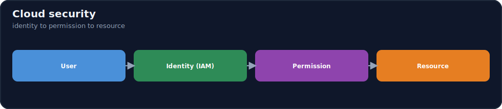
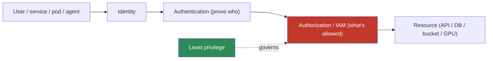

# 17.13 · Cloud Security ⭐

[⬅ 17.12 Cloud AI Services](17.12-ai-services.md) · [🏠 Module 17](../README.md) · [➡ 17.14 Cloud Cost Optimization](17.14-cost-optimization.md)

> **The lesson in one line:** Cloud security starts from one chain — **identity → authentication → authorization → resource** — and one principle — **least privilege**: every user, service, and workload gets an identity, proves it, and is granted the *minimum* permissions it needs, with **secrets in a manager, data encrypted, and networks locked down**. Applied consistently across model APIs, databases, storage, GPUs, Kubernetes, and agents, this is what keeps a cloud AI system from becoming a breach.



---

## 🎯 Learning objectives

- Understand **identity, authentication, authorization, IAM, and least privilege**.
- Apply **secrets management, encryption, and network security**.
- Secure every AI component: **model APIs, databases, object storage, GPUs, Kubernetes, agents**.

## ✅ Prerequisites

- [17.5 Networking](17.5-networking.md), [17.6 Storage](17.6-storage.md), [17.9 Kubernetes](17.9-kubernetes.md). Echoes [16.19 AI security](../../16-MLOps/weeks/16.19-security.md).

---

## 🧠 Mental model

> [!IMPORTANT]
> **All cloud security is one question asked over and over: "is *this identity* allowed to do *this action* on *this resource*?"** Every actor — a user, a service, a running pod, an agent — has an **identity**; it **authenticates** (proves who it is) and is **authorized** (granted specific permissions via **IAM** policies). The governing principle is **least privilege**: grant the *minimum* permissions needed, nothing more, so a compromised credential has a small blast radius. Around that core sit three more layers — **secrets management** (credentials live in a vault, never in code), **encryption** (data unreadable at rest and in transit), and **network security** (private subnets, firewalls, [17.5](17.5-networking.md)). Security isn't a feature you bolt on; it's **defense-in-depth** — every layer independently enforcing least privilege so no single failure is catastrophic.



## 🔍 Internal explanation

### The identity chain

| Step | Meaning | Example |
|---|---|---|
| **Identity** | who/what an actor is | a user, a service account, a pod's role |
| **Authentication (authN)** | proving that identity | password + MFA, a signed token, a workload identity |
| **Authorization (authZ)** | what that identity may do | IAM policy: "may read bucket X" |
| **Resource** | the thing being accessed | model API, database, bucket, GPU node |

**IAM (Identity and Access Management)** is the system that ties these together: it stores identities and the **policies** that grant them permissions on resources. Everything in the cloud is gated by IAM.

### Least privilege — the one principle to internalize

> [!IMPORTANT]
> **Least privilege: grant the minimum permissions needed for the task, and nothing else.** A serving pod needs *read* on the model bucket — not write, not access to the training bucket, not admin. A data-ingestion function needs *write* to the vector DB — not the ability to delete databases. The default cloud posture should be **deny-all, then explicitly allow** the specific actions each identity needs. This single discipline is what turns a leaked credential from a catastrophe into a contained incident — the attacker inherits only that identity's narrow permissions. Over-broad IAM roles (`*` permissions, admin-for-convenience) are the single most common and most damaging cloud misconfiguration.

### Secrets management

Credentials — API keys, database passwords, model-API tokens — are **secrets**, and the cardinal rule is **secrets never live in code, images, config files, or environment variables committed to git**. They live in a **secrets manager** (a vault) and are **injected at runtime** into the workload that needs them, with access itself governed by IAM. Rotate them regularly; a leaked secret in a git history is a classic breach vector ([17.8](17.8-containers.md), [17.9](17.9-kubernetes.md)).

### Encryption

- **At rest** — data on disk/object storage is encrypted so a stolen disk/bucket is unreadable. Enable default encryption everywhere; manage keys via a key-management service.
- **In transit** — TLS on every network hop so traffic can't be sniffed. Terminate TLS at the load balancer; encrypt internal traffic for sensitive data ([17.5](17.5-networking.md)).

### Network security

Covered in [17.5](17.5-networking.md), but as a security layer: **private subnets** for everything non-public, **security groups / network policies** enforcing least-privilege traffic, and **private connectivity** to managed services. Network and IAM are two independent layers — a resource should be protected by *both* (a database in a private subnet *and* requiring authenticated, authorized access).

### Securing each AI component

> [!IMPORTANT]
> **The same principles map onto every AI component — this is the whole lesson applied:**

| Component | Key controls |
|---|---|
| **Model APIs** | authN on every request, rate limiting, input validation, output filtering, private endpoints |
| **Databases** | private subnet, least-privilege creds from a vault, encryption, tenant isolation ([17.7](17.7-databases.md)) |
| **Object storage** | private-by-default buckets, least-privilege IAM, encryption, block public access ([17.6](17.6-storage.md)) |
| **GPUs** | dedicated (not shared) for sensitive workloads; protect weights as sensitive assets ([17.4](17.4-gpu-infrastructure.md)) |
| **Kubernetes** | RBAC least privilege, network policies, Secret objects, non-root pods ([17.9](17.9-kubernetes.md)) |
| **AI agents** | least-privilege tools, sandboxing, human-in-the-loop, prompt-injection defense ([16.19](../../16-MLOps/weeks/16.19-security.md), [14.13](../../14-AI-Agents/weeks/14.13-safety.md)) |

> [!NOTE]
> **AI adds a second security layer on top of infrastructure security.** Beyond IAM/network/secrets, AI systems face **AI-specific threats**: prompt injection, data exfiltration via model outputs, and tool misuse by agents. Infrastructure security (this lesson) + AI-layer security ([16.19](../../16-MLOps/weeks/16.19-security.md)) together are defense-in-depth for AI.

## 🛠️ Practical implementation

```text
Least-privilege IAM for an LLM+RAG serving stack (intent):
  serving-pod-role:   read  s3://models/*            # weights only, read-only
                      invoke vector-db:query          # query, not admin
                      get   secrets:llm-api-token     # the one secret it needs
  ingest-func-role:   read  s3://raw-docs/*
                      write vector-db:upsert
  NOTHING has: admin, delete-database, or cross-bucket write it doesn't need.
Secrets: stored in a vault; injected at runtime; access gated by the roles above.
Encryption: default-on at rest (KMS keys) + TLS in transit everywhere.
Network: DB/model/vector in private subnets; only the gateway is public (17.5).
```

## 🏭 Production examples

| System | Security posture |
|---|---|
| Public LLM API | authN + rate limit at gateway; model/DB private; secrets vaulted |
| Multi-tenant RAG | per-tenant vector filter + row-level access; least-privilege creds ([17.7](17.7-databases.md)) |
| Training platform | dataset buckets private + encrypted; job roles scoped to their data |
| Agent system | scoped tool credentials + sandboxes + approval gates ([14.13](../../14-AI-Agents/weeks/14.13-safety.md)) |

## ⚡ Performance considerations

- **Security rarely costs meaningful latency** — TLS, IAM checks, and private networking are negligible; don't trade security for micro-optimizations.
- **Rate limiting protects performance** — it's both a security and a reliability control ([17.20](17.20-reliability.md)).

## 💲 Cost considerations

- **A breach is the most expensive event** — security spend is cheap insurance ([17.14](17.14-cost-optimization.md)).
- **Least privilege limits cost blast radius too** — a compromised credential can't spin up crypto-mining GPUs if it lacks the permission.
- **KMS/secrets managers have small per-use costs** — trivial vs. the risk they mitigate.

## 🔒 Security considerations (checklist)

> [!IMPORTANT]
> **Cloud AI security checklist** — verify all before production:
> - [ ] **Identity** for every user/service/workload; MFA on human access.
> - [ ] **Least-privilege IAM** — deny-all default, explicit minimal allows; no `*`/admin roles.
> - [ ] **Secrets in a manager**, injected at runtime, rotated — none in code/images/git.
> - [ ] **Encryption** at rest (KMS) + in transit (TLS) everywhere.
> - [ ] **Private subnets** for DB/model/vector/GPU; only the gateway public ([17.5](17.5-networking.md)).
> - [ ] **Storage**: buckets private, public access blocked ([17.6](17.6-storage.md)).
> - [ ] **Kubernetes**: RBAC, network policies, Secret objects, non-root ([17.9](17.9-kubernetes.md)).
> - [ ] **Agents/models**: prompt-injection defense, output validation, scoped tools ([16.19](../../16-MLOps/weeks/16.19-security.md)).
> - [ ] **Audit logging** enabled; **data-governance** reviewed for managed APIs ([17.12](17.12-ai-services.md)).

## 🚫 Common mistakes

| Mistake | Consequence |
|---|---|
| Over-broad IAM roles (`*`/admin) | huge blast radius on compromise |
| Secrets in code/images/env committed to git | leaked credentials |
| Public buckets / public DB ports | direct data breach ([17.5](17.5-networking.md), [17.6](17.6-storage.md)) |
| No encryption at rest/in transit | data readable if intercepted/stolen |
| Missing tenant isolation | cross-tenant data leak ([17.7](17.7-databases.md)) |
| No audit logs | can't detect or investigate incidents |

## 🐛 Debugging workflow

Security incident/misconfig: (1) **"Storage permissions misconfigured" / access denied or over-exposed.** → Inspect the IAM + resource policy: is the principal granted exactly what it needs (not too little, not public)? (2) **Suspected leaked credential.** → Rotate immediately, scope its permissions (least privilege limits damage), audit its recent actions. (3) **Public exposure found.** → Lock it down, enable account-level public-access blocks, review who accessed it. (4) **Agent did something it shouldn't.** → Its tool permissions were too broad — scope them, add approval gates ([14.13](../../14-AI-Agents/weeks/14.13-safety.md)). (5) **Can't trace an incident.** → Audit logging wasn't on — enable it now.

## 🏋️ Exercises

1. **Conceptual.** Explain the identity → authN → authZ → resource chain and where least privilege applies.
2. **IAM design.** Write least-privilege roles for a serving pod, an ingestion function, and a training job.
3. **Secrets.** Show how a secret flows from a vault into a running pod without touching code/images.
4. **Checklist.** Audit a sample architecture against the security checklist; find three violations.
5. **Incident.** "Storage permissions are misconfigured" — walk through detection, containment, and fix.
6. **Least privilege.** Given an over-broad admin role, rewrite it to the minimum for its actual task.

## 🛠️ Mini project — "Secure-by-default AI architecture"

**Goal:** harden the LLM+RAG architecture from [17.11](17.11-ai-architectures.md).

**Requirements:** least-privilege IAM roles for every component (serving, ingestion, training, DB access); all secrets in a manager, injected at runtime, with rotation; encryption at rest + in transit; private subnets for all non-gateway tiers; tenant isolation on the vector DB; audit logging on; and a completed security checklist. Include the **two-layer** view (infra security + AI-layer prompt-injection/output-validation).
**Deliverable:** the hardened architecture diagram + the IAM/secrets/encryption spec + the filled checklist.
**Extension:** add a threat model (top 5 threats → mitigations) and an incident runbook for a leaked credential.

## 📄 Cheat sheet

| Concept | Essence |
|---|---|
| **Identity chain** | identity → authN → authZ → resource |
| **IAM** | stores identities + policies; gates every access |
| **⭐ Least privilege** | grant the minimum; deny-all default → explicit allows |
| **Secrets manager** | credentials vaulted, injected at runtime, rotated — never in code |
| **Encryption** | at rest (KMS) + in transit (TLS), everywhere |
| **Network security** | private subnets, SGs/network policies, private endpoints ([17.5](17.5-networking.md)) |
| **⭐ Defense-in-depth** | every layer enforces least privilege independently |
| **AI layer** | + prompt injection, output validation, scoped tools ([16.19](../../16-MLOps/weeks/16.19-security.md)) |
| **⚠️** | `*`/admin roles, secrets in git, public buckets/DB ports |

## 🎴 Flashcards

- **⭐ What single question is all cloud security asking?** → Is *this identity* allowed to do *this action* on *this resource*? — resolved by authentication + authorization (IAM).
- **⭐ What is least privilege and why does it matter?** → Grant every identity the minimum permissions it needs; it shrinks the blast radius of a compromised credential from catastrophe to contained.
- **What is IAM?** → Identity and Access Management — the system storing identities and the policies granting them permissions on resources; it gates every access.
- **Where do secrets belong?** → In a secrets manager, injected at runtime, rotated — never in code, images, env files, or git.
- **Encryption at rest vs. in transit?** → At rest encrypts stored data (stolen disk/bucket is unreadable); in transit uses TLS so network traffic can't be sniffed.
- **Why are network and IAM independent layers?** → Defense-in-depth — a resource should be both network-isolated (private subnet) *and* access-controlled (authenticated/authorized), so one failure isn't fatal.
- **The most common damaging cloud misconfiguration?** → Over-broad IAM roles (`*`/admin) — they give a compromised credential enormous reach.
- **What second security layer does AI add?** → AI-specific threats — prompt injection, output-based exfiltration, and agent tool misuse — on top of infra security.
- **First move on a leaked credential?** → Rotate it immediately; least privilege limits what it could have done; then audit its actions.

## 💬 Interview questions

1. Walk through the identity → authentication → authorization → resource chain.
2. What is least privilege, and how does it limit breach impact? Give an AI example.
3. How do you manage secrets in a cloud AI system, and what must you never do?
4. Explain encryption at rest vs. in transit and where each applies.
5. How do you secure model APIs, databases, storage, Kubernetes, and agents?
6. Why is defense-in-depth (network + IAM + AI-layer) better than any single control?

## 📝 Summary

- Cloud security is the repeated question **"is this identity allowed this action on this resource?"** — resolved by **identity → authentication → authorization (IAM) → resource**, and governed by **least privilege**: minimum permissions, deny-all default.
- Around that core: **secrets in a manager** (never in code/git), **encryption at rest and in transit**, and **network security** (private subnets, firewalls) — independent layers forming **defense-in-depth**.
- Apply the same principles to **every AI component** — model APIs, databases, object storage, GPUs, Kubernetes, and agents — and add the **AI-specific layer** (prompt injection, output validation, scoped tools, [16.19](../../16-MLOps/weeks/16.19-security.md)).
- The biggest risks are **over-broad IAM, leaked secrets, and public buckets/ports**; the checklist and least-privilege discipline are what keep a cloud AI system from becoming a breach.

## 📚 References

1. **[16.19 AI Security](../../16-MLOps/weeks/16.19-security.md).** ⭐ The AI-layer threats that pair with this infra layer.
2. **Provider IAM / KMS / secrets-manager docs (AWS/Azure/GCP).** The three implementations.
3. **[17.5 Networking](17.5-networking.md).** Network security as part of defense-in-depth.
4. **Cloud security benchmarks (CIS) & shared-responsibility docs.** Hardening baselines.

---

## 🧭 Navigation

| Direction | Link |
|---|---|
| ⬅ Previous | [17.12 · Cloud AI Services](17.12-ai-services.md) |
| ➡ Next | [17.14 · Cloud Cost Optimization](17.14-cost-optimization.md) |
| 🏠 Module | [Module 17](../README.md) |
| 📖 Lessons | [Lesson index](README.md) |
