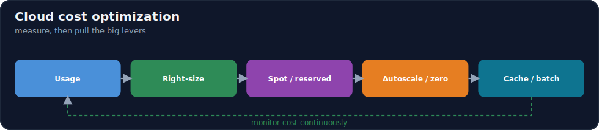
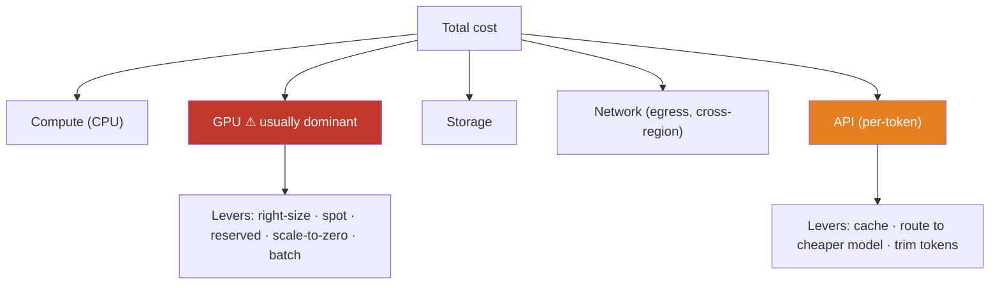

# 17.14 · Cloud Cost Optimization ⭐

[⬅ 17.13 Cloud Security](17.13-security.md) · [🏠 Module 17](../README.md) · [➡ 17.15 Autoscaling](17.15-autoscaling.md)

> **The lesson in one line:** AI is expensive in ways ordinary cloud apps aren't — **GPUs, per-token API calls, and heavy data movement** — and costs spike *silently*, so cost optimization means first **measuring** where money goes (compute, GPU, storage, network, API) and then pulling the big levers: **right-sizing, autoscaling, spot instances, reserved capacity, caching, batching, and scale-to-zero.** The golden rule: *the biggest cost is almost always an idle or oversized GPU.*



---

## 🎯 Learning objectives

- Break cloud cost into **compute, GPU, storage, network, and API** and know which dominates AI.
- Apply **right-sizing, autoscaling, spot, reserved, caching, batching, scale-to-zero**.
- Estimate AI system costs and find the dominant driver.

## ✅ Prerequisites

- [17.3 Compute](17.3-compute.md), [17.4 GPU Infrastructure](17.4-gpu-infrastructure.md). Echoes [16.18 Cost optimization](../../16-MLOps/weeks/16.18-cost-optimization.md).

---

## 🧠 Mental model

> [!IMPORTANT]
> **You cannot optimize what you don't measure — so cost work is always measure-then-cut, and for AI the measurement almost always points at GPUs.** Cloud cost decomposes into five buckets: **compute** (CPU VMs), **GPU** (the accelerators — usually the giant), **storage** (object/block), **network** (egress + cross-region), and **API** (per-token managed-model calls). For most AI systems, **GPU + API dominate** and everything else is rounding error. The failure mode that makes AI bills notorious is **silent waste**: an idle GPU billing 24/7, a runaway agent looping tokens, a forgotten cross-region replication. So the discipline is: **attribute cost to a unit that matters** (per request, per user, per model, per workflow — [16.18](../../16-MLOps/weeks/16.18-cost-optimization.md)), find the dominant driver, and pull the matching lever — with **idle/oversized GPUs** the first place to look every time.



## 🔍 Internal explanation

### The five cost buckets

| Bucket | What drives it | AI-specific note |
|---|---|---|
| **Compute (CPU)** | VM size × hours | usually cheap; scale out freely |
| **GPU** | GPU type × hours × count | **the dominant cost**; idle GPUs are the #1 leak |
| **Storage** | GB stored × tier + requests | cheap per GB; watch hot-tier accumulation ([17.6](17.6-storage.md)) |
| **Network** | egress + cross-region GB | sneaky; keep traffic in-region ([17.5](17.5-networking.md)) |
| **API** | per-token / per-call | scales with usage; caching cuts it ([17.12](17.12-ai-services.md)) |

### The levers

> [!IMPORTANT]
> **Each lever targets a specific waste; know which lever fixes which problem.**

| Lever | Fixes | How |
|---|---|---|
| **Right-sizing** | oversized instances/GPUs | pick the smallest that meets the need; quantize to fit a smaller GPU ([17.4](17.4-gpu-infrastructure.md)) |
| **Autoscaling** | paying for peak at all times | scale replicas/nodes with load ([17.15](17.15-autoscaling.md)) |
| **Spot / preemptible** | on-demand premium on interruptible work | big discounts for training/batch **with checkpointing** ([17.4](17.4-gpu-infrastructure.md)) |
| **Reserved / committed** | on-demand premium on steady work | commit 1–3 yr for a discount on predictable baseline |
| **Caching** | recomputing the same result | cache embeddings/responses ([17.7](17.7-databases.md)) |
| **Batching** | under-utilized GPU per request | batch inference to fill the GPU ([16.14](../../16-MLOps/weeks/16.14-model-optimization.md)) |
| **Scale-to-zero** | idle serving/batch capacity | drop to zero when no traffic (serverless/K8s, [17.10](17.10-serverless.md)) |

### Spot vs. reserved vs. on-demand — matching pricing to workload

- **On-demand** — pay full rate, no commitment; for unpredictable, short-lived, or can't-be-interrupted work.
- **Spot / preemptible** — deep discount, but the provider can reclaim it any time; perfect for **interruptible training and batch** *if you checkpoint* ([17.4](17.4-gpu-infrastructure.md)).
- **Reserved / committed-use** — discount for committing to a steady baseline of usage over 1–3 years; for your **always-on** serving floor.

The pattern: **reserved for the predictable baseline, on-demand/autoscale for the variable middle, spot for the interruptible batch/training.**

### The AI-specific killers

> [!IMPORTANT]
> **Two costs make AI bills explode: idle GPUs and runaway token usage.** An **idle GPU** bills at full rate whether it's doing inference or nothing — a single forgotten 8-GPU node can burn thousands per week. **Runaway tokens** come from oversized prompts, agent loops without budgets ([14.7](../../14-AI-Agents/weeks/14.7-agent-loops.md)), retry storms, or ever-growing context. Both are *silent* — no error, just a bill. Defenses: **scale GPUs to zero / to a warm minimum, keep them utilized (batching), attribute token cost per request/user/workflow, cap agent budgets, and cache aggressively.**

## 🛠️ Practical implementation

```python
# Rough monthly cost model — attribute, then find the dominant driver
def monthly_cost(gpu_hourly, gpu_count, gpu_util_hours,   # GPU: the usual dominant term
                 cpu_cost, storage_gb, egress_gb,
                 api_tokens_millions, api_per_million):
    gpu = gpu_hourly * gpu_count * gpu_util_hours          # ← optimize this first
    storage = storage_gb * 0.02                            # ~cheap per GB
    egress = egress_gb * 0.09                              # sneaky at scale
    api = api_tokens_millions * api_per_million
    total = gpu + cpu_cost + storage + egress + api
    # print the SHARE of each — the biggest share is where you optimize
    return {"gpu": gpu, "api": api, "cpu": cpu_cost, "storage": storage,
            "egress": egress, "total": total}
# Reality check: if a GPU runs 24/7 (730h) but only 20% utilized, you're paying
# 5x what a scale-to-zero + batching setup would cost.
```

```text
Cost-cut priority order (biggest wins first):
  1. Kill idle GPUs (scale-to-zero / warm-min) and right-size the rest
  2. Batch inference to raise GPU utilization
  3. Spot for training/batch; reserved for the steady serving floor
  4. Cache embeddings/responses; trim prompts; cap agent budgets
  5. Keep traffic in-region (cut egress); tier cold storage
```

## 🏭 Production examples

| Situation | Cost move |
|---|---|
| GPU serving idle off-peak | scale to warm minimum / zero ([17.15](17.15-autoscaling.md)) |
| Overnight fine-tuning | spot GPUs + checkpointing ([17.4](17.4-gpu-infrastructure.md)) |
| Steady 24/7 inference floor | reserved/committed GPU capacity |
| Repeated LLM queries | response/embedding cache ([17.7](17.7-databases.md)) |
| Low GPU utilization | continuous batching ([16.14](../../16-MLOps/weeks/16.14-model-optimization.md)) |
| Runaway agent tokens | per-workflow budget + caps ([14.7](../../14-AI-Agents/weeks/14.7-agent-loops.md)) |

## ⚡ Performance considerations

- **Cost and latency trade off** — scale-to-zero saves money but adds cold-start latency; keep a warm minimum for SLA-bound serving ([17.15](17.15-autoscaling.md)).
- **Batching raises throughput *and* cuts cost** — a rare win-win ([16.14](../../16-MLOps/weeks/16.14-model-optimization.md)).
- **Quantization cuts cost and often improves latency** — smaller model fits a cheaper GPU ([17.4](17.4-gpu-infrastructure.md)).

## 💲 Cost considerations (governance)

- **Tag everything** — attribute cost to teams/projects/workflows; you can't cut what you can't see.
- **Budgets + alerts** — catch a spike in hours, not on the monthly invoice.
- **Regular right-sizing reviews** — usage drifts; oversized resources accumulate.
- **Delete orphans** — idle GPUs, unattached disks, old snapshots, forgotten endpoints.

## 🔒 Security considerations

- **Least privilege limits cost blast radius** — a compromised credential without GPU-launch permission can't run up a crypto-mining bill ([17.13](17.13-security.md)).
- **Cost anomaly = possible breach** — a sudden GPU spike can signal abuse; investigate, don't just pay.

## 🚫 Common mistakes

| Mistake | Consequence |
|---|---|
| Leaving GPUs running idle | the #1 AI cost leak |
| On-demand for interruptible training | overpaying vs. spot |
| No caching on repeated LLM calls | paying per token repeatedly |
| Low GPU utilization ignored | paying full price for a starved GPU |
| Cross-region traffic everywhere | egress bill balloons ([17.5](17.5-networking.md)) |
| No budgets/alerts/tags | discover overspend on the invoice |
| Uncapped agent loops | runaway token cost ([14.7](../../14-AI-Agents/weeks/14.7-agent-loops.md)) |

## 🐛 Debugging workflow

Cost incident — **"cloud costs suddenly increase"**: (1) **Attribute it.** Which bucket jumped — GPU, API, egress? Use tags/cost tools. (2) **GPU spike?** New idle nodes, a stuck training job, low utilization, or on-demand where spot would do. (3) **API/token spike?** Runaway prompt size, agent loop without a budget, retry storm, or missing cache. (4) **Egress spike?** New cross-region traffic or large data movement. (5) **Fix + prevent:** pull the matching lever, then add a **budget alert** so the next spike is caught in hours. (6) **Rule out abuse** — a spike can be a compromised credential ([17.13](17.13-security.md)).

## 🏋️ Exercises

1. **Conceptual.** List the five cost buckets and which dominate AI, with why.
2. **Levers.** Match each lever (right-size, autoscale, spot, reserved, cache, batch, scale-to-zero) to the waste it fixes.
3. **Estimation.** Estimate monthly cost for a GPU serving stack; identify the dominant driver and the top-two cuts.
4. **Spot vs. reserved.** For a steady serving floor + overnight training, assign pricing models and justify.
5. **Incident.** "Cloud costs suddenly increased 3×" — walk through attribution → root cause → fix → prevention.
6. **Token cost.** Estimate the savings from caching 40% of repeated LLM queries.

## 🛠️ Mini project — "AI cost optimization audit"

**Goal:** audit and cut the cost of a cloud AI system.

**Requirements:** a cost model attributing spend across the five buckets with each bucket's share; identification of the dominant driver (expect GPU/API); a prioritized cut list applying the right levers (scale-to-zero, batching, spot/reserved, caching, right-sizing); a pricing-model plan (reserved baseline + on-demand middle + spot batch); tagging + budget alerts; and a note on the cost↔latency trade-off for any scale-to-zero.
**Deliverable:** the cost model, the driver analysis, and the prioritized optimization plan with estimated savings.
**Extension:** add a token-cost attribution per request/user/workflow and an agent-budget cap ([16.18](../../16-MLOps/weeks/16.18-cost-optimization.md)).

## 📄 Cheat sheet

| Bucket | Dominant lever |
|---|---|
| **GPU** ⚠ | right-size · **scale-to-zero** · spot(train) · reserved(steady) · batch |
| **API (tokens)** | cache · cheaper-model routing · trim prompts · cap agents |
| **Compute (CPU)** | autoscale (cheap; scale freely) |
| **Storage** | tiering/lifecycle rules ([17.6](17.6-storage.md)) |
| **Network** | keep in-region; cut egress ([17.5](17.5-networking.md)) |
| **Pricing models** | reserved (baseline) · on-demand (variable) · spot (interruptible) |
| **⭐ Rule** | measure → find driver → pull lever; **idle GPU = look here first** |
| **Governance** | tag everything · budgets + alerts · delete orphans |

## 🎴 Flashcards

- **⭐ What are the five cloud cost buckets, and which dominate AI?** → Compute, GPU, storage, network, API — GPU and per-token API almost always dominate AI systems.
- **⭐ What's the #1 AI cloud cost leak?** → Idle (or oversized/under-utilized) GPUs billing at full rate while doing little or nothing.
- **Spot vs. reserved vs. on-demand — when each?** → Spot for interruptible training/batch (with checkpointing); reserved for the steady always-on floor; on-demand for the unpredictable middle.
- **How do you cut per-token API cost without losing quality?** → Cache repeated results, route easy queries to cheaper models, trim prompts/context, and cap agent budgets.
- **Why does batching cut cost?** → It raises GPU utilization, serving more requests per GPU-hour (throughput up, cost per request down).
- **What is scale-to-zero and its trade-off?** → Dropping capacity to zero when idle (pay nothing) at the cost of cold-start latency on the next request.
- **First step in any cost optimization?** → Measure/attribute cost to a unit that matters, find the dominant driver, then pull the matching lever.
- **Why set budgets and alerts?** → AI costs spike silently; alerts catch it in hours instead of on the monthly invoice.
- **How does least privilege relate to cost?** → It caps the blast radius — a compromised credential without GPU-launch rights can't run up a mining bill.

## 💬 Interview questions

1. Break down cloud cost for an AI system. Which buckets dominate and why?
2. Match cost levers to the waste each addresses.
3. When do you use spot, reserved, and on-demand pricing?
4. Why are idle GPUs and runaway tokens the AI-specific cost killers, and how do you defend?
5. Walk through diagnosing a sudden 3× cost increase.
6. How does batching both improve performance and cut cost?

## 📝 Summary

- Cloud cost splits into **compute, GPU, storage, network, and API**, and for AI **GPU + per-token API dominate** — everything else is usually rounding error.
- Optimization is **measure-then-cut**: attribute cost to a meaningful unit, find the dominant driver, and pull the matching lever — **right-sizing, autoscaling, spot, reserved, caching, batching, scale-to-zero**.
- The **AI-specific killers are idle GPUs and runaway tokens**, both *silent* — defend with scale-to-zero/warm-minimums, batching for utilization, spot for training, reserved for the steady floor, caching, and agent budget caps.
- Govern with **tags, budgets/alerts, right-sizing reviews, and orphan cleanup**; remember the **cost↔latency trade-off** on scale-to-zero and that a cost spike can signal a breach ([17.13](17.13-security.md), [17.15](17.15-autoscaling.md)).

## 📚 References

1. **[16.18 Cost Optimization](../../16-MLOps/weeks/16.18-cost-optimization.md).** ⭐ Cost-per-unit attribution and token levers.
2. **Provider pricing & cost-management tools (AWS/Azure/GCP).** Tagging, budgets, spot/reserved.
3. **[17.4 GPU Infrastructure](17.4-gpu-infrastructure.md).** Right-sizing and spot for GPUs.
4. **[17.15 Autoscaling](17.15-autoscaling.md).** Scale-to-zero and warm minimums.

---

## 🧭 Navigation

| Direction | Link |
|---|---|
| ⬅ Previous | [17.13 · Cloud Security](17.13-security.md) |
| ➡ Next | [17.15 · Autoscaling](17.15-autoscaling.md) |
| 🏠 Module | [Module 17](../README.md) |
| 📖 Lessons | [Lesson index](README.md) |
