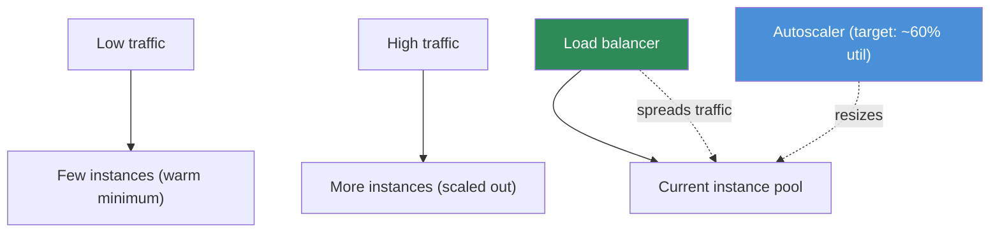

# 17.15 · Autoscaling

[⬅ 17.14 Cloud Cost Optimization](17.14-cost-optimization.md) · [🏠 Module 17](../README.md) · [➡ 17.16 Distributed Systems for AI](17.16-distributed-systems.md)

> **The lesson in one line:** Autoscaling is how a system **matches capacity to demand automatically** — adding instances when traffic rises and removing them when it falls — so you get availability under load *and* low cost when idle. The two axes are **horizontal** (more instances, the default) vs. **vertical** (bigger instances), and a **load balancer** spreads traffic across whatever's currently running. For AI, the twist is that scaling GPU serving is slower and pricier, so warm minimums and predictive scaling matter.

---

## 🎯 Learning objectives

- Distinguish **horizontal vs. vertical scaling** and **autoscaling** vs. manual.
- Understand how **load balancing** and autoscaling cooperate.
- Apply autoscaling to **ML inference, LLM inference, RAG APIs, and agent systems**.

## ✅ Prerequisites

- [17.5 Networking](17.5-networking.md) (load balancers), [17.9 Kubernetes](17.9-kubernetes.md), [17.14 Cost](17.14-cost-optimization.md).

---

## 🧠 Mental model

> [!IMPORTANT]
> **Autoscaling turns "guess your peak and pay for it always" into "let the system follow demand."** You define a target (e.g. "keep CPU/GPU utilization near 60%" or "N requests per instance") and the autoscaler continuously adds or removes capacity to hold it — a control loop over capacity, just like Kubernetes is a control loop over state ([17.9](17.9-kubernetes.md)). There are two directions to grow: **horizontal** (add more identical instances — the cloud-native default, since a load balancer can spread work across them) and **vertical** (replace an instance with a bigger one — limited, disruptive, but sometimes the only option for a single large model). The autoscaler and the **load balancer** are partners: the LB spreads traffic across the current pool, and the autoscaler resizes the pool. For AI serving the catch is timing — a new **GPU** replica takes longer and costs more to spin up, so you keep a **warm minimum** and scale ahead of demand.



## 🔍 Internal explanation

### Horizontal vs. vertical

| | **Horizontal (scale out/in)** | **Vertical (scale up/down)** |
|---|---|---|
| Change | add/remove instances | resize an instance (more CPU/RAM/GPU) |
| Limit | very high (add many) | capped by the biggest instance |
| Disruption | none (new instances join) | usually a restart |
| LB needed | yes (spread across many) | no |
| AI use | **default** for stateless serving | a single model too big for current instance |

> [!IMPORTANT]
> **Horizontal is the default because stateless services scale out cleanly behind a load balancer.** If your model server holds no per-request state (each request is independent — true for most inference), you can run 3 or 300 identical replicas and the LB spreads traffic across them; add replicas for more load, remove them when it drops. **Vertical scaling** is a fallback for when a *single* unit must be bigger (a model that needs a larger GPU) — but it has a ceiling and usually requires downtime. Design stateless so you can scale horizontally.

### The autoscaler as a control loop

An autoscaler watches a **metric** (CPU/GPU utilization, request rate, queue depth, or a custom AI metric like tokens/sec) and compares it to a **target**. Above target → add capacity; below → remove. Key parameters:
- **Min / max** — the floor (a **warm minimum** to avoid cold starts) and ceiling (cost/safety cap).
- **Target utilization** — the setpoint (e.g. 60%); lower = more headroom (costlier), higher = tighter (riskier).
- **Cooldowns / stabilization** — prevent thrashing (rapid scale up/down flapping).

On Kubernetes this is the **Horizontal Pod Autoscaler** (scales pods) plus a **cluster autoscaler** (scales nodes, including GPU node pools) — together they add pods *and* the machines to run them ([17.9](17.9-kubernetes.md)).

### Load balancing + autoscaling together

The **load balancer** ([17.5](17.5-networking.md)) is what makes horizontal scaling usable: it health-checks the pool and distributes requests across healthy instances. When the autoscaler adds a replica, the LB starts routing to it (once its readiness probe passes); when it removes one, the LB drains and stops routing. **Neither works alone** — autoscaling without an LB has nowhere to send the new capacity; an LB without autoscaling can't grow the pool.

### AI-specific autoscaling

> [!IMPORTANT]
> **Scaling GPU inference is slower and costlier than scaling CPU web servers — so plan for the lag.** A new GPU replica must be scheduled onto a GPU node (maybe a *new* node the cluster autoscaler provisions), pull a large image, and load model weights into VRAM — seconds to minutes. Meanwhile requests queue. Mitigations: **warm minimum** (never scale GPU serving fully to zero if latency-sensitive), **lean images + fast weight loading** ([17.8](17.8-containers.md)), **predictive/scheduled scaling** (scale up before a known peak), and **queue-based backpressure** so bursts don't drop requests ([17.16](17.16-distributed-systems.md)).

| Workload | Autoscaling approach |
|---|---|
| **ML inference** (CPU) | horizontal HPA on CPU/request rate; can scale to zero if latency-tolerant |
| **LLM inference** (GPU) | horizontal on GPU util / queue depth; **warm minimum**; scale nodes via cluster autoscaler |
| **RAG API** | scale the stateless app tier horizontally; vector DB scales separately ([17.7](17.7-databases.md)) |
| **Agent systems** | scale workers on queue depth; cap concurrency (agents are long-running, [17.16](17.16-distributed-systems.md)) |

## 🛠️ Practical implementation

```yaml
# Horizontal Pod Autoscaler for GPU serving — warm minimum + headroom
apiVersion: autoscaling/v2
kind: HorizontalPodAutoscaler
metadata: { name: llm-api }
spec:
  scaleTargetRef: { apiVersion: apps/v1, kind: Deployment, name: llm-api }
  minReplicas: 2                 # warm minimum — avoid cold starts on GPU (17.4)
  maxReplicas: 20                # cost/safety ceiling (17.14)
  metrics:
    - type: Resource
      resource: { name: nvidia_gpu_util, target: { type: Utilization, averageUtilization: 60 } }
  behavior:
    scaleUp:   { stabilizationWindowSeconds: 30 }   # react fast to bursts
    scaleDown: { stabilizationWindowSeconds: 300 }  # scale down slowly (avoid thrash)
# Pair with a cluster autoscaler on the GPU node pool so new pods get nodes.
```

```text
Tuning checklist:
  min = warm floor (latency SLA) · max = cost ceiling
  target util = headroom vs. cost trade-off
  scale-up fast, scale-down slow (anti-thrash)
  GPU: expect provisioning lag → predictive/scheduled scaling for known peaks
  always front with a load balancer + readiness probes
```

## 🏭 Production examples

| System | Autoscaling |
|---|---|
| Daytime-peak LLM chat | HPA on GPU util + scheduled scale-up before peak; warm min 2 |
| Spiky ML inference | HPA on request rate; scale to zero overnight (latency-tolerant) |
| RAG API | app tier horizontal; cache absorbs repeat load ([17.7](17.7-databases.md)) |
| Batch/agent workers | scale on queue depth; drain to zero when the queue empties |

## ⚡ Performance considerations

- **Warm minimum vs. cold start** — the core AI serving trade-off; size the floor to your latency SLA.
- **Readiness probes gate traffic** — a scaling-up model server shouldn't get requests until weights are loaded ([17.9](17.9-kubernetes.md)).
- **Scale-up fast, scale-down slow** — reacting quickly to bursts but conservatively to dips prevents thrash and dropped capacity.
- **Metric choice matters** — GPU util or queue depth reflects LLM load better than CPU.

## 💲 Cost considerations

> [!IMPORTANT]
> **Autoscaling is the primary mechanism that makes AI serving affordable — it's how you *avoid paying for peak capacity 24/7*.** Scale down (toward a warm minimum, or zero for tolerant workloads) reclaims idle GPU cost — the single biggest lever from [17.14](17.14-cost-optimization.md). But a too-low target utilization over-provisions (costly), and a GPU node pool that never scales *down* is the classic idle-GPU leak. Tune min/max/target to your traffic and SLA.

## 🔒 Security considerations

- **Autoscaling as DDoS amplifier** — an attack can drive scale-up and cost; pair with rate limiting ([17.13](17.13-security.md)) and a `max` ceiling.
- **New instances inherit config/secrets correctly** — ensure scaled-up pods get the same least-privilege roles and vaulted secrets ([17.13](17.13-security.md)).

## 🚫 Common mistakes

| Mistake | Consequence |
|---|---|
| Scaling GPU serving fully to zero with a tight SLA | cold-start latency spikes |
| No warm minimum | first requests after idle are slow |
| No `max` ceiling | runaway cost/DDoS amplification |
| Scaling on CPU for a GPU workload | wrong signal; mis-scales |
| No readiness probe | traffic hits un-ready replicas |
| Scale-down as fast as scale-up | thrashing, dropped capacity |

## 🐛 Debugging workflow

Scaling incident — **"application becomes slow" under load**: (1) **Is it scaling at all?** Check the autoscaler metric and whether replicas increased — wrong/missing metric is common. (2) **Scaled but still slow?** GPU provisioning lag — requests queued while new replicas loaded weights; add warm minimum / predictive scaling. (3) **Hit the max?** Ceiling too low for the load — raise it (mind cost). (4) **Thrashing?** Scale-down too aggressive — lengthen the stabilization window. (5) **New replicas not getting traffic?** Readiness probe failing or LB not registering them ([17.5](17.5-networking.md)). (6) **Downstream bottleneck?** The DB/vector store, not the app — scaling the app won't help ([17.7](17.7-databases.md)).

## 🏋️ Exercises

1. **Conceptual.** Compare horizontal vs. vertical scaling; why is horizontal the default?
2. **Cooperation.** Explain how the load balancer and autoscaler depend on each other.
3. **Config.** Write an HPA for GPU serving with a warm minimum, ceiling, and target utilization; justify each.
4. **AI twist.** Explain why GPU serving scales slower than CPU serving and three mitigations.
5. **Incident.** "App becomes slow under a traffic spike despite autoscaling" — diagnose in order.
6. **Cost.** Show how a warm minimum trades cost for latency and how you'd size it.

## 🛠️ Mini project — "Autoscaling for AI serving"

**Goal:** an autoscaling design for an LLM+RAG API that stays fast under bursts and cheap when idle.

**Requirements:** horizontal autoscaling on a GPU-appropriate metric (GPU util or queue depth) with a warm minimum, a max ceiling, and anti-thrash scale-down; a load balancer with readiness probes; a cluster autoscaler for the GPU node pool; predictive/scheduled scale-up for a known daily peak; queue-based backpressure for bursts ([17.16](17.16-distributed-systems.md)); and a documented cost↔latency trade-off for the warm minimum.
**Deliverable:** the autoscaling spec, the LB/probe config, and the traffic-vs-capacity diagram.
**Extension:** add rate limiting + max ceiling to bound DDoS-driven cost ([17.13](17.13-security.md)).

## 📄 Cheat sheet

| Concept | Essence |
|---|---|
| **Horizontal** | add/remove instances — the **default** (needs LB) |
| **Vertical** | resize an instance — capped, disruptive; fallback |
| **Autoscaler** | control loop: hold a metric at a target (min/max/target) |
| **Load balancer** | spreads traffic across the current pool (partners with autoscaler) |
| **Warm minimum** | floor of running replicas to avoid cold starts |
| **⭐ AI twist** | GPU scale-up is slow/costly → warm min + predictive + backpressure |
| **⭐ Rule** | scale-up fast, scale-down slow; front with LB + readiness probes |
| **⚠️** | no max ceiling; CPU metric for GPU load; full scale-to-zero on tight SLA |

## 🎴 Flashcards

- **Horizontal vs. vertical scaling?** → Horizontal adds/removes identical instances (default, unlimited, needs an LB); vertical resizes one instance (capped, disruptive, fallback for a single big unit).
- **⭐ Why is horizontal the default?** → Stateless services scale out cleanly behind a load balancer — run 3 or 300 replicas and the LB spreads traffic.
- **How do the load balancer and autoscaler cooperate?** → The autoscaler resizes the instance pool; the LB spreads traffic across the current healthy pool and drains removed instances.
- **What does an autoscaler control?** → It holds a metric (utilization, request rate, queue depth) at a target by adding/removing capacity within min/max bounds.
- **⭐ Why is GPU serving harder to autoscale?** → New GPU replicas need node scheduling, large image pulls, and weight loading into VRAM — slow and costly; mitigate with warm minimums and predictive scaling.
- **What is a warm minimum and why keep one?** → A floor of always-running replicas so latency-sensitive requests don't hit cold starts.
- **Why scale up fast but down slow?** → To absorb bursts immediately but avoid thrashing/dropping capacity on brief dips.
- **How is autoscaling the main AI cost lever?** → It avoids paying for peak capacity 24/7 by scaling down (toward a warm min or zero) when idle.
- **Autoscaling security risk?** → An attack can drive scale-up and cost; bound it with rate limiting and a max ceiling.

## 💬 Interview questions

1. Compare horizontal and vertical scaling and when you'd use each.
2. How do load balancing and autoscaling work together?
3. What metrics would you autoscale an LLM serving deployment on, and why not CPU?
4. Why is autoscaling GPU inference harder, and how do you mitigate the lag?
5. Diagnose "the app is slow under load despite autoscaling."
6. How does autoscaling control cost, and what's the trade-off with latency?

## 📝 Summary

- **Autoscaling matches capacity to demand automatically** — a control loop that holds a metric (utilization, request rate, queue depth) at a target within min/max bounds, giving availability under load and low cost when idle.
- **Horizontal** (add identical instances) is the cloud-native default for stateless serving and depends on a **load balancer** to spread traffic; **vertical** (bigger instance) is a capped, disruptive fallback.
- For AI, **GPU serving scales slower and costs more**, so keep a **warm minimum**, use lean images/fast weight loading, add **predictive/scheduled scaling and queue backpressure**, and scale **up fast, down slow**.
- Autoscaling is the **primary cost lever** ([17.14](17.14-cost-optimization.md)) — but needs a **max ceiling and rate limiting** to bound runaway/DDoS cost; the next lesson, [17.16](17.16-distributed-systems.md), covers the queues and async patterns that make bursty AI load survivable.

## 📚 References

1. **Kubernetes HPA & cluster-autoscaler docs.** The pod + node autoscaling pair.
2. **[17.5 Networking](17.5-networking.md).** Load balancers and health checks.
3. **[17.14 Cost Optimization](17.14-cost-optimization.md).** Scale-to-zero and warm minimums as cost levers.
4. **[17.16 Distributed Systems for AI](17.16-distributed-systems.md).** Queues and backpressure for bursts.

---

## 🧭 Navigation

| Direction | Link |
|---|---|
| ⬅ Previous | [17.14 · Cloud Cost Optimization](17.14-cost-optimization.md) |
| ➡ Next | [17.16 · Distributed Systems for AI](17.16-distributed-systems.md) |
| 🏠 Module | [Module 17](../README.md) |
| 📖 Lessons | [Lesson index](README.md) |
