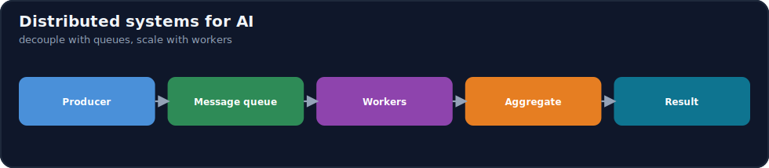
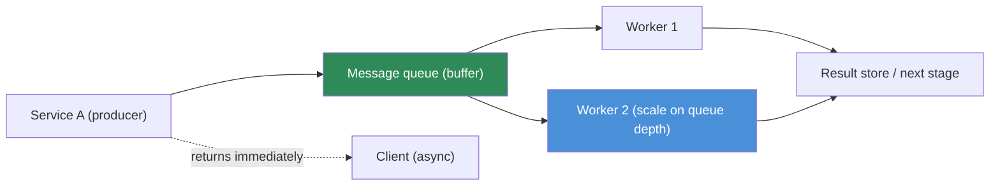

# 17.16 · Distributed Systems for AI ⭐

[⬅ 17.15 Autoscaling](17.15-autoscaling.md) · [🏠 Module 17](../README.md) · [➡ 17.17 Cloud Deployment](17.17-deployment.md)

> **The lesson in one line:** Once an AI system outgrows one machine, it becomes a **distributed system** — many services coordinating over the network — and the patterns that make that reliable are **message queues, event-driven architecture, asynchronous processing, and distributed training**. The core move is **decoupling**: instead of Service A calling Service B directly and waiting, A drops a message on a queue and B picks it up when ready — absorbing bursts, surviving failures, and scaling each part independently.



---

## 🎯 Learning objectives

- Understand **distributed computing, message queues, event-driven systems, async processing, and distributed training**.
- Apply these to **data pipelines, training, inference, RAG ingestion, and agents**.
- Trace **Service A → Queue → Service B → Worker → Result**.

## ✅ Prerequisites

- [17.10 Serverless](17.10-serverless.md) (events), [17.15 Autoscaling](17.15-autoscaling.md), [17.4 GPU Infrastructure](17.4-gpu-infrastructure.md) (distributed training).

---

## 🧠 Mental model

> [!IMPORTANT]
> **A distributed system replaces "call and wait" with "hand off and continue" — and a message queue is the shock absorber that makes it work.** When Service A calls Service B directly (synchronously), A is *blocked* until B answers, and if B is down or slow, A fails or stalls — failures cascade. Instead, A puts a **message** on a **queue** and moves on; B (a **worker**) pulls messages when it has capacity and processes them at its own pace. This **decoupling** buys four things: **burst absorption** (the queue holds a spike so B isn't overwhelmed), **fault tolerance** (if B crashes, messages wait; another worker takes over), **independent scaling** (scale B's workers on queue depth without touching A, [17.15](17.15-autoscaling.md)), and **async responsiveness** (A returns immediately, the slow work happens in the background). This is the backbone of every AI system that does heavy or bursty work — embedding pipelines, batch inference, agent task execution.



## 🔍 Internal explanation

### Synchronous vs. asynchronous

| | **Synchronous (call & wait)** | **Asynchronous (queue & continue)** |
|---|---|---|
| Coupling | tight (A waits for B) | loose (A hands off) |
| Failure | cascades (B down → A fails) | isolated (messages wait) |
| Bursts | overwhelm B | buffered by the queue |
| Latency to caller | full processing time | immediate ack; work in background |
| AI fit | fast inference in the request path | heavy/bursty/long work (embedding, batch, agents) |

Use **sync** for fast, must-answer-now calls (a quick inference behind an API). Use **async** for anything **slow, heavy, bursty, or best-effort** — which is most of AI's back-end work.

### Message queues and workers

A **message queue** is a durable buffer between producers and consumers. Producers **enqueue** messages; **workers** dequeue and process them, then acknowledge (so a message isn't lost if a worker crashes mid-process — it's redelivered). Key properties:
- **Durability** — messages survive until processed (no lost work on a crash).
- **Backpressure** — the queue absorbs bursts; workers drain at a sustainable rate ([17.15](17.15-autoscaling.md)).
- **Retries + dead-letter** — failed messages retry, then move to a dead-letter queue for inspection (don't poison the pipeline).
- **Scaling signal** — queue depth is the ideal autoscaling metric for workers.

### Event-driven architecture

**Event-driven** systems communicate by emitting and reacting to **events** rather than direct calls: "document uploaded" → embed it; "embedding done" → index it; "index updated" → notify. Producers don't know who consumes; consumers subscribe to what they care about. This maximizes decoupling and composes naturally with serverless functions ([17.10](17.10-serverless.md)) and queues. It's how you build pipelines that are resilient and independently evolvable.

### Distributed training — the compute-parallel case

> [!IMPORTANT]
> **Distributed training is distributed computing applied to the GPU: split the work across many GPUs/nodes because one can't hold the model or would take too long.** Two axes ([17.4](17.4-gpu-infrastructure.md)): **data parallelism** (each GPU has a full model copy, processes different batches, and they synchronize gradients each step) and **model/tensor parallelism** (the model itself is split across GPUs because it doesn't fit on one). The catch is that **the network between nodes becomes the bottleneck** — synchronizing gradients every step moves huge amounts of data, so fast interconnects (NVLink intra-node, high-bandwidth network inter-node) and frameworks (DDP/FSDP/DeepSpeed) that overlap communication with computation are essential. Distributed training trades single-GPU simplicity for scale, and the coordination overhead is real.

### Applying distributed patterns across AI

| Subsystem | Pattern |
|---|---|
| **Data pipelines** | event-driven stages + queues between them (ingest → clean → transform) |
| **Training** | distributed (data/model parallel) across GPU nodes ([17.4](17.4-gpu-infrastructure.md)) |
| **Inference** | async queue for long/batch jobs; sync for fast request-path inference |
| **RAG ingestion** | event on upload → queue → embedding workers → vector DB ([17.7](17.7-databases.md)) |
| **AI agents** | task queue; workers run long agent loops; results collected async ([14.7](../../14-AI-Agents/weeks/14.7-agent-loops.md)) |

## 🛠️ Practical implementation

```python
# Async RAG ingestion — decouple upload from the heavy embedding work
def on_upload(doc_id):                      # producer: fast, returns immediately
    queue.enqueue({"doc_id": doc_id})       # hand off; don't block the user
    return {"status": "queued"}             # client gets an instant response

def embedding_worker():                     # consumer: scales on queue depth (17.15)
    while (msg := queue.dequeue()):         # pull at a sustainable rate (backpressure)
        try:
            doc = load(msg["doc_id"])
            vecs = embed(chunk(doc))         # the heavy GPU/API work
            vector_db.upsert(vecs)           # (17.7)
            queue.ack(msg)                   # acknowledge → won't be redelivered
        except Exception:
            queue.retry_or_deadletter(msg)   # retry; park poison messages
# A burst of 10k uploads fills the queue; workers drain it steadily. Nothing is lost,
# nothing is overwhelmed, and you scale workers independently of the upload endpoint.
```

## 🏭 Production examples

| System | Distributed design |
|---|---|
| RAG ingestion at scale | upload events → queue → autoscaled embedding workers → vector DB |
| Batch inference | job queue → GPU workers → results to object storage ([17.6](17.6-storage.md)) |
| Async LLM generation | request → queue → worker generates → notify/store result ([17.10](17.10-serverless.md)) |
| Large model training | data/model-parallel across a GPU cluster (FSDP/DeepSpeed) ([17.4](17.4-gpu-infrastructure.md)) |
| Agent platform | task queue → agent workers (long loops) → aggregated results ([17.11](17.11-ai-architectures.md)) |

## ⚡ Performance considerations

- **Queue depth is the health + scaling signal** — growing depth means workers can't keep up; autoscale them ([17.15](17.15-autoscaling.md)).
- **Distributed training is network-bound** — gradient sync dominates; interconnect and communication-overlap matter more than raw FLOPs ([17.4](17.4-gpu-infrastructure.md)).
- **Batching within workers** — pull N messages and process as a batch to fill the GPU ([16.14](../../16-MLOps/weeks/16.14-model-optimization.md)).
- **Idempotency** — design workers so a redelivered message doesn't double-apply (retries happen).

## 💲 Cost considerations

- **Async lets you use spot/batch cheaply** — queued work tolerates interruption, so workers can run on spot GPUs ([17.14](17.14-cost-optimization.md)).
- **Scale workers to zero when the queue is empty** — no idle GPU cost between bursts ([17.15](17.15-autoscaling.md)).
- **Distributed training coordination has overhead** — more nodes ≠ linear speedup; measure efficiency, don't over-scale.

## 🔒 Security considerations

- **Queue access control** — least-privilege on who can enqueue/dequeue ([17.13](17.13-security.md)).
- **Validate message contents** — messages can carry untrusted input; validate before processing.
- **Dead-letter monitoring** — a filling dead-letter queue can indicate an attack or a poison-message bug.
- **Encrypt messages in transit and at rest** if they carry sensitive data.

## 🚫 Common mistakes

| Mistake | Consequence |
|---|---|
| Synchronous calls for heavy/bursty work | cascading failures, timeouts under load |
| No queue backpressure | a spike overwhelms workers / drops requests |
| Non-idempotent workers | retries double-apply (duplicate writes) |
| No dead-letter queue | one poison message stalls the pipeline |
| Over-scaling distributed training | sub-linear speedup, wasted GPUs |
| Ignoring queue depth as a metric | blind to backlog until it's a crisis |

## 🐛 Debugging workflow

Distributed incident: (1) **Backlog growing / slow results.** → Queue depth rising: workers under-scaled or stuck — autoscale on depth, check worker health ([17.15](17.15-autoscaling.md)). (2) **Duplicate results.** → Non-idempotent worker + retries — make processing idempotent. (3) **Messages disappearing.** → Not acking correctly, or landing in dead-letter — inspect the DLQ. (4) **Distributed training slow/hanging.** → Network bottleneck or a stuck rank — check interconnect bandwidth and NCCL ([17.4](17.4-gpu-infrastructure.md)). (5) **Cascading failure under load.** → A synchronous hop should be async — introduce a queue.

## 🏋️ Exercises

1. **Conceptual.** Contrast sync vs. async and list the four benefits a queue provides.
2. **Design.** Turn a synchronous "upload → embed → index" flow into an event-driven, queued pipeline.
3. **Idempotency.** Show how a redelivered message could double-write and how to prevent it.
4. **Distributed training.** Explain data vs. model parallelism and why the network is the bottleneck.
5. **Scaling.** Explain why queue depth is the right autoscaling signal for workers.
6. **Incident.** "Results are delayed and the backlog is growing" — diagnose and fix.

## 🛠️ Mini project — "Distributed AI processing pipeline"

**Goal:** a resilient, queue-based pipeline for a heavy AI workload (e.g. bulk embedding or batch inference).

**Requirements:** a producer that enqueues work and returns immediately; a durable queue with retries + a dead-letter queue; **idempotent** workers that batch messages and process on GPU/API; worker autoscaling on **queue depth** with scale-to-zero when empty; results written to a store; least-privilege queue access and message validation. Show how a 10k-item burst is absorbed without loss or overload.
**Folder structure**
```
pipeline/
├── producer.py     # enqueue + instant ack
├── worker.py       # idempotent, batched, ack/retry/DLQ
├── scaling.md      # autoscale on queue depth + scale-to-zero
└── architecture.md # event flow + failure handling
```
**Testing:** kill a worker mid-process → message redelivered, no loss; burst test → queue absorbs it.
**Security:** least-privilege queue IAM, message validation ([17.13](17.13-security.md)). **Monitoring:** queue depth, DLQ size, worker health ([17.19](17.19-observability.md)).
**Cost:** spot workers + scale-to-zero ([17.14](17.14-cost-optimization.md)). **Future:** multi-stage event-driven pipeline.

## 📄 Cheat sheet

| Concept | Essence |
|---|---|
| **Distributed system** | many services coordinating over the network |
| **Message queue** | durable buffer; decouples producer from worker |
| **⭐ Decoupling benefits** | burst absorption · fault tolerance · independent scaling · async |
| **Async processing** | hand off heavy/bursty work; return immediately |
| **Event-driven** | components react to events, not direct calls |
| **Distributed training** | data-parallel / model-parallel across GPUs; **network-bound** |
| **Idempotency** | safe re-processing (retries happen) |
| **⭐ Scaling signal** | queue depth → autoscale workers ([17.15](17.15-autoscaling.md)) |
| **⚠️** | sync for heavy work; non-idempotent workers; no DLQ |

## 🎴 Flashcards

- **⭐ What does a message queue buy you over a direct synchronous call?** → Decoupling: burst absorption, fault tolerance (messages wait if a worker dies), independent scaling, and async responsiveness (caller returns immediately).
- **When sync vs. async?** → Sync for fast must-answer-now calls (request-path inference); async for slow/heavy/bursty/best-effort work (embedding, batch, agents).
- **What is backpressure?** → The queue absorbing a burst so workers process at a sustainable rate instead of being overwhelmed.
- **⭐ Why is queue depth the ideal worker autoscaling metric?** → It directly measures backlog — rising depth means workers can't keep up, so scale them out (and to zero when empty).
- **What is idempotency and why does it matter here?** → Processing a message safely even if redelivered; queues retry on failure, so non-idempotent workers double-apply.
- **What is a dead-letter queue?** → Where messages that repeatedly fail are parked, so one poison message doesn't stall the pipeline.
- **Data vs. model parallelism?** → Data: each GPU has a full model copy on different batches, syncing gradients; model: the model is split across GPUs because it doesn't fit on one.
- **⭐ Why is distributed training network-bound?** → Gradient synchronization every step moves huge data between nodes, so interconnect bandwidth (not raw FLOPs) often limits it.
- **How does async enable cheaper compute?** → Queued work tolerates interruption, so workers can run on cheap spot GPUs and scale to zero between bursts.

## 💬 Interview questions

1. Why decouple services with a queue instead of calling synchronously? What does it buy you?
2. When is synchronous vs. asynchronous processing appropriate in an AI system?
3. What is backpressure, and how does queue depth drive worker autoscaling?
4. Why must queue workers be idempotent, and how do you achieve it?
5. Explain data vs. model parallelism and why distributed training is network-bound.
6. Design a resilient bulk-embedding pipeline and its failure handling.

## 📝 Summary

- Beyond one machine, AI systems are **distributed systems**, and the key move is **decoupling** via **message queues**: producers hand off work, **workers** process it at their own pace — buying burst absorption, fault tolerance, independent scaling, and async responsiveness.
- Use **synchronous** calls for fast request-path inference and **asynchronous** queues/events for **heavy, bursty, long, or best-effort** work — most of AI's back-end (embedding, batch inference, agent tasks).
- Make workers **idempotent**, add **retries + dead-letter queues**, and autoscale on **queue depth** (scaling to zero when empty for cost).
- **Distributed training** is the compute-parallel case — **data/model parallelism across GPUs**, bottlenecked by the **network** — trading single-GPU simplicity for scale ([17.4](17.4-gpu-infrastructure.md)); these patterns underpin the deployment and reliability lessons that follow.

## 📚 References

1. **Message-queue / streaming docs (SQS, Pub/Sub, Kafka, etc.).** The queue primitives.
2. **[17.4 GPU Infrastructure](17.4-gpu-infrastructure.md).** Multi-GPU and distributed training.
3. **PyTorch DDP/FSDP & DeepSpeed docs.** Distributed-training frameworks.
4. **Designing Data-Intensive Applications (Kleppmann).** ⭐ The distributed-systems foundations.

---

## 🧭 Navigation

| Direction | Link |
|---|---|
| ⬅ Previous | [17.15 · Autoscaling](17.15-autoscaling.md) |
| ➡ Next | [17.17 · Cloud Deployment](17.17-deployment.md) |
| 🏠 Module | [Module 17](../README.md) |
| 📖 Lessons | [Lesson index](README.md) |
