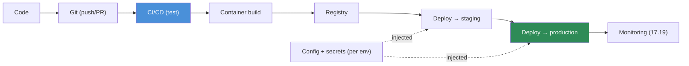

# 17.17 · Cloud Deployment ✅

[⬅ 17.16 Distributed Systems for AI](17.16-distributed-systems.md) · [🏠 Module 17](../README.md) · [➡ 17.18 Infrastructure as Code](17.18-iac.md)

> **The lesson in one line:** Cloud deployment is the **automated path from a git commit to running code in production** — Code → Git → CI/CD → container build → registry → cloud deploy → monitoring — with **configuration, secrets, and environments (staging vs. production)** managed so the same artifact promotes cleanly and safely. Manual deployment doesn't scale and isn't reproducible; a pipeline does.

---

## 🎯 Learning objectives

- Build a complete **CI/CD deployment workflow** for a cloud AI service.
- Manage **environment variables, secrets, configuration, staging, and production**.
- Understand safe promotion from staging to production.

## ✅ Prerequisites

- [17.8 Containers](17.8-containers.md), [17.9 Kubernetes](17.9-kubernetes.md), [17.13 Security](17.13-security.md). Echoes [16.7 CI/CD](../../16-MLOps/weeks/16.7-cicd.md).

---

## 🧠 Mental model

> [!IMPORTANT]
> **Deployment should be a pipeline, not a person.** Every change flows through the same automated path: you push **code** to **git**, which triggers **CI/CD** to test it, **build a container image**, push it to a **registry**, and **deploy** it to the cloud, after which you **monitor** it. The same **immutable image** ([17.8](17.8-containers.md)) is promoted through **environments** — first **staging** (a production-like proving ground) then **production** — with **configuration and secrets injected per-environment** so the artifact itself never changes, only its wiring. This makes deployment **reproducible, reviewable, fast, and safe to roll back** — the opposite of hand-copying files onto a server.



## 🔍 Internal explanation

### The pipeline stages

| Stage | What happens | AI note |
|---|---|---|
| **Code → Git** | change committed, PR opened | version control is the trigger |
| **CI (test)** | lint, unit/integration tests, **model/prompt evals** | test data/models/prompts, not just code ([16.7](../../16-MLOps/weeks/16.7-cicd.md)) |
| **Build** | build the container image | pinned deps → reproducible ([17.8](17.8-containers.md)) |
| **Registry** | push the tagged image | the artifact that gets promoted |
| **Deploy → staging** | run the image in a prod-like env | validate before users see it |
| **Deploy → production** | promote the *same* image | canary/blue-green for safety ([16.13](../../16-MLOps/weeks/16.13-deployment-strategies.md)) |
| **Monitor** | watch health, latency, cost, quality | close the loop ([17.19](17.19-observability.md)) |

### Configuration, secrets, and environments

> [!IMPORTANT]
> **The same image runs everywhere; only its configuration and secrets change per environment.** This is the "build once, deploy many" principle. **Environment variables and config** (model name, endpoints, feature flags) come from per-environment ConfigMaps/config; **secrets** (API keys, DB creds) come from a secrets manager, injected at runtime, *never baked into the image* ([17.13](17.13-security.md), [17.8](17.8-containers.md)). **Staging** mirrors production (same image, same infra shape, non-prod data/config) so you catch problems before real users do; **production** gets the promoted artifact only after staging passes. Keeping the artifact identical across environments is what makes "it worked in staging" actually mean something.

### Safe promotion

Promotion to production shouldn't be all-or-nothing. Combine with **deployment strategies** ([16.13](../../16-MLOps/weeks/16.13-deployment-strategies.md)): **canary** (a small % of traffic to the new version, promote on good metrics), **blue-green** (stand up the new version alongside, switch traffic, instant rollback), or **rolling** (replace instances gradually). The pipeline makes **rollback** a one-click re-deploy of the previous image — critical because AI can fail quietly ([16.1](../../16-MLOps/weeks/16.1-what-is-mlops.md)).

## 🛠️ Practical implementation

```yaml
# CI/CD pipeline (conceptual) — commit to production, one automated path
on: [push, pull_request]
jobs:
  test:                                   # 1. CI: gate the change
    steps: [lint, unit-tests, model-evals]   #    test code AND model/prompt quality (16.7)
  build:                                  # 2. build the immutable artifact
    needs: test
    steps:
      - docker build -t $REGISTRY/llm-api:$GIT_SHA .   # tag by commit → traceable
      - docker push $REGISTRY/llm-api:$GIT_SHA
  deploy-staging:                         # 3. promote to staging (prod-like)
    needs: build
    steps: [ kubectl set image ... :$GIT_SHA -n staging, smoke-tests ]
  deploy-prod:                            # 4. promote the SAME image to prod
    needs: deploy-staging
    when: manual-approval                 #    gated; canary rollout (16.13)
    steps: [ canary 5% → watch metrics → full rollout, or rollback ]
# Config/secrets are injected per-namespace; the image never changes between envs.
```

## 🏭 Production examples

| System | Deployment flow |
|---|---|
| LLM API | PR → tests + evals → image → staging → canary prod → monitor |
| RAG service | same pipeline; eval gate checks retrieval quality ([16.12](../../16-MLOps/weeks/16.12-llm-evaluation.md)) |
| Batch job | image built + pushed; deployed as a scheduled Job ([17.9](17.9-kubernetes.md)) |
| Model update | new model version → eval gate → canary → rollback if metrics drop |

## ⚡ Performance considerations

- **Fast pipelines encourage small, safe changes** — cache builds, parallelize tests.
- **Lean images deploy faster** ([17.8](17.8-containers.md)) — matters for canary/rollback speed.
- **Smoke tests in staging** catch gross regressions before production.

## 💲 Cost considerations

- **Staging costs money** — right-size it (smaller than prod) but keep it representative.
- **Automated rollback prevents costly incidents** — a bad deploy caught in canary is cheap.
- **Ephemeral preview environments** can be spun up per-PR and torn down ([17.18](17.18-iac.md)).

## 🔒 Security considerations

> [!CAUTION]
> - **Secrets injected at deploy time from a manager** — never in the image, repo, or CI logs ([17.13](17.13-security.md)).
> - **Least-privilege CI/CD credentials** — the pipeline's deploy role should be scoped, not admin.
> - **Scan images in CI** ([17.8](17.8-containers.md)); sign artifacts to prevent tampering.
> - **Protected branches + review** — production deploys gated by approval.

## 🚫 Common mistakes

| Mistake | Consequence |
|---|---|
| Manual deployment | unreproducible, error-prone, slow |
| Rebuilding a different image per environment | "worked in staging" means nothing |
| Secrets in CI config/logs | leaked credentials ([17.13](17.13-security.md)) |
| No staging / no smoke tests | regressions hit users directly |
| No canary/rollback plan | a bad deploy is a full outage ([16.13](../../16-MLOps/weeks/16.13-deployment-strategies.md)) |
| Testing only code, not models/prompts | quality regressions ship green ([16.7](../../16-MLOps/weeks/16.7-cicd.md)) |

## 🐛 Debugging workflow

Deployment incident — **"model deployment fails"**: (1) **Which stage failed?** Build (dep/image issue), deploy (config/secret/resource), or runtime (crash) — read the pipeline logs. (2) **Works in staging, fails in prod?** Config/secret difference or a resource (GPU) gap — the image is the same, so it's the wiring ([17.13](17.13-security.md)). (3) **Pod won't start.** → CrashLoopBackOff diagnosis ([17.9](17.9-kubernetes.md)) — missing secret, wrong command, OOM. (4) **Deployed but metrics dropped.** → Canary should have caught it; roll back to the previous image, then investigate. (5) **Rollback needed.** → Re-deploy the last-good image tag (that's why you tag by commit).

## 🏋️ Exercises

1. **Conceptual.** Draw the Code → Git → CI/CD → build → registry → deploy → monitor flow.
2. **Build.** Write a CI/CD pipeline that tests, builds a commit-tagged image, and promotes staging → prod.
3. **Config/secrets.** Show how the same image gets different config/secrets per environment.
4. **Promotion.** Add a canary step with metric-based promotion and rollback.
5. **Incident.** "Deployment succeeds but production errors while staging is fine" — diagnose.

## 🛠️ Mini project — "End-to-end deployment pipeline" ✅

**Goal:** a full CI/CD pipeline deploying an AI service to the cloud.

**Requirements:** git-triggered pipeline that runs tests + model/prompt evals ([16.7](../../16-MLOps/weeks/16.7-cicd.md)), builds a **commit-tagged immutable image**, pushes to a registry, deploys to **staging** with smoke tests, then promotes the **same image** to **production** via a gated **canary** with metric-based rollback; per-environment config + secrets from a manager (none in the repo); least-privilege pipeline credentials; image scanning.
**Folder structure**
```
deploy/
├── .ci/pipeline.yaml   # test → build → staging → prod(canary)
├── k8s/staging/        # env-specific config
├── k8s/prod/
└── rollback.md         # re-deploy last-good tag
```
**Testing:** a green pipeline deploys; a failing eval blocks; a bad canary auto-rolls-back.
**Security:** secrets vaulted, scoped CI role, scanned images ([17.13](17.13-security.md)). **Monitoring:** post-deploy health/latency/cost ([17.19](17.19-observability.md)).
**Future improvements:** ephemeral PR preview envs ([17.18](17.18-iac.md)); progressive delivery (Argo Rollouts).

## 📄 Cheat sheet

| Stage | Essence |
|---|---|
| **Code → Git** | commit/PR triggers the pipeline |
| **CI** | test code **+ models/prompts** (eval gate) |
| **Build → Registry** | immutable, commit-tagged image |
| **Staging** | prod-like; validate before users |
| **Production** | promote the **same image**; canary + rollback |
| **Monitor** | close the loop ([17.19](17.19-observability.md)) |
| **⭐ Rule** | build once, deploy many; config/secrets per env |
| **⚠️** | manual deploys; per-env rebuilds; secrets in CI |

## 🎴 Flashcards

- **⭐ What is the cloud deployment pipeline?** → Code → Git → CI/CD (test) → container build → registry → deploy (staging → production) → monitoring — automated, reproducible, and rollback-able.
- **⭐ What's the "build once, deploy many" principle?** → Promote the same immutable image through environments, injecting per-environment config and secrets — so the artifact never changes, only its wiring.
- **What is staging for?** → A production-like environment to validate a change before real users see it.
- **How does CI/CD for AI differ from plain software?** → It also tests models, prompts, and RAG quality via an eval gate — not just code.
- **How do you promote to production safely?** → Canary (small % first), blue-green (instant switch/rollback), or rolling — with metric-based rollback.
- **Where do secrets come from at deploy time?** → A secrets manager, injected at runtime — never baked into the image or stored in CI config/logs.
- **Why tag images by commit SHA?** → Traceability and one-click rollback — re-deploy the previous known-good tag.
- **First question when a deploy works in staging but fails in prod?** → It's config/secrets/resource wiring, since the image is identical.

## 💬 Interview questions

1. Walk through a CI/CD pipeline from commit to production for an AI service.
2. What does "build once, deploy many" mean and why does it matter?
3. How do you manage config and secrets across environments?
4. How does deploying AI differ from deploying ordinary software?
5. How do you promote to production safely and roll back fast?
6. Diagnose a deployment that passes staging but fails in production.

## 📝 Summary

- Cloud deployment is an **automated pipeline**: **Code → Git → CI/CD → build → registry → staging → production → monitoring** — reproducible, reviewable, and fast to roll back, unlike manual deployment.
- **Build once, deploy many**: the same **immutable, commit-tagged image** is promoted across environments with **config and secrets injected per-environment** (secrets from a manager, never in the image/CI).
- **CI for AI tests models and prompts** (eval gate), not just code; **staging** validates before users, and **production promotion uses canary/blue-green with metric-based rollback** ([16.13](../../16-MLOps/weeks/16.13-deployment-strategies.md)).
- The pipeline is codified further by **Infrastructure as Code** ([17.18](17.18-iac.md)) and closed by **observability** ([17.19](17.19-observability.md)); secure it with scoped CI credentials, vaulted secrets, and image scanning ([17.13](17.13-security.md)).

## 📚 References

1. **[16.7 CI/CD for AI](../../16-MLOps/weeks/16.7-cicd.md).** ⭐ Eval gates and testing data/models/prompts.
2. **[16.13 Deployment Strategies](../../16-MLOps/weeks/16.13-deployment-strategies.md).** Canary, blue-green, rolling, shadow.
3. **[17.8 Containers](17.8-containers.md).** The immutable artifact you promote.
4. **CI/CD platform docs (GitHub Actions, GitLab CI, Argo CD).** Pipeline implementations.

---

## 🧭 Navigation

| Direction | Link |
|---|---|
| ⬅ Previous | [17.16 · Distributed Systems for AI](17.16-distributed-systems.md) |
| ➡ Next | [17.18 · Infrastructure as Code](17.18-iac.md) |
| 🏠 Module | [Module 17](../README.md) |
| 📖 Lessons | [Lesson index](README.md) |
