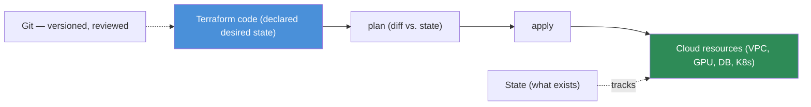

# 17.18 · Infrastructure as Code ✅

[⬅ 17.17 Cloud Deployment](17.17-deployment.md) · [🏠 Module 17](../README.md) · [➡ 17.19 Cloud Observability](17.19-observability.md)

> **The lesson in one line:** Infrastructure as Code (IaC) means your cloud infrastructure — networks, GPU nodes, databases, storage, Kubernetes — is **defined in version-controlled files (Terraform) instead of clicked together in a console**, so it's reproducible, reviewable, and recoverable. You declare the desired infrastructure, Terraform computes the diff and applies it, and **state** tracks what exists; **modules** make it reusable and **environments** (dev/staging/prod) share the same code with different variables.

---

## 🎯 Learning objectives

- Understand **Infrastructure as Code, Terraform, state, modules, and environments**.
- Build a basic infrastructure definition and manage **dev/staging/prod**.
- Apply the reproducibility discipline to infrastructure.

## ✅ Prerequisites

- [17.5 Networking](17.5-networking.md), [17.9 Kubernetes](17.9-kubernetes.md), [17.17 Deployment](17.17-deployment.md). Expands [16.21 IaC](../../16-MLOps/weeks/16.21-iac.md).

---

## 🧠 Mental model

> [!IMPORTANT]
> **The same reproducibility argument you apply to code, data, and models applies to *infrastructure*: if your cloud was clicked together in a console, nobody can reproduce it, review it, or recover it after a disaster.** IaC makes infrastructure a **versioned artifact** — you write files declaring "I want a VPC, a GPU node pool, a database, and a Kubernetes cluster," commit them to git, review them in a PR, and apply them deterministically. **Terraform** is the dominant tool: you declare **desired state**, it reads the current **state**, computes the **diff** (`plan`), and makes reality match (`apply`) — a reconciliation loop, like Kubernetes but for cloud resources. **Modules** package reusable infrastructure (a "GPU serving stack" module), and **environments** (dev/staging/prod) instantiate the same modules with different variables. The payoff mirrors the model registry's: **reproduce, review, roll back — for your entire cloud.**



## 🔍 Internal explanation

### Terraform and the declarative model

You write **declarative** configuration — *what* you want, not *how* to create it — and Terraform figures out the API calls, ordering, and dependencies. The core loop:
- **`plan`** — show the diff between declared config and current reality (a dry run; review this in PRs).
- **`apply`** — make the changes.
- **`destroy`** — tear it all down (great for ephemeral environments — cost saver, [17.14](17.14-cost-optimization.md)).

### State — the source of truth

> [!IMPORTANT]
> **Terraform's *state* is its record of what actually exists, and it's both essential and dangerous.** State maps your config to real cloud resources so Terraform knows what to create, change, or delete. It must be stored **remotely and shared** (in object storage with locking) so a team doesn't corrupt it with concurrent applies — and it often **contains secrets** (like generated passwords), so it must be **encrypted and access-controlled** ([17.13](17.13-security.md)). Never edit state by hand, never commit it to git, and always use remote state with locking for team work. Losing or corrupting state is one of the worst IaC failure modes.

### Modules — reusable infrastructure

A **module** packages a set of resources into a reusable unit with inputs (variables) and outputs — e.g. a `gpu-serving` module that creates a GPU node pool, an autoscaler, and a load balancer, parameterized by GPU type and replica count. Modules turn infrastructure into composable building blocks, so you define "a GPU serving stack" once and instantiate it many times ([16.21](../../16-MLOps/weeks/16.21-iac.md)).

### Environments — dev, staging, production

> [!IMPORTANT]
> **The same Terraform code defines dev, staging, and production — they differ only in variables (size, replica counts, region), not in structure.** This guarantees the environments match (staging is a true rehearsal for prod, [17.17](17.17-deployment.md)) and avoids drift. Each environment has its **own state** (isolated blast radius) and its own variable file (`dev.tfvars`, `prod.tfvars`) setting sizes and counts — dev runs one small GPU node, prod runs an autoscaling pool. This is how you manage many environments without duplicating (and diverging) infrastructure definitions.

## 🛠️ Practical implementation

```hcl
# A reusable module instantiated per environment (conceptual)
module "gpu_serving" {
  source        = "./modules/gpu-serving"    # reusable building block
  gpu_type      = var.gpu_type                # dev: small, prod: A100
  min_replicas  = var.min_replicas            # dev: 1, prod: 2 (warm min, 17.15)
  max_replicas  = var.max_replicas            # dev: 2, prod: 20
  region        = var.region
}
resource "aws_s3_bucket" "artifacts" {         # object storage for models/data (17.6)
  bucket = "${var.env}-model-artifacts"
  versioning { enabled = true }                # (16.3)
}
# dev.tfvars:  gpu_type="t4"   min_replicas=1  max_replicas=2
# prod.tfvars: gpu_type="a100" min_replicas=2  max_replicas=20
```
```bash
terraform plan  -var-file=prod.tfvars    # review the diff (in a PR)
terraform apply -var-file=prod.tfvars    # make it real
terraform destroy -var-file=dev.tfvars   # tear down an ephemeral env (cost saver)
# State lives remotely (object storage + locking), encrypted, never in git.
```

## 🏭 Production examples

| Need | IaC |
|---|---|
| Reproducible GPU serving stack | a `gpu-serving` module + autoscaling ([17.15](17.15-autoscaling.md)) |
| Dev/staging/prod parity | same modules, per-env tfvars |
| Ephemeral PR preview env | `apply` on PR, `destroy` on merge ([17.14](17.14-cost-optimization.md)) |
| Disaster recovery | re-`apply` the whole stack in another region ([17.2](17.2-regions-availability.md)) |
| Reviewable infra changes | Terraform PRs with the `plan` diff |

## ⚡ Performance considerations

- **`destroy` ephemeral GPU environments** — biggest IaC cost/perf hygiene win ([17.14](17.14-cost-optimization.md)).
- **Modules keep infra consistent** — no hand-tuned snowflakes that behave differently.
- **Plan-review catches expensive mistakes** before they're applied.

## 💲 Cost considerations

> [!IMPORTANT]
> **IaC is a major cost lever because it makes infrastructure disposable: `terraform destroy` tears down idle GPU environments, and per-env variables prevent over-provisioning dev/staging.** Ephemeral preview environments spin up for a PR and vanish on merge; dev runs tiny while prod runs full-size — all from the same code. The failure mode is orphaned resources from console clicking that IaC would have tracked and cleaned up ([17.14](17.14-cost-optimization.md)).

## 🔒 Security considerations

> [!CAUTION]
> - **No secrets in IaC files** — reference a secrets manager; IaC is committed to git ([17.13](17.13-security.md)).
> - **State contains secrets** — store it remotely, encrypted, access-controlled; never commit it.
> - **Least-privilege in IaC** — declare minimal IAM roles/security groups; IaC is where least privilege is enforced at scale ([17.13](17.13-security.md)).
> - **IaC is a security review gate** — infra changes (open ports, new roles) get PR review + policy scanning.

## 🚫 Common mistakes

| Mistake | Consequence |
|---|---|
| Console-clicking infrastructure | unreproducible, unreviewable, undeletable-cleanly |
| Secrets hardcoded in IaC | leaked via git ([17.13](17.13-security.md)) |
| Committing / hand-editing state | corruption, leaked secrets |
| Local (non-shared) state on a team | concurrent applies corrupt it |
| Divergent per-env definitions | staging ≠ prod; "worked in staging" lies |
| Not destroying ephemeral envs | wasted GPU cost ([17.14](17.14-cost-optimization.md)) |

## 🐛 Debugging workflow

IaC issue: (1) **Config vs. reality mismatch.** → `terraform plan` shows the diff — that's your root cause. (2) **State drift** (someone clicked in the console). → Reconcile: import the change or re-apply to overwrite; codify to prevent recurrence. (3) **State locked/corrupted.** → Someone's mid-apply or a crashed apply — investigate the lock, never hand-edit. (4) **Apply fails partway.** → Read the error (dependency/permission/quota); fix and re-apply (Terraform is idempotent). (5) **Can't reproduce prod.** → The IaC is incomplete (something was clicked) — find and codify it.

## 🏋️ Exercises

1. **Conceptual.** Explain why infrastructure should be version-controlled and what IaC buys you.
2. **Terraform loop.** Describe plan/apply/destroy and the role of state.
3. **Modules.** Write a reusable `gpu-serving` module and instantiate it for dev and prod.
4. **Environments.** Show how one codebase produces dev/staging/prod via tfvars.
5. **State security.** Explain why state is sensitive and how you store it safely.
6. **Incident.** "Terraform plan shows unexpected changes" (state drift) — diagnose and fix.

## 🛠️ Mini project — "Infrastructure-as-Code AI platform" ✅

**Goal:** define a full cloud AI platform as reusable, multi-environment Terraform.

**Requirements:** modules for the network (VPC + subnets, [17.5](17.5-networking.md)), a Kubernetes cluster with a GPU node pool ([17.9](17.9-kubernetes.md)), object storage + a database ([17.6](17.6-storage.md), [17.7](17.7-databases.md)); dev/staging/prod via per-env tfvars (sizes, replica counts); **remote encrypted state with locking**; **no secrets in files** (reference a manager); least-privilege IAM declared in code; `destroy` for ephemeral envs.
**Folder structure**
```
iac-platform/
├── modules/{network,k8s-gpu,storage,database}/
├── envs/{dev,staging,prod}.tfvars
├── main.tf          # wires modules together
└── backend.tf       # remote state (encrypted, locked)
```
**Testing:** `plan` shows a clean diff; `apply` builds the stack; a fresh `apply` reproduces prod; `destroy` cleans up dev.
**Security:** state encrypted/locked, secrets external, least-privilege IAM ([17.13](17.13-security.md)). **Cost:** `destroy` ephemeral envs, small dev sizes ([17.14](17.14-cost-optimization.md)).
**Future improvements:** policy-as-code (OPA), GitOps (Argo CD), multi-region DR modules.

## 📄 Cheat sheet

| Concept | Essence |
|---|---|
| **IaC** | infrastructure as version-controlled files — reproduce/review/rollback |
| **Terraform** | declare desired state; `plan`/`apply`/`destroy` |
| **State** | record of what exists; remote, encrypted, locked, **never in git** |
| **Modules** | reusable infrastructure building blocks |
| **Environments** | same code, per-env variables (dev/staging/prod) |
| **⭐ Payoff** | reproduce · review · rollback — for your whole cloud |
| **⭐ Cost lever** | `destroy` ephemeral GPU envs; per-env sizing |
| **⚠️** | secrets in files; committed/edited state; console-clicking |

## 🎴 Flashcards

- **⭐ Why use Infrastructure as Code?** → So infrastructure is a version-controlled artifact — reproducible, reviewable (PRs), and recoverable — instead of unreproducible console clicking; the same reproducibility argument as code/data/models.
- **What is the Terraform loop?** → Declare desired state → `plan` (diff vs. state) → `apply` (make it real) → optionally `destroy`.
- **⭐ What is Terraform state and why is it sensitive?** → Its record of what actually exists, mapping config to real resources; it can contain secrets, so it's stored remotely, encrypted, locked, and never committed to git.
- **What are modules for?** → Packaging reusable infrastructure (e.g. a GPU serving stack) with inputs/outputs so you define it once and instantiate many times.
- **⭐ How do you manage dev/staging/prod with IaC?** → The same code with per-environment variable files (sizes, replica counts) and separate state — guaranteeing parity, avoiding drift.
- **Why is IaC a cost lever?** → It makes infrastructure disposable — `terraform destroy` tears down idle GPU environments and per-env sizing avoids over-provisioning.
- **Why never hardcode secrets in IaC?** → IaC is committed to git; reference a secrets manager instead.
- **What is state drift and how do you handle it?** → Reality diverging from code (usually console clicking); `plan` reveals it, then you reconcile by importing or re-applying and codify to prevent it.

## 💬 Interview questions

1. Why version-control infrastructure, and what does IaC provide?
2. Explain Terraform's plan/apply/destroy loop and the role of state.
3. Why is Terraform state sensitive, and how do you manage it safely for a team?
4. How do modules and per-environment variables give you dev/staging/prod parity?
5. How is IaC a cost lever and a security review gate?
6. How do you handle state drift?

## 📝 Summary

- **Infrastructure as Code** makes your cloud a **version-controlled artifact** — reproducible, reviewable, and recoverable — extending the reproducibility discipline from code/data/models to infrastructure.
- **Terraform** declares **desired state** and reconciles reality via `plan`/`apply`/`destroy`; **state** is its (sensitive) record of what exists — stored remotely, encrypted, locked, never in git.
- **Modules** make infrastructure reusable, and **per-environment variables** produce **dev/staging/prod from one codebase** — guaranteeing parity and enabling `destroy`-able ephemeral environments (a major cost lever).
- Secure it with **no secrets in files, protected state, and least-privilege IAM declared in code** — IaC is where least privilege and security review scale ([17.13](17.13-security.md), [17.14](17.14-cost-optimization.md)); next, [17.19](17.19-observability.md) makes the running system observable.

## 📚 References

1. **[16.21 Infrastructure as Code](../../16-MLOps/weeks/16.21-iac.md).** ⭐ Docker/Terraform/K8s/Helm layering.
2. **Terraform documentation.** Language, state, modules, backends.
3. **[17.9 Kubernetes for AI](17.9-kubernetes.md).** The clusters IaC provisions.
4. **OPA / policy-as-code & GitOps (Argo CD) docs.** Governance and declarative delivery.

---

## 🧭 Navigation

| Direction | Link |
|---|---|
| ⬅ Previous | [17.17 · Cloud Deployment](17.17-deployment.md) |
| ➡ Next | [17.19 · Cloud Observability](17.19-observability.md) |
| 🏠 Module | [Module 17](../README.md) |
| 📖 Lessons | [Lesson index](README.md) |
