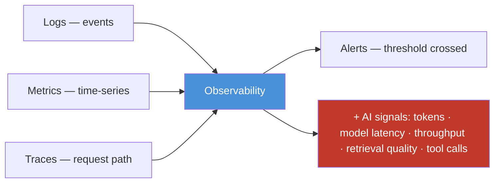

# 17.19 · Cloud Observability

[⬅ 17.18 Infrastructure as Code](17.18-iac.md) · [🏠 Module 17](../README.md) · [➡ 17.20 Cloud Reliability](17.20-reliability.md)

> **The lesson in one line:** Observability is how you **know what a running cloud system is doing** through **logs, metrics, traces, and alerts** — and for AI you monitor the usual infrastructure signals (CPU, GPU, memory, network, latency, errors, cost) *plus* AI-specific ones (tokens, model latency, inference throughput, retrieval quality, agent tool calls), because AI systems **fail quietly** and only instrumentation reveals a wrong-but-not-erroring system.

---

## 🎯 Learning objectives

- Understand **logs, metrics, traces, and alerts**.
- Monitor infrastructure signals (**CPU, GPU, memory, network, latency, errors, cost**).
- Add AI-specific signals (**tokens, model latency, throughput, retrieval quality, agent tool calls**).

## ✅ Prerequisites

- [17.4 GPU Infrastructure](17.4-gpu-infrastructure.md), [17.9 Kubernetes](17.9-kubernetes.md). Expands [16.10 observability](../../16-MLOps/weeks/16.10-observability.md).

---

## 🧠 Mental model

> [!IMPORTANT]
> **You can't operate what you can't see, and AI systems are especially blind spots because they fail *silently*.** Observability rests on three pillars: **logs** (discrete events — "request failed, model loaded"), **metrics** (numeric time-series — CPU%, GPU util, latency, tokens/sec), and **traces** (the path of one request across every service — gateway → app → model → DB). **Alerts** fire when a metric crosses a threshold. For ordinary apps, infra signals suffice. For AI you must add a **second layer** of signals — tokens, model latency, throughput, retrieval quality, agent tool calls — because an AI system can return `200 OK` with a wrong answer, blowing cost or degrading quality with **no error to catch** ([16.1](../../16-MLOps/weeks/16.1-what-is-mlops.md)). Observability is what turns "users say it's bad" into "the p95 model latency doubled at 14:03 on the new deploy."



## 🔍 Internal explanation

### The three pillars + alerts

| Pillar | What | Use |
|---|---|---|
| **Logs** | timestamped discrete events | debugging specific failures |
| **Metrics** | numeric time-series | trends, dashboards, alert thresholds |
| **Traces** | one request across all services | find *which hop* is slow/broken |
| **Alerts** | notify on threshold breach | catch problems before users report |

**Traces are especially vital for AI** because RAG and agents are **multi-step** — a single latency number hides whether the retrieval, the model, or a tool call was slow; a trace localizes it ([16.10](../../16-MLOps/weeks/16.10-observability.md)).

### Infrastructure signals

The baseline every cloud system needs:

| Signal | Why |
|---|---|
| **CPU / memory** | saturation → slow or crashing services |
| **GPU utilization / memory** | the expensive resource — under-fed or OOM ([17.4](17.4-gpu-infrastructure.md)) |
| **Network** | latency, throughput, errors between services |
| **Latency (p50/p95/p99)** | user experience; tail latency matters |
| **Errors / error rate** | failing requests |
| **Cost** | spend trend — catch spikes early ([17.14](17.14-cost-optimization.md)) |

### AI-specific signals

> [!IMPORTANT]
> **AI systems need a second observability layer, because the infra signals can all look healthy while the AI is failing.** Monitor:
> - **Tokens** — per request/user/workflow; the driver of LLM cost and a runaway-detector ([17.14](17.14-cost-optimization.md)).
> - **Model latency** — time-to-first-token and total generation time (distinct from infra latency).
> - **Inference throughput** — tokens/sec, requests/sec; the GPU-efficiency signal ([16.14](../../16-MLOps/weeks/16.14-model-optimization.md)).
> - **Retrieval quality** — for RAG, are retrieved chunks relevant? (quality can rot with no error).
> - **Agent tool calls** — count, success/failure, latency per tool; agents fail in the *trajectory*, not a status code ([14.14](../../14-AI-Agents/weeks/14.14-evaluation.md)).
>
> These are what catch **quiet failures** — a cost blowup, a quality regression, a looping agent — that infra dashboards miss.

### Putting it together

A production AI system emits **structured logs**, exports **metrics** (infra + AI) to a time-series store with **dashboards**, **traces** every request end-to-end (OpenTelemetry + an LLM-tracing tool like Langfuse/Phoenix, [16.10](../../16-MLOps/weeks/16.10-observability.md)), and **alerts** on the signals that matter (error rate, p95 latency, GPU OOM, cost spike, quality drop). This closes the operational loop — you detect, localize, and fix.

## 🛠️ Practical implementation

```python
# Instrument an AI request: infra + AI signals + a trace span
def handle(request):
    with tracer.start_span("request") as span:          # trace: the whole path
        span.set_attribute("user", request.user)
        chunks = with_span("retrieve", lambda: vectordb.search(request.q))  # RAG hop
        metrics.gauge("retrieval.count", len(chunks))    # AI signal: retrieval
        resp = with_span("generate", lambda: llm(request.q, chunks))        # model hop
        metrics.histogram("model.latency_ms", resp.latency)   # AI: model latency
        metrics.counter("tokens", resp.tokens, tags={"user": request.user}) # AI: tokens/cost
        log.info("served", extra={"tokens": resp.tokens, "latency": resp.latency})
        return resp
# Alerts (conceptual): error_rate > 2% | p95_latency > SLA | gpu_oom > 0
#                      | cost_per_hour > budget | retrieval_relevance < threshold
```

## 🏭 Production examples

| System | Key signals |
|---|---|
| LLM API | p95 model latency, tokens/user, GPU util, error rate, cost/hour |
| RAG service | retrieval relevance, generation latency, cache hit rate ([17.7](17.7-databases.md)) |
| Agent platform | tool-call count/success, trajectory traces, loop/budget alerts ([14.7](../../14-AI-Agents/weeks/14.7-agent-loops.md)) |
| Training | GPU utilization, throughput, loss curves, checkpoint success ([17.4](17.4-gpu-infrastructure.md)) |

## ⚡ Performance considerations

- **Traces localize latency** — the fastest way to find *which* hop is slow.
- **GPU utilization + throughput** tell you if you're wasting the expensive resource ([17.4](17.4-gpu-infrastructure.md)).
- **Sampling** high-volume traces controls overhead while keeping visibility.

## 💲 Cost considerations

> [!IMPORTANT]
> **Cost is a first-class signal to monitor, not just a monthly surprise — and token metrics are how you catch AI cost blowups in real time.** Dashboard cost per hour and tokens per request/user/workflow, and **alert on anomalies** so a runaway agent or retry storm is caught in minutes ([17.14](17.14-cost-optimization.md)). Note that observability itself costs money (log/metric/trace storage) — sample and set retention sensibly.

## 🔒 Security considerations

- **Don't log secrets or sensitive data** — redact PII, tokens, and credentials from logs ([17.13](17.13-security.md)).
- **Audit logs** — security-relevant events (access, permission changes) feed incident investigation.
- **Access-control the observability stack** — dashboards/logs can expose sensitive operational detail.

## 🚫 Common mistakes

| Mistake | Consequence |
|---|---|
| Only infra signals, no AI signals | quiet quality/cost failures invisible ([16.1](../../16-MLOps/weeks/16.1-what-is-mlops.md)) |
| No tracing on RAG/agents | can't localize multi-step failures |
| No cost/token monitoring | discover spikes on the invoice ([17.14](17.14-cost-optimization.md)) |
| Alerting on everything | alert fatigue → real alerts ignored |
| Logging secrets/PII | data leak ([17.13](17.13-security.md)) |
| Only averages, no p95/p99 | tail-latency pain hidden |

## 🐛 Debugging workflow

Incident — **"application becomes slow"** (or wrong/expensive): (1) **Metrics first** — which signal moved, and when? Correlate with deploys. (2) **Trace a slow request** — which hop (retrieval, model, DB, tool) is the bottleneck? ([16.10](../../16-MLOps/weeks/16.10-observability.md)) (3) **GPU?** Utilization/OOM/throughput ([17.4](17.4-gpu-infrastructure.md)). (4) **Cost spike?** Token metrics per user/workflow ([17.14](17.14-cost-optimization.md)). (5) **Quiet quality failure?** Retrieval relevance / eval metrics dropped though infra is green. (6) **Logs** for the specific error once you've localized it.

## 🏋️ Exercises

1. **Conceptual.** Explain logs vs. metrics vs. traces and when each is the right tool.
2. **Signals.** List the infra and AI-specific signals for an LLM+RAG service and why each matters.
3. **Tracing.** Show how a trace localizes a slow hop in a RAG request.
4. **Alerts.** Define five alerts (with thresholds) that catch real problems without alert fatigue.
5. **Quiet failure.** Give an AI failure that infra dashboards miss and the AI signal that catches it.
6. **Incident.** "App is slow" — order your observability-driven diagnosis.

## 🛠️ Mini project — "AI observability stack"

**Goal:** full observability for an LLM+RAG service.

**Requirements:** structured logs (no secrets); metrics for infra (CPU/GPU/memory/network/latency/errors/**cost**) and AI (tokens per request/user, model latency, throughput, retrieval relevance); end-to-end **tracing** of each request across gateway → retrieval → model → DB; dashboards; and a small set of **alerts** (error rate, p95 latency, GPU OOM, cost/hour, retrieval-quality drop) tuned to avoid fatigue.
**Deliverable:** the instrumentation plan, a dashboard spec, and the alert definitions.
**Extension:** add agent-trajectory tracing and a loop/budget alert ([14.7](../../14-AI-Agents/weeks/14.7-agent-loops.md)).

## 📄 Cheat sheet

| Pillar | Use |
|---|---|
| **Logs** | discrete events → debug specifics |
| **Metrics** | time-series → trends, dashboards, alert thresholds |
| **Traces** | one request across services → localize the slow/broken hop |
| **Alerts** | threshold breach → catch before users |
| **Infra signals** | CPU · GPU · memory · network · latency (p95/p99) · errors · **cost** |
| **⭐ AI signals** | tokens · model latency · throughput · retrieval quality · tool calls |
| **⭐ Why** | AI fails quietly — AI signals catch what infra misses |
| **⚠️** | infra-only monitoring; no tracing; logging secrets; alert fatigue |

## 🎴 Flashcards

- **What are the three pillars of observability?** → Logs (events), metrics (numeric time-series), and traces (one request's path across services) — plus alerts on thresholds.
- **⭐ Why do AI systems need extra observability?** → They fail quietly (`200 OK` but wrong), so infra signals look healthy while quality or cost degrades; AI-specific signals catch it.
- **Name the AI-specific signals.** → Tokens (per request/user/workflow), model latency, inference throughput, retrieval quality, and agent tool calls.
- **Why are traces vital for RAG and agents?** → They're multi-step; a single latency number hides which hop (retrieval, model, tool) failed — a trace localizes it.
- **Which latency percentiles matter and why?** → p95/p99 (tail latency) — averages hide the slow requests users actually feel.
- **Why monitor cost and tokens live?** → To catch AI cost blowups (runaway agent, retry storm) in minutes via alerts, not on the monthly invoice.
- **What must you never put in logs?** → Secrets, tokens, credentials, and PII — redact them.
- **How do you avoid alert fatigue?** → Alert only on signals that require action, with sensible thresholds — not on everything.

## 💬 Interview questions

1. Explain logs, metrics, and traces and when you'd reach for each.
2. What extra signals does an AI system need beyond infrastructure metrics, and why?
3. Why is distributed tracing especially important for RAG and agent systems?
4. How would you catch a silent quality or cost regression in an LLM app?
5. What alerts would you set for an LLM serving deployment?
6. How do you observe GPU efficiency, and what does poor utilization indicate?

## 📝 Summary

- Observability = **logs + metrics + traces + alerts** — how you know what a running cloud system is doing; **traces** are essential for localizing failures in multi-step RAG/agent systems.
- Monitor **infra signals** (CPU, GPU, memory, network, latency p95/p99, errors, **cost**) **plus AI-specific signals** (**tokens, model latency, throughput, retrieval quality, tool calls**).
- The AI layer exists because **AI fails quietly** — a wrong-but-not-erroring system looks healthy on infra dashboards; AI signals and quality metrics catch it ([16.1](../../16-MLOps/weeks/16.1-what-is-mlops.md)).
- Treat **cost as a live signal** with anomaly alerts, **never log secrets/PII**, and tune alerts to avoid fatigue — observability closes the operational loop and feeds **reliability** ([17.20](17.20-reliability.md)).

## 📚 References

1. **[16.10 Observability](../../16-MLOps/weeks/16.10-observability.md).** ⭐ Logs/metrics/traces + LLM tracing in depth.
2. **OpenTelemetry / Langfuse / Phoenix docs.** Tracing standards and LLM observability.
3. **[17.4 GPU Infrastructure](17.4-gpu-infrastructure.md).** GPU utilization and throughput signals.
4. **Prometheus / Grafana docs.** Metrics and dashboards.

---

## 🧭 Navigation

| Direction | Link |
|---|---|
| ⬅ Previous | [17.18 · Infrastructure as Code](17.18-iac.md) |
| ➡ Next | [17.20 · Cloud Reliability](17.20-reliability.md) |
| 🏠 Module | [Module 17](../README.md) |
| 📖 Lessons | [Lesson index](README.md) |
