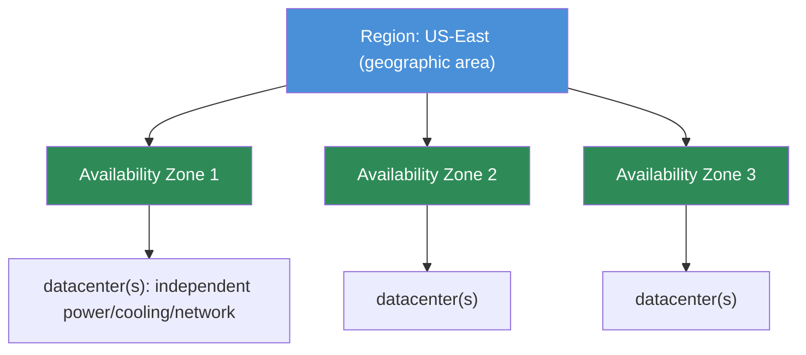
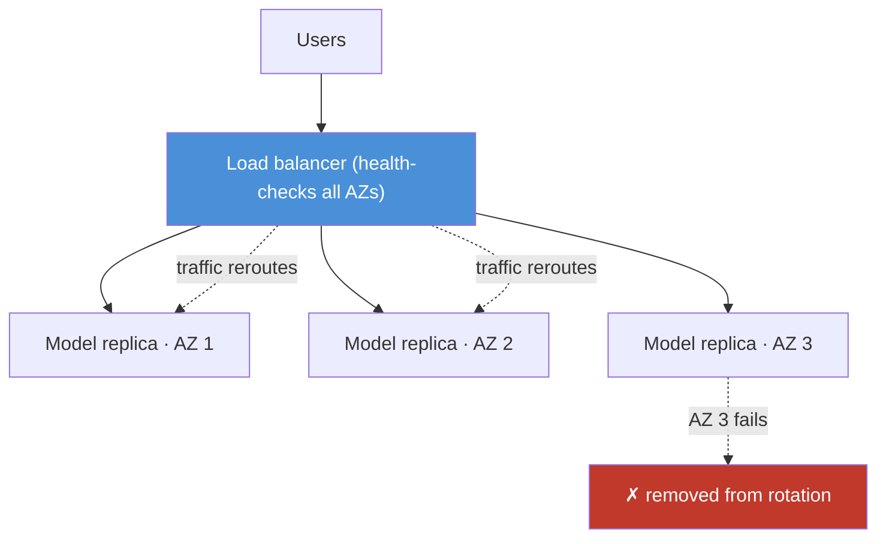

# 17.2 · Regions & Availability

[⬅ 17.1 Cloud Fundamentals](17.1-cloud-fundamentals.md) · [🏠 Module 17](../README.md) · [➡ 17.3 Compute](17.3-compute.md)

> **The lesson in one line:** The cloud is physically organized as **Regions ⊃ Availability Zones ⊃ datacenters**, and this geography is not trivia — it's the raw material of reliability: you spread an AI system across **multiple AZs so a datacenter fire doesn't take you down**, across **regions for disaster recovery and low latency to users**, and you *assume every component will eventually fail* and design for it.

---

## 🎯 Learning objectives

- Understand **regions, availability zones (AZs), and datacenters** and how they nest.
- Design AI systems for **high availability, redundancy, and disaster recovery**.
- Reason about **geographic distribution** for latency and data residency.

## ✅ Prerequisites

- [17.1 Cloud Fundamentals](17.1-cloud-fundamentals.md) — availability vs. fault tolerance.

---

## 🧠 Mental model

> [!IMPORTANT]
> **Everything fails eventually — disks, servers, racks, whole datacenters — so the cloud is built as layers of independent failure domains, and your job is to spread across them.** A **datacenter** is one building full of servers. An **Availability Zone (AZ)** is one or more datacenters with independent power, cooling, and networking — engineered to fail *independently* of other AZs. A **Region** is a geographic area (e.g. "US-East") containing several AZs, connected by fast private links. The core reliability move: **run redundant copies of your service in multiple AZs behind a load balancer**, so when one AZ dies, traffic flows to the others and users never notice. Regions add a second layer — for **disaster recovery** (a whole region fails) and **latency** (serve users from a region near them).



## 🔍 Internal explanation

### The nesting, precisely

| Level | What it is | Failure domain |
|---|---|---|
| **Datacenter** | one physical building of servers | a fire/flood/power loss takes it out |
| **Availability Zone** | 1+ datacenters, isolated power/cooling/network | designed to fail independently of sibling AZs |
| **Region** | several AZs in one geography, low-latency private links between them | a regional disaster (rare) can affect all its AZs |

AZs within a region are **close enough for low-latency synchronous communication** (single-digit milliseconds) but **far enough to not share a failure** (separate power grids, flood plains). That combination is what makes multi-AZ redundancy both *possible* (fast enough to replicate) and *worthwhile* (independent failure).

### Designing for failure

> [!IMPORTANT]
> **High availability is not a feature you buy — it's a design you choose: run redundant instances across multiple AZs behind a load balancer.** A single-AZ deployment inherits that AZ's fate. A multi-AZ deployment survives any one AZ failing because the load balancer ([17.5](17.5-networking.md)) health-checks instances and routes only to healthy ones. This is the single most important reliability pattern in the cloud, and it applies directly to AI serving: put your model replicas in 2–3 AZs, and a GPU node or an entire AZ can die without an outage.



### The four design goals

| Goal | Meaning | How |
|---|---|---|
| **Failure (design for it)** | assume every component dies | health checks, redundancy, no single point of failure |
| **Redundancy** | more than one of everything critical | multi-AZ replicas, replicated data |
| **Recovery** | get back to healthy after a failure | auto-replacement, backups, failover ([17.20](17.20-reliability.md)) |
| **Geographic distribution** | serve/replicate across regions | low latency to users, DR, data residency |

### Regions: latency, DR, and residency

Choosing regions is driven by three forces:
- **Latency** — put compute near users; a user in Europe hitting a US region pays a transatlantic round-trip on every request. For LLMs, this adds to already-high generation latency.
- **Disaster recovery** — a second region gives you somewhere to fail over if the primary region has a rare but real outage.
- **Data residency / compliance** — regulations (GDPR and similar) may *require* data to stay in a specific geography; the region choice becomes a legal constraint, not just a performance one ([17.13](17.13-security.md)).

### RTO and RPO — the DR vocabulary

Disaster recovery is quantified by two numbers:
- **RTO (Recovery Time Objective)** — how long you can be down (minutes? hours?).
- **RPO (Recovery Point Objective)** — how much data you can afford to lose (last second? last hour?).

These drive the DR strategy (and cost): tight RTO/RPO needs a warm/hot standby in another region (expensive); loose RTO/RPO allows backup-and-restore (cheap). Detailed in [17.20](17.20-reliability.md).

## 🛠️ Practical implementation

- **Default posture:** deploy stateless services (model APIs) across **≥2 AZs** behind a load balancer; store data in services that **replicate across AZs** automatically.
- **For DR:** decide RTO/RPO, then pick backup-restore vs. pilot-light vs. warm-standby vs. active-active across regions.
- **For global users:** deploy the app in multiple regions and route users to the nearest (geo-DNS / global load balancer, [17.5](17.5-networking.md)).

```text
Single AZ:      cheapest, no HA — one AZ failure = outage         (dev/test only)
Multi-AZ:       standard HA — survives an AZ failure              (production default)
Multi-region:   DR + global latency — survives a region failure  (critical / global apps)
```

## 🏭 Production examples

| Requirement | Design |
|---|---|
| Production LLM API, no outages on AZ failure | model replicas in 3 AZs behind an LB |
| Global chat product, low latency worldwide | multi-region deployment + geo-routing |
| Regulated data must stay in-country | pin region; block cross-region replication ([17.13](17.13-security.md)) |
| Survive a regional disaster, ≤1h data loss | cross-region backups (RPO 1h) + warm standby |

## ⚡ Performance considerations

- **Cross-AZ traffic is fast but not free** — same-AZ is lowest latency; keep chatty, latency-sensitive paths within an AZ where possible.
- **Cross-region is slow** — tens to hundreds of ms; never put a synchronous per-request hop across regions.
- **Data gravity** — put compute in the same region as the data it reads heavily (training data, vector DB) to avoid latency and egress.

## 💲 Cost considerations

> [!IMPORTANT]
> **Redundancy and geography cost money — spend it where availability matters.** Multi-AZ roughly multiplies compute by the number of AZs; multi-region multiplies again and adds **cross-region data transfer (egress) charges**, which are among the sneakiest cloud costs ([17.14](17.14-cost-optimization.md)). Match spend to need: production serving deserves multi-AZ; a nightly batch job may not. Cross-region replication is for DR and global latency, not for everything.

## 🔒 Security considerations

- **Data residency is a region decision** — compliance may forbid certain regions or cross-region replication ([17.13](17.13-security.md)).
- **Blast-radius isolation** — separating environments/workloads across accounts/projects and regions limits how far a compromise or misconfiguration spreads.

## 🚫 Common mistakes

| Mistake | Consequence |
|---|---|
| Single-AZ "production" deployment | one AZ failure = full outage |
| Assuming multi-AZ = multi-region | a regional outage still takes you down |
| Synchronous cross-region calls per request | brutal latency on every request |
| Ignoring RTO/RPO until a disaster | DR plan improvised under fire |
| Forgetting egress cost of cross-region replication | surprise bill ([17.14](17.14-cost-optimization.md)) |
| Storing regulated data in the wrong region | compliance violation ([17.13](17.13-security.md)) |

## 🐛 Debugging workflow

Availability incident: (1) **Is it one AZ or the region?** Check which AZ's instances are unhealthy — a single-AZ blip should self-heal if you're multi-AZ. (2) **Did the LB stop routing to a healthy zone?** Health-check misconfig can pull good instances. (3) **Latency spike for some users only?** Likely a region-distance issue — check where those users are routed. (4) **Region-wide outage?** Execute the DR runbook (fail over to the standby region); measure against your RTO. (5) **Post-incident:** if a single AZ took you down, you weren't actually multi-AZ — fix the redundancy.

## 🏋️ Exercises

1. **Conceptual.** Draw region ⊃ AZ ⊃ datacenter and explain what independent failure domains buy you.
2. **HA design.** Design a multi-AZ deployment for an LLM API; show how an AZ failure is survived.
3. **DR.** For a system with RTO=15min, RPO=5min, pick a DR strategy and justify the cost.
4. **Latency.** A global user base complains of slow responses from a single US region — propose a fix and its trade-offs.
5. **Incident.** An "AZ 2 down" alert fires; walk through your diagnosis and expected auto-recovery.

## 🛠️ Mini project — "Multi-AZ HA blueprint"

**Goal:** a reference architecture + runbook for a highly-available AI serving stack.

**Requirements:** model replicas across 3 AZs behind a load balancer with health checks; an AZ-failure walkthrough showing zero user-facing downtime; a documented RTO/RPO and a matching DR plan (cross-region backups + failover steps); a note on data-residency constraints.
**Deliverable:** an architecture diagram, an AZ-failure sequence diagram, and a one-page DR runbook.
**Extension:** extend to active-active multi-region with geo-routing; estimate the added cost.

## 📄 Cheat sheet

| Concept | Essence |
|---|---|
| **Datacenter** | one building of servers (a failure domain) |
| **Availability Zone** | 1+ datacenters, isolated power/cooling/net; fails independently |
| **Region** | several AZs in one geography, fast private links |
| **⭐ HA pattern** | redundant instances across ≥2 AZs behind a load balancer |
| **Multi-region** | DR + global latency + data residency |
| **RTO / RPO** | max downtime / max data loss you'll tolerate |
| **⚠️** | single-AZ = no HA; cross-region = latency + egress cost |

## 🎴 Flashcards

- **How do region, AZ, and datacenter nest?** → Region ⊃ Availability Zones ⊃ datacenters; a region is a geography, an AZ is isolated-power/cooling/network datacenter(s) that fails independently.
- **⭐ What is the core high-availability pattern?** → Run redundant instances across ≥2 AZs behind a load balancer that health-checks and reroutes around failures.
- **Why are AZs close but not too close?** → Close enough for low-latency replication, far enough to not share a failure (power grid, flood plain).
- **Multi-AZ vs. multi-region — what does each protect against?** → Multi-AZ survives a datacenter/AZ failure; multi-region survives a whole-region disaster and cuts latency for distant users.
- **What are RTO and RPO?** → Recovery Time Objective (max downtime) and Recovery Point Objective (max data loss) — they drive the DR strategy and its cost.
- **Why does region choice matter beyond latency?** → Data residency/compliance may legally require data to stay in a geography.
- **What's the hidden cost of multi-region?** → Cross-region data transfer (egress) charges plus duplicated compute.

## 💬 Interview questions

1. Explain regions, AZs, and datacenters, and why the distinction matters for reliability.
2. How do you design an AI API to survive an AZ failure? A region failure?
3. What are RTO and RPO, and how do they shape a DR strategy?
4. When is multi-region worth its cost, and what does it add over multi-AZ?
5. How do latency and data residency influence region selection?

## 📝 Summary

- The cloud nests as **Region ⊃ Availability Zone ⊃ datacenter**, each an independent failure domain; AZs are close enough to replicate fast, far enough to fail independently.
- **High availability is a design, not a purchase:** redundant instances across **≥2 AZs behind a load balancer** survive any single AZ failure — the cloud's most important reliability pattern, and it applies directly to AI model serving.
- **Regions** add a second layer for **disaster recovery** (survive a regional outage, sized by **RTO/RPO**), **latency** (serve users nearby), and **data residency** (compliance).
- Redundancy and geography **cost money and egress** — spend on multi-AZ for production serving, reserve multi-region for DR and global latency ([17.14](17.14-cost-optimization.md), [17.20](17.20-reliability.md)).

## 📚 References

1. **Provider region/AZ documentation (AWS/Azure/GCP).** How each defines and prices regions and zones.
2. **[17.20 Cloud Reliability](17.20-reliability.md).** ⭐ HA, failover, and DR in depth.
3. **[17.5 Cloud Networking](17.5-networking.md).** Load balancers and geo-routing.
4. **Google SRE Book — availability & DR chapters.** The engineering discipline behind uptime.

---

## 🧭 Navigation

| Direction | Link |
|---|---|
| ⬅ Previous | [17.1 · Cloud Computing Fundamentals](17.1-cloud-fundamentals.md) |
| ➡ Next | [17.3 · Compute](17.3-compute.md) |
| 🏠 Module | [Module 17](../README.md) |
| 📖 Lessons | [Lesson index](README.md) |
