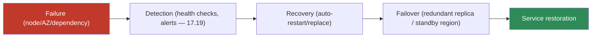

# 17.20 · Cloud Reliability

[⬅ 17.19 Cloud Observability](17.19-observability.md) · [🏠 Module 17](../README.md) · [➡ 17.21 Multi-Cloud Architecture](17.21-multi-cloud.md)

> **The lesson in one line:** Reliability is designing an AI system to **keep working despite failures** — through **high availability** (redundancy so no single failure causes an outage), **fault tolerance** (graceful handling of component failures), **disaster recovery** (backups + failover to recover from large failures), and the loop *failure → detection → recovery → failover → service restoration*. The premise is that everything fails eventually; reliability is what makes failure a non-event instead of an outage.

---

## 🎯 Learning objectives

- Understand **high availability, fault tolerance, disaster recovery, backups, and failover**.
- Trace the reliability loop: **failure → detection → recovery → failover → restoration**.
- Design **resilient AI architectures**.

## ✅ Prerequisites

- [17.2 Regions & Availability](17.2-regions-availability.md), [17.15 Autoscaling](17.15-autoscaling.md), [17.19 Observability](17.19-observability.md). Echoes [16.17 reliability](../../16-MLOps/weeks/16.17-reliability.md).

---

## 🧠 Mental model

> [!IMPORTANT]
> **Reliability starts from one assumption: every component *will* fail — so you design so that no single failure is fatal.** A GPU node dies, an AZ loses power, a dependency times out, a disk corrupts — these are certainties, not hypotheticals. **High availability** means redundancy (multiple replicas across AZs, [17.2](17.2-regions-availability.md)) so losing one changes nothing users see. **Fault tolerance** means the system *handles* failures gracefully (retries, circuit breakers, fallbacks — [16.17](../../16-MLOps/weeks/16.17-reliability.md)) rather than cascading. **Disaster recovery** means you can recover from *large* failures (a whole region) via **backups** and **failover** to a standby, sized by **RTO/RPO** ([17.2](17.2-regions-availability.md)). The operational loop is **failure → detection (observability) → recovery → failover → restoration** — and the goal is to make that loop automatic so failures are non-events.



## 🔍 Internal explanation

### The reliability building blocks

| Concept | Meaning | AI application |
|---|---|---|
| **High availability (HA)** | redundancy so no single failure = outage | model replicas across ≥2 AZs behind an LB ([17.2](17.2-regions-availability.md)) |
| **Fault tolerance** | graceful handling of component failure | retry/timeout/circuit-breaker/fallback ([16.17](../../16-MLOps/weeks/16.17-reliability.md)) |
| **Disaster recovery (DR)** | recover from large-scale failure | cross-region backups + failover |
| **Backups** | durable copies to restore from | checkpoints, datasets, DB snapshots ([17.6](17.6-storage.md)) |
| **Failover** | switch to a healthy replica/region | LB reroutes; DNS/region failover |

### High availability — redundancy as the default

HA is achieved by **redundancy + load balancing + health checks**: run N replicas across multiple AZs; a load balancer health-checks them and routes only to healthy ones ([17.5](17.5-networking.md)); autoscaling replaces failed capacity ([17.15](17.15-autoscaling.md)). No single node, and no single AZ, can take the service down. This is the same pattern from [17.2](17.2-regions-availability.md), now framed as a reliability guarantee.

### Fault tolerance — graceful failure handling

> [!IMPORTANT]
> **Fault tolerance is the set of patterns that stop one failure from cascading — and AI systems need them acutely because they depend on flaky, slow, expensive things (LLM APIs, vector DBs, GPUs, tools).** The core patterns ([16.17](../../16-MLOps/weeks/16.17-reliability.md)): **timeout** (don't wait forever on a slow dependency), **retry with backoff** (transient failures), **circuit breaker** (stop hammering a down service), **rate limiting / backpressure** (don't overload — [17.16](17.16-distributed-systems.md)), and **graceful degradation** (serve a reduced-but-working response — a cached answer, a smaller model, retrieval-only — instead of erroring). Graceful degradation is especially valuable for AI: if the LLM is down, returning cached or retrieval-only results beats a blank error.

### Disaster recovery — surviving the big one

DR handles failures too large for HA (a whole region). It's driven by **RTO/RPO** ([17.2](17.2-regions-availability.md)):
- **Backup & restore** — cheapest; restore from backups (high RTO). Fine for loose objectives.
- **Pilot light / warm standby** — a minimal/partial copy in another region, scaled up on failover (medium RTO/RPO).
- **Active-active multi-region** — full duplicate serving traffic; near-instant failover (low RTO/RPO, high cost).

**Backups** are the foundation: model checkpoints, datasets, and databases must be backed up (cross-region for DR) — and backups are worthless untested, so **rehearse restores**.

### Designing resilient AI architectures

> [!IMPORTANT]
> **A resilient AI system layers all of this:** stateless model replicas across AZs (HA); retries/timeouts/circuit-breakers/graceful-degradation on every external call (fault tolerance); durable checkpoints/data/DB backups cross-region (DR); health checks + alerts (detection, [17.19](17.19-observability.md)); and automated failover/rollback ([16.13](../../16-MLOps/weeks/16.13-deployment-strategies.md), [16.5](../../16-MLOps/weeks/16.5-model-registry.md)). Plus AI-specific resilience: **fall back to a cached/smaller model** when the primary is unavailable, and **degrade gracefully** rather than failing the whole request.

## 🛠️ Practical implementation

```python
# Fault-tolerant model call: timeout + retry + circuit breaker + graceful degradation
@circuit_breaker(fail_max=5, reset_timeout=30)      # stop hammering a down model
@retry(max=3, backoff="exponential")                # transient failures
def call_model(prompt):
    return primary_llm(prompt, timeout=10)          # don't wait forever

def answer(prompt):
    try:
        return call_model(prompt)
    except CircuitOpen:                              # primary is down
        if (cached := cache.get(prompt)): return cached          # degrade: cached answer
        try:    return small_fallback_model(prompt)              # degrade: smaller model
        except: return retrieval_only(prompt)                    # degrade: no-LLM result
    # Every path returns SOMETHING useful — one failure isn't a total outage.
```

## 🏭 Production examples

| Requirement | Design |
|---|---|
| No outage on AZ/node failure | replicas across 3 AZs + LB + autoscale ([17.2](17.2-regions-availability.md)) |
| LLM API down → still respond | cached/smaller-model/retrieval-only fallback |
| Survive a region disaster (RTO≤1h) | cross-region backups + warm standby |
| Never lose a training run | checkpoints to object storage; resume on failure ([17.6](17.6-storage.md)) |
| Bad model deploy | instant rollback via registry/canary ([16.5](../../16-MLOps/weeks/16.5-model-registry.md)) |

## ⚡ Performance considerations

- **Health checks + fast failover** minimize the window of degraded service.
- **Graceful degradation trades quality for availability** — a slightly worse answer beats an error.
- **Timeouts prevent slow dependencies from consuming all capacity** (thread/connection exhaustion).

## 💲 Cost considerations

> [!IMPORTANT]
> **Reliability costs money — match the investment to the criticality via RTO/RPO.** Multi-AZ roughly multiplies compute; active-active multi-region multiplies again plus egress ([17.14](17.14-cost-optimization.md)). Don't buy active-active DR for a nightly batch job, and don't run production serving single-AZ. Backups are cheap insurance (cold storage); untested backups are a false economy. Spend on redundancy where an outage actually hurts.

## 🔒 Security considerations

- **Backups are sensitive** — encrypt and access-control them; a leaked backup is a data breach ([17.13](17.13-security.md)).
- **Failover must preserve security** — the standby region needs the same IAM/network controls, not a weaker config.
- **DR rehearsals test security too** — verify the recovered system is still locked down.

## 🚫 Common mistakes

| Mistake | Consequence |
|---|---|
| Single-AZ production | one AZ failure = full outage ([17.2](17.2-regions-availability.md)) |
| No graceful degradation | any dependency failure → total error |
| Untested backups | discover they're broken during a disaster |
| No timeouts on external calls | slow dependency exhausts capacity |
| DR plan improvised during the incident | slow, error-prone recovery |
| Weaker security on the standby | breach via the failover path ([17.13](17.13-security.md)) |

## 🐛 Debugging workflow

Reliability incident: (1) **Detect** — alerts/health checks should have fired ([17.19](17.19-observability.md)); if not, add them. (2) **Scope** — node, AZ, region, or dependency? Multi-AZ should self-heal a node/AZ loss. (3) **Failover** — did automatic failover/rollback trigger? If manual, execute the runbook; measure vs. RTO. (4) **Degrade** — is graceful degradation serving *something*? (5) **Restore** — bring the failed component back, verify, return to normal. (6) **Post-mortem** — if a single failure caused an outage, the redundancy was missing — fix it.

## 🏋️ Exercises

1. **Conceptual.** Distinguish HA, fault tolerance, and DR with an AI example of each.
2. **Loop.** Walk through failure → detection → recovery → failover → restoration for an AZ loss.
3. **Fault tolerance.** Implement timeout + retry + circuit breaker + graceful degradation for a model call.
4. **DR.** For RTO=1h/RPO=15min, choose a DR strategy and justify the cost.
5. **Degradation.** Design three fallback tiers for an LLM app when the primary model is down.
6. **Incident.** "GPU instance becomes unavailable mid-serving" — how does a resilient system respond?

## 🛠️ Mini project — "Resilient AI architecture"

**Goal:** make the LLM+RAG service survive failures at every level.

**Requirements:** HA (replicas across ≥2 AZs + LB + autoscaling); fault tolerance on every external call (timeout, retry+backoff, circuit breaker); **graceful degradation** tiers (cached → smaller model → retrieval-only); cross-region backups of checkpoints/data/DB with a documented **RTO/RPO** and failover runbook; detection via health checks + alerts ([17.19](17.19-observability.md)); instant rollback for bad deploys ([16.5](../../16-MLOps/weeks/16.5-model-registry.md)).
**Deliverable:** the resilient architecture diagram, the fault-tolerance code sketch, and the DR runbook.
**Extension:** run a game-day — inject an AZ failure and a model outage, verify no user-facing outage.

## 📄 Cheat sheet

| Concept | Essence |
|---|---|
| **High availability** | redundancy + LB + health checks across AZs → no single-failure outage |
| **Fault tolerance** | timeout · retry+backoff · circuit breaker · backpressure · **graceful degradation** |
| **Disaster recovery** | cross-region backups + failover; sized by **RTO/RPO** |
| **Backups** | durable copies (checkpoints, data, DB) — **test restores** |
| **Failover** | switch to healthy replica/region |
| **⭐ Loop** | failure → detection → recovery → failover → restoration |
| **⭐ AI resilience** | fall back to cached / smaller model / retrieval-only |
| **⚠️** | single-AZ prod; no degradation; untested backups; no timeouts |

## 🎴 Flashcards

- **⭐ What assumption underlies all reliability engineering?** → Everything fails eventually — so design so no single failure causes an outage.
- **HA vs. fault tolerance vs. DR?** → HA = redundancy so no single failure = outage; fault tolerance = graceful handling of component failures; DR = recovering from large-scale failures via backups + failover.
- **⭐ What is graceful degradation, and why does it matter for AI?** → Serving a reduced-but-working response (cached answer, smaller model, retrieval-only) instead of erroring — so an LLM/dependency outage isn't a total failure.
- **Name the core fault-tolerance patterns.** → Timeout, retry with backoff, circuit breaker, rate limiting/backpressure, and graceful degradation.
- **What is the reliability loop?** → Failure → detection → recovery → failover → service restoration.
- **What do RTO and RPO drive?** → The DR strategy and its cost — tight objectives need warm/active standby; loose ones allow backup-and-restore.
- **Why test backups?** → An untested backup may be broken; you find out during a disaster, when it's too late.
- **How does a resilient system handle a lost GPU node?** → Multi-AZ replicas + LB reroute around it and autoscaling replaces it — no user-facing outage.
- **Reliability cost rule?** → Match redundancy investment to criticality via RTO/RPO — don't run prod single-AZ, don't buy active-active for a batch job.

## 💬 Interview questions

1. Distinguish high availability, fault tolerance, and disaster recovery.
2. Walk through the failure → detection → recovery → failover → restoration loop.
3. What fault-tolerance patterns protect an AI system's external calls?
4. What is graceful degradation, and how would you apply it to an LLM app?
5. How do RTO/RPO shape a DR strategy and its cost?
6. Design a resilient architecture that survives an AZ failure and a model outage.

## 📝 Summary

- Reliability assumes **everything fails** and designs so no single failure is fatal: **high availability** (redundant replicas across AZs + LB + health checks), **fault tolerance** (timeout/retry/circuit-breaker/backpressure/**graceful degradation**), and **disaster recovery** (cross-region backups + failover, sized by RTO/RPO).
- The operational loop is **failure → detection → recovery → failover → restoration**, made automatic via health checks, alerts ([17.19](17.19-observability.md)), autoscaling, and rollback.
- **AI-specific resilience** = **graceful degradation** — fall back to a cached answer, a smaller model, or retrieval-only when the primary is down, so an outage degrades quality instead of failing entirely.
- **Match reliability spend to criticality** via RTO/RPO, **test your backups**, and keep the standby as secure as production ([17.13](17.13-security.md), [17.14](17.14-cost-optimization.md)); reliability is the operational payoff of everything in this module.

## 📚 References

1. **[16.17 Reliability](../../16-MLOps/weeks/16.17-reliability.md).** ⭐ Timeout/retry/circuit-breaker/graceful-degradation patterns.
2. **[17.2 Regions & Availability](17.2-regions-availability.md).** HA and DR geography, RTO/RPO.
3. **Google SRE Book.** ⭐ The discipline of reliability at scale.
4. **Provider DR / backup docs (AWS/Azure/GCP).** Backup, failover, and multi-region.

---

## 🧭 Navigation

| Direction | Link |
|---|---|
| ⬅ Previous | [17.19 · Cloud Observability](17.19-observability.md) |
| ➡ Next | [17.21 · Multi-Cloud Architecture](17.21-multi-cloud.md) |
| 🏠 Module | [Module 17](../README.md) |
| 📖 Lessons | [Lesson index](README.md) |
