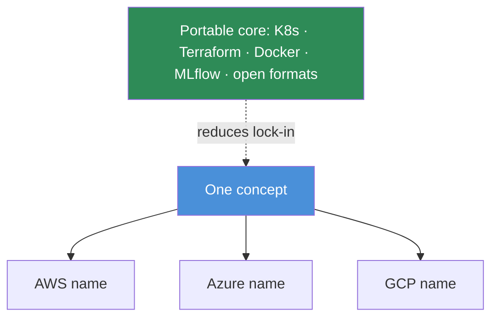

# 17.21 · Multi-Cloud Architecture

[⬅ 17.20 Cloud Reliability](17.20-reliability.md) · [🏠 Module 17](../README.md) · [➡ 17.22 Cloud AI Projects & Summary](17.22-projects-summary.md)

> **The lesson in one line:** AWS, Azure, and Google Cloud offer the **same primitives under different names** — compute, GPUs, storage, databases, Kubernetes, AI services, networking — so the goal isn't to memorize three product catalogs but to hold the **transferable concept** in your head and treat each provider's name as a lookup. Multi-cloud (using more than one) buys resilience and GPU availability at the cost of complexity, and the defense against lock-in is always a **portable core**.

---

## 🎯 Learning objectives

- Map compute, GPUs, storage, databases, Kubernetes, AI services, and networking across **AWS, Azure, GCP** at the concept level.
- Understand **why and when** to go multi-cloud, and its costs.
- Avoid lock-in with a **portable core**.

## ✅ Prerequisites

- The whole module — this is the cross-provider synthesis. Echoes [16.22 Cloud MLOps](../../16-MLOps/weeks/16.22-cloud.md).

---

## 🧠 Mental model

> [!IMPORTANT]
> **The three clouds are three dialects of one language.** Every concept in this module — a private network, a GPU instance, object storage, a managed database, a Kubernetes cluster, a load balancer — exists on all three, with a different product name and a slightly different console. Once you know *what a VPC is and why*, learning that AWS calls it a VPC, Azure a VNet, and GCP a VPC is a five-second lookup, not a re-education. This is the entire thesis of the module: **learn the concept once; the vendor name is a detail.** "Multi-cloud" (deliberately using more than one provider) is a real strategy for **resilience, GPU availability, and avoiding lock-in** — but it multiplies operational complexity, so most teams pick one primary cloud and keep a **portable core** (open formats, Kubernetes, Terraform, MLflow) so they *could* move.



## 🔍 Internal explanation

### The concept-mapping table

> [!IMPORTANT]
> **This is the reference table the whole module builds toward — read it as "concept first, three names second."**

| Concept | AWS | Azure | Google Cloud |
|---|---|---|---|
| **Virtual machines** | EC2 | Virtual Machines | Compute Engine |
| **GPU instances** | EC2 P/G families | N-series VMs | GPU on Compute Engine |
| **Serverless functions** | Lambda | Functions | Cloud Functions / Run |
| **Object storage** | S3 | Blob Storage | Cloud Storage |
| **Block storage** | EBS | Managed Disks | Persistent Disk |
| **Relational DB** | RDS / Aurora | Azure SQL / DB | Cloud SQL / Spanner |
| **NoSQL** | DynamoDB | Cosmos DB | Firestore / Bigtable |
| **Managed Kubernetes** | EKS | AKS | GKE |
| **Private network** | VPC | VNet | VPC |
| **Firewall** | Security Groups | NSG | Firewall rules |
| **Load balancer** | ELB/ALB/NLB | Load Balancer / App Gateway | Cloud Load Balancing |
| **DNS** | Route 53 | Azure DNS | Cloud DNS |
| **Managed model API** | Bedrock | Azure OpenAI | Vertex AI / Gemini |
| **ML platform** | SageMaker | Azure ML | Vertex AI |
| **Container registry** | ECR | ACR | Artifact Registry |
| **Secrets** | Secrets Manager | Key Vault | Secret Manager |
| **IAM** | IAM | Entra ID / RBAC | Cloud IAM |

Notice: **the *rows* are what you learned; the columns are just names.** Any architecture you designed in [17.11](17.11-ai-architectures.md) maps onto any provider by reading across a row.

### Comparing the providers (at the concept level)

The providers differ in emphasis and maturity, not in fundamentals:
- **Compute/GPU** — all three offer the major GPU types; **availability and price vary by region and moment** ([17.4](17.4-gpu-infrastructure.md)), which is itself a reason some teams multi-cloud (chase GPU capacity).
- **Storage/DB** — near-parity on object/block/relational/NoSQL; managed vector search is newer and varies.
- **Kubernetes** — EKS/AKS/GKE are the same Kubernetes with different management layers (GKE is often considered the most mature).
- **AI services** — each has managed model APIs and an ML platform ([17.12](17.12-ai-services.md)); the specific models/features differ and change constantly.
- **Networking** — identical concepts (VPC/subnets/LB/firewall), different names.

> [!NOTE]
> **Don't over-index on "which cloud is best."** For most AI workloads all three are capable; the decision is usually driven by existing commitments, specific model/service availability, GPU capacity, pricing deals, and team familiarity — not fundamental capability gaps.

### Multi-cloud: why, and the cost

> [!IMPORTANT]
> **Multi-cloud is a deliberate trade: resilience and flexibility for operational complexity — use it for a reason, not by default.** Reasons to genuinely go multi-cloud: **avoid vendor lock-in**, **GPU availability** (source scarce capacity wherever it exists), **resilience** (survive a provider-wide outage), **data residency**, or **best-of-breed** (a specific model/service only one offers). The cost is real: **duplicated tooling, cross-cloud networking and egress, more security surface, and doubled operational burden**. Most teams are better served by **one primary cloud + a portable core** (Kubernetes, Terraform, Docker, MLflow, open model formats) that *keeps the option* to move without paying the full multi-cloud tax up front ([16.22](../../16-MLOps/weeks/16.22-cloud.md)).

## 🛠️ Practical implementation

```text
Avoiding lock-in with a portable core (regardless of provider):
  Compute      → containers (Docker) on Kubernetes (EKS/AKS/GKE all run the same manifests)
  Infra        → Terraform (multi-provider) instead of provider consoles
  ML lifecycle → MLflow (tracking/registry) + standard model formats (safetensors/ONNX)
  Data         → open formats (parquet) in object storage (S3/Blob/GCS behind one abstraction)
  Result: your architecture is 80% portable; only the thin provider-specific glue changes.
```

## 🏭 Production examples

| Situation | Choice |
|---|---|
| Single team, one cloud commitment | one primary cloud + portable core |
| Need scarce GPUs wherever available | multi-cloud GPU sourcing ([17.4](17.4-gpu-infrastructure.md)) |
| Provider-outage resilience required | active-active across two clouds (expensive, [17.20](17.20-reliability.md)) |
| A model only one provider hosts | use that provider's API + keep the rest portable |
| Regulated data residency | pick the provider/region that meets the rule ([17.13](17.13-security.md)) |

## ⚡ Performance considerations

- **Cross-cloud latency is high** — never put a synchronous per-request hop between clouds; keep each workload within one cloud/region ([17.5](17.5-networking.md)).
- **GPU availability varies by provider/region** — a real performance/capacity lever for multi-cloud.

## 💲 Cost considerations

> [!IMPORTANT]
> **Multi-cloud multiplies cost — cross-cloud egress, duplicated tooling, and doubled ops — so it must earn its keep.** Egress between clouds is expensive ([17.14](17.14-cost-optimization.md)); managing two providers' security, IAM, and monitoring doubles effort. Committed-use/reserved discounts also fragment across providers. Unless resilience, capacity, or residency *requires* it, a **portable core on one cloud** is cheaper and simpler.

## 🔒 Security considerations

- **Two clouds = two security surfaces** — IAM, network, and secrets must be hardened consistently on both ([17.13](17.13-security.md)).
- **Consistent policy is harder multi-cloud** — use policy-as-code and centralized identity where possible.
- **Data residency may drive provider/region choice** — a compliance constraint, not a preference.

## 🚫 Common mistakes

| Mistake | Consequence |
|---|---|
| Memorizing products instead of concepts | knowledge rots as catalogs change |
| Multi-cloud "for resilience" without need | doubled complexity/cost for little gain |
| No portable core, all-proprietary | painful lock-in ([16.22](../../16-MLOps/weeks/16.22-cloud.md)) |
| Synchronous cross-cloud request paths | brutal latency |
| Inconsistent security across clouds | a weak side becomes the breach |

## 🐛 Debugging workflow

Multi-cloud/provider issue: (1) **Mapping confusion?** Return to the concept — what *primitive* is this? Then find the provider's name. (2) **Cost surprise?** Cross-cloud egress or fragmented commitments ([17.14](17.14-cost-optimization.md)). (3) **Latency?** A cross-cloud/region hop in the path ([17.5](17.5-networking.md)). (4) **Security gap?** Inconsistent IAM/policy between providers. (5) **Lock-in pain?** Missing portable core — introduce Kubernetes/Terraform/MLflow abstractions incrementally.

## 🏋️ Exercises

1. **Mapping.** From memory, fill the concept → AWS/Azure/GCP table for 10 primitives.
2. **Translate.** Take your [17.11](17.11-ai-architectures.md) LLM architecture and instantiate it on each provider by reading across rows.
3. **Decide.** For 4 scenarios, decide single- vs. multi-cloud and justify.
4. **Portable core.** Design a stack that's 80% portable; identify the thin provider-specific glue.
5. **Cost.** List the extra costs multi-cloud incurs and when they're justified.

## 🛠️ Mini project — "Provider-agnostic architecture + mapping"

**Goal:** one AI architecture, portable across all three clouds.

**Requirements:** the [17.11](17.11-ai-architectures.md) LLM+RAG architecture expressed with a **portable core** (Kubernetes, Terraform, Docker, MLflow, open formats); a complete concept → AWS/Azure/GCP mapping table for every component used; a documented single-vs-multi-cloud decision with justification; the thin provider-specific glue isolated so switching is a small change; a note on cross-cloud egress and consistent security.
**Deliverable:** the portable architecture diagram, the full mapping table, and the provider-decision record.
**Extension:** estimate the effort to migrate the stack from one provider to another.

## 📄 Cheat sheet

| Concept | AWS · Azure · GCP |
|---|---|
| **VM / GPU** | EC2·VMs·Compute Engine (P/G · N-series · GPU) |
| **Object storage** | S3 · Blob · Cloud Storage |
| **Managed K8s** | EKS · AKS · GKE |
| **Private network** | VPC · VNet · VPC |
| **Managed model API** | Bedrock · Azure OpenAI · Vertex/Gemini |
| **Secrets / IAM** | Secrets Manager·Key Vault·Secret Manager / IAM·Entra·Cloud IAM |
| **⭐ Thesis** | concepts transfer; product names are a lookup |
| **⭐ Portable core** | K8s · Terraform · Docker · MLflow · open formats |
| **Multi-cloud** | resilience/GPU/residency ↔ complexity/egress/cost |

## 🎴 Flashcards

- **⭐ What's the core insight about AWS vs. Azure vs. GCP?** → They implement the same primitives under different names — learn the concept once and the vendor name is a five-second lookup.
- **Map "object storage" across the three clouds.** → S3 (AWS), Blob Storage (Azure), Cloud Storage (GCP).
- **Map "managed Kubernetes."** → EKS (AWS), AKS (Azure), GKE (GCP) — the same Kubernetes with different management layers.
- **Map "private network" and "firewall."** → VPC/VNet/VPC and Security Groups/NSG/Firewall rules.
- **⭐ Why and when go multi-cloud?** → For lock-in avoidance, GPU availability, provider-outage resilience, data residency, or a unique service — at the cost of doubled complexity, egress, and ops; use it only with a real reason.
- **What is a portable core?** → Kubernetes, Terraform, Docker, MLflow, and open formats that keep your stack ~80% provider-agnostic so you *could* move.
- **Which cloud is "best" for AI?** → Usually none decisively — all three are capable; the choice is driven by commitments, model/service availability, GPU capacity, pricing, and familiarity.
- **Why avoid synchronous cross-cloud request paths?** → Cross-cloud latency is high and egress is expensive; keep each workload within one cloud/region.

## 💬 Interview questions

1. How do AWS, Azure, and GCP compare on compute, storage, Kubernetes, and AI services?
2. Why is "learn concepts, not products" the right approach to the cloud?
3. When is multi-cloud justified, and what does it cost?
4. What is a portable core, and how does it mitigate lock-in?
5. Map a full LLM+RAG architecture across all three providers.
6. How do GPU availability and data residency influence provider choice?

## 📝 Summary

- AWS, Azure, and GCP provide the **same primitives under different names** — the concept → three-names mapping table is the module's payoff, and any architecture maps onto any provider by reading across a row.
- The providers differ in **emphasis, maturity, and moment-to-moment GPU availability/price**, not in fundamentals — there's rarely a decisively "best" cloud for AI.
- **Multi-cloud** is a deliberate trade — **resilience, GPU availability, residency, best-of-breed** vs. **complexity, egress, doubled ops** — justified only by a real need.
- The durable defense against lock-in is a **portable core** (**Kubernetes, Terraform, Docker, MLflow, open formats**) on one primary cloud ([16.22](../../16-MLOps/weeks/16.22-cloud.md)) — next, [17.22](17.22-projects-summary.md) puts the whole module together in end-to-end projects.

## 📚 References

1. **[16.22 Cloud MLOps](../../16-MLOps/weeks/16.22-cloud.md).** ⭐ Managed-vs-portable-core and the AI-service mapping.
2. **Provider comparison docs & each cloud's service overview.** For the *rows*, not memorization.
3. **Terraform (multi-provider), Kubernetes, MLflow docs.** The portable-core tooling.
4. **[17.11 Cloud AI Architectures](17.11-ai-architectures.md).** The architecture you map across providers.

---

## 🧭 Navigation

| Direction | Link |
|---|---|
| ⬅ Previous | [17.20 · Cloud Reliability](17.20-reliability.md) |
| ➡ Next | [17.22 · Cloud AI Projects & Summary](17.22-projects-summary.md) |
| 🏠 Module | [Module 17](../README.md) |
| 📖 Lessons | [Lesson index](README.md) |
