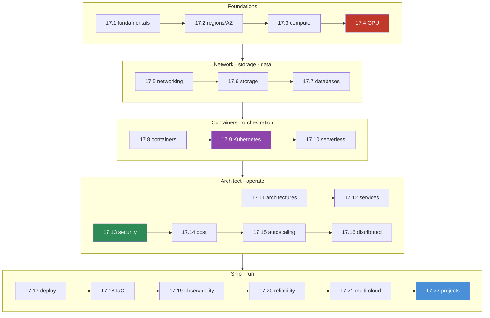

# 17.22 · Cloud AI Projects & Module Summary ✅

[⬅ 17.21 Multi-Cloud Architecture](17.21-multi-cloud.md) · [🏠 Module 17](../README.md) · [➡ Module 18](../../18-System-Design/README.md)

> **The lesson in one line:** Eight end-to-end projects take you from "deploy a model API" to "an Infrastructure-as-Code AI platform" — each assembling the module's primitives (compute, networking, storage, databases, containers, Kubernetes, GPUs, distributed systems, security, cost, observability, reliability) into a complete, production-shaped cloud AI system, and this lesson lists them and closes the module.

---

## 🎯 Learning objectives

- Assemble the module's primitives into **eight complete cloud AI systems**.
- Consolidate the module into a single **mental map** of cloud AI engineering.

---

## 🛠️ The eight projects

Each project follows the same spec: **requirements · architecture · folder structure · infrastructure · deployment · security · monitoring · cost estimation · testing · future improvements.** Build in order — each adds a capability.

| # | Project | Assembles | Key lessons |
|---|---|---|---|
| 1 | **Deploy an ML API to the cloud** | container → cloud, LB, monitoring | [17.8](17.8-containers.md) · [17.5](17.5-networking.md) · [17.17](17.17-deployment.md) |
| 2 | **Deploy a GPU deep-learning model** | GPU instance, VRAM sizing, serving | [17.4](17.4-gpu-infrastructure.md) · [17.3](17.3-compute.md) |
| 3 | **Cloud-based RAG system** | vector DB, object storage, LLM, cache | [17.7](17.7-databases.md) · [17.6](17.6-storage.md) · [17.11](17.11-ai-architectures.md) |
| 4 | **Deploy an AI agent** | agent loop, tools/MCP, memory, observability | [17.11](17.11-ai-architectures.md) · [17.19](17.19-observability.md) |
| 5 | **Kubernetes model-serving system** | K8s deployment, GPU scheduling, autoscaling | [17.9](17.9-kubernetes.md) · [17.15](17.15-autoscaling.md) |
| 6 | **Cloud data pipeline** | event-driven ingestion, queues, storage | [17.16](17.16-distributed-systems.md) · [17.10](17.10-serverless.md) |
| 7 | **Distributed AI processing system** | queues, workers, async, scale-to-zero | [17.16](17.16-distributed-systems.md) · [17.15](17.15-autoscaling.md) |
| 8 | **Infrastructure-as-Code AI platform** | Terraform, multi-env, the whole stack | [17.18](17.18-iac.md) · [17.13](17.13-security.md) · [17.14](17.14-cost-optimization.md) |

### Project spec template (applies to all eight)

> [!IMPORTANT]
> **Every project must specify all ten dimensions — this is what makes it production-shaped rather than a toy.**

- **Requirements** — what it must do, traffic/latency/SLA, GPU need, budget.
- **Architecture** — the five-layer skeleton ([17.11](17.11-ai-architectures.md)) with components placed on primitives.
- **Folder structure** — code + IaC + configs laid out.
- **Infrastructure** — network (VPC/subnets), compute (CPU/GPU), storage, databases.
- **Deployment** — CI/CD pipeline, image, staging → prod promotion ([17.17](17.17-deployment.md)).
- **Security** — IAM least privilege, secrets, encryption, private subnets ([17.13](17.13-security.md)).
- **Monitoring** — infra + AI signals, dashboards, alerts ([17.19](17.19-observability.md)).
- **Cost estimation** — per-bucket cost + the dominant driver + levers ([17.14](17.14-cost-optimization.md)).
- **Testing** — functional, load, failure-injection.
- **Future improvements** — the next capability to add.

### Project 8 — the capstone (Infrastructure-as-Code AI platform)

> [!IMPORTANT]
> **The flagship ties everything together: a full AI platform defined entirely as Infrastructure as Code.** Terraform modules provision the network, a Kubernetes cluster with a GPU node pool, object storage, databases, and a vector DB; a CI/CD pipeline deploys model-serving with autoscaling and canary rollout; security is least-privilege IAM + vaulted secrets + private subnets throughout; observability covers infra + AI signals; reliability is multi-AZ with backups and rollback; and cost is controlled with spot/reserved/scale-to-zero — all reproducible across dev/staging/prod from version-controlled code. If you can build Project 8, you can design, deploy, secure, scale, monitor, and operate production AI in the cloud.

## 🧩 Incident drills (operate the systems)

The projects build; these **break** things, because operating cloud AI is diagnosing failures under pressure. Each maps to the lesson that resolves it — see [`exercises/`](../exercises/README.md) for full scenarios.

| Incident | First question | Lesson |
|---|---|---|
| GPU instance becomes unavailable | Another AZ/region/type? Fallback? | [17.4](17.4-gpu-infrastructure.md) · [17.2](17.2-regions-availability.md) |
| Cloud costs suddenly increase | Which bucket — GPU/API/egress? | [17.14](17.14-cost-optimization.md) |
| Application becomes slow | Which hop? Autoscaling? Trace it | [17.19](17.19-observability.md) · [17.15](17.15-autoscaling.md) |
| Database becomes unreachable | Network first, then DB/failover | [17.7](17.7-databases.md) · [17.5](17.5-networking.md) |
| Kubernetes pod crashes | Logs: config/secret/OOM/probe? | [17.9](17.9-kubernetes.md) |
| Model deployment fails | Which stage? Staging vs prod diff? | [17.17](17.17-deployment.md) |
| Network access is blocked | Security group/subnet/route? | [17.5](17.5-networking.md) |
| Storage permissions misconfigured | IAM/bucket policy; public? | [17.6](17.6-storage.md) · [17.13](17.13-security.md) |

## 🗺️ Module 17 — the whole map

## 📝 Module summary — what you can now do

- **Understand cloud fundamentals** — virtualization, elasticity, the IaaS→serverless ladder ([17.1](17.1-cloud-fundamentals.md)).
- **Design region- and AZ-aware architectures** — HA and DR built in ([17.2](17.2-regions-availability.md)).
- **Choose and size compute** — CPU/GPU/TPU, VRAM math, multi-GPU/distributed ([17.3](17.3-compute.md), [17.4](17.4-gpu-infrastructure.md)).
- **Build private, secure networks** — VPC, subnets, load balancers, firewalls ([17.5](17.5-networking.md)).
- **Store and query correctly** — object storage + the right database incl. vector ([17.6](17.6-storage.md), [17.7](17.7-databases.md)).
- **Containerize and orchestrate** — Docker + Kubernetes with GPU scheduling ([17.8](17.8-containers.md), [17.9](17.9-kubernetes.md)).
- **Architect ML/LLM/agent systems** on the shared skeleton ([17.11](17.11-ai-architectures.md)).
- **Secure, cost-optimize, scale, and distribute** ([17.13](17.13-security.md)–[17.16](17.16-distributed-systems.md)).
- **Deploy, codify, observe, and make reliable** ([17.17](17.17-deployment.md)–[17.20](17.20-reliability.md)).
- **Work across any provider** via concepts + a portable core ([17.21](17.21-multi-cloud.md)).

> [!IMPORTANT]
> **The one thing to carry out of Module 17:** the cloud is a **small set of transferable primitives**, and production AI engineering is **composing them** — compute (GPUs!), networking, storage, databases, containers, orchestration, distributed systems — into systems that are **secure, cost-controlled, scalable, observable, and reliable**. Learn the primitive once; the vendor name is a lookup. That's the bridge from local AI development to production-scale cloud AI.

## 🎴 Flashcards

- **What's the point of building the eight projects?** → Each assembles the module's primitives into a complete, production-shaped cloud AI system, from a simple ML API to a full IaC platform.
- **⭐ The single takeaway of Module 17?** → The cloud is a small set of transferable primitives; production AI engineering is composing them into secure, cost-controlled, scalable, observable, reliable systems — learn the concept once, the vendor name is a lookup.
- **What ten dimensions define a production-shaped project?** → Requirements, architecture, folder structure, infrastructure, deployment, security, monitoring, cost estimation, testing, future improvements.
- **What is Project 8 (the capstone)?** → A full AI platform defined entirely as Infrastructure as Code — network, K8s+GPU, storage, databases, CI/CD, security, observability, reliability, cost — reproducible across dev/staging/prod.
- **Why include incident drills, not just build projects?** → Operating cloud AI is diagnosing failures (GPU unavailable, cost spike, pod crash, network blocked) under pressure.

## 📚 References

1. **All Module 17 lessons.** The projects assemble them.
2. **[17.11 Cloud AI Architectures](17.11-ai-architectures.md).** The skeleton every project follows.
3. **[`exercises/`](../exercises/README.md).** The full incident scenarios.
4. **Provider well-architected frameworks (AWS/Azure/GCP).** Production architecture guidance.

---

## 🧭 Navigation

| Direction | Link |
|---|---|
| ⬅ Previous | [17.21 · Multi-Cloud Architecture](17.21-multi-cloud.md) |
| ➡ Next module | [Module 18 · System Design](../../18-System-Design/README.md) |
| 🏠 Module | [Module 17](../README.md) |
| 📖 Lessons | [Lesson index](README.md) |
