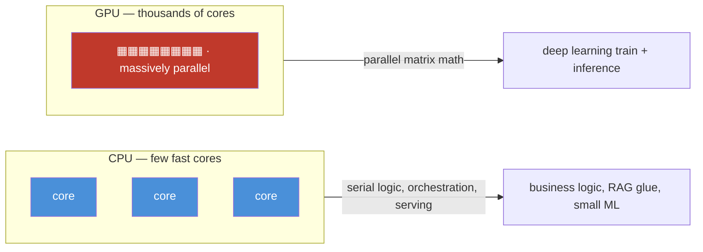

# 17.3 · Compute ⭐

[⬅ 17.2 Regions & Availability](17.2-regions-availability.md) · [🏠 Module 17](../README.md) · [➡ 17.4 GPU Cloud Infrastructure](17.4-gpu-infrastructure.md)

> **The lesson in one line:** Compute is where your code actually runs, and the central choice — **CPU vs. GPU vs. TPU** — is a story about *parallelism*: CPUs have a few very fast cores (great for logic and orchestration), GPUs have thousands of slower cores (great for the massively parallel matrix math of deep learning), and TPUs are ASICs built for exactly that math. Picking compute for an AI workload means matching its parallelism and memory profile to the right processor.


---

## 🎯 Learning objectives

- Distinguish **VMs, CPUs, GPUs, TPUs, bare metal, and serverless compute**.
- Explain **parallel processing, memory bandwidth, and VRAM** — why GPUs win at deep learning.
- **Select compute** for traditional ML, deep learning, LLM fine-tuning, LLM inference, RAG, and agents.

## ✅ Prerequisites

- [17.1 Cloud Fundamentals](17.1-cloud-fundamentals.md) (VMs, the abstraction ladder).
- Helpful: [15.7 full fine-tuning](../../15-Fine-Tuning/weeks/15.7-full-fine-tuning.md), [16.15 GPU infrastructure](../../16-MLOps/weeks/16.15-gpu-infrastructure.md) (VRAM math, expanded in [17.4](17.4-gpu-infrastructure.md)).

---

## 🧠 Mental model

> [!IMPORTANT]
> **CPU vs. GPU is few-fast-cores vs. many-slow-cores.** A **CPU** has a handful of powerful cores optimized for *latency* — running one complex instruction stream as fast as possible (branching logic, orchestration, serving a request). A **GPU** has thousands of simpler cores optimized for *throughput* — doing the same operation on thousands of numbers at once. Deep learning is almost entirely **matrix multiplication** — the same multiply-add over millions of numbers — which is *embarrassingly parallel*, so a GPU annihilates a CPU on it (often 10–100×). A **TPU** takes this further: a custom chip (ASIC) whose silicon *is* a matrix-multiply engine. The engineering question is never "which is best" but "**does this workload have the parallel, matrix-heavy shape that GPUs/TPUs accelerate — and does the model fit in their memory?**"



## 🔍 Internal explanation

### The processors

| Processor | Shape | Best at | AI role |
|---|---|---|---|
| **CPU** | few (4–64) fast, general cores | serial logic, branching, I/O, orchestration | app servers, RAG glue, classical ML, data prep |
| **GPU** | thousands of parallel cores + high-bandwidth VRAM | massively parallel matrix math | DL training & inference, LLMs, embeddings |
| **TPU** | ASIC: systolic matrix-multiply array | large-scale matmul (esp. training) | large model training on specific stacks |
| **Bare metal** | a whole physical server, no hypervisor | max performance, no virtualization overhead | latency-critical or licensing-bound workloads |
| **Serverless** | ephemeral, event-driven, usually CPU-only | short, spiky, stateless tasks | glue, triggers, light inference ([17.10](17.10-serverless.md)) |

### Why GPUs win deep learning — parallelism + bandwidth

Two properties matter:

1. **Parallel processing.** Training/inference is dominated by matrix multiplies, where each output element is independent — thousands can compute simultaneously. A CPU does a few at a time; a GPU does thousands. This is why the *same* model trains in hours on a GPU vs. weeks on a CPU.
2. **Memory bandwidth.** Those thousands of cores are starved if they can't get data fast enough. GPUs pair their cores with **very high bandwidth memory (VRAM)** — often an order of magnitude more bandwidth than CPU RAM. **Deep learning is frequently memory-bandwidth-bound, not compute-bound**, so this matters as much as core count.

> [!IMPORTANT]
> **VRAM is the make-or-break constraint for AI compute.** A GPU's on-board memory (VRAM) must hold the model's weights, the activations, and — for training — gradients and optimizer state. If the model doesn't *fit* in VRAM, it doesn't run, full stop, no matter how fast the cores are. This is why "which GPU?" is really "**how much VRAM, and does my model fit?**" — the arithmetic is the subject of [17.4](17.4-gpu-infrastructure.md).

### VM, bare metal, serverless — the delivery form

Orthogonal to *which processor*, there's *how it's delivered*:
- **Virtual machine** — a virtualized slice of a host (the default; slight overhead, huge flexibility).
- **Bare metal** — a dedicated physical server (no hypervisor overhead; for the rare workload that needs it).
- **Serverless** — no server to manage; runs your function per-event and scales to zero. Almost always **CPU-only** with tight time/memory limits — fine for glue, wrong for GPU training ([17.10](17.10-serverless.md)).

### Selecting compute per AI workload

> [!IMPORTANT]
> **Match the processor to the workload's parallelism and memory profile — don't default to a GPU for everything (it's expensive and often idle) or a CPU for everything (it can't train).**

| Workload | Compute | Why |
|---|---|---|
| **Traditional ML** (trees, regression, small nets) | **CPU** | not matmul-dominated; GPUs give little benefit |
| **Deep learning training** | **GPU (often multi)** / TPU | matmul-heavy, parallel; needs VRAM for grads+optimizer |
| **LLM fine-tuning** | **GPU**, VRAM-sized to method | full-FT ≈ 16 bytes/param; LoRA/QLoRA fit far smaller ([15.9](../../15-Fine-Tuning/weeks/15.9-qlora.md)) |
| **LLM inference** | **GPU** (weights + KV cache in VRAM) | latency-sensitive matmul; batch for throughput ([16.14](../../16-MLOps/weeks/16.14-model-optimization.md)) |
| **RAG** | **CPU app + GPU for embeddings/LLM** | orchestration is CPU; embedding & generation are GPU |
| **AI agents** | **CPU orchestration + GPU/model API** | the loop is logic (CPU); model calls hit GPU or a hosted API |

The pattern: **the "thinking" (model math) wants a GPU; the "plumbing" (logic, retrieval, tool calls, serving) wants a CPU.** Most real AI systems are *hybrid* — a CPU app tier calling a GPU model tier.

## 🛠️ Practical implementation

```text
Choosing compute — decision sketch:
  Is the hot path large matrix math (train/infer a neural net)?
      YES → GPU (or TPU for very large training on a supported stack)
            → size by VRAM: does the model + activations (+ grads/optimizer if training) fit? (17.4)
      NO  → CPU
            → spiky/short/stateless & no GPU? → serverless (17.10)
            → steady? → VM
  Need max perf / no virtualization / special licensing? → bare metal
```

```python
# The hybrid reality of an AI service:
#   [ CPU app tier ]  handles HTTP, auth, request logic, RAG orchestration
#         │  calls
#         ▼
#   [ GPU model tier ] runs embeddings / LLM inference (VRAM-bound)
# You scale and pay for these independently — CPU is cheap and elastic,
# GPU is expensive and scarce, so you keep GPUs busy and minimal.
```

## 🏭 Production examples

| System | Compute layout |
|---|---|
| Fraud model (gradient-boosted trees) | CPU VMs; no GPU needed |
| Image classifier training | multi-GPU VM (spot) ([17.14](17.14-cost-optimization.md)) |
| Self-hosted LLM chat | GPU nodes (vLLM) behind a CPU API gateway |
| RAG service | CPU app + GPU embedding/LLM tier + vector DB ([17.7](17.7-databases.md)) |
| Agent platform | CPU orchestrator + model API + tool sandboxes ([17.11](17.11-ai-architectures.md)) |

## ⚡ Performance considerations

- **GPU utilization is the metric that matters** — an underfed GPU (small batches, data-loading bottleneck, CPU preprocessing stall) wastes the most expensive resource you rent ([17.4](17.4-gpu-infrastructure.md)).
- **Memory bandwidth often bounds inference** — not raw FLOPs; this is why KV-cache and batching strategies matter ([16.14](../../16-MLOps/weeks/16.14-model-optimization.md)).
- **CPU preprocessing can bottleneck a GPU** — feed the GPU fast (parallel data loading) or it idles.

## 💲 Cost considerations

> [!IMPORTANT]
> **GPUs are the dominant, scarce cost in AI compute — an idle GPU is the most expensive mistake in the module.** A GPU VM can cost 10–40× a comparable CPU VM. So: put only the matmul on GPUs, keep them **highly utilized**, use **spot/preemptible** for interruptible training, and **scale GPU serving toward zero** when idle. Never run business logic on a GPU node "because it's there." Full levers in [17.14](17.14-cost-optimization.md).

## 🔒 Security considerations

- **GPU multi-tenancy** — sharing a GPU across tenants/workloads has isolation caveats; for sensitive workloads prefer dedicated GPUs.
- **Bare metal** removes hypervisor isolation between you and... nothing (it's dedicated) — but also removes a layer the provider normally manages; you own more of the stack ([17.13](17.13-security.md)).

## 🚫 Common mistakes

| Mistake | Consequence |
|---|---|
| GPU for traditional ML | pay 10×+ for no speedup |
| CPU for deep learning training | jobs take weeks, or never finish |
| Ignoring VRAM before choosing a GPU | model doesn't fit — job OOMs ([17.4](17.4-gpu-infrastructure.md)) |
| Running app logic on GPU nodes | expensive GPU cycles wasted on plumbing |
| Serverless for GPU/long jobs | timeout/no-GPU wall ([17.10](17.10-serverless.md)) |
| Leaving GPUs idle | the #1 AI cloud cost leak ([17.14](17.14-cost-optimization.md)) |

## 🐛 Debugging workflow

Compute problem: (1) **Job won't start / OOMs?** VRAM too small — estimate memory ([17.4](17.4-gpu-infrastructure.md)), reduce batch/precision or get a bigger GPU. (2) **GPU slow / underused?** Check GPU utilization — likely a data-loading or CPU-preprocessing bottleneck starving it. (3) **Inference latency high?** Memory-bandwidth-bound; try batching, quantization, KV-cache tuning. (4) **CPU service slow under load?** Scale out CPU instances (cheap) rather than reaching for a GPU. (5) **Cost too high?** Are GPUs doing only matmul, and are they utilized/released?

## 🏋️ Exercises

1. **Conceptual.** Explain why a GPU beats a CPU on training but not on branchy business logic.
2. **Selection.** For 8 workloads (tree model, CNN training, LLM fine-tune, LLM serve, embedding batch job, RAG API, agent loop, nightly ETL), pick CPU/GPU/TPU/serverless and justify.
3. **Bandwidth.** Explain "memory-bandwidth-bound" and give an inference example where it dominates.
4. **Hybrid design.** Draw the CPU/GPU split for a RAG service and say what scales independently.
5. **Cost.** Estimate the monthly cost of leaving one GPU VM running 24/7 vs. only during 5h/day training.

## 🛠️ Mini project — "Compute selection matrix"

**Goal:** a decision matrix + one worked hybrid architecture.

**Requirements:** a table mapping ≥6 AI workloads to compute type, with the *reason* (parallelism, VRAM, latency, cost) for each; one detailed hybrid architecture (CPU app tier + GPU model tier) with a note on how each tier scales and is priced independently; a VRAM "does it fit?" check for the GPU tier's model.
**Deliverable:** the matrix, the architecture diagram, and the fit check.
**Extension:** add a spot-vs-on-demand cost comparison for the GPU tier ([17.14](17.14-cost-optimization.md)).

## 📄 Cheat sheet

| Concept | Essence |
|---|---|
| **CPU** | few fast cores — logic, orchestration, serving, classical ML |
| **GPU** | thousands of cores + high-bandwidth VRAM — parallel matrix math (DL) |
| **TPU** | ASIC matrix-multiply engine — large-scale training on supported stacks |
| **Bare metal** | dedicated physical server, no hypervisor overhead |
| **Serverless** | ephemeral CPU-only, scales to zero — glue, not GPU jobs |
| **⭐ VRAM** | the constraint — model must *fit* or it won't run ([17.4](17.4-gpu-infrastructure.md)) |
| **⭐ Rule** | matmul → GPU; plumbing → CPU; most AI systems are hybrid |
| **⚠️** | idle GPU = #1 cost leak; never run logic on GPU nodes |

## 🎴 Flashcards

- **⭐ CPU vs. GPU in one line?** → Few fast cores for serial logic vs. thousands of cores for massively parallel matrix math; deep learning is matmul, so GPUs win big.
- **Why is deep learning "embarrassingly parallel"?** → It's dominated by matrix multiplies whose output elements are independent, so thousands compute simultaneously.
- **⭐ What is the make-or-break GPU constraint?** → VRAM — the model (+ activations, and grads/optimizer for training) must fit in GPU memory or the job can't run.
- **What does "memory-bandwidth-bound" mean?** → Performance is limited by how fast data reaches the cores, not by raw compute — common for inference.
- **What is a TPU?** → A custom ASIC whose silicon is a matrix-multiply engine, built for large-scale neural-net math.
- **When is serverless the wrong compute?** → GPU workloads and long-running training — it's CPU-only with tight time/memory limits.
- **⭐ What's the hybrid pattern for AI systems?** → CPU app tier (logic, orchestration, RAG glue) calling a GPU model tier (embeddings, LLM inference), scaled and priced independently.
- **The single biggest AI compute cost mistake?** → Leaving GPUs idle (or running plumbing on them) instead of keeping them minimal and highly utilized.

## 💬 Interview questions

1. Why do GPUs outperform CPUs on deep learning but not on general application logic?
2. What is VRAM and why is it the binding constraint for model compute?
3. Explain memory bandwidth vs. compute, and when inference is bandwidth-bound.
4. How would you split a RAG or agent system across CPU and GPU compute, and why?
5. When would you choose bare metal or serverless over a standard VM?
6. How do you keep GPU compute cost under control?

## 📝 Summary

- Compute choice is fundamentally **CPU (few fast cores, serial logic) vs. GPU (thousands of cores, parallel matmul) vs. TPU (matmul ASIC)** — and deep learning's matrix-heavy, parallel shape is why GPUs/TPUs dominate it.
- **VRAM and memory bandwidth**, not just core count, decide whether a model runs and how fast — **the model must fit in VRAM** ([17.4](17.4-gpu-infrastructure.md)).
- **Delivery form** (VM / bare metal / serverless) is orthogonal to processor choice; serverless is CPU-only glue, not for GPU jobs ([17.10](17.10-serverless.md)).
- Select by workload: **classical ML → CPU; DL train/infer, fine-tune, embeddings → GPU; orchestration/RAG-glue/agent-loop → CPU** — most systems are **hybrid**, and the golden rule is *keep expensive GPUs minimal and busy, never idle* ([17.14](17.14-cost-optimization.md)).

## 📚 References

1. **[17.4 GPU Cloud Infrastructure](17.4-gpu-infrastructure.md).** ⭐ VRAM math and multi-GPU — the next lesson.
2. **[16.15 GPU Infrastructure](../../16-MLOps/weeks/16.15-gpu-infrastructure.md).** The MLOps view of GPU sizing.
3. **NVIDIA CUDA & GPU architecture docs.** How the parallel hardware works.
4. **[17.10 Serverless](17.10-serverless.md).** Why serverless can't do GPU workloads.

---

## 🧭 Navigation

| Direction | Link |
|---|---|
| ⬅ Previous | [17.2 · Regions & Availability](17.2-regions-availability.md) |
| ➡ Next | [17.4 · GPU Cloud Infrastructure](17.4-gpu-infrastructure.md) |
| 🏠 Module | [Module 17](../README.md) |
| 📖 Lessons | [Lesson index](README.md) |
