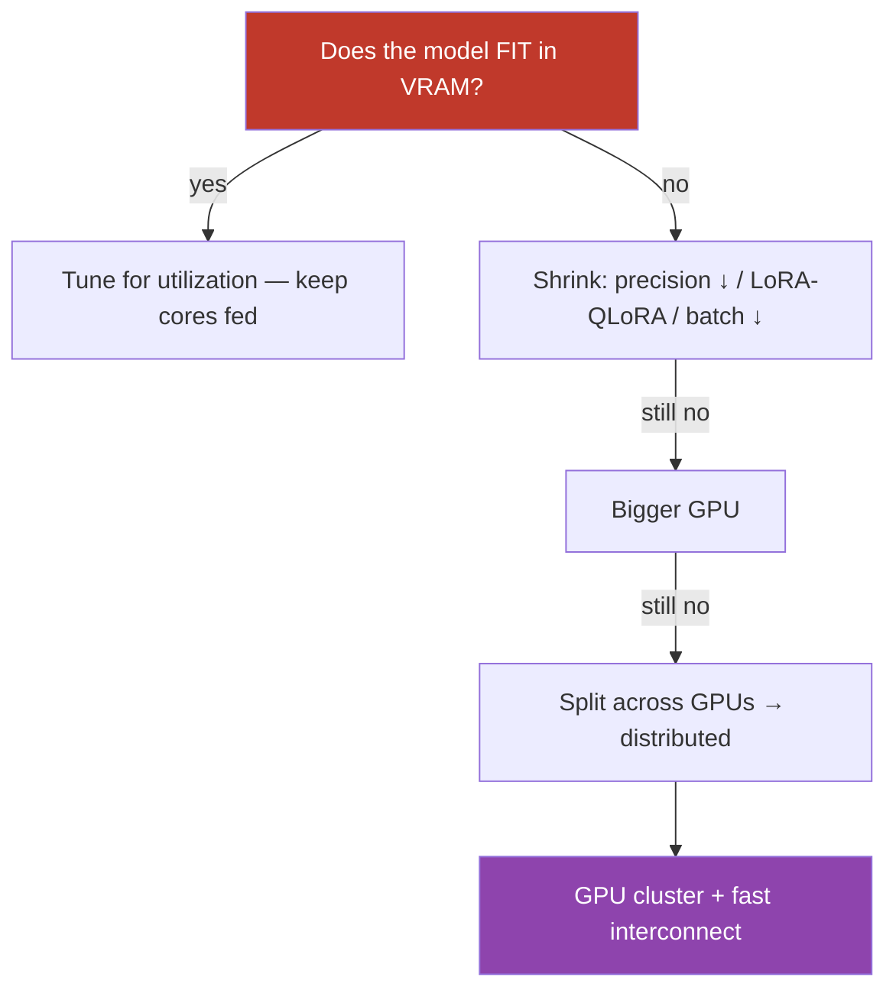

# 17.4 · GPU Cloud Infrastructure ⭐

[⬅ 17.3 Compute](17.3-compute.md) · [🏠 Module 17](../README.md) · [➡ 17.5 Cloud Networking](17.5-networking.md)

> **The lesson in one line:** GPUs are the scarce, expensive engine of modern AI, and the one number that governs everything is **VRAM** — you must be able to *estimate* how much memory a model needs to serve or train, because if it doesn't fit you scale from a single GPU → multi-GPU → distributed training → a GPU cluster, each step adding cost and complexity. Mastering GPU infrastructure is mostly mastering **memory arithmetic and utilization**.


---

## 🎯 Learning objectives

- Understand **GPU architecture basics, VRAM, CUDA, and GPU utilization**.
- **Estimate** model, training, and inference memory requirements.
- Scale from **single GPU → multi-GPU → distributed training → cluster**.
- Optimize **GPU cost** and troubleshoot common GPU failures.

## ✅ Prerequisites

- [17.3 Compute](17.3-compute.md) (why GPUs, VRAM as the constraint).
- Strongly reinforces [16.15 GPU infrastructure](../../16-MLOps/weeks/16.15-gpu-infrastructure.md), [15.7](../../15-Fine-Tuning/weeks/15.7-full-fine-tuning.md), [15.9](../../15-Fine-Tuning/weeks/15.9-qlora.md).

---

## 🧠 Mental model

> [!IMPORTANT]
> **A GPU is a wall of parallel cores fed by a fixed pool of very fast memory (VRAM), and VRAM is the wall you hit first.** Everything a GPU works on — model weights, activations, and (when training) gradients and optimizer state — must live in VRAM simultaneously. So the first question for *any* GPU workload is arithmetic: **"how many bytes does this need, and is that ≤ the GPU's VRAM?"** If yes, you tune for utilization (keep the cores busy). If no, you have three moves: **shrink the memory** (lower precision, LoRA/QLoRA, smaller batch), **use a bigger GPU**, or **split across multiple GPUs** (which introduces distributed-training complexity and inter-GPU networking). CUDA is the software layer that lets your framework actually run on the GPU cores.



## 🔍 Internal explanation

### GPU architecture, briefly

A GPU packs thousands of cores grouped into streaming multiprocessors, paired with **high-bandwidth VRAM** (e.g. 24/40/80 GB on data-center cards). **CUDA** is NVIDIA's platform/API that frameworks (PyTorch, etc.) compile down to so tensors run on those cores. You rarely write CUDA directly, but you feel it: driver/toolkit version mismatches are a top source of "it won't run" ([debugging](#-debugging-workflow--gpu-troubleshooting)). **GPU utilization** (% of time the cores are busy) is your efficiency gauge — low utilization means you're paying for a GPU that's mostly waiting.

### VRAM: what has to fit

> [!IMPORTANT]
> **Inference and training have very different memory footprints — know both formulas.**

**Inference memory** ≈ model weights + KV cache + activation/overhead:
- **Weights** = parameters × bytes-per-parameter. Bytes per param by precision: **fp32 = 4, fp16/bf16 = 2, int8 = 1, int4 = 0.5**.
- **KV cache** (for LLMs) grows with **batch size × sequence length × layers × hidden size** — for long contexts or high concurrency this can rival the weights.
- **Overhead** — activations + fragmentation; budget ~10–20% headroom.

**Training memory** ≈ ~**16 bytes per parameter** for full fine-tuning in mixed precision, because you store: fp16 weights (2) + fp16 gradients (2) + fp32 master weights (4) + Adam optimizer moments m & v (4 + 4) — plus **activations** (which scale with batch size and can dominate). This is why full fine-tuning is so much heavier than inference, and why **LoRA/QLoRA** exist — they freeze the base (no gradient/optimizer state for it), collapsing training memory toward inference levels ([15.8](../../15-Fine-Tuning/weeks/15.8-lora.md), [15.9](../../15-Fine-Tuning/weeks/15.9-qlora.md)).

### Worked estimates

| Model | Precision | Inference weights | Full-FT training (~16 B/param) |
|---|---|---|---|
| 7B | fp16 | 7B × 2 = **~14 GB** (+ KV cache) | ~**112 GB** (won't fit one 80 GB GPU) |
| 7B | int4 | 7B × 0.5 = **~3.5 GB** | — |
| 13B | fp16 | 13B × 2 = **~26 GB** | ~**208 GB** |
| 70B | fp16 | 70B × 2 = **~140 GB** (needs multi-GPU) | ~**1.1 TB** (large cluster) |

**Reading these:** a 7B serves comfortably on one 24–80 GB GPU (fp16) or a tiny one (int4); full fine-tuning a 7B needs multi-GPU or QLoRA; a 70B needs multiple GPUs even just to *serve*. **The arithmetic decides your infrastructure.**

### Scaling ladder: single → multi → distributed → cluster


- **Single GPU** — model + workload fit; no parallelism complexity. Always prefer this if it fits.
- **Multi-GPU (single node)** — split the model (**model/tensor parallelism**) or the batch (**data parallelism**) across GPUs connected by fast intra-node links (NVLink). Needed when one GPU can't hold the model, or to go faster.
- **Distributed training** — scale across *many nodes*; now the **network between nodes** ([17.5](17.5-networking.md)) becomes the bottleneck, and you need frameworks (DDP/FSDP/DeepSpeed) to coordinate gradients.
- **GPU cluster** — a pool of GPU nodes scheduled by Kubernetes ([17.9](17.9-kubernetes.md)), shared across teams/jobs, autoscaled.

Each rung adds cost, coordination overhead, and failure modes — climb only when the memory or speed forces you to.

## 🛠️ Practical implementation

```python
# Quick VRAM estimator (concept — bytes, not exact framework overhead)
BYTES = {"fp32": 4, "fp16": 2, "bf16": 2, "int8": 1, "int4": 0.5}

def inference_vram_gb(params_billion, precision="fp16", kv_gb=0, overhead=0.15):
    weights = params_billion * 1e9 * BYTES[precision]
    total = (weights) / 1e9 + kv_gb
    return round(total * (1 + overhead), 1)

def full_ft_vram_gb(params_billion, activations_gb=0, overhead=0.15):
    # ~16 bytes/param: fp16 w(2)+grad(2)+fp32 master(4)+Adam m,v(4+4)
    state = params_billion * 1e9 * 16 / 1e9
    return round((state + activations_gb) * (1 + overhead), 1)

# 7B fp16 inference ≈ 16 GB with headroom; 7B full-FT ≈ 129 GB → multi-GPU or QLoRA
```

```bash
# The GPU engineer's first two commands, always:
nvidia-smi                 # VRAM used/free, utilization %, driver/CUDA version, processes
nvidia-smi dmon            # live utilization/memory stream — is the GPU actually busy?
```

## 🏭 Production examples

| Goal | Infra |
|---|---|
| Serve a 7B LLM | single 24–80 GB GPU (fp16 or quantized), autoscaled ([17.15](17.15-autoscaling.md)) |
| Serve a 70B LLM | multi-GPU node, tensor-parallel (vLLM) |
| Fine-tune 13B on a budget | single/dual GPU with **QLoRA** ([15.9](../../15-Fine-Tuning/weeks/15.9-qlora.md)) |
| Pretrain/large full-FT | multi-node distributed cluster (FSDP/DeepSpeed) |
| Bursty batch embedding jobs | spot GPUs, scale-to-zero between jobs ([17.14](17.14-cost-optimization.md)) |

## ⚡ Performance considerations

- **Maximize GPU utilization** — the #1 efficiency lever. Low util usually means a **data-loading/CPU-preprocessing bottleneck** starving the GPU, or batches too small.
- **Interconnect matters at scale** — multi-GPU/multi-node performance is often bounded by NVLink/network bandwidth for gradient sync, not compute.
- **Batching for inference throughput** — continuous batching keeps the GPU full across concurrent requests ([16.14](../../16-MLOps/weeks/16.14-model-optimization.md)).
- **Precision as a speed lever** — fp16/bf16 and int8/int4 quantization cut both memory *and* time.

## 💲 Cost considerations

> [!IMPORTANT]
> **GPUs are the single largest AI cost, so the whole game is: use the smallest GPU that fits, keep it busy, and release it when idle.** Concretely — quantize/LoRA to fit smaller GPUs; use **spot/preemptible** instances (with checkpointing) for interruptible training (large discounts); **scale GPU serving toward zero** off-peak; and never let a GPU VM idle. A single idle 8-GPU node can burn thousands of dollars a week. Full toolkit in [17.14](17.14-cost-optimization.md).

## 🔒 Security considerations

- **GPU isolation** — shared/multi-tenant GPUs have weaker isolation than separate nodes; use dedicated GPUs for sensitive data ([17.13](17.13-security.md)).
- **Driver/toolkit supply chain** — pin and verify CUDA/driver images; they run with high privilege.
- **Model weights are sensitive assets** — protect checkpoints in storage (encryption, access control, [17.6](17.6-storage.md), [17.13](17.13-security.md)).

## 🚫 Common mistakes

| Mistake | Consequence |
|---|---|
| Not estimating VRAM before renting | job OOMs on start; wrong instance |
| Forgetting KV cache / activations in the estimate | fits "on paper," OOMs at real batch/context |
| Jumping to multi-GPU when one would fit (quantized) | needless distributed complexity + cost |
| Low GPU utilization ignored | paying full price for a mostly-idle GPU |
| On-demand GPUs for interruptible training | overpaying vs. spot ([17.14](17.14-cost-optimization.md)) |
| Driver/CUDA version mismatch | cryptic "no CUDA device" / crashes |

## 🐛 Debugging workflow / GPU troubleshooting

Incident-style scenarios (see also [exercises](../exercises/README.md)):

1. **CUDA out of memory (OOM).** → Estimate the real footprint (weights + KV/activations + train state). Reduce batch size, shorten sequence/context, lower precision (fp16→int8/int4), enable gradient checkpointing (training), or move to a bigger/multi GPU. First command: `nvidia-smi` to see what's resident.
2. **GPU underutilized / training slow.** → `nvidia-smi dmon` shows low util → the GPU is starved. Fix data loading (more workers, prefetch), move preprocessing off the hot path, increase batch size.
3. **"No CUDA-capable device" / driver errors.** → Driver ↔ CUDA toolkit ↔ framework version mismatch. Pin a known-good CUDA base image; verify `nvidia-smi` works inside the container.
4. **GPU instance unavailable (capacity error).** → GPU scarcity — try another AZ/region ([17.2](17.2-regions-availability.md)), a different instance type, or on-demand vs. spot; build retry/fallback into provisioning.
5. **Multi-GPU job hangs or is slow.** → Interconnect/network bottleneck or a stuck rank; check inter-node bandwidth and NCCL config.

## 🏋️ Exercises

1. **VRAM math.** Compute inference VRAM for 7B/13B/70B at fp16 and int4; which fit an 80 GB GPU?
2. **Training math.** Compute full-FT memory for a 7B and show why it needs multi-GPU or QLoRA; break the ~16 bytes/param into its components.
3. **KV cache.** Explain how batch size and context length grow the KV cache and when it rivals the weights.
4. **Scaling.** For a 70B you must *serve*, decide single vs. multi-GPU and justify with the arithmetic.
5. **Troubleshoot (incident).** You get "CUDA out of memory" mid-training — list, in order, the five things you'd try.
6. **Cost.** Compare on-demand vs. spot for a 10-hour training job, including checkpoint/restart overhead.

## 🛠️ Mini project — "GPU sizing & troubleshooting toolkit" ✅

**Goal:** a reusable VRAM estimator + a GPU incident runbook.

**Requirements:** a script that, given model size, precision, batch, and context, estimates inference *and* full-FT/LoRA training VRAM and recommends a GPU class (or "needs N GPUs"); an incident runbook covering OOM, low utilization, driver mismatch, capacity-unavailable, and multi-GPU stalls (symptom → checks → fix); a cost note comparing on-demand vs. spot for one training run.
**Folder structure**
```
gpu-toolkit/
├── estimate.py         # VRAM estimator + GPU recommendation
├── runbook.md          # incident → diagnosis → fix
└── cost.md             # on-demand vs spot for a sample job
```
**Testing:** validate estimates against known cases (7B fp16 ≈ 14 GB weights; 7B full-FT ≈ 112 GB state).
**Security:** note weight/checkpoint protection ([17.13](17.13-security.md)). **Monitoring:** utilization + VRAM dashboards.
**Future improvements:** add tensor-parallel sizing; integrate real `nvidia-smi` sampling.

## 📄 Cheat sheet

| Thing | Value / rule |
|---|---|
| **Bytes/param** | fp32=4 · fp16/bf16=2 · int8=1 · int4=0.5 |
| **Inference VRAM** | weights + **KV cache** + ~15% overhead |
| **Full-FT VRAM** | **≈16 bytes/param** + activations |
| **⭐ Fit ladder** | shrink (precision/LoRA/batch) → bigger GPU → multi-GPU → distributed → cluster |
| **Scaling** | single → multi-GPU (NVLink) → distributed (network!) → K8s cluster |
| **First commands** | `nvidia-smi`, `nvidia-smi dmon` |
| **⭐ Cost rule** | smallest GPU that fits · keep busy · spot for training · scale-to-zero |
| **⚠️** | forgetting KV cache/activations; driver/CUDA mismatch; idle GPUs |

## 🎴 Flashcards

- **⭐ What is the binding constraint on any GPU workload?** → VRAM — weights + activations (+ gradients & optimizer state for training) must all fit, or it can't run.
- **Bytes per parameter by precision?** → fp32=4, fp16/bf16=2, int8=1, int4=0.5.
- **⭐ Why is full fine-tuning ≈16 bytes/param?** → fp16 weights(2) + fp16 grads(2) + fp32 master(4) + Adam m,v(4+4), plus activations on top.
- **What grows the KV cache?** → Batch size × sequence/context length (× layers × hidden) — for long contexts/high concurrency it can rival the weights.
- **What is CUDA?** → NVIDIA's platform/API that frameworks compile to so tensor ops run on GPU cores.
- **What is GPU utilization and why watch it?** → % of time cores are busy; low utilization means the GPU is starved (data loading/preprocessing) and you're wasting money.
- **⭐ The scaling ladder when a model won't fit?** → Shrink (precision/LoRA/batch) → bigger GPU → multi-GPU (NVLink) → distributed (network-bound) → GPU cluster.
- **First move on "CUDA out of memory"?** → Estimate the real footprint, then cut batch/context/precision or enable checkpointing before reaching for more GPUs.
- **Cheapest way to run interruptible training?** → Spot/preemptible GPUs with checkpointing.

## 💬 Interview questions

1. Estimate the VRAM to serve, and to full-fine-tune, a 7B model. Show your arithmetic.
2. Why is training memory ~8× inference for the same model?
3. What is the KV cache and how does it affect GPU sizing for LLM serving?
4. Walk through the single→multi→distributed→cluster ladder and what forces each step.
5. Diagnose a "GPU is slow" report and a "CUDA out of memory" error.
6. How do you minimize GPU cost without hurting throughput?

## 📝 Summary

- GPU infrastructure is governed by **VRAM arithmetic**: weights (params × bytes/precision) + KV cache/activations for inference, and **≈16 bytes/param** for full-FT training — the numbers decide your infrastructure.
- **CUDA** runs your framework on the cores; **GPU utilization** tells you if you're getting your money's worth (low util = starved GPU).
- When a model won't fit, climb the ladder deliberately — **shrink (precision/LoRA/QLoRA/batch) → bigger GPU → multi-GPU → distributed (now network-bound) → cluster** — each step adds cost and coordination.
- **GPUs are the dominant AI cost**, so: smallest GPU that fits, keep it **busy**, use **spot for training**, and **scale serving to zero** when idle ([17.14](17.14-cost-optimization.md)); most GPU incidents are OOM, starvation, or driver/CUDA mismatches.

## 📚 References

1. **[16.15 GPU Infrastructure](../../16-MLOps/weeks/16.15-gpu-infrastructure.md).** ⭐ Companion MLOps treatment of GPU sizing.
2. **QLoRA / LoRA lessons ([15.8](../../15-Fine-Tuning/weeks/15.8-lora.md), [15.9](../../15-Fine-Tuning/weeks/15.9-qlora.md)).** How to collapse training memory.
3. **NVIDIA CUDA & `nvidia-smi` documentation.** The tools and the platform.
4. **DeepSpeed / PyTorch FSDP docs.** Distributed training at cluster scale.

---

## 🧭 Navigation

| Direction | Link |
|---|---|
| ⬅ Previous | [17.3 · Compute](17.3-compute.md) |
| ➡ Next | [17.5 · Cloud Networking](17.5-networking.md) |
| 🏠 Module | [Module 17](../README.md) |
| 📖 Lessons | [Lesson index](README.md) |
