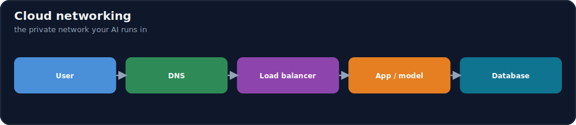
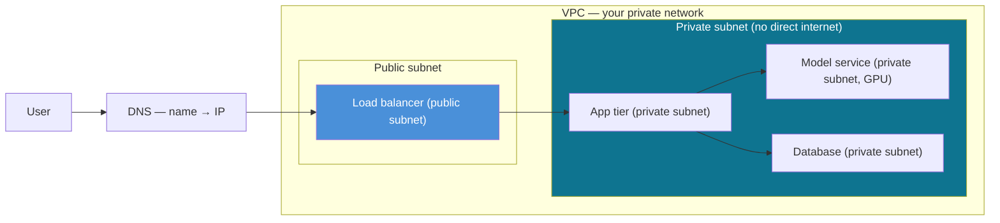

# 17.5 · Cloud Networking ⭐

[⬅ 17.4 GPU Cloud Infrastructure](17.4-gpu-infrastructure.md) · [🏠 Module 17](../README.md) · [➡ 17.6 Storage](17.6-storage.md)

> **The lesson in one line:** Cloud networking is how you build a **private, controlled network for your AI system inside a shared cloud** — a VPC with public and private subnets, firewalls (security groups) that allow only the traffic you intend, load balancers that spread requests across healthy instances, and DNS that turns names into addresses. The request path *User → DNS → Load Balancer → App → Model → Database* is the backbone of every production AI service, and each hop is a networking decision.



---

## 🎯 Learning objectives

- Understand **IP addresses, subnets, routing, DNS, ports, firewalls, load balancers, and private networks**.
- Design a **VPC** with public and private subnets and correct **security groups**.
- Trace and secure the **User → DNS → LB → App → Model → DB** request path.
- Map VPC/VNet/subnet/security-group concepts to **AWS, Azure, and GCP**.

## ✅ Prerequisites

- [17.1 Cloud Fundamentals](17.1-cloud-fundamentals.md), [17.2 Regions & Availability](17.2-regions-availability.md).

---

## 🧠 Mental model

> [!IMPORTANT]
> **A VPC is your own private, walled-off slice of the cloud network — you decide what's reachable from the internet and what's hidden inside.** Think of it as a building: the **public subnet** is the lobby (reachable from outside — your load balancer lives here); the **private subnet** is the back offices (no direct internet route — your model servers and databases live here). **Firewalls / security groups** are the doors, each with a rule saying exactly who may pass on which **port**. A **load balancer** is the receptionist that spreads visitors across many identical workers and skips the ones that are out sick (health checks). **DNS** is the phone book that turns `api.myapp.com` into an IP address. Production security comes from one principle: **expose the front door, hide everything else in private subnets, and open only the specific ports each tier needs.**



## 🔍 Internal explanation

### The primitives

| Primitive | What it is | AI relevance |
|---|---|---|
| **IP address** | a machine's address on the network | every instance/service has one |
| **Subnet** | a slice of the VPC's IP range, public or private | separates internet-facing from internal tiers |
| **Routing** | rules for where packets go | public subnet routes to internet; private doesn't |
| **DNS** | name → IP resolution | stable endpoints; geo-routing ([17.2](17.2-regions-availability.md)) |
| **Port** | a numbered channel on an IP (e.g. 443 HTTPS) | firewalls allow/deny per port |
| **Firewall / security group** | allow/deny rules on traffic | least-privilege network access |
| **Load balancer** | distributes traffic across healthy instances | HA + horizontal scale for inference ([17.15](17.15-autoscaling.md)) |
| **Private network** | internal-only connectivity | keep model/DB/vector-DB off the internet |

### VPC, subnets, and the public/private split

A **VPC (Virtual Private Cloud)** is an isolated virtual network you define with its own IP range. You carve it into **subnets**:
- **Public subnet** — has a route to the internet (via an internet gateway). Only internet-facing components belong here: the **load balancer**, sometimes a bastion/NAT.
- **Private subnet** — *no* direct inbound internet route. Your **app servers, GPU model services, databases, and vector DBs** live here, reachable only through the load balancer or from within the VPC. Outbound internet (e.g. to pull a model) goes through a **NAT gateway** so nothing inbound can reach them directly.

> [!IMPORTANT]
> **The single most important network-security decision: put everything that doesn't need to face the internet in a private subnet.** Your expensive GPU model server and your database should be *unreachable* from the public internet — only the load balancer is exposed, and it forwards to the private tiers. A database or model endpoint on a public IP with a weak firewall is one of the most common and most damaging cloud misconfigurations ([17.13](17.13-security.md)).

### Firewalls / security groups — least privilege for traffic

A **security group** is an instance-level firewall: a set of allow rules like "allow inbound TCP 443 from the internet" or "allow inbound 8000 *only from the app tier's security group*." Best practice mirrors IAM least privilege ([17.13](17.13-security.md)): **default deny, then open only the specific port from the specific source each tier needs.** The load balancer accepts 443 from the world; the app tier accepts traffic *only from the load balancer*; the model service accepts traffic *only from the app tier*; the database accepts traffic *only from the app/model tier*. Each layer can only talk to its neighbor.

### Load balancers

A **load balancer** sits in front of a pool of identical instances and:
- **Distributes** incoming requests across them (spreading load — horizontal scale).
- **Health-checks** them and routes only to healthy ones (HA — dead instances are skipped, [17.2](17.2-regions-availability.md)).
- Terminates TLS, and can route by path/host (Layer 7) or just forward connections (Layer 4).

For AI serving, the LB is what lets you run multiple model replicas across AZs and add/remove them under autoscaling ([17.15](17.15-autoscaling.md)) without clients noticing.

### DNS and the request path

**DNS** resolves `api.myapp.com` → the load balancer's address, giving you a stable name even as instances churn behind it. It's also where **geographic routing** happens — sending each user to the nearest region ([17.2](17.2-regions-availability.md)). The full backbone:

```text
User → DNS (resolve name) → Load Balancer (pick a healthy replica)
     → App tier (logic/orchestration) → Model service (GPU inference)
                                       → Database / vector DB (data)
```

### Cross-cloud mapping

> [!NOTE]
> **Same concept, three names — this is the whole "concepts transfer" thesis in one table.**

| Concept | AWS | Azure | GCP |
|---|---|---|---|
| Private network | **VPC** | **VNet** | **VPC** |
| Instance firewall | Security Group | Network Security Group (NSG) | Firewall rules |
| Public egress for private subnet | NAT Gateway | NAT Gateway | Cloud NAT |
| Load balancer | ELB/ALB/NLB | Load Balancer / App Gateway | Cloud Load Balancing |
| Managed DNS | Route 53 | Azure DNS | Cloud DNS |
| Private link to services | PrivateLink | Private Endpoint | Private Service Connect |

## 🛠️ Practical implementation

```text
Reference VPC layout for an AI service:
  VPC 10.0.0.0/16
  ├── Public subnet  10.0.1.0/24   → Internet Gateway
  │     └── Load Balancer (accepts 443 from internet)
  └── Private subnets 10.0.10.0/24, 10.0.11.0/24  (across 2 AZs) → NAT Gateway (egress only)
        ├── App tier      (accepts 8080 only from LB's security group)
        ├── Model service (accepts 8000 only from App tier's SG; GPU)
        └── Database / vector DB (accepts 5432 only from App/Model SG)
```

```python
# Security-group intent expressed as rules (conceptual):
lb_sg    = ["allow tcp 443 from 0.0.0.0/0"]        # front door open to internet
app_sg   = ["allow tcp 8080 from lb_sg"]            # app only from the LB
model_sg = ["allow tcp 8000 from app_sg"]           # model only from the app
db_sg    = ["allow tcp 5432 from app_sg, model_sg"] # db only from app/model
# Nothing accepts traffic from the internet except the load balancer.
```

## 🏭 Production examples

| Need | Networking |
|---|---|
| Public LLM API, private model & DB | LB in public subnet; model/DB in private subnets |
| Keep vector DB off the internet | private subnet + SG allowing only the app tier |
| Multi-AZ HA serving | LB across AZs → replicas in private subnets per AZ ([17.2](17.2-regions-availability.md)) |
| Reach a managed model API privately | private link/endpoint (no traffic over public internet) |
| Global low latency | geo-DNS → regional load balancers |

## ⚡ Performance considerations

- **Keep chatty paths close** — app↔model↔DB in the same AZ minimizes latency ([17.2](17.2-regions-availability.md)); cross-AZ is fine, cross-region per request is not.
- **Load balancer is a hop** — usually negligible, but health-check tuning affects how fast dead replicas are removed.
- **DNS TTLs** affect how quickly failover/routing changes propagate.

## 💲 Cost considerations

> [!IMPORTANT]
> **Data transfer — especially egress (data leaving the cloud) and cross-region traffic — is a large, easily-overlooked cost.** Traffic *into* the cloud is usually free; traffic *out* to the internet and *between regions* is billed per GB and adds up fast for data-heavy AI (serving large responses, replicating datasets, cross-region calls). NAT gateways and load balancers also bill hourly + per-GB. Design to **keep heavy traffic inside a region/VPC** and minimize egress ([17.14](17.14-cost-optimization.md)).

## 🔒 Security considerations

> [!CAUTION]
> - **Private subnets for everything non-public** — model servers, databases, vector DBs must not have public IPs ([17.13](17.13-security.md)).
> - **Default-deny security groups** — open only the specific port from the specific source; never `0.0.0.0/0` on a database or model port.
> - **TLS everywhere** — terminate HTTPS at the LB; encrypt internal traffic for sensitive data.
> - **Private links to managed services** — keep traffic to model APIs / storage off the public internet.
> - **A misconfigured SG is a breach** — an accidentally-public DB/model port is the classic incident ([troubleshooting](#-debugging-workflow)).

## 🚫 Common mistakes

| Mistake | Consequence |
|---|---|
| Database/model on a public subnet | directly attackable from the internet |
| `0.0.0.0/0` allow rule on an internal port | anyone can reach it |
| No load balancer / single instance | no HA, no horizontal scale |
| Ignoring egress/cross-region transfer cost | surprise bill ([17.14](17.14-cost-optimization.md)) |
| Over-broad security groups ("allow all") | huge blast radius |
| Forgetting NAT for private-subnet egress | instances can't pull models/updates |

## 🐛 Debugging workflow

Network incident (see [exercises](../exercises/README.md) for the full drills):
1. **"Network access is blocked" / service unreachable.** → Check security-group rules first: is the port open from the *right source*? Then subnet routing (is it private with no route?), then the LB health checks (is the target marked unhealthy?).
2. **Database becomes unreachable.** → SG change? subnet/route change? DB in a failed AZ? Confirm the app tier's SG is still allowed on the DB port.
3. **Intermittent 5xx from the API.** → LB routing to unhealthy replicas — check health-check config and replica status.
4. **Works from one place, not another.** → Source-IP-based SG rule or DNS geo-routing sending you elsewhere.
5. **Can reach the internet inbound but private instances can't reach out.** → Missing/broken NAT gateway for the private subnet.

## 🏋️ Exercises

1. **Conceptual.** Explain public vs. private subnet and what belongs in each for an AI service.
2. **Design.** Draw a VPC for an LLM API: LB, app, GPU model, DB — assign subnets and security-group rules.
3. **Least privilege.** Write the four security-group rules so each tier talks only to its neighbor.
4. **Mapping.** Fill in the VPC/VNet, SG/NSG, LB, DNS names for AWS/Azure/GCP.
5. **Incident.** "Network access is blocked to the model service" — list your diagnosis steps in order.
6. **Cost.** Identify which paths in your design incur egress/cross-region charges and how to reduce them.

## 🛠️ Mini project — "Secure VPC blueprint for an AI service"

**Goal:** a complete, least-privilege network design for an LLM+RAG API.

**Requirements:** a VPC with a public subnet (LB only) and private subnets across 2 AZs (app, GPU model, database, vector DB); security-group rules implementing tier-to-tier least privilege (nothing but the LB reachable from the internet); DNS name → LB; a note on TLS termination and private links to any managed services; a labeled cross-cloud mapping (AWS/Azure/GCP).
**Deliverable:** the network diagram, the security-group rule table, and the cross-cloud mapping.
**Extension:** add a troubleshooting runbook for "port blocked," "DB unreachable," and "unhealthy replicas."

## 📄 Cheat sheet

| Concept | Essence |
|---|---|
| **VPC / VNet** | your isolated private cloud network |
| **Public subnet** | has internet route — LB / NAT only |
| **Private subnet** | no inbound internet — app / model / DB |
| **Security group / NSG** | instance firewall; default-deny, allow per port+source |
| **Load balancer** | spread traffic across healthy replicas (HA + scale) |
| **DNS** | name → IP; stable endpoint; geo-routing |
| **NAT gateway** | outbound-only internet for private subnets |
| **⭐ Rule** | expose the LB; hide model/DB/vector-DB in private subnets |
| **⚠️** | public DB/model port; `0.0.0.0/0` internal rule; egress cost |

## 🎴 Flashcards

- **⭐ What is a VPC and why does it matter?** → Your isolated private network in the cloud where you control what's reachable from the internet vs. hidden internally.
- **⭐ Public vs. private subnet — what goes where?** → Public (internet route) holds the load balancer only; private (no inbound internet) holds app servers, GPU model services, databases, and vector DBs.
- **What is a security group and the best-practice posture?** → An instance-level firewall; default-deny, then allow only the specific port from the specific source each tier needs.
- **What does a load balancer do for AI serving?** → Distributes requests across healthy model replicas and health-checks them — giving HA and horizontal scale.
- **What is the standard AI request path?** → User → DNS → Load Balancer → App tier → Model service → Database/vector DB.
- **Name the AWS/Azure/GCP terms for a private network.** → VPC / VNet / VPC (security groups / NSG / firewall rules).
- **Why is a public database port so dangerous?** → It's directly attackable from the internet — a classic breach; databases belong in private subnets with tight SGs.
- **What's the sneaky networking cost?** → Egress (data leaving the cloud) and cross-region transfer, billed per GB.
- **What does a NAT gateway do?** → Gives private-subnet instances outbound internet (to pull models/updates) with no inbound access.

## 💬 Interview questions

1. Design the network for a production LLM API. Where does each tier live and why?
2. Explain public vs. private subnets and what should never be public.
3. How do security groups implement least privilege across tiers?
4. What does a load balancer provide beyond distributing traffic?
5. Map VPC/subnet/security-group/LB/DNS across AWS, Azure, and GCP.
6. Where do networking costs come from and how do you minimize them?

## 📝 Summary

- Cloud networking builds a **private, controlled network (VPC/VNet)** inside the shared cloud, split into **public subnets** (internet-facing — load balancer only) and **private subnets** (app, GPU model, database, vector DB — no inbound internet).
- **Security groups** are tier-level firewalls; the discipline is **default-deny, least-privilege**, so each tier talks only to its neighbor and **only the load balancer faces the internet**.
- **Load balancers** give HA and horizontal scale by spreading traffic across health-checked replicas; **DNS** provides stable names and geo-routing — together forming the **User → DNS → LB → App → Model → DB** backbone.
- The same concepts map across clouds (**VPC/VNet, SG/NSG, LB, DNS**); watch **egress and cross-region transfer costs**, and never expose a database or model port publicly ([17.13](17.13-security.md), [17.14](17.14-cost-optimization.md)).

## 📚 References

1. **Provider VPC/VNet networking docs (AWS/Azure/GCP).** The three dialects of the same primitives.
2. **[17.13 Cloud Security](17.13-security.md).** ⭐ Network security as part of defense-in-depth.
3. **[17.2 Regions & Availability](17.2-regions-availability.md).** Load balancing across AZs; geo-DNS.
4. **[17.15 Autoscaling](17.15-autoscaling.md).** How the LB and autoscaler cooperate.

---

## 🧭 Navigation

| Direction | Link |
|---|---|
| ⬅ Previous | [17.4 · GPU Cloud Infrastructure](17.4-gpu-infrastructure.md) |
| ➡ Next | [17.6 · Storage](17.6-storage.md) |
| 🏠 Module | [Module 17](../README.md) |
| 📖 Lessons | [Lesson index](README.md) |
