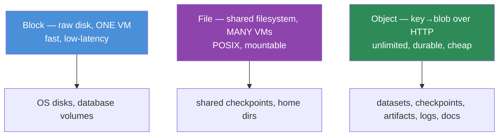

# 17.6 · Storage

[⬅ 17.5 Cloud Networking](17.5-networking.md) · [🏠 Module 17](../README.md) · [➡ 17.7 Databases for AI Systems](17.7-databases.md)

> **The lesson in one line:** The cloud offers three storage shapes — **block** (a raw virtual disk attached to one VM), **file** (a shared filesystem several machines mount), and **object** (a flat, infinitely-scalable key→blob store accessed over HTTP) — and for AI, **object storage is the workhorse**: it's where training datasets, model checkpoints, artifacts, logs, and documents live, because it's cheap, durable, and scales without limit.

---

## 🎯 Learning objectives

- Distinguish **block, file, and object storage** and their trade-offs.
- Match AI artifacts — **datasets, checkpoints, model artifacts, logs, documents, embeddings** — to the right storage.
- Understand cloud **object storage** (S3 / Blob / GCS) as the AI data lake.

## ✅ Prerequisites

- [17.1 Cloud Fundamentals](17.1-cloud-fundamentals.md). Pairs with [17.7 Databases](17.7-databases.md).

---

## 🧠 Mental model

> [!IMPORTANT]
> **Three storage shapes, three access patterns.** **Block storage** is a raw disk — you attach it to *one* VM, format it, and it behaves like a local drive (fast, low-latency; this is what your VM's OS and databases run on). **File storage** is a shared network filesystem — *many* machines mount the same directory tree (good for shared checkpoints, NFS-style access). **Object storage** is different in kind: a flat namespace of **keys → objects (blobs)** accessed over HTTP, with virtually unlimited capacity, extreme durability, and cheap price — but higher latency and no in-place edits (you replace whole objects). **For AI, object storage is home base**: datasets, checkpoints, and documents are large, write-once-read-many blobs — exactly what object storage is built for.



## 🔍 Internal explanation

### The three shapes compared

| | **Block** | **File** | **Object** |
|---|---|---|---|
| **Abstraction** | raw disk / volume | filesystem (directories) | flat key → blob |
| **Access** | attached to one VM | mounted by many VMs | HTTP API (get/put) |
| **Latency** | lowest | low | higher |
| **Capacity** | fixed (resize-able) | large | effectively unlimited |
| **Edits** | in-place (block-level) | in-place | replace whole object |
| **Cost/GB** | higher | higher | **lowest** |
| **Durability** | high | high | **very high** (replicated) |
| **AI use** | DB volumes, VM disks | shared training scratch | **datasets, checkpoints, artifacts, logs, docs** |

### Why object storage is the AI workhorse

Object storage wins for AI data because AI artifacts are **large, immutable-ish blobs read many times**:
- **Unlimited scale** — training datasets can be terabytes; object stores don't have a fixed size.
- **Cheap** — the lowest cost/GB, with cheaper tiers for cold data (old checkpoints, archives).
- **Durable** — data is replicated across devices/AZs; designed for extreme durability (you won't lose a checkpoint).
- **Decoupled from compute** — any number of GPU workers can read the same dataset over HTTP; storage and compute scale independently.
- **Versioning + lifecycle** — keep dataset/checkpoint versions ([16.3](../../16-MLOps/weeks/16.3-data-versioning.md)) and auto-expire or archive old ones to save cost.

> [!IMPORTANT]
> **Object storage is the backbone of the AI data lifecycle: raw data lands here, training reads from here, checkpoints and final model artifacts are written here, and logs accumulate here.** It's the durable "source of truth" that ephemeral compute (VMs, GPU nodes, containers) reads from and writes to. When a GPU node dies mid-training, the checkpoint in object storage is what lets you resume — never keep the only copy of something important on a VM's local disk.

### Matching AI artifacts to storage

| Artifact | Storage | Why |
|---|---|---|
| **Training datasets** | object | large, read-many, versioned; workers stream from it |
| **Model checkpoints** | object | durable, survive node failure, resumable |
| **Model artifacts (final weights)** | object (+ registry ref) | durable, served/downloaded by inference nodes ([16.5](../../16-MLOps/weeks/16.5-model-registry.md)) |
| **Logs** | object (+ log service) | append-heavy, cheap, archived |
| **Documents (for RAG)** | object | source docs before chunking/embedding ([17.7](17.7-databases.md)) |
| **Embeddings** | **vector DB**, not object | need similarity search, not blob retrieval ([17.7](17.7-databases.md)) |
| **Database data** | block (DB volume) | low-latency random access |
| **Shared scratch during distributed training** | file | many nodes mount the same path |

> [!NOTE]
> **Embeddings are the exception.** You *store* the source documents in object storage, but the **embeddings** go in a **vector database** ([17.7](17.7-databases.md)) because retrieval needs *similarity search*, not key lookup. Don't put embeddings in object storage expecting to query them.

## 🛠️ Practical implementation

```python
# Object storage is a key → blob store over HTTP. The mental API (provider-agnostic):
#   put(bucket, key, bytes)      # write/replace a whole object
#   get(bucket, key) -> bytes    # read it
#   list(bucket, prefix)         # enumerate keys under a prefix ("folder")
# A training job:
#   1. read dataset:   get("datasets", "imagenet/v3/shard-0001.tar")
#   2. checkpoint:     put("checkpoints", "run-42/epoch-5.pt", weights)   # survive node death
#   3. final artifact: put("models", "classifier/v1.2/model.safetensors", weights)
# "Folders" are just key prefixes — the namespace is flat.
```

**Storage tiers** (cost lever): hot (frequent access) → warm → cold/archive (rare access, cheap, slow retrieval). Move old checkpoints/datasets to colder tiers via lifecycle rules ([17.14](17.14-cost-optimization.md)).

## 🏭 Production examples

| System | Storage layout |
|---|---|
| Training pipeline | dataset + checkpoints + artifacts all in object storage; block for the DB |
| RAG ingestion | source docs in object storage → chunk → embed → vector DB ([17.7](17.7-databases.md)) |
| Model serving | inference node pulls weights from object storage / registry on startup |
| Distributed training | dataset in object storage; shared scratch on file storage; checkpoints back to object |
| Log pipeline | app logs → object storage (cheap archive) + a query/log service |

## ⚡ Performance considerations

- **Object storage has higher latency than block** — great for throughput (streaming big files), poor for tiny random reads. For many-small-file datasets, pack into shards (tar/parquet/webdataset) to read sequentially.
- **Read throughput scales with parallelism** — many workers reading many objects saturate bandwidth; single-stream reads are slower.
- **Keep storage in the same region as compute** — cross-region reads are slow and incur egress ([17.5](17.5-networking.md), [17.14](17.14-cost-optimization.md)).
- **Block storage IOPS/throughput are provisioned** — size the DB volume's performance tier to the workload.

## 💲 Cost considerations

> [!IMPORTANT]
> **Object storage is cheap per GB but two things bite: request/egress charges and forgotten data.** You pay per GB stored, per request, and — painfully — for **egress** when data leaves the region/cloud. Big levers: use **lifecycle rules** to auto-move old data to cold tiers or delete it; keep compute and storage **co-located** to avoid egress; and **clean up** old checkpoints/datasets (they accumulate silently). Block and file storage cost more per GB — don't use them where object storage fits ([17.14](17.14-cost-optimization.md)).

## 🔒 Security considerations

> [!CAUTION]
> - **A public storage bucket is a top cause of data breaches** — default to **private**, grant access via IAM, never make dataset/model buckets world-readable ([17.13](17.13-security.md)).
> - **Encrypt at rest and in transit** — enable default encryption; use TLS for access.
> - **Least-privilege access** — a serving node needs read on the model bucket, not write on the dataset bucket.
> - **Misconfigured permissions** (see [incident drills](../exercises/README.md)) — audit bucket policies; block public access at the account level.

## 🚫 Common mistakes

| Mistake | Consequence |
|---|---|
| Keeping the only checkpoint on a VM's local disk | node dies → training lost |
| Putting embeddings in object storage | can't do similarity search ([17.7](17.7-databases.md)) |
| Public bucket for datasets/models | data breach ([17.13](17.13-security.md)) |
| Millions of tiny objects | slow reads, high request cost — shard instead |
| No lifecycle rules | cold data piles up at hot-tier prices |
| Cross-region reads for training | slow + egress cost |

## 🐛 Debugging workflow

Storage incident: (1) **"Storage permissions misconfigured" / access denied.** → Check the IAM policy and bucket policy: does the principal have the needed action on the resource? Is public access (correctly) blocked? (2) **Training I/O slow.** → Too many small objects (shard them), single-stream reads (parallelize), or cross-region (co-locate). (3) **Checkpoint missing after node failure.** → Was it actually written to object storage, or only local disk? (4) **Storage bill spiking.** → Egress or hot-tier accumulation — add lifecycle rules, check cross-region traffic. (5) **Bucket accidentally public.** → Lock it down, enable account-level public-access block, audit who accessed it.

## 🏋️ Exercises

1. **Conceptual.** Compare block/file/object on access, latency, capacity, cost, and give an AI use for each.
2. **Matching.** Place datasets, checkpoints, DB data, RAG docs, embeddings, and shared scratch on the right storage.
3. **Why object.** Explain why object storage is the AI data lake in terms of scale, cost, durability, and compute-decoupling.
4. **Cost.** Design lifecycle rules for training checkpoints and old datasets; estimate the savings.
5. **Incident.** "Storage permissions are misconfigured — serving can't load the model" — walk through your fix.
6. **Sharding.** Explain why a dataset of 10M tiny files is slow to train on and how you'd fix it.

## 🛠️ Mini project — "AI storage architecture"

**Goal:** a complete storage plan for a training + RAG system.

**Requirements:** map every artifact (raw data, dataset versions, checkpoints, final model, logs, RAG source docs, embeddings) to block/file/object/vector-DB with justification; a bucket layout with key-prefix conventions and versioning; IAM least-privilege access per role (trainer, server, RAG ingester); lifecycle rules for cost; a note on encryption and blocking public access.
**Deliverable:** the storage architecture diagram + the bucket/IAM/lifecycle spec.
**Extension:** add a cross-region DR copy for critical artifacts and estimate its cost ([17.2](17.2-regions-availability.md), [17.14](17.14-cost-optimization.md)).

## 📄 Cheat sheet

| Type | Shape | AI use |
|---|---|---|
| **Block** | raw disk, one VM, fastest | DB volumes, OS disks |
| **File** | shared filesystem, many VMs | distributed-training scratch |
| **Object** | key→blob over HTTP, unlimited, cheap, durable | **datasets, checkpoints, artifacts, logs, docs** |
| **⭐ Object storage** | the AI data lake / source of truth | ephemeral compute reads/writes here |
| **Embeddings** | → **vector DB**, not object ([17.7](17.7-databases.md)) | similarity search |
| **Tiers** | hot → warm → cold/archive | lifecycle rules cut cost |
| **⚠️** | public buckets, tiny-file datasets, VM-only checkpoints, egress |
| **Cross-cloud** | S3 (AWS) · Blob (Azure) · GCS (GCP) |

## 🎴 Flashcards

- **⭐ Block vs. file vs. object storage?** → Block = raw disk for one VM (fastest); file = shared filesystem for many VMs; object = key→blob over HTTP, unlimited/cheap/durable (higher latency).
- **⭐ Why is object storage the AI workhorse?** → AI artifacts are large, durable, read-many blobs; object storage is cheap, effectively unlimited, extremely durable, and decoupled from compute.
- **What goes in object storage for AI?** → Training datasets, model checkpoints, final artifacts, logs, and RAG source documents.
- **What's the object-storage exception?** → Embeddings — they need similarity search, so they go in a vector DB, not object storage.
- **Why never keep the only checkpoint on local disk?** → A VM/GPU node can die; checkpoints in object storage survive and let you resume.
- **What are storage tiers for?** → Moving cold data (old checkpoints/datasets) to cheaper hot→warm→cold tiers via lifecycle rules.
- **Top storage security mistake?** → A public bucket exposing datasets/models — default to private with least-privilege IAM.
- **Why are millions of tiny objects a problem?** → Slow reads and high request costs; pack into shards (tar/parquet) for sequential reads.
- **Name the three object stores.** → S3 (AWS), Blob Storage (Azure), Cloud Storage (GCP).

## 💬 Interview questions

1. Compare block, file, and object storage and give an AI use for each.
2. Why is object storage the default for datasets, checkpoints, and artifacts?
3. Where do embeddings belong and why not object storage?
4. How do storage tiers and lifecycle rules control cost?
5. What are the main storage security risks and how do you mitigate them?
6. Why should checkpoints always land in object storage, not local disk?

## 📝 Summary

- Three storage shapes: **block** (raw disk, one VM, fastest — DB/OS volumes), **file** (shared filesystem, many VMs — distributed scratch), and **object** (key→blob over HTTP, unlimited/cheap/durable).
- **Object storage is the AI data lake** — datasets, checkpoints, artifacts, logs, and RAG source documents live there because they're large, durable, read-many blobs decoupled from ephemeral compute; it's the source of truth GPU nodes read from and write to.
- **Embeddings are the exception** — they need a **vector database** ([17.7](17.7-databases.md)) for similarity search, not blob retrieval.
- Control cost with **tiers/lifecycle rules and co-location** (avoid egress), and secure with **private-by-default buckets, least-privilege IAM, and encryption** — a public bucket is a classic breach ([17.13](17.13-security.md), [17.14](17.14-cost-optimization.md)).

## 📚 References

1. **Object storage docs — S3 / Azure Blob / Google Cloud Storage.** The three dialects.
2. **[16.3 Data Versioning](../../16-MLOps/weeks/16.3-data-versioning.md).** Versioning datasets/artifacts in object storage.
3. **[17.7 Databases for AI](17.7-databases.md).** Where embeddings and structured data go instead.
4. **WebDataset / sharding guides.** Making large datasets fast to stream.

---

## 🧭 Navigation

| Direction | Link |
|---|---|
| ⬅ Previous | [17.5 · Cloud Networking](17.5-networking.md) |
| ➡ Next | [17.7 · Databases for AI Systems](17.7-databases.md) |
| 🏠 Module | [Module 17](../README.md) |
| 📖 Lessons | [Lesson index](README.md) |
