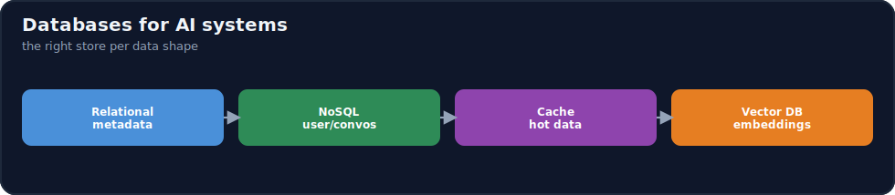
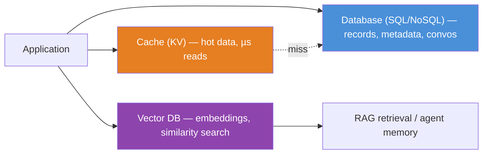

# 17.7 · Databases for AI Systems ⭐

[⬅ 17.6 Storage](17.6-storage.md) · [🏠 Module 17](../README.md) · [➡ 17.8 Containers](17.8-containers.md)

> **The lesson in one line:** AI systems don't have "a database" — they have a **portfolio of stores, each matched to a data shape**: a relational DB for structured metadata and transactions, a NoSQL/document store for flexible user data and conversations, a key-value **cache** for hot data, and a **vector database** for embeddings (the store that makes RAG and semantic memory possible). Choosing correctly is choosing the store whose access pattern matches your query.



---

## 🎯 Learning objectives

- Distinguish **relational, NoSQL (document/key-value), and vector** databases and when to use each.
- Design data stores for **ML metadata, user data, conversations, embeddings, RAG, and agent memory**.
- Understand the **Application → Database → Cache → Vector DB** access pattern.

## ✅ Prerequisites

- [17.6 Storage](17.6-storage.md). Helpful: [13.x RAG](../../13-RAG/README.md) (embeddings & retrieval), [14.5 memory](../../14-AI-Agents/weeks/14.5-memory.md).

---

## 🧠 Mental model

> [!IMPORTANT]
> **Pick the database by the *shape of the data and the query*, not by habit.** Structured records with relationships and transactions (users, orders, ML run metadata) → **relational** (SQL). Flexible, schema-light documents you fetch by key (a conversation, a user profile, a JSON blob) → **document/NoSQL**. Tiny hot values you read constantly and can afford to lose → **key-value cache** (in-memory, microsecond reads). And the one unique to AI: **embeddings** — high-dimensional vectors you query by *similarity* ("find the 5 chunks most like this question") → a **vector database**. RAG and long-term agent memory are impossible without vector search, because you're retrieving by *meaning*, not by exact key. Most real AI systems use **several of these together**, each for what it's best at.



## 🔍 Internal explanation

### The database families

| Family | Model | Query by | AI use |
|---|---|---|---|
| **Relational (SQL)** | tables + relationships, ACID transactions | structured queries, joins | ML metadata, users, billing, labels |
| **Document (NoSQL)** | schema-flexible JSON documents | key / document fields | conversations, user profiles, flexible configs |
| **Key-value / cache** | key → value, usually in-memory | exact key, ultra-fast | hot data, sessions, embedding/response cache |
| **Vector** | high-dim vectors + metadata | **similarity (nearest-neighbor)** | embeddings for RAG, semantic memory |

### Relational vs. NoSQL — the classic axis

- **Relational (SQL)** gives you a **fixed schema, joins, and ACID transactions** — correctness guarantees ideal for data with relationships and integrity requirements (an experiment's metadata linked to its dataset and metrics; a user's account and permissions). Trade-off: schema changes are heavier, and scaling writes horizontally is harder.
- **NoSQL/document** gives you **flexible schema and easy horizontal scale** — ideal for data whose shape varies or evolves (a chat conversation with arbitrary message metadata, a user profile with optional fields). Trade-off: weaker cross-document consistency and no rich joins.

> [!NOTE]
> Rule of thumb: **structured + relational + transactional → SQL; flexible + high-volume + fetched-by-key → NoSQL.** Many AI apps use both — SQL for the system-of-record (users, billing, ML metadata), NoSQL for high-volume flexible data (conversations, events).

### The cache layer

A **cache** (in-memory key-value store) sits in front of slower stores to serve **hot, frequently-read data in microseconds**. For AI it's a major cost/latency lever:
- **Response/embedding cache** — don't re-embed or re-generate for a repeated input ([17.14](17.14-cost-optimization.md)).
- **Session/conversation state** — fast access to recent context.
- **Rate-limit counters, feature flags** — tiny hot values.

The pattern: **app checks cache → on miss, reads the DB → writes the result back to cache**. Caches are for speed, not durability (data can be evicted), so never make a cache the only copy.

### The vector database — the AI-specific store

> [!IMPORTANT]
> **A vector database exists to answer one question fast: "which stored items are most *similar* to this one?" — and that question is the engine of RAG and semantic memory.** You embed text (or images) into high-dimensional vectors ([13.x](../../13-RAG/README.md)); the vector DB indexes them so that, given a query vector, it returns the nearest neighbors in milliseconds even across billions of vectors (using approximate-nearest-neighbor indexes like HNSW/IVF). A relational or object store *cannot* do this efficiently — similarity search is a fundamentally different access pattern from key lookup or SQL filtering. This is why "just put the embeddings in Postgres" only works at small scale (or with a vector *extension*); at scale you need a purpose-built vector index.

Vector DBs also store **metadata alongside each vector** (source doc, chunk id, timestamp, permissions) so you can **filter** ("nearest neighbors *from this user's documents*") — essential for multi-tenant RAG and access control.

### Designing stores per AI subsystem

| Subsystem | Store(s) | Why |
|---|---|---|
| **ML metadata** (runs, params, metrics, lineage) | relational | structured, related, queried/joined ([16.4](../../16-MLOps/weeks/16.4-experiment-tracking.md)) |
| **User data / accounts** | relational (or document) | integrity + relationships |
| **Conversations** | document/NoSQL (+ cache for recent) | flexible, high-volume, fetched by session |
| **Embeddings** | **vector DB** | similarity search for RAG |
| **RAG system** | object (docs) + vector (embeddings) + relational (metadata) | each layer its own store ([17.6](17.6-storage.md)) |
| **Agent memory** | vector (semantic recall) + document/KV (working state) | recall by meaning + fast state ([14.5](../../14-AI-Agents/weeks/14.5-memory.md)) |

## 🛠️ Practical implementation

```python
# The layered access pattern (provider/vendor-agnostic):
def answer(question, user_id):
    if (hit := cache.get(question)):          # 1. cache: µs, avoid recompute
        return hit
    qvec = embed(question)                     # 2. embed the query
    chunks = vectordb.search(                   # 3. vector DB: similarity + metadata filter
        qvec, k=5, filter={"user_id": user_id}  #    (RAG retrieval, access-scoped)
    )
    meta = sql.query(                           # 4. relational: structured metadata/joins
        "SELECT title, url FROM docs WHERE id = ANY(:ids)", ids=[c.doc_id for c in chunks]
    )
    ans = llm(question, context=chunks)         # 5. generate
    cache.set(question, ans, ttl=3600)          # 6. write-back to cache
    return ans
# Four stores, each doing what it's best at — the hallmark of a real AI data layer.
```

## 🏭 Production examples

| System | Data layer |
|---|---|
| RAG assistant | object (docs) → vector DB (chunks) + relational (doc metadata) + cache (answers) |
| Chat product | document DB (conversations) + cache (recent turns) + relational (users/billing) |
| ML platform | relational (experiment metadata/lineage) + object (artifacts) ([16.4](../../16-MLOps/weeks/16.4-experiment-tracking.md)) |
| Agent | vector (long-term memory) + KV (working state) + relational (audit log) ([14.5](../../14-AI-Agents/weeks/14.5-memory.md)) |

## ⚡ Performance considerations

- **Cache the hot path** — response/embedding caching is one of the biggest latency and cost wins in AI ([17.14](17.14-cost-optimization.md)).
- **Vector index choice is a recall/latency trade-off** — approximate indexes (HNSW/IVF) trade a little accuracy for huge speed; tune for your scale.
- **Metadata filtering in the vector DB** — pre-filtering vs. post-filtering affects both correctness (access control) and speed.
- **Co-locate stores with compute** — cross-AZ/region DB hops add latency ([17.5](17.5-networking.md)).

## 💲 Cost considerations

> [!IMPORTANT]
> **The two AI-specific database costs are the vector DB (memory-heavy at scale) and the compute you *avoid* with caching.** Vector indexes often live in RAM for speed, so billions of vectors get expensive — dimensionality-reduction, quantization, and tiering help. Caching, conversely, is a cost *saver*: every cached embedding/response is an LLM/embedding call you didn't pay for. Right-size the DB tier to the workload, and use managed vs. self-hosted based on scale and ops capacity ([16.22](../../16-MLOps/weeks/16.22-cloud.md)).

## 🔒 Security considerations

> [!CAUTION]
> - **Databases live in private subnets** — never a public DB port ([17.5](17.5-networking.md), [17.13](17.13-security.md)).
> - **Multi-tenant isolation in the vector DB** — filter retrieval by tenant/user; a missing filter leaks another user's documents into RAG answers.
> - **Encrypt at rest and in transit**; least-privilege DB credentials via a secrets manager ([17.13](17.13-security.md)).
> - **PII in embeddings** — embeddings can leak information; treat the vector store as sensitive.

## 🚫 Common mistakes

| Mistake | Consequence |
|---|---|
| Embeddings in a relational/object store at scale | slow or impossible similarity search |
| No metadata filter on vector search | cross-tenant data leak in RAG |
| Cache as the only copy of data | data loss on eviction |
| SQL for high-volume flexible conversations | schema pain, scaling limits |
| NoSQL for relational/transactional data | lost integrity, no joins |
| Public database port | breach ([17.5](17.5-networking.md)) |

## 🐛 Debugging workflow

Data-layer incident: (1) **"Database becomes unreachable."** → Network first (SG/subnet — [17.5](17.5-networking.md)), then DB health/failover ([17.2](17.2-regions-availability.md)), then connection-pool exhaustion. (2) **RAG returns wrong/other users' docs.** → Missing or wrong metadata filter on the vector search — a security bug, fix immediately. (3) **Retrieval slow.** → Vector index type/params, or index not fitting in memory (spilling to disk). (4) **Latency spikes under load.** → Add/scale the cache; check DB connection limits. (5) **Stale answers.** → Cache TTL too long or no invalidation on data change.

## 🏋️ Exercises

1. **Conceptual.** Compare relational, document, key-value, and vector DBs on data shape and query type.
2. **Design.** Choose stores for a RAG assistant (docs, chunks, metadata, cached answers) and justify each.
3. **Vector.** Explain why similarity search needs a vector DB and can't be done efficiently in SQL at scale.
4. **Agent memory.** Design the data layer for an agent's working state + long-term semantic memory.
5. **Security.** Show how a missing vector-search filter causes a multi-tenant leak and how to prevent it.
6. **Incident.** "Database unreachable" — order your diagnosis from network to DB.

## 🛠️ Mini project — "AI data layer design"

**Goal:** the complete data layer for a multi-tenant RAG + chat product.

**Requirements:** map every data type (users, billing, conversations, ML metadata, documents, embeddings, cache) to relational/document/KV/vector/object with justification; show the layered access pattern (cache → DB → vector DB) in code or diagram; implement **tenant isolation** on vector search; place all databases in private subnets with least-privilege credentials; add a caching strategy with TTLs and invalidation.
**Deliverable:** the data-layer diagram, the store-selection table, and the access-pattern pseudocode.
**Extension:** add cost estimates (vector DB memory, cache savings) and a managed-vs-self-hosted decision.

## 📄 Cheat sheet

| Store | Use for | Query |
|---|---|---|
| **Relational (SQL)** | metadata, users, transactions | joins, ACID |
| **Document (NoSQL)** | conversations, profiles, flexible data | by key/fields |
| **Key-value cache** | hot data, sessions, response cache | exact key, µs |
| **⭐ Vector DB** | embeddings (RAG, agent memory) | **similarity + metadata filter** |
| **Object** | source docs, artifacts ([17.6](17.6-storage.md)) | key→blob |
| **⭐ Pattern** | cache → DB → vector DB, each for its strength |
| **⚠️** | embeddings in SQL at scale; missing tenant filter; public DB port |
| **Cross-cloud** | managed SQL/NoSQL + vector (pgvector, Pinecone, etc.) |

## 🎴 Flashcards

- **⭐ How do you choose an AI database?** → By the shape of the data and the query: structured/transactional → SQL; flexible/by-key → NoSQL; hot values → KV cache; embeddings/similarity → vector DB.
- **⭐ Why do RAG and agent memory need a vector database?** → They retrieve by *similarity* (meaning), which is a nearest-neighbor query that relational/object stores can't do efficiently at scale.
- **Relational vs. NoSQL trade-off?** → SQL gives schema, joins, and ACID (integrity); NoSQL gives flexible schema and easy horizontal scale (high-volume, by-key).
- **What is a cache for in AI systems?** → Serving hot data (recent context, repeated embeddings/responses) in microseconds — a big latency and cost saver; never the only copy.
- **What must a vector DB store besides vectors?** → Metadata (source, tenant, timestamp) so you can *filter* similarity results — essential for multi-tenant RAG and access control.
- **Classic multi-tenant RAG bug?** → Missing the tenant/user filter on vector search, leaking other users' documents into answers.
- **Where do source documents vs. embeddings go?** → Documents in object storage; embeddings in the vector DB.
- **The layered access pattern?** → App → cache (fast) → on miss DB → vector DB for retrieval, write results back to cache.

## 💬 Interview questions

1. How do you choose between relational, NoSQL, and vector databases for an AI system?
2. Why can't you do RAG retrieval efficiently in a relational database at scale?
3. What does a vector database store beyond vectors, and why does metadata matter?
4. Where does caching help most in an AI system, and what are its risks?
5. Design the data layer for a multi-tenant RAG chat product.
6. How do you secure and isolate databases in an AI architecture?

## 📝 Summary

- AI systems use a **portfolio of stores, each matched to a data shape**: **relational** (structured metadata, users, transactions), **document/NoSQL** (flexible, high-volume conversations/profiles), **key-value cache** (hot data, µs reads, cost saver), and **vector DB** (embeddings).
- The **vector database is the AI-specific store** — it answers *similarity* queries in milliseconds and is what makes **RAG and semantic agent memory** possible; relational/object stores can't do nearest-neighbor efficiently at scale.
- Real systems **layer** them (**cache → DB → vector DB**, with object storage for source docs), each doing what it's best at.
- Secure the layer with **private subnets, least-privilege credentials, encryption, and tenant-isolation filters** on vector search (a missing filter is a data leak), and use **caching** as a major latency/cost lever ([17.5](17.5-networking.md), [17.13](17.13-security.md), [17.14](17.14-cost-optimization.md)).

## 📚 References

1. **RAG module ([13.x](../../13-RAG/README.md)).** ⭐ Embeddings, retrieval, and vector search in depth.
2. **[14.5 Agent Memory](../../14-AI-Agents/weeks/14.5-memory.md).** Vector + working memory for agents.
3. **Vector DB docs (pgvector, Pinecone, Milvus, etc.) & HNSW/IVF index papers.** How similarity search scales.
4. **[16.4 Experiment Tracking](../../16-MLOps/weeks/16.4-experiment-tracking.md).** Relational metadata for ML.

---

## 🧭 Navigation

| Direction | Link |
|---|---|
| ⬅ Previous | [17.6 · Storage](17.6-storage.md) |
| ➡ Next | [17.8 · Containers](17.8-containers.md) |
| 🏠 Module | [Module 17](../README.md) |
| 📖 Lessons | [Lesson index](README.md) |
