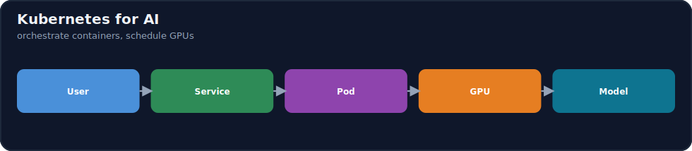
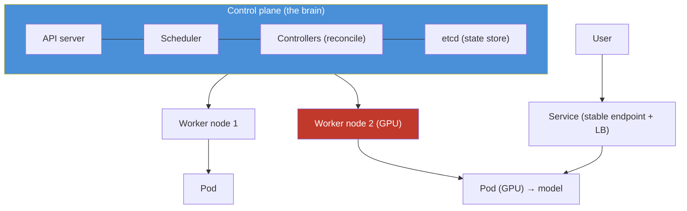

# 17.9 · Kubernetes for AI Engineers ⭐ ✅

[⬅ 17.8 Containers](17.8-containers.md) · [🏠 Module 17](../README.md) · [➡ 17.10 Serverless Computing](17.10-serverless.md)

> **The lesson in one line:** Kubernetes is the system that runs and manages **many containers across many machines** for you — you declare the desired state ("3 replicas of this model server, each with 1 GPU") and Kubernetes continuously makes reality match: scheduling pods onto nodes, restarting failures, load-balancing, and scaling. For AI it's the standard way to **serve models, schedule scarce GPUs, run batch inference, and orchestrate training** at scale.



---

## 🎯 Learning objectives

- Understand **Kubernetes architecture**: control plane, worker nodes, pods, deployments, services, jobs, ConfigMaps, secrets.
- Run **AI workloads**: model serving, **GPU scheduling**, batch inference, training jobs, distributed workloads.
- Trace **User → Service → Pod → GPU → Model**.

## ✅ Prerequisites

- [17.8 Containers](17.8-containers.md), [17.5 Networking](17.5-networking.md), [17.4 GPU Infrastructure](17.4-gpu-infrastructure.md). Expands [16.16 Kubernetes](../../16-MLOps/weeks/16.16-kubernetes.md).

---

## 🧠 Mental model

> [!IMPORTANT]
> **Kubernetes is a control loop over declared state: you tell it *what* you want, it figures out *how* to keep it true.** You write a manifest — "run 3 replicas of `llm-api:1.4.0`, each needing 1 GPU, reachable at this service name" — and Kubernetes' controllers continuously **reconcile**: if a pod crashes, it starts a new one; if a node dies, it reschedules its pods elsewhere; if you ask for more replicas, it schedules them onto nodes with free GPUs. You stop managing individual containers and start managing *desired outcomes*. This is why it's the backbone of production AI serving — the same machinery that keeps a web app's 3 replicas alive schedules your GPU model servers, restarts a crashed inference pod, and packs batch-inference jobs onto spare capacity.



## 🔍 Internal explanation

### Architecture: control plane + worker nodes

- **Control plane** — the brain. The **API server** (you talk to it), the **scheduler** (decides which node runs each pod), **controllers** (reconcile desired vs. actual), and **etcd** (the cluster's state store). Managed Kubernetes (EKS/AKS/GKE) runs this for you.
- **Worker nodes** — the machines (VMs, some with GPUs) that actually run your pods. Each runs a kubelet (node agent) and a container runtime.

### The objects you'll use

| Object | What it is | AI use |
|---|---|---|
| **Pod** | smallest unit — one or more containers sharing network/storage | one model-server instance |
| **Deployment** | declares N replicas of a pod, handles rollouts & self-healing | scale/roll out model serving |
| **Service** | stable network endpoint + load balancing across pods | the address clients hit ([17.5](17.5-networking.md)) |
| **Job** | run-to-completion workload | batch inference, a training run |
| **CronJob** | scheduled Job | nightly batch scoring, retraining |
| **ConfigMap** | non-secret config injected into pods | model name, params, feature flags |
| **Secret** | sensitive values injected into pods | API keys, DB creds ([17.13](17.13-security.md)) |

> [!IMPORTANT]
> **Deployments are for services that should always be running (model serving); Jobs are for work that finishes (training, batch inference).** A Deployment keeps *N replicas alive forever* and heals them — perfect for an always-on LLM API. A Job runs a pod *until the task completes* and then stops — perfect for a fine-tuning run or a nightly batch-inference pass. Mixing these up (e.g. a Deployment for a training run that should end) is a classic mistake.

### GPU scheduling — the AI-critical part

> [!IMPORTANT]
> **Kubernetes treats GPUs as a schedulable, countable resource — you *request* them and the scheduler places your pod only on a node with a free GPU.** Via a device plugin, a pod declares `resources.limits: nvidia.com/gpu: 1`, and Kubernetes guarantees it lands on a GPU node with capacity, reserving that GPU for it. This is how a shared GPU cluster works: many teams' pods request GPUs, and the scheduler bin-packs them onto the expensive GPU nodes. Combined with **node pools** (a CPU pool + a GPU pool) and autoscaling, you keep costly GPUs busy and add/remove GPU nodes with demand ([17.14](17.14-cost-optimization.md), [17.15](17.15-autoscaling.md)).

### The serving request path

```text
User → Service (stable endpoint, load-balances) → Pod (model server, holds a GPU) → Model (inference)
```
Multiple pods (replicas) sit behind one Service; the Service spreads requests and skips unhealthy pods (health/readiness probes). An autoscaler adds pods under load ([17.15](17.15-autoscaling.md)); pods spread across nodes/AZs give HA ([17.2](17.2-regions-availability.md)).

### AI workload patterns on Kubernetes

| Workload | K8s shape |
|---|---|
| **Model serving** | Deployment (replicas) + Service + HPA autoscaler; GPU-requested pods |
| **GPU scheduling** | pods request `nvidia.com/gpu`; GPU node pool; scheduler bin-packs |
| **Batch inference** | Job / CronJob over a dataset; scale out then finish |
| **Training jobs** | Job (single or multi-pod); often with a queue/operator |
| **Distributed training** | multiple coordinated pods across nodes (operators like the training-operators); needs fast inter-node network ([17.4](17.4-gpu-infrastructure.md)) |

## 🛠️ Practical implementation

```yaml
# Deployment: 3 GPU-backed model-server replicas (always-on serving)
apiVersion: apps/v1
kind: Deployment
metadata: { name: llm-api }
spec:
  replicas: 3
  selector: { matchLabels: { app: llm-api } }
  template:
    metadata: { labels: { app: llm-api } }
    spec:
      containers:
        - name: server
          image: myorg/llm-api:1.4.0
          ports: [{ containerPort: 8000 }]
          resources:
            limits: { nvidia.com/gpu: 1 }        # ← GPU request: schedule onto a GPU node
          envFrom:
            - configMapRef: { name: model-config }   # non-secret config
            - secretRef:    { name: model-secrets }   # injected secrets (17.13)
          readinessProbe: { httpGet: { path: /health, port: 8000 } }  # skip unready pods
---
apiVersion: v1
kind: Service
metadata: { name: llm-api }
spec:
  selector: { app: llm-api }
  ports: [{ port: 80, targetPort: 8000 }]        # stable endpoint, load-balances across pods
```
```yaml
# Job: a run-to-completion batch-inference pass (finishes, unlike a Deployment)
apiVersion: batch/v1
kind: Job
metadata: { name: nightly-batch-score }
spec:
  template:
    spec:
      restartPolicy: OnFailure
      containers:
        - name: scorer
          image: myorg/batch-scorer:1.0.0
          resources: { limits: { nvidia.com/gpu: 1 } }
```

## 🏭 Production examples

| System | K8s layout |
|---|---|
| Self-hosted LLM API | Deployment (GPU pods) + Service + HPA + GPU node pool ([17.15](17.15-autoscaling.md)) |
| Multi-model platform | many Deployments; scheduler bin-packs GPUs; namespaces per team |
| Nightly batch scoring | CronJob over a dataset; scale-to-zero between runs |
| Fine-tuning platform | Jobs (queued) on the GPU pool; checkpoints to object storage ([17.6](17.6-storage.md)) |
| Distributed training | training-operator pods across GPU nodes + fast interconnect |

## ⚡ Performance considerations

- **Readiness probes prevent routing to cold pods** — a model server that's still loading weights shouldn't get traffic; the probe gates it.
- **Node pools separate CPU and GPU** — don't waste GPU nodes on CPU pods; taints/tolerations and node selectors keep them apart.
- **Bin-packing keeps GPUs busy** — the scheduler packs GPU pods to maximize utilization ([17.4](17.4-gpu-infrastructure.md)).
- **Image pull time affects scale-up** — lean images (from [17.8](17.8-containers.md)) make new pods ready faster ([17.15](17.15-autoscaling.md)).

## 💲 Cost considerations

> [!IMPORTANT]
> **On Kubernetes, GPU cost is controlled by node autoscaling + bin-packing + scale-to-zero, not by hand.** Use a **GPU node pool that autoscales** (add nodes when GPU pods are pending, remove when idle), pack pods to keep each GPU busy, and scale serving Deployments toward a warm minimum (or to zero for batch). Spot/preemptible GPU nodes cut training cost with checkpointing. The failure mode is a GPU node pool that never scales down — idle GPUs billing 24/7 ([17.14](17.14-cost-optimization.md)).

## 🔒 Security considerations

> [!CAUTION]
> - **Secrets via Secret objects (from a secrets manager), never in images/ConfigMaps** ([17.13](17.13-security.md), [17.8](17.8-containers.md)).
> - **RBAC least privilege** — scope who/what can act in the cluster; per-namespace isolation for teams.
> - **Network policies** — restrict pod-to-pod traffic (the K8s analog of security groups, [17.5](17.5-networking.md)).
> - **Pod security** — non-root, drop capabilities, resource limits (prevent a noisy-neighbor pod starving others).
> - **Private cluster + private registry** — control-plane and nodes not publicly exposed.

## 🚫 Common mistakes

| Mistake | Consequence |
|---|---|
| Deployment for a training run | never finishes / restarts forever (use a Job) |
| No GPU request on a GPU pod | scheduled on a CPU node → fails/OOMs |
| No readiness probe | traffic hits pods still loading the model |
| GPU node pool that never scales down | idle GPUs bill 24/7 ([17.14](17.14-cost-optimization.md)) |
| Secrets in ConfigMaps/images | leaked credentials ([17.13](17.13-security.md)) |
| No resource limits | one pod starves the node |

## 🐛 Debugging workflow

Incident (see [exercises](../exercises/README.md)): (1) **"Kubernetes pod crashes" / CrashLoopBackOff.** → `kubectl logs` + `describe pod`: bad start command, missing secret/config, OOM (raise limits or shrink model), or failing readiness probe. (2) **Pod stuck Pending.** → No node with the requested resources — often **no free GPU**; check the GPU node pool / autoscaler ([17.4](17.4-gpu-infrastructure.md)). (3) **Service unreachable.** → Selector/label mismatch, no ready pods (probe failing), or network policy blocking ([17.5](17.5-networking.md)). (4) **GPU not used.** → Missing `nvidia.com/gpu` request or device plugin. (5) **Scale-up slow.** → Image pull time / node provisioning; use lean images and warm pools ([17.15](17.15-autoscaling.md)).

## 🏋️ Exercises

1. **Conceptual.** Explain the control loop: desired vs. actual state and reconciliation.
2. **Objects.** Match model serving, batch inference, and a training run to Deployment/Job/CronJob.
3. **GPU.** Write the pod spec fragment that requests 1 GPU and explain how scheduling uses it.
4. **Path.** Trace User → Service → Pod → GPU → Model and say what provides HA and scale.
5. **Incident.** "Pod crashes (CrashLoopBackOff)" and "Pod stuck Pending on a GPU request" — diagnose each.
6. **Cost.** Design a GPU node pool + autoscaling + scale-to-zero strategy for spiky serving.

## 🛠️ Mini project — "Kubernetes model-serving stack" ✅

**Goal:** deploy a GPU model API on Kubernetes with HA, autoscaling, and correct config/secrets.

**Requirements:** a Deployment of GPU-requested pods behind a Service; a readiness probe gating traffic until weights load; ConfigMap for config + Secret for credentials (from a secrets manager); an HPA that scales replicas on load with a warm minimum ([17.15](17.15-autoscaling.md)); a GPU node pool that autoscales and scales down when idle; a Job manifest for nightly batch inference.
**Folder structure**
```
k8s-serving/
├── deployment.yaml     # GPU pods + readiness probe
├── service.yaml        # stable endpoint + LB
├── hpa.yaml            # autoscaling
├── configmap.yaml
├── secret.yaml         # reference-only (from secrets manager)
└── batch-job.yaml      # run-to-completion inference
```
**Testing:** kill a pod → it self-heals; load-test → replicas scale; GPU pods land only on GPU nodes.
**Security:** RBAC, network policies, non-root, secrets external ([17.13](17.13-security.md)). **Monitoring:** GPU utilization, pod health, latency ([17.19](17.19-observability.md)).
**Cost:** GPU node-pool autoscaling + scale-to-zero for the batch Job ([17.14](17.14-cost-optimization.md)).
**Future improvements:** vLLM for throughput; canary rollout ([16.13](../../16-MLOps/weeks/16.13-deployment-strategies.md)); multi-AZ spread.

## 📄 Cheat sheet

| Object | Use |
|---|---|
| **Pod** | one model-server instance (containers) |
| **Deployment** | N always-on replicas, self-heal, rollout → **serving** |
| **Service** | stable endpoint + load balancing |
| **Job / CronJob** | run-to-completion / scheduled → **batch, training** |
| **ConfigMap / Secret** | config / sensitive values injected into pods |
| **⭐ GPU** | `resources.limits: nvidia.com/gpu: 1` → scheduled onto GPU node |
| **⭐ Path** | User → Service → Pod → GPU → Model |
| **⭐ Cost** | GPU node-pool autoscale + bin-pack + scale-to-zero |
| **⚠️** | Deployment-for-training; no GPU request; no readiness probe; idle GPU pool |
| **Cross-cloud** | EKS (AWS) · AKS (Azure) · GKE (GCP) |

## 🎴 Flashcards

- **⭐ What is Kubernetes, in one sentence?** → A control loop that continuously reconciles declared desired state (replicas, resources, endpoints) with reality — scheduling, healing, and scaling containers across many machines.
- **Control plane vs. worker nodes?** → The control plane (API server, scheduler, controllers, etcd) is the brain that decides; worker nodes run the pods.
- **⭐ Deployment vs. Job?** → Deployment keeps N replicas always running and self-healing (serving); Job runs a pod to completion and stops (training, batch inference).
- **⭐ How does Kubernetes schedule GPUs?** → A pod requests `nvidia.com/gpu: N`; via a device plugin the scheduler places it only on a node with that many free GPUs and reserves them.
- **What is a Service for?** → A stable network endpoint that load-balances across a Deployment's pods and skips unhealthy ones.
- **The AI serving request path?** → User → Service → Pod (holds a GPU) → Model.
- **Why a readiness probe on a model server?** → So traffic isn't routed to a pod that's still loading weights.
- **How is GPU cost controlled on K8s?** → Autoscaling GPU node pools + bin-packing + scale-to-zero for batch, plus spot nodes for training.
- **Where do secrets go?** → Secret objects sourced from a secrets manager — never in images or ConfigMaps.
- **Common cause of a Pending pod?** → No node with the requested resources — often no free GPU; the node-pool autoscaler must add one.

## 💬 Interview questions

1. Explain Kubernetes as a reconciliation loop and why that model is powerful for production AI.
2. Deployment vs. Job vs. CronJob — which for serving, training, and batch inference?
3. How does Kubernetes schedule GPUs, and how do you keep a shared GPU cluster utilized?
4. Trace the serving path and say what gives you HA, scale, and safe rollouts.
5. Diagnose a CrashLoopBackOff and a Pending-on-GPU pod.
6. How do you control GPU cost on Kubernetes?

## 📝 Summary

- **Kubernetes runs and manages many containers across many machines via a reconciliation loop** — you declare desired state (replicas, GPUs, endpoints) and its control plane keeps reality matching it (schedule, heal, scale).
- Core objects: **Pod** (instance), **Deployment** (always-on replicas → serving), **Service** (stable endpoint + LB), **Job/CronJob** (run-to-completion → training/batch), **ConfigMap/Secret** (config/credentials).
- **GPU scheduling** is the AI-critical feature: pods **request** `nvidia.com/gpu`, and the scheduler places them on GPU nodes and reserves the hardware — enabling shared, bin-packed, autoscaled GPU clusters.
- The serving path is **User → Service → Pod → GPU → Model**; secure with **RBAC, network policies, non-root pods, and external secrets**, and control **GPU cost** with autoscaling node pools + scale-to-zero ([17.13](17.13-security.md), [17.14](17.14-cost-optimization.md), [17.15](17.15-autoscaling.md)).

## 📚 References

1. **[16.16 Kubernetes for AI](../../16-MLOps/weeks/16.16-kubernetes.md).** ⭐ Companion MLOps treatment.
2. **Kubernetes documentation.** Pods, Deployments, Services, Jobs, scheduling.
3. **NVIDIA GPU Operator / device plugin docs.** GPU scheduling on Kubernetes.
4. **Managed K8s docs — EKS / AKS / GKE.** The three managed control planes.

---

## 🧭 Navigation

| Direction | Link |
|---|---|
| ⬅ Previous | [17.8 · Containers](17.8-containers.md) |
| ➡ Next | [17.10 · Serverless Computing](17.10-serverless.md) |
| 🏠 Module | [Module 17](../README.md) |
| 📖 Lessons | [Lesson index](README.md) |
