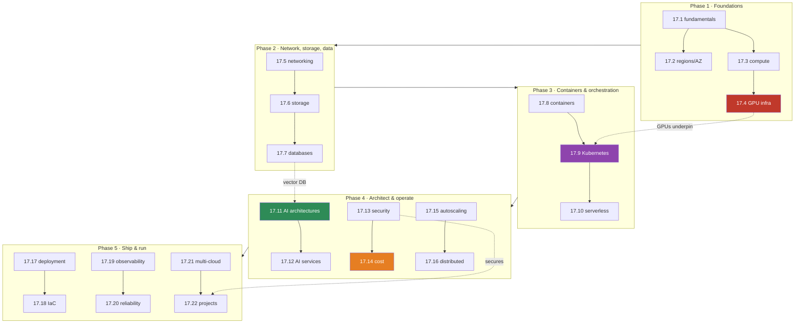

# Module 17 · Cloud for AI Engineers — Lesson Index

[🏠 Module 17](../README.md) · [🏋️ Exercises](../exercises/README.md) · [📝 Quiz](../quizzes/quiz-01.md) · [🎴 Flashcards](../flashcards/deck.md) · [📄 Cheat sheet](../cheat-sheets/cloud-cheatsheet.md)

> 22 lessons, ordered along the cloud stack: **fundamentals → compute & GPUs → networking & storage → data → containers & orchestration → serverless → architectures & services → security & cost → scaling & distribution → deploy/IaC/observe/reliability → multi-cloud → projects.** ⭐ marks the load-bearing lessons. "Build?" = the lesson ships a runnable mini project.

---

## Lessons

| # | Lesson | Build? | One-line |
|---|---|:--:|---|
| ⭐ [17.1](17.1-cloud-fundamentals.md) | Cloud Computing Fundamentals | | The cloud is rented, elastic infrastructure; IaaS→PaaS→SaaS→serverless is a control-vs-convenience ladder |
| [17.2](17.2-regions-availability.md) | Regions & Availability | | Regions ⊃ AZs ⊃ datacenters; design for failure, redundancy, recovery, geography |
| ⭐ [17.3](17.3-compute.md) | Compute | | CPU vs GPU vs TPU is a parallelism story; pick compute by workload |
| ⭐ [17.4](17.4-gpu-infrastructure.md) | GPU Cloud Infrastructure | ✅ | VRAM is the constraint; estimate memory; single→multi→distributed→cluster |
| ⭐ [17.5](17.5-networking.md) | Cloud Networking | | VPC/subnets/LB/firewall/DNS — the private network your AI runs in |
| [17.6](17.6-storage.md) | Storage | | Block vs file vs **object**; object storage is the AI data lake |
| ⭐ [17.7](17.7-databases.md) | Databases for AI Systems | | Relational/NoSQL/**vector** + cache — the right store per data shape |
| [17.8](17.8-containers.md) | Containers | ✅ | Package once, run anywhere: image → container → registry → cloud |
| ⭐ [17.9](17.9-kubernetes.md) | Kubernetes for AI Engineers | ✅ | Orchestrate containers; schedule GPUs; serve, batch, and train |
| [17.10](17.10-serverless.md) | Serverless Computing | | Functions & event-driven; great for glue, wrong for big GPU jobs |
| ⭐ [17.11](17.11-ai-architectures.md) | Cloud AI Architectures | | Reference designs for ML, LLM, and agent systems |
| [17.12](17.12-ai-services.md) | Cloud AI Services | | Service *categories* and trade-offs, not vendor catalogs |
| ⭐ [17.13](17.13-security.md) | Cloud Security | | Identity → permission → resource; least privilege everywhere |
| ⭐ [17.14](17.14-cost-optimization.md) | Cloud Cost Optimization | | Compute/GPU/storage/network/API — measure, then pull the big levers |
| [17.15](17.15-autoscaling.md) | Autoscaling | | Horizontal/vertical scaling + load balancing for AI traffic |
| ⭐ [17.16](17.16-distributed-systems.md) | Distributed Systems for AI | | Queues, async, event-driven, and distributed training |
| [17.17](17.17-deployment.md) | Cloud Deployment | ✅ | Git → CI/CD → build → registry → deploy → monitor |
| [17.18](17.18-iac.md) | Infrastructure as Code | ✅ | Terraform: state, modules, dev/staging/prod |
| [17.19](17.19-observability.md) | Cloud Observability | | Logs/metrics/traces + AI signals (tokens, latency, retrieval) |
| [17.20](17.20-reliability.md) | Cloud Reliability | | HA, fault tolerance, DR, backups, failover |
| [17.21](17.21-multi-cloud.md) | Multi-Cloud Architecture | | AWS vs Azure vs GCP — the transferable core |
| [17.22](17.22-projects-summary.md) | Cloud AI Projects & Summary | ✅ | 8 end-to-end projects + module synthesis |

## Dependency graph

## How to use this module

1. **Read in order** — each phase assumes the last. The stack builds bottom-up.
2. **Do the incident drills** in [exercises](../exercises/README.md) — cloud skill is diagnosing failures (GPU unavailable, cost spike, pod crash, network blocked) under pressure.
3. **Build the ✅ projects** — a deployed API, a GPU model, a RAG system, a K8s serving stack, an IaC platform.
4. **Keep the [cheat sheet](../cheat-sheets/cloud-cheatsheet.md) open** — especially the AWS/Azure/GCP concept-mapping table.

---

## Navigation

| Direction | Link |
|---|---|
| 🏠 Module | [Module 17](../README.md) |
| ➡ First lesson | [17.1 · Cloud Computing Fundamentals](17.1-cloud-fundamentals.md) |
| 🏋️ Exercises | [Exercises](../exercises/README.md) |
| 📄 Cheat sheet | [Cloud cheat sheet](../cheat-sheets/cloud-cheatsheet.md) |
