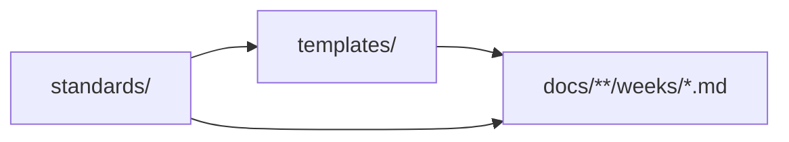

# Handbook Standards

[🏠 Repo root](../README.md) · [🗺 Roadmap](../ROADMAP.md) · [✍ Contributing](../CONTRIBUTING.md)

> The authoring standards that **every** document in this handbook must follow. If [CONTRIBUTING.md](../CONTRIBUTING.md) is the quick style guide, this folder is the detailed rulebook. Read the relevant standard before writing any lesson, exercise, project, or reference.

---

## Why standards exist

This repository is meant to read like a **single-author published book** used by thousands of engineers. Consistency is what makes 3,000+ pages feel unified instead of like scattered notes. When in doubt, follow the standard even if you could improvise something "better" — predictability is the feature.

---

## The standards

| Standard | Governs | Read before you… |
|---|---|---|
| [documentation-philosophy.md](documentation-philosophy.md) | Voice, structure, formatting, quality bar | Write any prose |
| [visual-standards.md](visual-standards.md) | Mermaid, diagrams, images, decision trees | Add any diagram or figure |
| [code-standards.md](code-standards.md) | Code examples & snippets | Write any code |
| [retention-standards.md](retention-standards.md) | Summaries, cheat sheets, flashcards, teach-back | Finish any lesson |
| [exercise-standards.md](exercise-standards.md) | Coding, debugging, refactoring, design exercises | Write any exercise |
| [project-standards.md](project-standards.md) | Module projects & capstones | Write any project |
| [interview-standards.md](interview-standards.md) | Per-module interview sections | Write any interview content |
| [reference-standards.md](reference-standards.md) | Citing external resources | Cite anything |

---

## The master template

Every lesson is built from [templates/lesson-template.md](../templates/lesson-template.md) — the canonical **26-section** structure. These standards define *how to fill* that template well.

---

## The non-negotiables

> [!IMPORTANT]
> 1. **First principles over shortcuts** — explain *why* before *how*.
> 2. **Show, then generalize** — concrete example first, abstraction second.
> 3. **No walls of text** — break with tables, callouts, diagrams, lists.
> 4. **Every lesson is revisitable** — summary + cheat sheet + flashcards, always.
> 5. **Production-focused** — every concept ties back to real systems.
> 6. **Consistency** — same structure, same voice, same conventions, everywhere.

---

## Navigation

| | |
|---|---|
| ⬆ Parent | [Repo root](../README.md) |
| ✍ Style guide | [CONTRIBUTING.md](../CONTRIBUTING.md) |
| 🧩 Templates | [templates/](../templates/) |
| 📚 Curriculum | [CURRICULUM.md](../CURRICULUM.md) |
