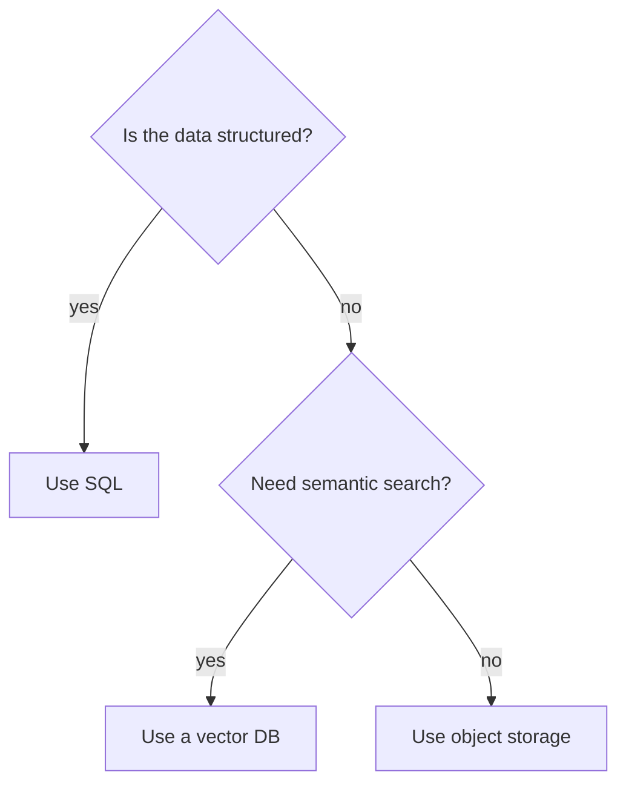

# Documentation Philosophy & Standards

[🏠 Standards](README.md) · [✍ Contributing](../CONTRIBUTING.md)

> How every document in this handbook is written, structured, and formatted.

---

## The quality bar

Every document must be **all seven** of these at once:

| Quality | What it means in practice |
|---|---|
| **Technically accurate** | Verifiable claims; runnable code; cited sources |
| **Beginner-friendly where appropriate** | Intuition and analogies before formalism |
| **Deep enough for experts** | First principles, internals, tradeoffs — not surface tutorials |
| **Production-focused** | Every concept ties to real systems and real failure modes |
| **Visually structured** | Tables, callouts, diagrams — never walls of text |
| **Revisitable** | A reader returning in 6 months can re-learn from the summary alone |
| **Consistent** | Same voice, structure, and conventions across the whole book |

> [!IMPORTANT]
> If a page satisfies six of these but reads like a wall of text, it fails. Structure is not decoration — it is how engineers read.

---

## Voice & tone

| Do | Don't |
|---|---|
| Write directly to a smart peer | Lecture or condescend |
| Assume Python fluency | Re-teach basic syntax |
| Define jargon on first use (link [GLOSSARY](../GLOSSARY.md)) | Assume ML acronyms are known |
| Use "you" and "we" naturally | Be stiff or academic |
| Prefer short paragraphs (≤ 4 sentences) | Write dense blocks |
| State the *why* before the *how* | Dump mechanics without motivation |

---

## Structure rules

- **One `#` H1 per file** — the title. Everything else is `##`/`###`.
- **Lead with a one-line blockquote hook** under the title.
- **Progressive disclosure:** intuition → theory → math → code → production → edge cases.
- **Break every ~150 words** with a table, list, callout, or diagram.
- **End every lesson** with Summary → Cheat Sheet → Flashcards → Exercises → What's Next.

## The formatting toolbox

Reach for the right device for the job:

| Use… | When you need to… |
|---|---|
| **Table** | Compare ≥ 2 things across ≥ 2 attributes |
| **Comparison table** | Contrast approaches (A vs B vs C) with a verdict column |
| **Callout** | Flag a note, tip, warning, or danger (see below) |
| **Checklist** | Give a repeatable procedure or self-check |
| **Mermaid flowchart** | Show a process or data flow |
| **Sequence diagram** | Show interaction/ordering between components |
| **Decision tree** | Help the reader choose between options |
| **Timeline** | Show evolution/history of a technology |
| **Numbered list** | Give ordered steps |

## Callout vocabulary

```markdown
> [!NOTE]      neutral, useful context
> [!TIP]       a shortcut or best practice
> [!IMPORTANT] must-know to succeed
> [!WARNING]   a common, costly mistake
> [!CAUTION]   dangerous / destructive / irreversible
```

Use them **sparingly and meaningfully** — if every paragraph is a callout, none stand out.

## Comparison-table pattern

Always include a **verdict/when-to-use** column so the reader leaves with a decision, not just data:

| Option | Strengths | Weaknesses | Use when |
|---|---|---|---|
| A | … | … | … |
| B | … | … | … |

## Decision-tree pattern



## Anti-patterns (reject in review)

- ❌ Walls of text with no visual break
- ❌ Mechanics with no motivation ("here's how" without "here's why")
- ❌ Undefined jargon
- ❌ Code with no error handling presented as production-ready
- ❌ A lesson with no summary, cheat sheet, or flashcards
- ❌ Inconsistent heading depth or section order

---

## Review checklist (before merging any doc)

- [ ] One H1, correct section order, no empty headings
- [ ] Broken up with tables/callouts/diagrams — no walls of text
- [ ] Intuition precedes formalism
- [ ] At least one diagram, or a justified note that none is needed
- [ ] Jargon defined and linked to the glossary
- [ ] Ties to a real production use case
- [ ] Summary + cheat sheet + flashcards present (for lessons)
- [ ] Links are relative and valid
