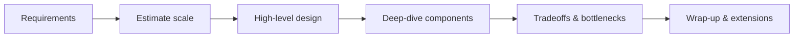

# Interview Preparation Standards

[🏠 Standards](README.md) · [🎯 Interview prep](../interview-preparation/README.md)

> Every module ends with an interview section. Interview readiness is trained *throughout* the handbook, not crammed at the end.

---

## Required interview section (per lesson & per module)

Each lesson's §19 and each module's interview bank must include all five:

| Tier | Count (min) | Tests |
|---|:--:|---|
| **Beginner** | 3 | Definitions, "what is", basic recall |
| **Intermediate** | 3 | "How does it work", tradeoffs, application |
| **Advanced** | 2 | Internals, edge cases, "why", failure modes |
| **System design prompt** | 1 | End-to-end design under constraints |
| **Follow-up questions** | 2+ per design | Depth probes on the design answer |

---

## Question quality rules

- **Model answers required.** Every question has a concise, correct answer — not just the prompt.
- **Explain the *why*.** Answers state the reasoning, not just the fact.
- **Realistic.** Prefer questions actually asked in industry over trivia.
- **Progressive.** Beginner → advanced within each module.
- **Traps flagged.** Note the common wrong answer and why it's wrong.

Use the [interview-notes template](../templates/interview-notes-template.md).

---

## Question format

```markdown
**Q (Intermediate):** Why does attention scale the dot product by 1/√d_k?

**A:** For large `d_k`, dot products grow in magnitude, pushing softmax into
regions with tiny gradients. Dividing by √d_k keeps variance ~1, stabilizing
training.

**Trap:** "To normalize probabilities" — softmax already does that; the scaling
is about gradient stability, not normalization.

**Follow-ups:** What happens if you remove it? How does this interact with
mixed-precision training?
```

---

## System-design prompts

Every module with system relevance includes at least one open-ended prompt. Answers should demonstrate a repeatable framework:



| Step | What to cover |
|---|---|
| Requirements | Functional + non-functional, clarify scope |
| Scale estimate | QPS, data size, latency budget |
| High-level design | Boxes and arrows |
| Deep dive | The 1–2 hardest components |
| Tradeoffs | Alternatives, bottlenecks, failure modes |
| Wrap-up | Cost, scaling, what you'd add next |

---

## Behavioral & portfolio (Module 18)

Beyond technical questions, [Module 18](../docs/18-Interview-Preparation/README.md) covers:
- **STAR-format** behavioral stories
- Explaining your **capstone projects** crisply
- Talking about **tradeoffs and failures** credibly

---

## Where interview content lives

| Scope | Location |
|---|---|
| Per-lesson questions | Lesson §19 |
| Per-module bank | `docs/<module>/references/` or module README link |
| Cross-cutting prep | `interview-preparation/` |

---

## Checklist

- [ ] 3 beginner, 3 intermediate, 2 advanced questions
- [ ] ≥ 1 system-design prompt with follow-ups
- [ ] Every question has a model answer with the *why*
- [ ] Common traps flagged
- [ ] Difficulty progresses within the module
