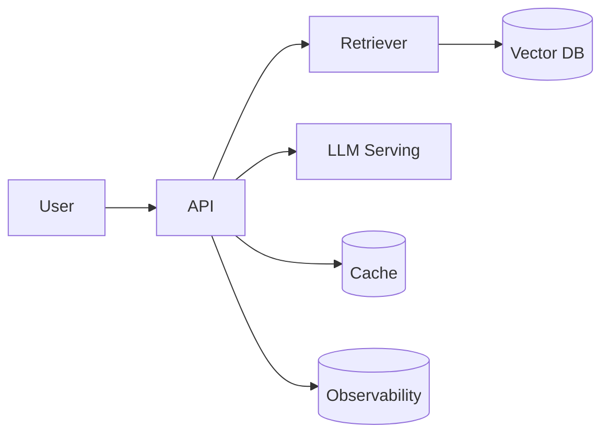

# Project Standards

[🏠 Standards](README.md)

> Projects are how skills become capability and a portfolio. Every project — from a module mini-project to a capstone — follows this structure.

---

## Required sections (every project)

Built from [templates/project-template.md](../templates/project-template.md):

| # | Section | Purpose |
|--:|---|---|
| 1 | **Goal** | One paragraph: what you'll build and why it's realistic |
| 2 | **Requirements** | Numbered, checkable functional + non-functional requirements |
| 3 | **Folder structure** | The expected project layout |
| 4 | **Architecture diagram** | A Mermaid diagram of the system |
| 5 | **Milestones** | Ordered, shippable increments |
| 6 | **Stretch goals** | Optional extensions for deeper learners |
| 7 | **Testing strategy** | How correctness is verified |
| 8 | **Deployment guide** | How to run/ship it |
| 9 | **Future improvements** | What you'd do with more time |

---

## Requirements format

Split explicitly — engineers must learn to see both:

| Functional | Non-functional |
|---|---|
| What the system does | How well it does it |
| "Answers questions from the docs" | "p95 latency < 2s, cost < $X / 1k queries" |

Each requirement is checkable:

```markdown
| # | Requirement | Type | Done |
|--:|---|---|:--:|
| 1 | Ingest PDFs and chunk them | Functional | ☐ |
| 2 | p95 query latency < 2s | Non-functional | ☐ |
```

---

## Folder structure (recommended baseline)

```text
projects/<name>/
├── README.md            # the project brief (this template)
├── pyproject.toml       # pinned dependencies
├── src/                 # application code
├── tests/               # test suite
├── data/                # sample data (gitignored if large)
├── infra/               # Dockerfile, deploy config
└── docs/                # architecture notes, decisions
```

## Architecture diagram (required)



Complex systems also get an [architecture-notes](../templates/architecture-notes-template.md) document.

---

## Milestones

Order as **shippable increments** — each one runs end-to-end:

| Milestone | Deliverable | Definition of done |
|---|---|---|
| M1 | Walking skeleton | End-to-end path works with stubs |
| M2 | Core feature | Primary requirement met |
| M3 | Hardening | Errors, tests, observability |
| M4 | Ship | Deployed + documented |

> [!TIP]
> "Walking skeleton first" beats building components in isolation — you find integration problems early.

---

## Testing strategy (required)

| Layer | What to test |
|---|---|
| Unit | Pure functions, parsing, chunking |
| Integration | Component boundaries (retriever ↔ store) |
| End-to-end | A real query producing a grounded answer |
| Evaluation | For AI systems: an offline eval set + metrics |

## Deployment guide (required)

- Exact run commands (`docker`, `uvicorn`, etc.)
- Required environment variables (reference a `.env.example`)
- Health check and smoke-test steps
- Rollback note

## Rubric

| Criterion | Weight |
|---|:--:|
| Correctness | 40% |
| Code quality | 20% |
| Production-readiness (tests, errors, observability) | 25% |
| Documentation | 15% |

---

## Capstone-specific additions

Capstones ([Module 19](../docs/19-Capstone-Projects/README.md)) additionally require:
- A written **design doc** (tradeoffs, alternatives considered)
- **Load/latency testing** results
- **Observability** wired in (traces, logs, metrics)
- A **retrospective** ([template](../templates/project-retrospective-template.md))
- Portfolio-grade README with screenshots/diagrams

---

## Checklist

- [ ] All 9 sections present
- [ ] Functional and non-functional requirements separated and checkable
- [ ] Architecture diagram included
- [ ] Milestones are shippable increments
- [ ] Testing strategy spans unit → e2e (+ eval for AI)
- [ ] Deployment guide is runnable as written
- [ ] Rubric included
