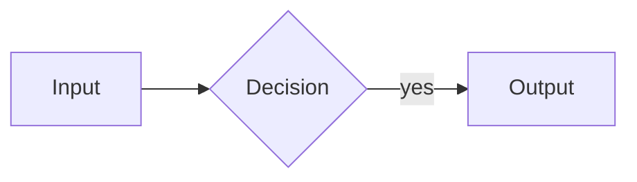
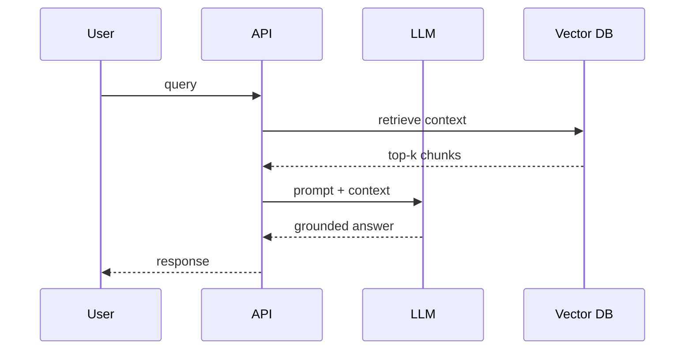
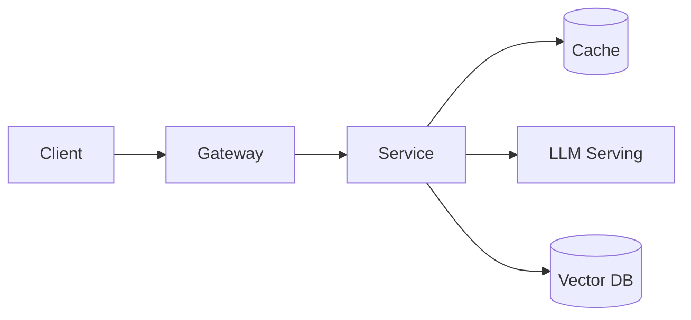

# Visual Standards

[🏠 Standards](README.md)

> When and how to use diagrams and images. A good diagram replaces three paragraphs — use them generously, but purposefully.

---

## The rule

> [!IMPORTANT]
> **Prefer Mermaid** for anything that is a process, structure, relationship, or decision. Use an **image placeholder** only when a hand-drawn or photographic illustration genuinely communicates better (e.g. an intuition sketch, a real UI, a hardware photo).

Every non-trivial lesson should contain **at least one diagram**.

---

## Choosing the right diagram

| Diagram type | Use for | Mermaid keyword |
|---|---|---|
| **Flowchart** | Processes, data flow, pipelines | `flowchart` |
| **Sequence diagram** | Interactions/ordering between components over time | `sequenceDiagram` |
| **Class / ER diagram** | Data models, schemas, relationships | `classDiagram` / `erDiagram` |
| **State diagram** | Lifecycle / state machines (e.g. an agent loop) | `stateDiagram-v2` |
| **Decision tree** | Helping the reader choose | `flowchart TD` with `{...}` nodes |
| **Timeline** | Evolution/history of a technology | `timeline` |
| **Mindmap** | Concept maps / overviews | `mindmap` |
| **Gantt** | Project schedules / roadmaps | `gantt` |

---

## Mermaid conventions

- Always fence with a language tag:

````markdown

````

- **Direction:** `LR` for pipelines/flows, `TD` for hierarchies/decision trees.
- **Node labels:** short noun phrases; put detail in the surrounding prose.
- **Shapes carry meaning:** `[rect]` = process/step, `{diamond}` = decision, `([round])` = start/end, `[(cylinder)]` = datastore.
- **Keep it readable:** if a diagram exceeds ~15 nodes, split it into two.
- **Store complex sources** in the module's `diagrams/` folder as `.mmd` and embed a rendered copy where needed.

### Sequence-diagram example



### Architecture-diagram example



---

## Image placeholders

When an illustration beats a diagram, insert a placeholder **and describe exactly what it should show** so it can be produced later:

```markdown


> **Illustration placeholder** — `assets/images/python-memory-model.png`:
> Show the stack vs heap, with variable names on the stack pointing to
> objects on the heap; highlight how two names can reference one object.
```

### Image rules

| Rule | Detail |
|---|---|
| **Path** | `assets/images/<topic>-<descriptor>.png` (kebab-case) |
| **Alt text** | Always present and descriptive |
| **Description** | Every placeholder is followed by a precise "what it should depict" note |
| **Width** | Cap large images (`width="720"`) so pages stay readable |
| **Source files** | Editable sources go in `assets/diagrams/` |
| **Do not** | Do not generate images in this repo — only placeholders + descriptions |

---

## Accessibility & theming

- Never rely on color alone to convey meaning — label nodes/edges.
- Keep alt text meaningful for screen readers.
- Diagrams should read in both light and dark GitHub themes (Mermaid handles this; avoid hard-coded colors unless necessary).

---

## Checklist

- [ ] Diagram type matches the intent (process vs interaction vs decision)
- [ ] Mermaid fenced with `mermaid` language tag
- [ ] ≤ ~15 nodes, short labels, meaningful shapes
- [ ] Image placeholders include a precise description
- [ ] Complex sources saved in `diagrams/` or `assets/diagrams/`
