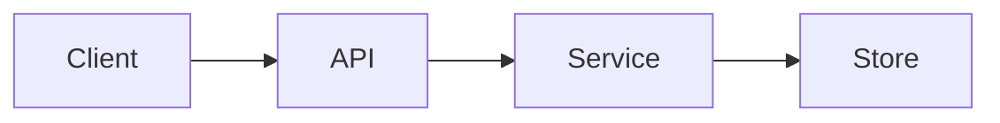

# Architecture Notes · <System>

[🏠 Repo root](../README.md)

## Context
<What problem this system solves and for whom.>

## Requirements
| Type | Requirement |
|---|---|
| Functional | |
| Non-functional | |

## High-level design

## Components
| Component | Responsibility | Notes |
|---|---|---|
| | | |

## Data flow
<Describe the request/response and data lifecycle.>

## Tradeoffs & alternatives
| Decision | Chosen | Rejected | Why |
|---|---|---|---|
| | | | |

## Failure modes & mitigations
| Failure | Impact | Mitigation |
|---|---|---|
| | | |

## Open questions
- <question>
