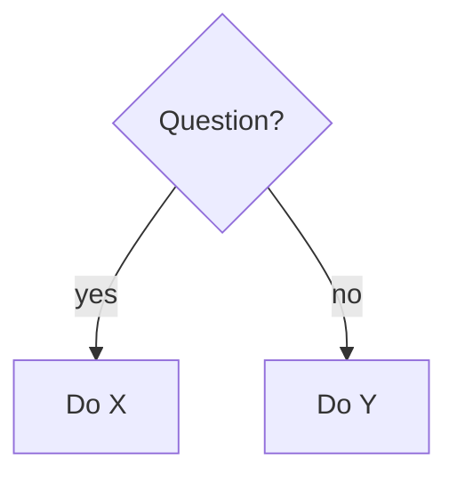

# Cheat Sheet · <Topic>

[🏠 Module](../README.md)

> One-page quick reference. Optimized for scanning, not learning.

## At a glance
| Thing | Use it for | Gotcha |
|---|---|---|
| | | |

## Common commands / snippets
```text
# key snippets
```

## Decision guide


## Remember
- <key point>
