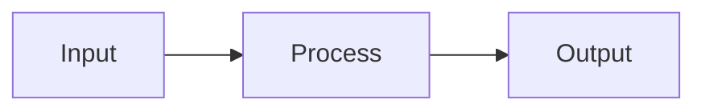

<!--
MASTER LESSON TEMPLATE — do not delete this comment block.
Every lesson in the handbook MUST follow this structure and section order.
Delete a section only if a maintainer confirms it is genuinely N/A, and leave a
one-line note explaining why. Fill placeholders in <angle brackets>. See
../standards/README.md for the full authoring standards.
-->

# <Lesson Title>

[⬅ Prev](#) · [🏠 Module](../README.md) · [🗺 Roadmap](../../../ROADMAP.md) · [Next ➡](#)

> One-sentence hook: what this lesson unlocks and why it matters.

| | |
|---|---|
| **Module** | `<NN · Name>` |
| **Week / Lesson** | `<NN.M>` |
| **Difficulty** | ⭐–⭐⭐⭐⭐⭐ |
| **Estimated study time** | `<e.g. 90 min read · 60 min exercises>` |
| **Status** | 🟢 stable · 🟡 draft · 🔴 stub |

---

## 1. Learning Objectives
By the end of this lesson you will be able to:
- [ ] `<measurable, verb-first outcome>`
- [ ] `<measurable outcome>`
- [ ] `<measurable outcome>`

## 2. Prerequisites
| Needed | Where to get it |
|---|---|
| `<concept>` | [`<lesson>`](#) |

## 3. Estimated Study Time
| Activity | Time |
|---|---|
| Read & understand | `<min>` |
| Exercises | `<min>` |
| Mini project | `<min>` |
| Review & flashcards | `<min>` |

## 4. Why This Topic Exists
`<The historical / engineering reason this concept was invented. What did the world look like before it?>`

## 5. Problems It Solves
| Problem | How this topic addresses it |
|---|---|
| `<pain>` | `<solution>` |

## 6. Real-World Applications
- **`<Domain>`** — `<concrete system or product where this is used>`

## 7. Mental Model
`<A single, sticky analogy or picture the reader can carry forever.>`

> **Illustration placeholder** — `assets/images/<topic>-mental-model.png`: describe exactly what the image should depict.

## 8. Core Theory
`<The concept explained from first principles. Intuition first, then formalism.>`

### Mathematics (where relevant)
`<Formal treatment. Define every symbol. Keep notation consistent with the glossary.>`

## 9. Internal Working
`<What actually happens under the hood — data structures, algorithms, or mechanics.>`

## 10. Step-by-Step Breakdown
1. `<step>`
2. `<step>`
3. `<step>`

## 11. Visual Architecture

> Add sequence/architecture/decision-tree diagrams where they clarify. See [visual standards](../../../standards/visual-standards.md).

## 12. Production Examples
`<How this appears in real production systems, with a concrete, realistic scenario.>`

## 13. Code Examples
```python
# Production-quality, minimal, runnable. Error handling included.
# See ../../../standards/code-standards.md
```

## 14. Common Mistakes
| Mistake | Why it happens | Correct approach |
|---|---|---|
| `<mistake>` | `<cause>` | `<fix>` |

### Common Misconceptions
> [!WARNING]
> **Myth:** `<false belief>` → **Reality:** `<correction>`

## 15. Performance Considerations
| Concern | Guidance |
|---|---|
| Time / space complexity | `<...>` |
| Latency / throughput | `<...>` |
| Cost | `<...>` |

## 16. Security Considerations
| Risk | Mitigation |
|---|---|
| `<risk>` | `<control>` |

## 17. Best Practices
- ✅ `<do>`
- ❌ `<don't>`

## 18. Debugging Guide
| Symptom | Likely cause | Diagnostic | Fix |
|---|---|---|---|
| `<symptom>` | `<cause>` | `<how to confirm>` | `<fix>` |

## 19. Interview Questions
> Full standard: [interview standards](../../../standards/interview-standards.md).

**Beginner**
1. `<question>`

**Intermediate**
1. `<question>`

**Advanced**
1. `<question>`

**System design prompt**
- `<open-ended prompt>` — *Follow-ups:* `<...>`

## 20. Summary
| Key idea | Takeaway |
|---|---|
| `<idea>` | `<one line>` |

## 21. Cheat Sheet
```text
<the 5–10 things worth memorizing, scannable>
```
> Longer version: [`../cheat-sheets/<topic>-cheatsheet.md`](../cheat-sheets/).

## 22. Flashcards
> Deck: [`../flashcards/deck.md`](../flashcards/). Review schedule: [LEARNING_STRATEGY.md](../../../LEARNING_STRATEGY.md).

- **Q:** `<question>` — **A:** `<concise answer>`

## 23. Hands-on Exercises
> Set: [`../exercises/`](../exercises/). Difficulty must progress gradually — see [exercise standards](../../../standards/exercise-standards.md).

- [ ] `<exercise 1 (easy)>`
- [ ] `<exercise 2 (medium)>`
- [ ] `<exercise 3 (hard / debugging)>`

## 24. Mini Project
> Brief: [`../projects/`](../projects/). Follows the [project standards](../../../standards/project-standards.md).

`<One-paragraph project that applies this lesson.>`

## 25. References
> Citation format: [reference standards](../../../standards/reference-standards.md).

- `<Author/Org. "Title." Year. URL>`

## 26. What's Next
`<One sentence connecting this lesson to the next, and how it builds forward.>`

➡️ **Next:** [`<next lesson>`](#)

---

### 🔁 Revision checklist
- [ ] I can explain this from memory on a blank page
- [ ] I completed the exercises without looking
- [ ] I can teach it back in under 3 minutes
- [ ] Flashcards created and first review scheduled

### 🔗 Spaced-repetition callbacks
> Explicitly connect back to earlier lessons here, e.g. *"Recall [`gradient descent`](#) from Module 06 — this reuses it."*
