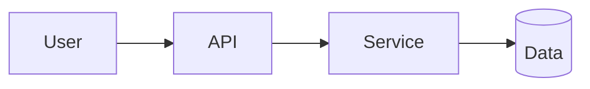

<!-- Follows ../standards/project-standards.md — keep all 9 sections. -->

# Project · <Title>

[🏠 Module](../README.md) · [🗺 Roadmap](../../../ROADMAP.md)

| | |
|---|---|
| **Module** | `<NN · Name>` |
| **Est. time** | 🛠️ `<hours>` |
| **Difficulty** | ⭐–⭐⭐⭐⭐⭐ |

## 1. Goal
`<One paragraph: what you'll build and why it's realistic.>`

## 2. Requirements
| # | Requirement | Type | Done |
|--:|---|---|:--:|
| 1 | `<what it does>` | Functional | ☐ |
| 2 | `<how well — latency/cost/etc.>` | Non-functional | ☐ |

## 3. Folder structure
```text
projects/<name>/
├── README.md
├── pyproject.toml
├── src/
├── tests/
├── data/
├── infra/            # Dockerfile, deploy config
└── docs/             # architecture notes, decisions
```

## 4. Architecture diagram


## 5. Milestones
| Milestone | Deliverable | Definition of done |
|---|---|---|
| M1 | Walking skeleton | End-to-end path works with stubs |
| M2 | Core feature | Primary requirement met |
| M3 | Hardening | Errors, tests, observability |
| M4 | Ship | Deployed + documented |

## 6. Stretch goals
- `<optional extension>`

## 7. Testing strategy
| Layer | What to test |
|---|---|
| Unit | `<...>` |
| Integration | `<...>` |
| End-to-end | `<...>` |
| Evaluation (AI systems) | `<offline eval set + metric>` |

## 8. Deployment guide
- **Run:** `<exact commands>`
- **Env vars:** `<reference .env.example>`
- **Smoke test:** `<health check + one real request>`
- **Rollback:** `<how to revert>`

## 9. Future improvements
- `<what you'd do with more time>`

---

## Rubric
| Criterion | Weight |
|---|:--:|
| Correctness | 40% |
| Code quality | 20% |
| Production-readiness | 25% |
| Documentation | 15% |

## Reflection
`<After finishing, complete the` [retrospective template](project-retrospective-template.md)`.>`
